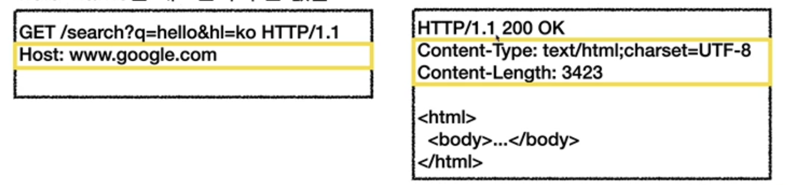
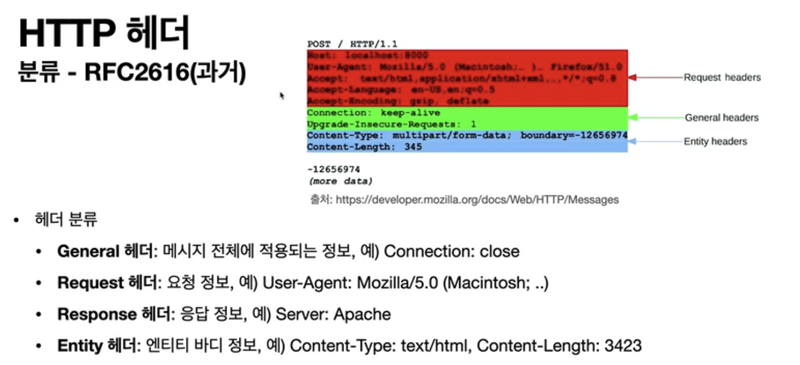
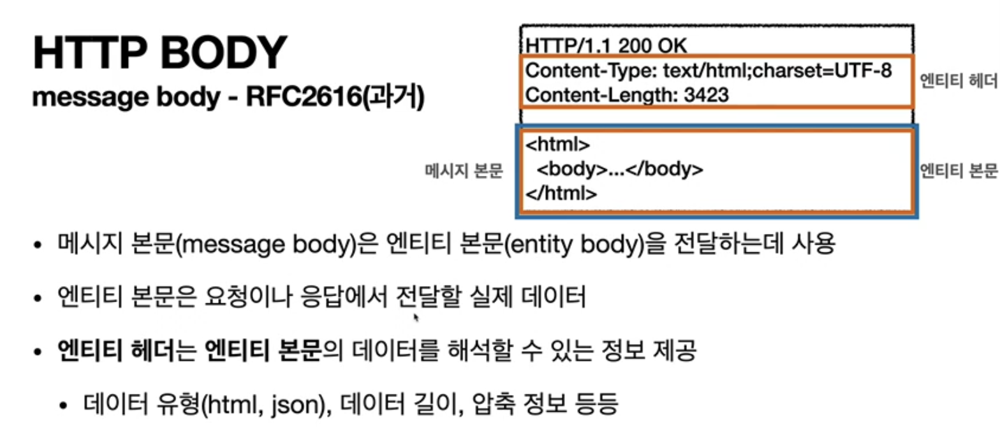
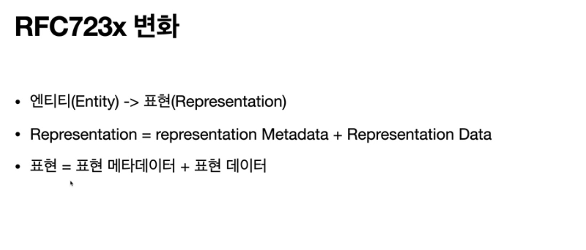
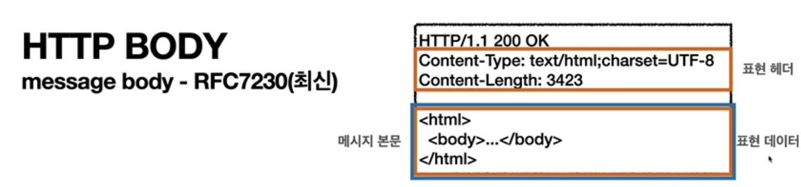

# HTTP 헤더 개요

## HTTP 헤더

- header-field = field-name “:” OWS field-value OWS
- field-name은 대소문자 구문 없음

용도

- HTTP 전송에 필요한 모든 부가정보
- 예) 메시지 바디의 내용, 메시지 바디의 크기, 압축, 인증, 요청 클라이언트, 서버 정보, 캐시 관리 정보...
- 표준 헤더가 너무 많음
- 필요시 임의의 헤더 추가 가능

- 메시지 본문을 통해 표현 데이터 전달
- 메시지 본문 = 페이로드
- 표현은 요청이나 응답에서 전달할 실제 데이터
- 표현 헤더는 표현 데이터를 해석할 수 있는 정보 제공
    - 데이터 유형(html, json), 데이터 길이, 압축 정보 등등
- 참고: 표현 헤더는 표현 메타데이터와, 페이로드 메시지를 구분해야 하지만,