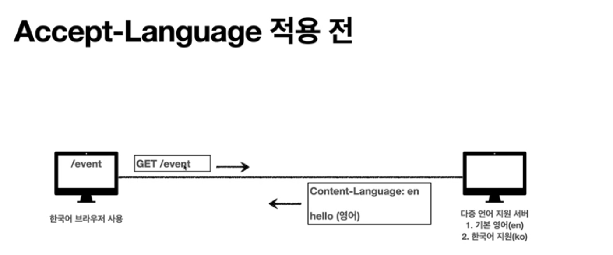
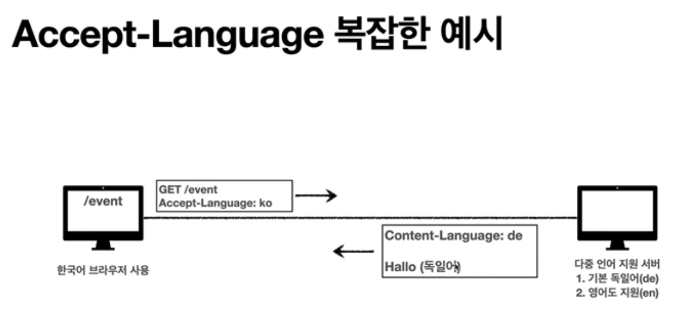
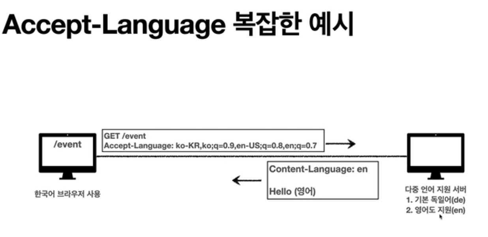
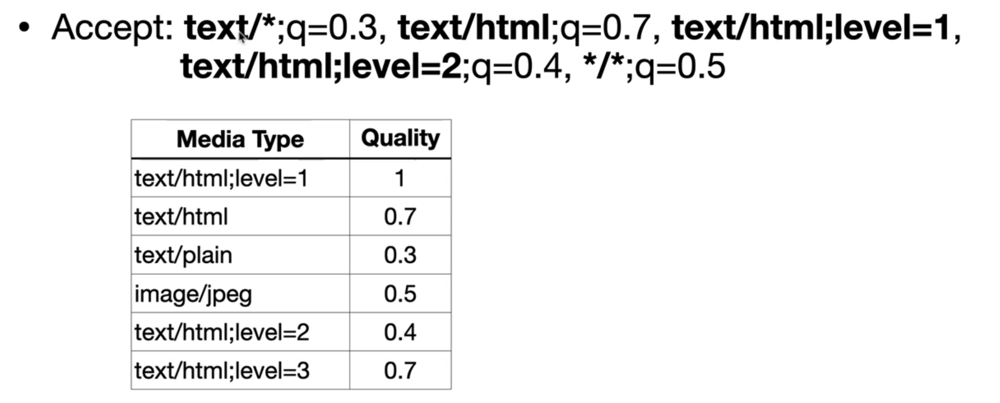

# 협상

클라이언트가 선호하는 표현 요청

- Accept: 클라이언트가 선호하는 미디어 타입 전달
- Accept-Charset: 클라이언트가 선호하는 문자 인코딩
- Accept-Encoding: 클라이언트가 선호하는 압축 인코딩
- Accept-Language: 클라이언트가 선호하는 자연 언어

- 협상 헤더는 요청시에만 사용

## 협상과 우선순위

Quality Value(q)

- Quality Values(q)값 사용
- 0~1 클수록 높은 우선순휘
- 생략하면 1
- Accept-Language: ko-KR,ko;q=0.9,en-US;q=0.8,en;q=0.7
    - ko-KR;q=1 생략
    - ko;q=0.9
    - en-US;q=0.8
    - en;q0.7

## 협상과 우선순위2

Quality Value(q)

- 구체적인 것이 우선한다.
- Accept: text/*, text/plain, text/plain;format=flowed, */*
    1. text/plain;format=flowed
    2. text
    3. text/*
    4. */*

## 협상과 우선순위3

Quality Value(q)

- 구체적인 것을 기준으로 미디어 타입을 맞춘다.

## 전송 방식 설명

- 단순 전송
- 압축 전송
- 분할 전송
- 범위 전송