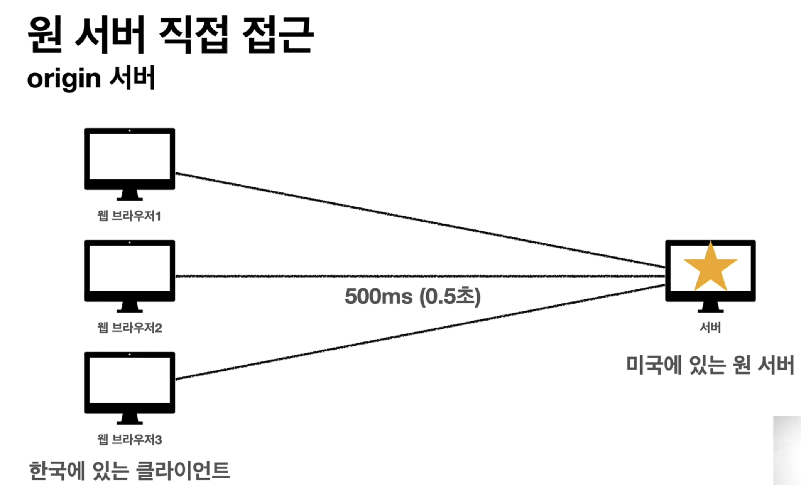
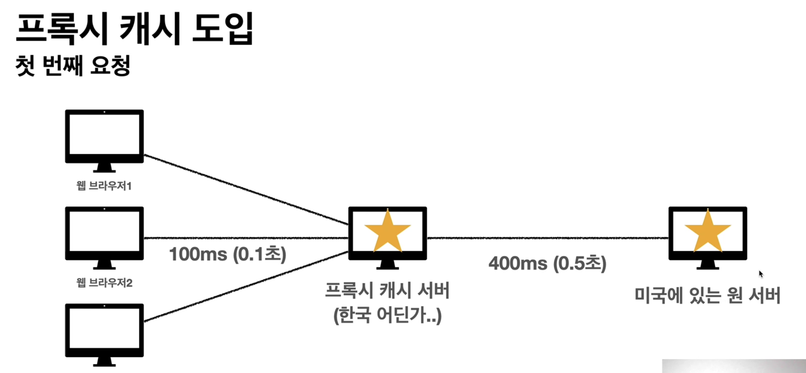
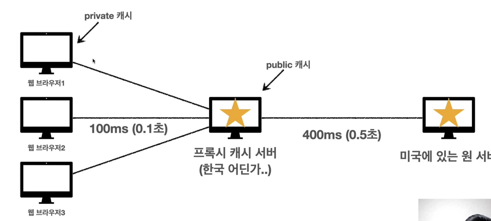
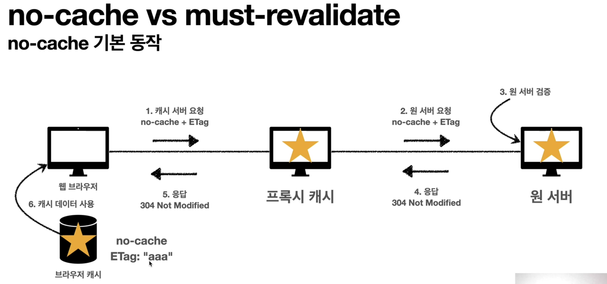
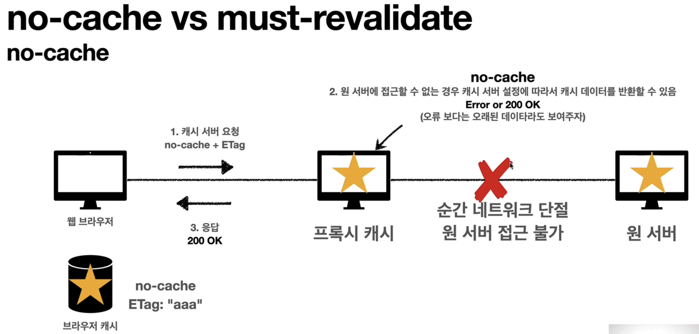
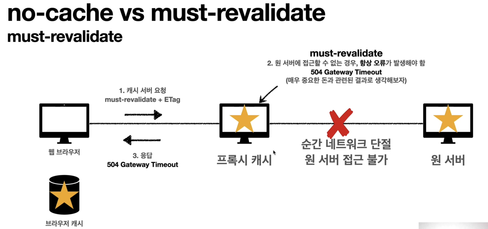

# 프록시 캐시

## Cache-Control

캐시 지시어 - 기타

- Cache-Control: public
    - 응답이 public 캐시에 저장되어도 됨
- Cache-Control: private
    - 응답이 해당  사용자만을 위한 것임, private 캐시에 저장해야 함(기본값)
- Cache-Control: s-maxage
    - 프록시 캐시에만 적용되는 max-age
- Age: 60 (HTTP 헤더)
    - 오리진 서버에서 응답 후 프록시 캐시 내에 머문 시간

## Cahce-Control

확실한 캐시 무효화 응답

- Cache-Control: no-cache, no-store, must-revalidate
- Pragma: no-cache
    - HTTP 1.0 하위 호환

- Cache-Control:  no-cache
    - 데이터는 캐시해도 되지만, 항상 원 서버에 검증하고 사용
- Cache-Control: no-store
    - 데이터에 민감한 정보가 있으므로 저장하면 안됨
        
        (메모리에서 사용하고 최대한 빨리 삭제)
        
- Cache-Control: must-revalidate
    - 캐시 만료후 최초 조회시 원 서버에 검증해야 함
    - 원 서버 접근 실패시 반드시 오류가 발생해야 함 - 504(Gateway Timeout)
    - must-revalidate는 캐시 요효 기간이라면 캐시를 사용함
- Pragma: no-cache
    - HTTP 1.0 하위 호환

