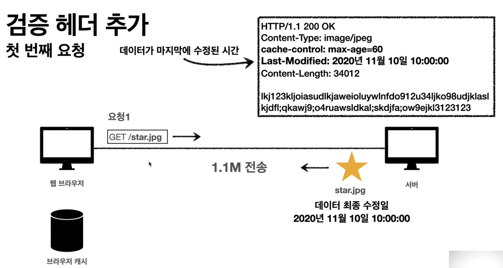
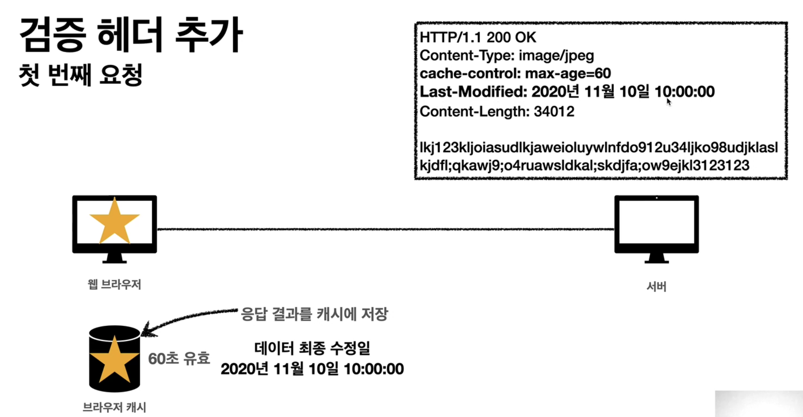
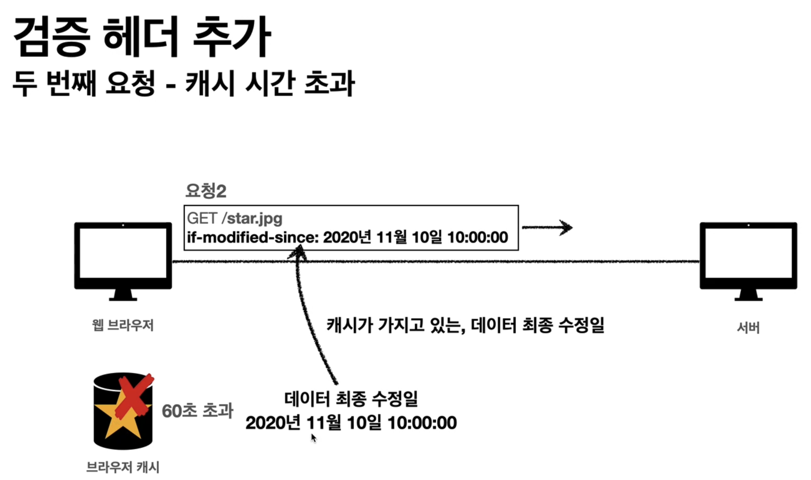
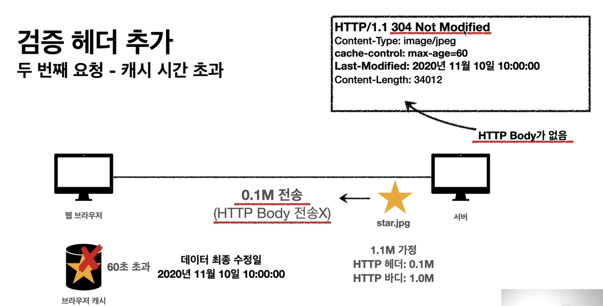
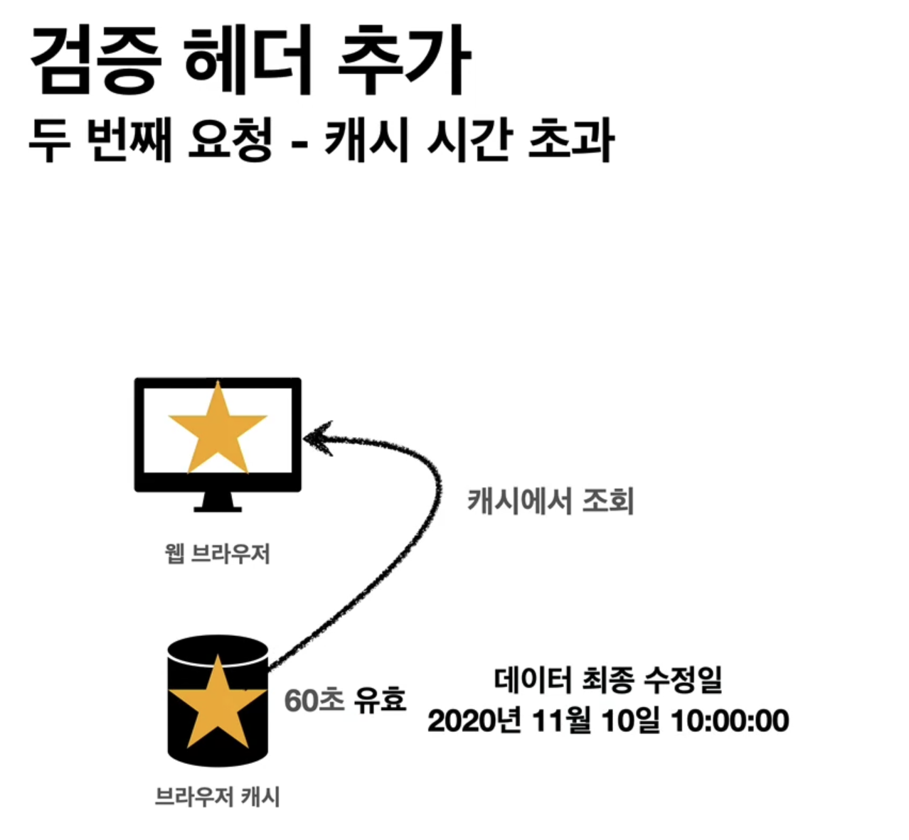
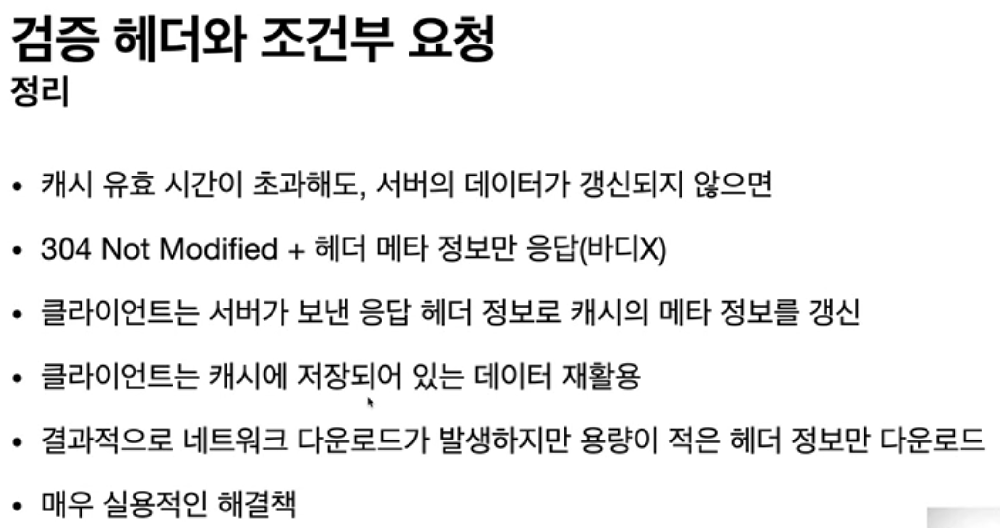

# 검증 헤더와 조건부 요청1

## 캐시 시간 초과

- 캐시 유효 시간이 초과해서 서버에 다시 요청하면 다음 두 가지 상황이 나타난다.
    1. 서버에서 기존 데이터를 변경함
    2. 서버에서 기존 데이터를 변경하지 않음
- 캐시 만료후에도 서버에서 데이터를 변경하지 않음
- 생각해보면 데이터를 전송하는 대신에 저장해 두었던 캐시를 재사용 할 수 있다.
- 단 클라이언트의 데이터와 서버의 데이터가 같다는 사실을 확인할 수 있는 방법 필요

