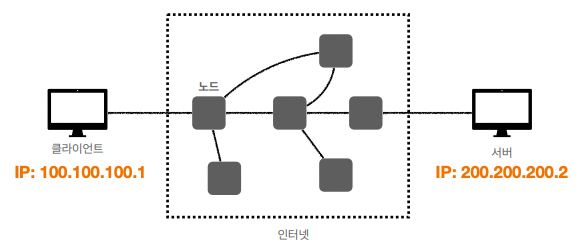
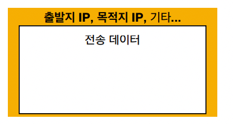
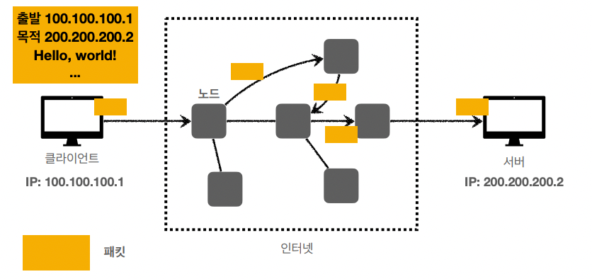
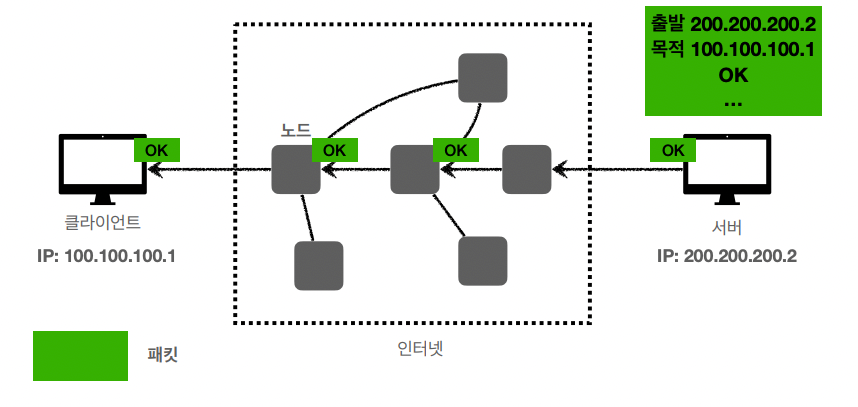
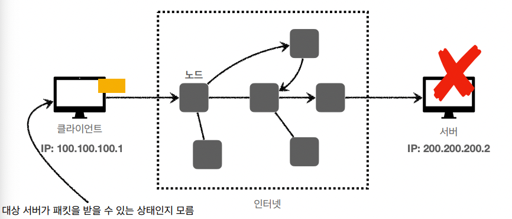
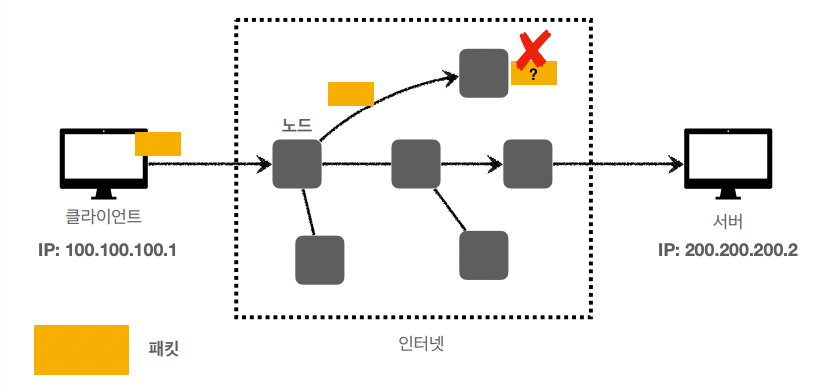
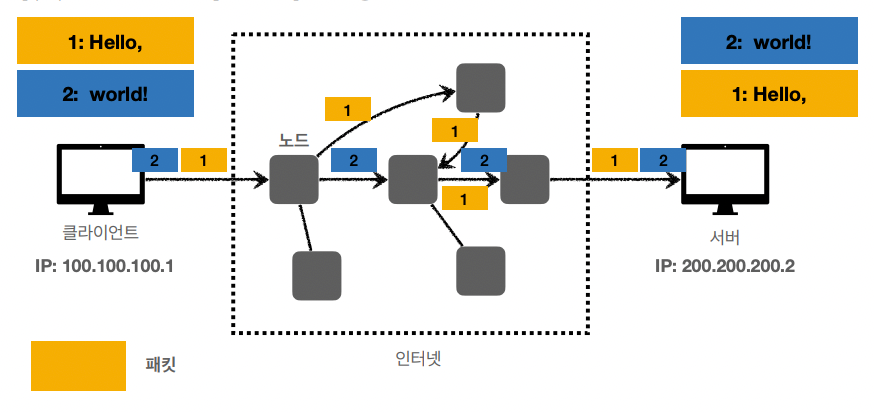

´# IP(인터넷 프로토콜)

인터넷 프로토콜 역할

* 지정한 `IP` 주소(IP Address)에 데이터 전달
* `Packet`이라는 통신 단위로 데이터 전달

## IP 주소 부여

* 클라이언트가 `100.100.100.1` IP를 부여
* 서버가 `200.200.200.2` IP를 부여

## IP 패킷 정보

패킷에 전송하고자 하는 데이터와 출발지 IP, 목적지 IP 등이 담겨있다.

## 클라이언트 패킷 전달

각 서버 노드를 거치며 목적지 서버인 `200.200.200.2`를 찾음

## 서버 패킷 전달

클라이언트가 서버에게 패킷을 전달하는 것과 유사한 방식으로 패킷이 전달

## IP 프로토콜의 한계

* #### 비연결성
  * 패킷을 받을 대상이 없거나 서비스 불능 상태여도 패킷 전송
* #### 비신뢰성
  * 중간에 패킷이 사라지는 경우 
  * 패킷이 순서대로 오지 않을 경우
* #### 프로그램 구분
  * 같은 IP를 사용하는 서버에서 통신하는 애플리케이션이 둘 이상인 경우

## 대상이 서비스 불능인 상태에서 패킷 전송 

* 패킷이 소실됨

## 패킷 전달 순서 문제 발생

