# TCP UDP

## 인터넷 프로토콜 스택의 4계층

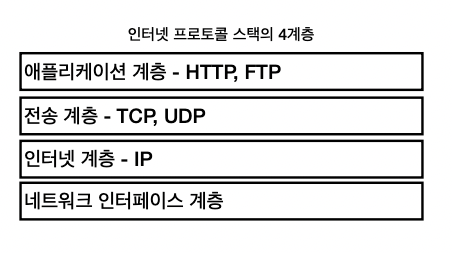

## 프로토콜 계층 

####tcp 소켓

* tcp를 유저 모드 어플리케이션 프로세스가 접근할 수 있도록 파일 형식으로 추상화한 
  인터페이스

## 프로토콜 계층

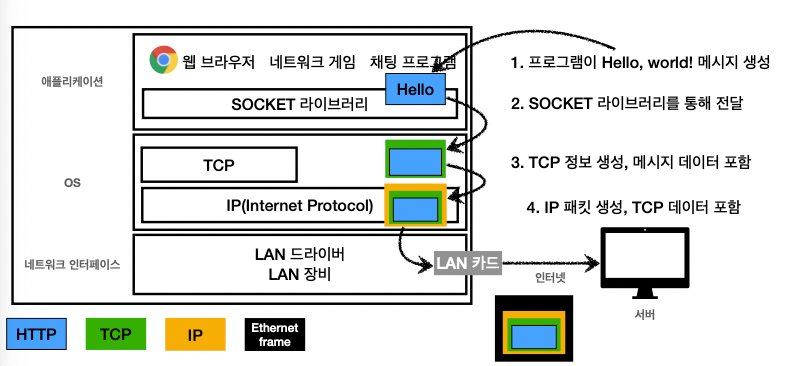

## IP 패킷 정보

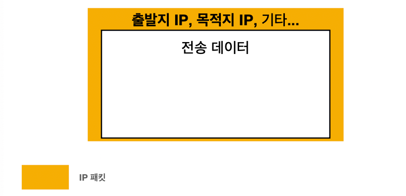

## TCP/IP 패킷 정보

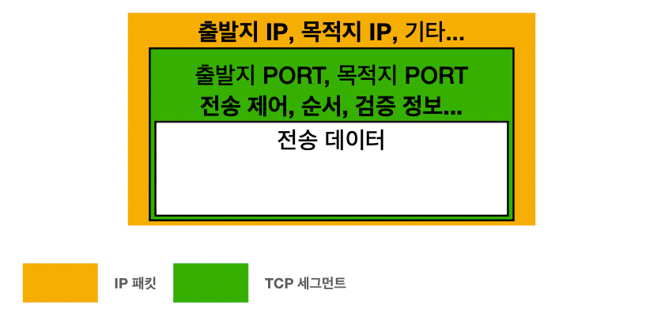

## TCP 특징

전송 제어 프로토콜(Transmission Control Protocol)

* 연결지향 - TCP 3 way handshake (가상 연결)
* 데이터 전달 보증
* 순서 보장

* 신뢰할 수 있는 프로토콜 
* 현재는 대부분 TCP 사용

## TCP 3 way handshake 

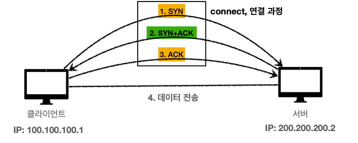

* SYN : 접속 요청
* ACK : 요청 수락
* 참고: 3. ACK와 함께 데이터 전송 가능

## 데이터 전달 보증

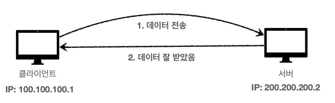

## 순서 보장

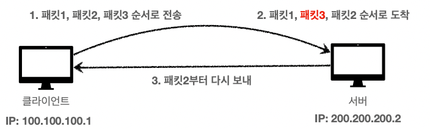

## UDP의 특징

사용자 데이터그램 프로토콜(User Datagram Protocol)

* 기능이 거의 없음
* 연결 지향 - TCP `3 way handshake` X
* 데이터 전달 보증 X
* 순서 보장 X
* 데이터 전달 및 순서가 보장되지 않지만, 단순하고 빠름
* 정리
  * IP와 거의 같다. + PORT + checksum 정도만 추가
  * 애플리케이션에서 추가 작업 필요

# PORT

## 한번에 둘 이상 연결해야할 경우

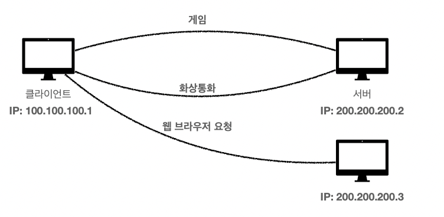

## TCP/IP 패킷 정보

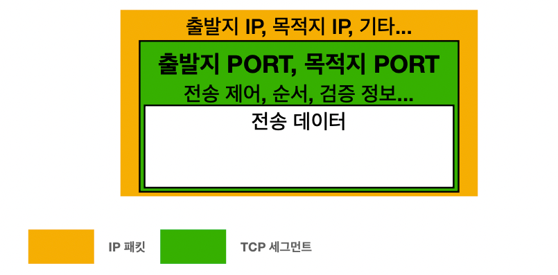

## 패킷 정보

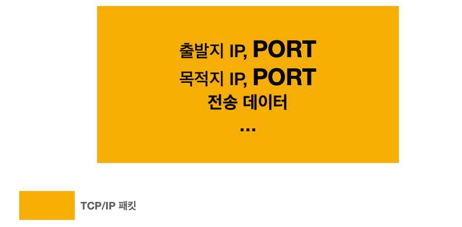

## PORT - 같은 IP 내에서 프로세스 구분

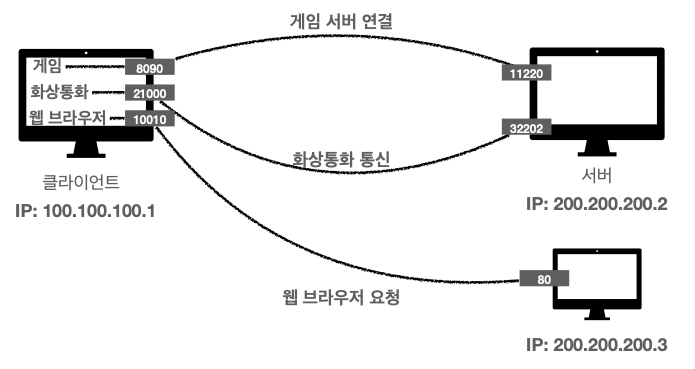

## PORT

* 0 ~ 65535: 할당 가능
* 0 ~ 1023: 잘 알려진 포트, 사용하지 않는 것이 좋음
  * FTP - 20, 21
  * TELNET - 23
  * HTTP - 80
  * HTTPS - 443

# DNS

## IP는 기억하기 어렵다.

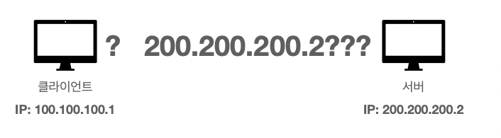

## IP는 변경될 수 있다.

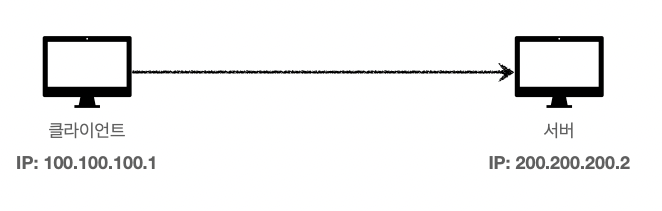

## IP는 변경될 수 있다.

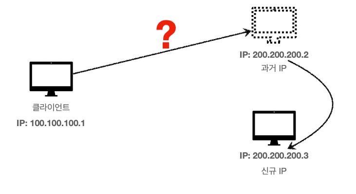

## DNS

도메인 네임 시스템(Domain Name System)

* 도메인 명을 IP 주소로 변환

## DNS 사용

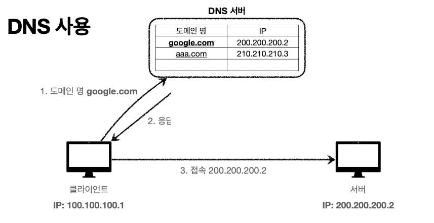
