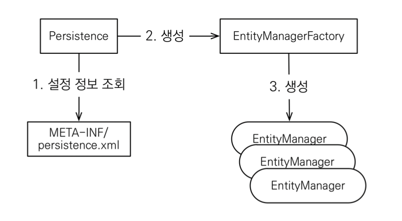

# Hello JPA - 애플리케이션 개발

## JPA 구동 방식


## JPA 동작 확인
* `JpaMain` 클래스 생성
* JPA 동작확인
  ```java
    package hellojpa;
    
    import javax.persistence.EntityManager;
    import javax.persistence.EntityManagerFactory;
    import javax.persistence.Persistence;
    
    public class JpaMain {
        public static void main(String[] args) {
            EntityManagerFactory emf = Persistence.createEntityManagerFactory("hello");
            EntityManager em = emf.createEntityManager();
            em.close();
            emf.close();
        }
    }
  ```

## 객체와 테이블을 생성하고 매핑하기
* `@Entity`: JPA가 관리할 객체
* `@Id`: 데이터베이스 PK와 매핑
    ```java
    package hellojpa;
    import javax.persistence.Entity;
    import javax.persistence.Id;
  
    @Entity
    public class Member {
        @Id
        private Long id;
        private String name;
        //Getter, Setter ...
    }
    ```
  
  ```sql
    create table Member (
        id bigint not null,
        name varchar(255);
        primary key(id);
    );
  ```
  
## CRUD
* 회원 등록
  ```java
      public static void main(String[] args) {
        EntityManagerFactory emf = Persistence.createEntityManagerFactory("hello");
        EntityManager em = emf.createEntityManager();
      
        EntityTransaction tx = em.getTransaction();
        tx.begin();
        try{
            Member member = new Member();
            member.setId(2L);
            member.setName("HelloB");
            em.persist(member);
      
            tx.commit();
        } catch (Exception e){
            tx.rollback();
        } finally {
            em.close();
        }
        emf.close();
      }
  ```
* 회원 수정
  ```java
    public static void main(String[] args) {
        EntityManagerFactory emf = Persistence.createEntityManagerFactory("hello");
        EntityManager em = emf.createEntityManager();

        EntityTransaction tx = em.getTransaction();
        tx.begin();
        try{
            Member member = em.find(Member.class, 1L);
            member.setName("HelloJPA");
            tx.commit();
        } catch (Exception e){
            tx.rollback();
        } finally {
            em.close();
        }
        emf.close();
    }
  ```
* 회원 삭제
  ```java
    public static void main(String[] args) {
        EntityManagerFactory emf = Persistence.createEntityManagerFactory("hello");
        EntityManager em = emf.createEntityManager();

        EntityTransaction tx = em.getTransaction();
        tx.begin();
        try{
            Member member = em.find(Member.class, 1L);
            em.remove(member);
            tx.commit();
        } catch (Exception e){
            tx.rollback();
        } finally {
            em.close();
        }
        emf.close();
    }
  ```

  
## 주의

* **엔티티 매니저 팩토리**는 하나만 생성해서 애플리케이션 전체에서 공유
* **엔티티 매니저**는 쓰레드간에 공유X (사용하고 버려야 한다)
* **JPA의 모든 데이터 변경은 트랙잭션 안에서 실행**


## JPQL
* 가장 단순한 조회 방법
  * `EntityManager.find()`
  * 객체 그래프 탐색(`a.getB()`, `b.getC()`)
* 나이가 18살 이상인 회원을 모두 검색하고 싶다면?
  ```java
  Member member = em.find(Member.class, 1L);
  em.createQuery("SELECT m from Member as m", Member.class)
          .setFirstResult(5)
          .setMaxResults(8)
          .getResultList();
  ``` 
* JPA를 사용하면 엔티티 객체를 중심으로 개발
* 문제는 검색 쿼리
* 검색을 할 때도 테이블이 아닌 엔티티 객체를 대상으로 검색
* 모든 DB 데이터를 객체로 변환해서 검색하는 것은 불가능
* 애플리케이션이 필요한 데이터만 DB에서 불러오려면 결국 검색 조건이 포함된 SQL이 필요
* JPA는 SQL을 추상화한 JPQL이라는 객체 지향 쿼리 언어 제공
* SQL과 문법 유사, SELECT, FROM, WHERE, GROUP BY, HAVAING, JOIN 지원
* **JPQL은 엔티티 객체**를 대상으로 쿼리
* **SQL은 데이터베이스 테이블**을 대상으로 쿼리
* 테이블이 아닌 **객체를 대상으로 검색하는 객체 지향 쿼리**
* SQL을 추상화해서 특정 데이터베이스 SQL에 의존 X
* JOQL을 한마디로 정의하면 객체 지향 SQL

                      
  

