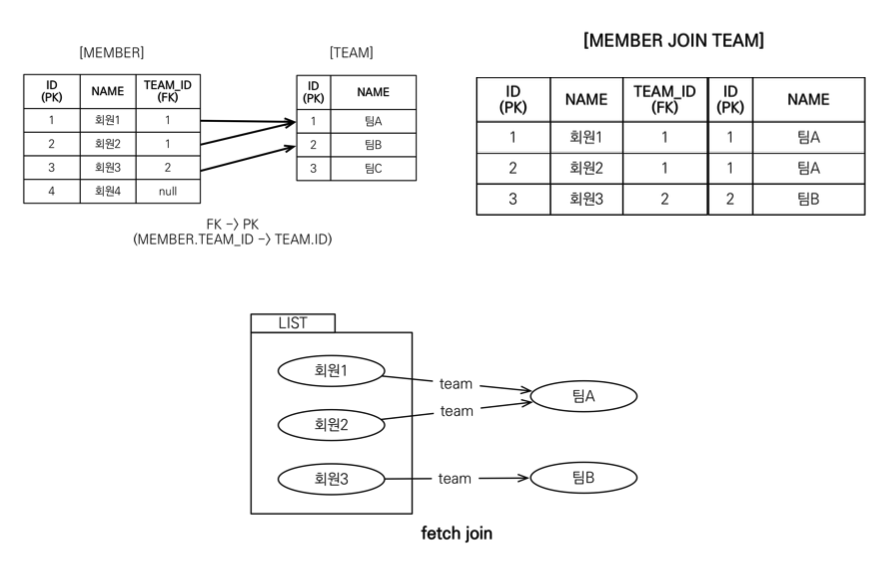
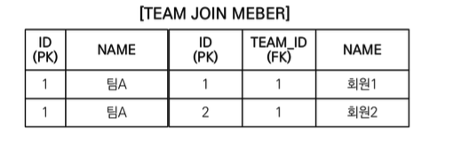

## 경로 표현식

* `.` 으로 객체 그래프를 탐색하는 것

```sql
select m.username -> 상태 필드
    from Member m
    join m.team t -> 단일 값 연관 필드
    join m.orders o -> 컬렉션 값 연관 필드
where t.name = 'teamA'
```

* 상태 필드(state field): 단순히 값을 저장하기 위한 필드

* 연관 필드(association field): 연관관계를 위한 필드
  * 단일 값 연관 필드: `@ManyToOne`, `@OneToOne`, 대상이 엔티티
  * 컬렉션 값 연관 필드: `@OneToMany`, `@ManyToMany`, 대상이 컬렉션

## 경로 표현식 특징

* 상태 필드: 경로 탐색의 끝

* 단일 값 연관 경로: 묵시적 내부 조인(inner join) 발생, 탐색 O

```java
String query = "select m.team From Member m"
```

* 컬렉션 값 연관 경로: 묵시적 내부 조인 발생, 탐색 X
  * FROM 절에서 명시적 조인을 통해 별칭을 얻으면 별칭을 통해 탐색 가능

```java
String query1 = "select t.members From Team t";
// t.members는 Collection 객체 임으로
// t.members.username 과 같은 그래프 탐색이 불가하다
// 이를 해결하기 위해선 명시적으로 join을 해주어야 한다.
        
String query2 = "select m.username From Team t join t.members m";
```

## 명시적 조인, 묵시적 조인

* 명시적 조인: join 키워드 직접 사용
  * `select m from Member m join m.team t`

* 묵시적 조인: 경로 표현식에 의해 묵시적으로 SQL 조인 발생(내부 조인만 가능)
  * `select m.team from Member m`

## 경로 탐색을 사용한 묵시적 조인 시 주의사항

* 항상 내부 조인
* 컬렉션은 경로 탐색의 끝, 명시적 조인을 통해 별칭을 얻어야함
* 경로 탐색은 주로 `Select`, `where` 절에서 사용을 하지만  
  묵시적 조인으로 인해 `sql` 의 `from`, `join` 절에 영향을 줌


# 페치 조인

* SQL 조인 종류 x
* JPQL 에서 성능 최적화를 위해 제공하는 기능 
* 연관된 엔티티나 컬렉션을 SQL 한 번에 함께 조회하는 기능
* join fetch 명령어 사용
* 페치 조인 ::= [ LEFT [OUTER] | INNER ] JOIN FETCH 조인경로

## 엔티티 페치 조인

* 회원을 조회하면서 연관된 팀과 함께 조회(SQL 한 번에)

* SQL을 보면 회원 뿐만 아니라 팀도 함께 SELECT

* JPQL : `select m from Member m join fetch m.team`

* SQL: `select m.*, T,* from Member m INNER JOIN T ON M.TEAM_ID = T.ID`



```java
String jpql = "select m from Member m join fetch m.team";
List<Member> members = em.createQuery(jpql, Member.class).getResultList();

for(Member member : members){
    //페치 조인으로 회원과 팀을 함께 조회해서 지연 로딩X
    System.out.println(member.getUsername() + " " + member.getTeam().name());
}
/*
username = 회원1, teamname = 팀A 
username = 회원2, teamname = 팀A 
username = 회원3, teamname = 팀B
*/
```

## 컬렉션 페치 조인

* 일대다 관계, 컬렉션 페치 조인

* JPQL : `select t from Team t join fetch t.members where t.name = 'teamA'`

## 페치 조인과 DISTINCT

* SQL의 DISTINCT는 중복된 결과를 제거하는 명령
* JPQL의 DISTINCT 2가지 기능 제공
  1. SQL에 DISTINCT를 추가
  2. 애플리케이션에서 엔티티 중복 제거

```java
String query = "select distinct t from Team t join fetch t.members where t.name = 'teamA'"
```

* SQL에 DISTINCT를 추가하지만 데이터가 다르므로 SQL 결과에서 중복제거 실패



* DISTINCT가 추가로 애플리케이션에서 중복 제거 시도

* 같은 식별자를 가진 TEAM 엔티티 제거

## 페치 조인과 일반 조인의 차이

* 일반 조인 실행시 연관된 엔티티를 함께 조회하지 않음

* JPQL: `select t from Team t join t.members m where t.name = 'teamA''`

* JPQL은 결과를 반환할 때 연관관계 고려 X 

* 단지 SELECT 절에 지정한 엔티티만 조회할 뿐

* 여기서는 팀 엔티티만 조회하고, 회원 엔티티는 조회 X

* 페치 조인을 사용할 때만 연관된 엔티티도 함께 조회(즉시 로딩)

* 페치 조인은 객체 그래프 SQL 한번에 조회하는 개념

## 페치 조인의 특징과 한계

* 페치 조인 대상에는 별칭을 줄 수 없다.
  * 하이버네이트는 가능, 가급적 사용 X

* 둘 이상의 컬렉션은 체피 조인 할 수 없다.

* 둘 이상의 컬렉션은 페치 조인 할 수 없다.

* 컬렉션을 체피 조인하면 페이징 API를 사용할 수 없다.
  * 일대일, 다대일, 같은 단일 값 연관 필드들은 체피 조인해도 페이징 가능
  * 하이버네이트는 경고 로그를 남기고 메모리에서 페이징(매우 위험)

* 연관된 엔티티들을 SQL 한 번으로 조회 - 성능 최적화
* 엔티티에 직접 적용하는 글로벌 로딩 전략보다 우선함
  * @OneToMany(fetch = FetchType.LAZY)
* 실무에서 글로벌 로딩 전략은 모두 지연 로딩
* 최적화가 필요한 곳은 페치 조인 적용

## JPQL 다형성 쿼리

* 조회 대상을 특정 자식으로 한정

* JPQL: `select i from Item i where type(i) in (Book, Movie)`

* SQL: `select i from i where i.DTYPE in ('B', 'M')`

* 자바 타입 캐스팅과 유사

* 상속 구조에서 부모 타입을 특정 자식 타입으로 다룰 때 사용

* FROM, WHERE, SELECT 사용

* JPQL: `select i from Item i where treat(i as Book).auther = 'kim'`

* SQL: `select i.* from Item i where i.DTYPE = 'B' and i.auther = 'kim'`

## 엔티티 직접 사용

* JPQL에서 엔티티를 직접 사용하면 SQL에서 해당 엔티티의 기본 키 값을 사용

* JPQL: `select count(m.id) from Member m`, `select count(m) from Member m`

* SQL: `select count(m.id) as cnt from Member m`

* 엔티티를 파라미터로 전달

```java
String jpql = “select m from Member m where m = :member”; 
List resultList = em.createQuery(jpql)
        .setParameter("member", member) .getResultList();
```

### 엔티티 직접 사용 - 기본 키 값

* 식별자를 직접 전달
```java
String jpql = “select m from Member m where m.id = :memberId”; 
List resultList = em.createQuery(jpql)
    .setParameter("memberId", memberId) .getResultList();
```

* 실행된 SQL
```sql
select m.* from Member m where m.id=?
```

### 엔티티 직접 사용 - 외래 키 값

```java
Team team = em.find(Team.class, 1L);
String qlString = “select m from Member m where m.team = :team”; List resultList = em.createQuery(qlString)
.setParameter("team", team) .getResultList();
```

```java
String qlString = “select m from Member m where m.team.id = :teamId”; 
List resultList = em.createQuery(qlString)
        .setParameter("teamId", teamId) .getResultList();
```

* 실행된 SQL
```sql
select m.* from Member m where m.team_id=?
```


## Named 쿼리 - 어노테이션

```java
@Entity
@NamedQuery(
        name = "Member.findByUsername",
        query = "select m from Member m where m.username = :username")
public class Member{
  ...
}
)
```

```java
List<Member> resultList = 
    em.createNamedQuery("Member.findByUsername", Member.class)
        .setOarameter("username", "user1")
        .getResultList();

```

## Named 쿼리 - XML에 정의

```xml
<persistence-unit name="jpabook" >
    <mapping-file>META-INF/ormMember.xml</mapping-file>
```

```xml
<?xml version="1.0" encoding="UTF-8"?>
<entity-mappings xmlns="http://xmlns.jcp.org/xml/ns/persistence/orm" version="2.1">
  <named-query name="Member.findByUsername">
    <query><![CDATA[
    select m
    from Member m
    where m.username = :username
    ]]></query>
  </named-query>
 <named-query name="Member.count">
   <query>select count(m) from Member m</query>
 </named-query>
</entity-mappings>
```

* XML이 항상 우선권을 가진다.

* 애플리케이션 운영 환경에 따라 다른 XML을 배포할 수 있다.

## JPQL - 벌크 연산

* 재고 10개 미만인 모든 상품의 가격을 10% 상승하려면?
* JPA 변경 감지 기능으로 실행하려면 너무 많은 SQL 실행
  1. 재고가 10 미만인 상품을 리스트로 조회한다.
  2. 상품 엔티티의 가격을 10% 증가한다.
  3. 트랜잭션 커밋 시점에 변경감지가 동작한다.
* 변경된 데이터가 100건이라면 100번의 UPDATE SQL 실행

## 벌크 연산 예제
* 쿼리 한 번으로 여러 테이블 로우 변경(엔티티)
* `executeUpdate()` 의 결과는 영향받은 엔티티 수 반환
* UPDATE, DELETE 지원
* INSERT(insert into.. select, 하이버네이트 지원)
```java
String qlString = "update Product p " +
        "set p.price = p.price * 1.1 " +
        "where p.stockAmount < :stockAmount";

int resultCount = em.createQuery(qlString)
        .setParameter("stockAmount", 10)
        .executeUpdate();
```


## 벌크 연산 주의

* 벌크 연산은 영속성 컨텍스트를 무시하고 데이터베이스에 직접 쿼리

  1. 벌크 연산을  먼저 실행 - 영속성 컨텍스트가 비어있기 때문에 문제가 되지 않음
  2. 벌크 연산 수행 후 영속성 컨텍스트 초기화
  ```java
  em.clear();
  Member findMember = em.find(Member.class, member1.getId());
  ```
