# 영속성 컨텍스트(Persistence Context)

## 엔티티 매니저 팩토리와 엔티티 매니저

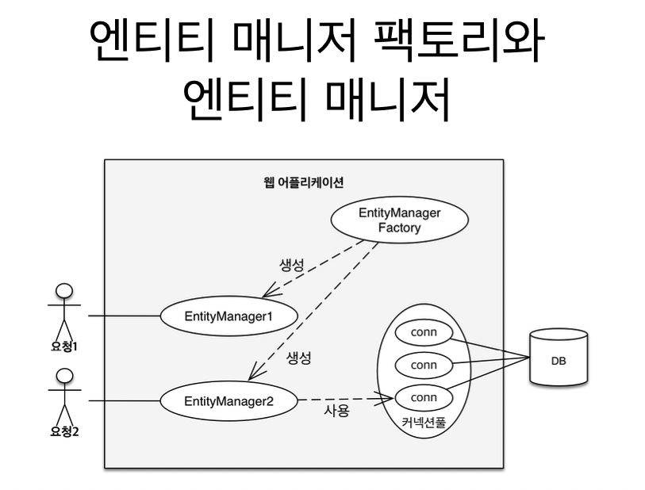

## 연속성 컨텍스트
* JPA를 이해하는데 **중요**
* **엔티티를 영구 저장하는 환경**이라는 뜻
* `EntityManager.persist(entity)`
    * DB에 저장하는 것이 아닌 영속성 컨텍스트에 저장한다는 뜻

## 엔티티 매니저와 영속성 컨텍스트
* 영속성 컨텍스트는 논리적인 개념
* 눈에 보이지 않는다
* 엔티티 매니저를 통해서 영속성 컨텍스트에 접근

## J2SE 환경
엔티티 매니저와 영속성 컨텍스트가 1:1

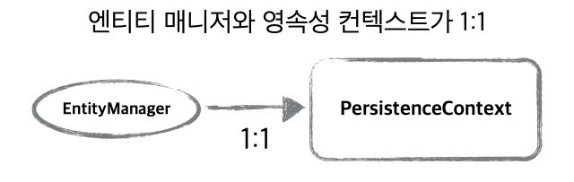

## J2EE, 스프링 프레임워크와 같은 컨테이너 환경
엔티티 매니저와 영속성 컨텍스트가 N:1

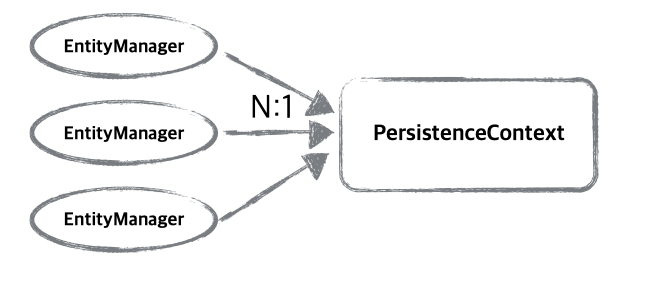

## 엔티티의 생명주기

* 비영속(new/transient)
  영속성 컨텍스트와 전혀 관계가 없는 새로운 상태

* 영속(managed)
  영속성 컨텍스

| 생명주기               | 설명                        |
|--------------------|---------------------------|
| 비영속(new/transient) | 영속성 컨텍스트와 전혀 관계가 없는 **새로운** 상태 |
| 영속(managed)        | 영속성이 컨텍스트에 **관리**되는 상태        |
| 준영속(detached)      | 영속성 컨텍스트에 저장되었다가 **분리**된 상태   |
| 삭제(removed)        | **삭제**된 상태                    |

## 엔티티의 생명주기
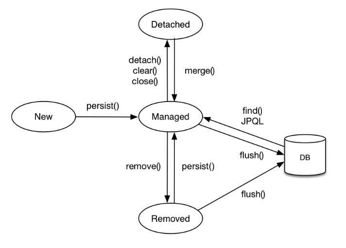

## 비영속
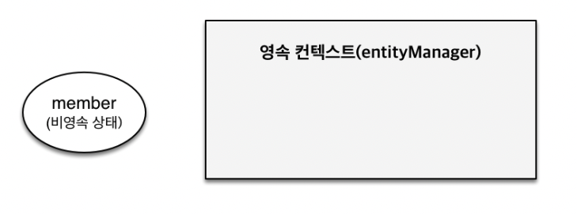
```java
//객체를 생성한 상태(비영속)
Member member = new Member();
member.setId("member1");
member.setUsername("회원1");
```

## 영속
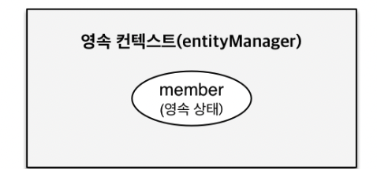
```java
Member member = new Member();
member.setId("member1");
member.setUsername(“회원1”);
EntityManager em = emf.createEntityManager();
em.getTransaction().begin();
 //객체를 저장한 상태(영속)
em.persist(member);
```

* 영속상태라고 해서 쿼리가 날라가는 것이 아님

## 준영속, 삭제
```java
// 회원 엔티티를 영속성 컨텍스트에서 분리, 준영속 상태
em.detach(member);
```

```java
// 객체를 삭제한 상태(삭제)
em.remove(member);
```

## 영속성 컨텍스트의 이점

* 1차 캐시
* 동일성(identity) 보장
* 트랜잭션을 지원하는 쓰기 지연
  (transactional write-behind)
* 변경 감지(Dirty Checking)
* 지연 로딩(Lazy Loading)


## 엔티티 조회, 1차 캐시

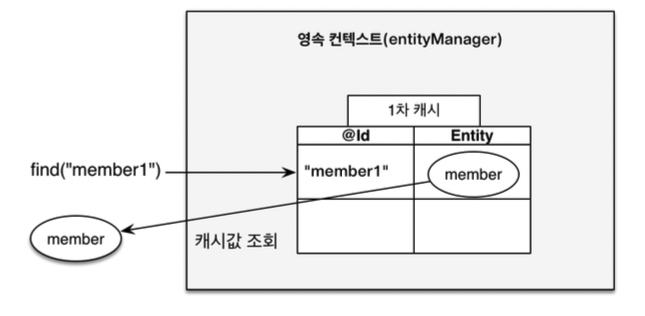

```java
//엔티티를 생성한 상태(비영속)
Member member = new Member();
member.setId("member1");
member.setUsername("회원1");
//엔티티를 영속
```

## 데이터베이스에서 조회
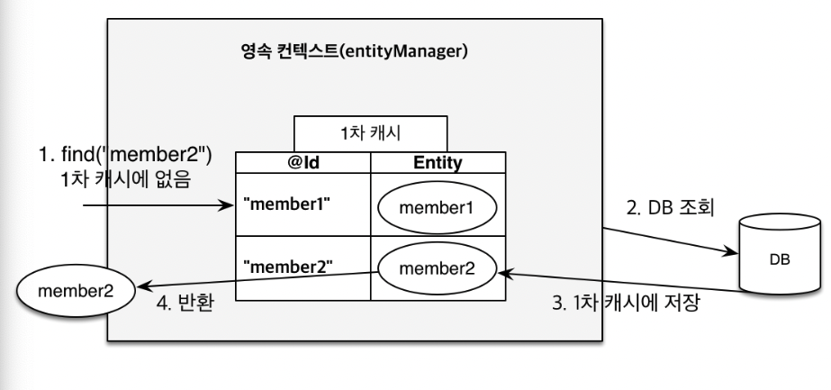
```java
 Member member = new Member();
 member.setId("member1");
 member.setUsername("회원1");
 //1차 캐시에 저장됨
 em.persist(member);
 //1차 캐시에서 조회
 Member findMember = em.find(Member.class, "member1");
```

* 1차 캐시는 엔티티매니저의 생명주기에서 가능한데 
  이는 일시적으로 사용하는 객체이기 때문에 성능적으로 큰 이점은 없다.

## 영속 엔티티의 동일성 보장

```java
Member a = em.find(Member.class, "member1");
Member b = em.find(Member.class, "member1");
System.out.println(a == b); //동일성 비교 true
```

* 1차 캐시로 반복 가능한 읽기(REPEATABLE READ) 등급의 
트랜잭션 격리 수준을 데이터베이스가 아닌 애플리케이션 차원에서 제공

## 엔티티 등록 트랙젝션을 지원하는 쓰기 지연
```java
EntityManager em = emf.createEntityManager();
EntityTranscation transaction = em.getTransaction();
// 엔티티 매니저는 데이터 변경시 트랜잭션을 시작해야 한다.
transaction.begin();

em.persist(memberA);
em.persist(memberB);
//여기까지 INSERT SQL을 데이터베이스에 보내지 않는다.
        
//커밋하는 순간 데이터베이스에 INSERT SQL을 보낸다.
transaction.commit();
```

| 호출 메서드                 | 동작방식                             |
|------------------------|----------------------------------|
| `em.persist(memberA);` | 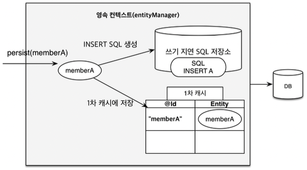  |
| `em.persist(memberB);` | 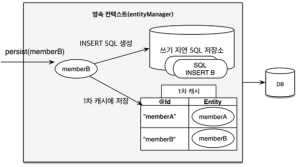 |
| `transaction.commit()` | 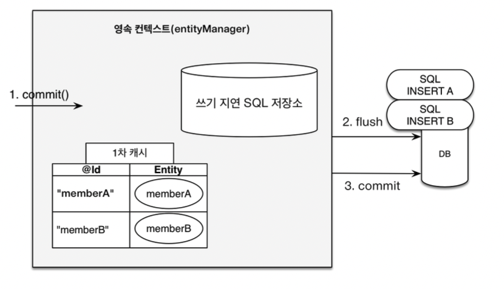 |

## 엔티티 수정 변경 감지

```java
EntityManager em = emf.createEntityManager();
EntityTransaction transaction = em.getTransaction();
transaction.begin(); // [트랜잭션] 시작
// 영속 엔티티 조회
Member memberA = em.find(Member.class, "memberA");
// 영속 엔티티 데이터 수정
memberA.setUsername("hi");
memberA.setAge(10);
//em.update(member) 이런 코드가 있어야 하지 않을까?
transaction.commit(); // [트랜잭션] 커밋
```

* 엔티티를 `Java`의 `Collction`다루듯 하도록 도와준다.

## 변경감지

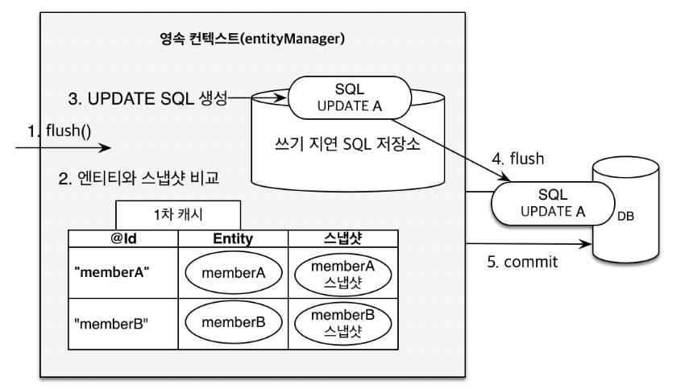

* 데이터베이스 커밋하는 시점에  스냅샷과 비교한다.
  * 스냅샷은 영속성 컨텍스트에 객체가 삽입되었을 때 형태
* `transaction`이 커밋되는 시점에 엔티티와 스냅샷을 비교한다.
* 변경이 감지될 경우 `쓰기 지연 SQL 저장소`에 update 쿼리를 저장한다.

## 플러시

* 영속성 컨텍스트의 변경내용을 데이터베이스에 반영
* 플러시 발생
  * 변경 감지
  * 수정된 엔티티 `쓰기 지연 SQL 저장소`에 등록
  * `쓰기 지연 SQL 저장소`의 쿼리를 데이터베이스에 전송
    (등록, 수정, 삭제 쿼리)
  * `1차 캐시`가 지워지는 것은 아님
  

  | `flush` 호출 방법 | 기능         |
  |---------------|------------|
  | `em.flush()`  | 직접 호출      |
  | 트랜잭션 커밋       | 플러시 자동 호출  |
  | JPQL 쿼리 발생    | 플러시 자동 호출  |

* JPQL 쿼리 실행시 플러시가 자동으로 호출되는 이유

```java
em.persist(memberA);
em.persist(memberB);
em.persist(memberC);
//중간에 JPQL 실행
query = em.createQuery("select m from Member m", Member.class);
List<Member> members= query.getResultList();
```
* JPQL 쿼리를 날릴 때 자동으로 `flush`되지 않는다면
  `memberA`, `memberB`, `memberC`가 DB 쿼리로
  불가능하기 때문에 항상 자동으로 `flush` 된다.

## 플러시 모드 옵션
```java
em.setFlushMode(FlushModeType.COMMIT)
```

* `FlushModeType.AUTO`
  * 커밋이나 쿼리를 실행할 때 플러시(기본값)

* `FlushModeType.COMMIT`
  * 커밋할 때만 플러시
  * 상황에 따라 유용할 수 있음

## 플러시 요약
* 영속성 컨텍스트를 비우지 않음
* 영속성 컨텍스트의 변경내용을 데이터베이스에 동기화
* 트랜잭션이라는 작업 단위가 중요 -> 커밋 직전에만 동기화하면 됨

## 준영속 상태
* 영속 -> 준영속
* 영속 상태의 엔티티가 영속성 컨텍스트에서 분리(detached)
* 영속성 컨텍스트가 제공하는 기능을 사용 못함
* 준영속 상태로 만드는 방법

| 준영속 상태로 만드는 방법      | 기능                | 
|-------------------|---------------|
| `em.detach(entity)` | 특정 엔티티만 준영속 상태로 전환 |
 | `em.clear()`                 | 영속성 컨텍스트를 완전히 초기화 |
 | `em.close`          | 영속성 컨텍스트를 종료      |