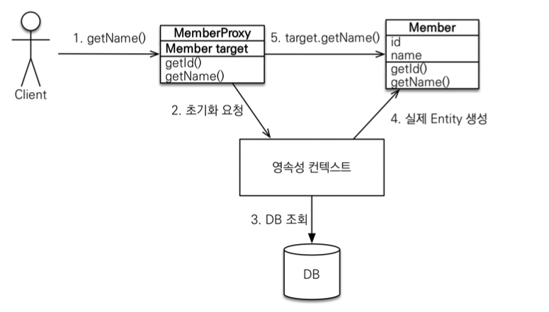
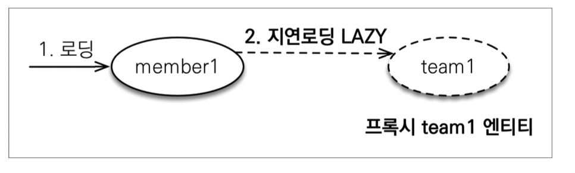
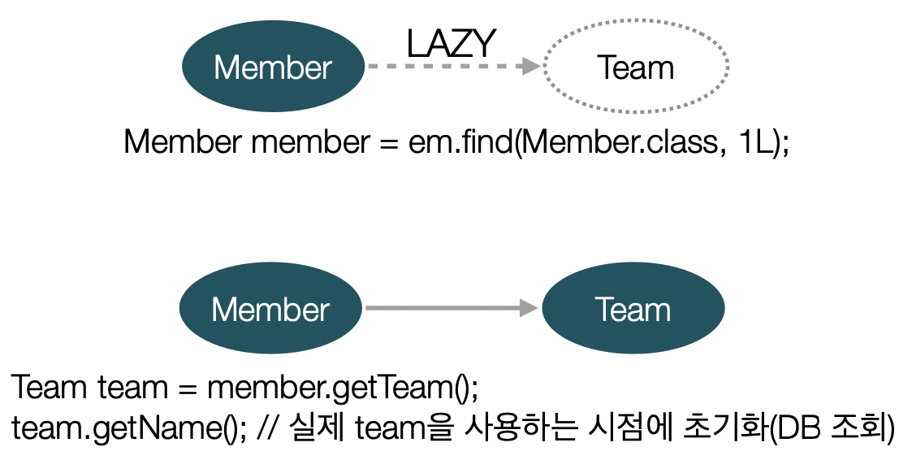
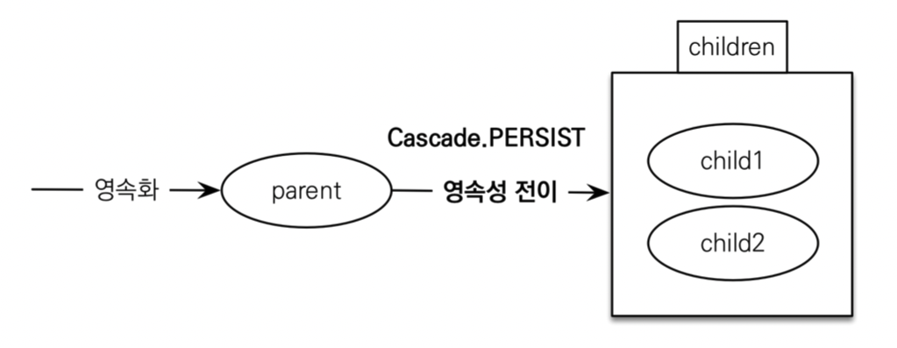

## 프록시와 연관관계 매핑

### 프록시

#### Member를 조회할 때 Team도 함께 조회를 해야할까??

```java
public void printUserAndTeam(String memberId) {
    Member member = em.find(Member.class, memberId);
    Team team = member.getTeam();
    System.out.println("회원 이름: " + member.getUsername());
    System.out.println("소속팀: " + team.getName()); 
}
```

```java
public void printUser(String memberId) {
    Member member = em.find(Member.class, memberId);
    Team team = member.getTeam();
    System.out.println("회원 이름: " + member.getUsername());
}
```

### 프록시 기초

* `em.find()` vs `em.getReference()`
* `em.find()` : 데이터베이스를 통해서 실제 인티티 객체 조회
* `em.getReference()` : 데이터베이스 조회를 미루는 가짜(프록시) 엔티티 객체 조회

### 프록시 특징

* 실제 클래스를 상속 받아서 만들어짐
* 실제 클래스와 겉 모양이 같다.
* 사용하는 입장에서는 진짜 객체인지 프록시 객체인지 구분하지 않고 사용하면 됨

### 프록시 객체의 초기화

```java
Member member = em.getReference(Member.class, “id1”); 
member.getName();
```



### 프록시의 특징

* 프록시 객체는 처음 사용할 때 한 번만 초기화

* 프록시 객체를 초기화 할 때, 프록시 객체가 실제 엔티티로 바뀌는 것은 아님, 초 기화되면 프록시 객체를 통해서 실제 엔티티에 접근 가능

* #### 프록시 객체는 원본 엔티티를 상속받음, 따라서 타입 체크시 주의해야함 (== 비 교 실패, 대신 `instance of` 사용)
* 영속성 컨텍스트에 찾는 엔티티가 이미 있으면 `em.getReference()`를 호출해 도 실제 엔티티 반환
* 영속성 컨텍스트의 도움을 받을 수 없는 준영속 상태일 때, 프록시를 초기화하면 문제 발생
(하이버네이트는 `org.hibernate.LazyInitializationException` 예외를 터트림)

### 프록시 확인

* 프록시 인스턴스의 초기화 여부 확인 
  PersistenceUnitUtil.isLoaded(Object entity)

* 프록시 클래스 확인 방법
  `entity.getClass().getName()`
* 프록시 강제 초기화
 `org.hibernate.Hibernate.initialize(entity);`
> 참고: JPA 표준은 강제 초기화 없음
> 
>   강제 호출: `member.getName()`

### 디연 로딩 LAZY를 사용해서 프록시 조회

```java
@Entity
public class Member {
    @Id
    @GeneratedValue
    private String name;
    
    @ManyToOne(fetch = FetchType.LAZY) //**
    @JoinColumn(name = "TEAM_ID")
    private Team team;
}
```

### 지연 로딩




### 지연 로딩 LAZY을 사용해서 프록시로 조회




### 즉시 로딩 EAGER를 사용해서 함께 조회

```java
@Entity
public class Member {

    @Id
    @GenerValue
    private Long id;
    
    @Column(name = "USERNAME")
    private String name;
    
    @ManyToOne(fetch = FetchType.EAGER) 
    @JoinColumn(name = "TEAM_ID")
    private Team team;
}
```

### 프록시와 즉시로딩 주의

* 가급적 지연 로딩만 사용
* 즉시 로딩을 적용하면 예상하지 못한 SQL 발생
* 즉시 로딩은 JPQL에서 N + 1 문제를 일으킨다.
* `@ManyToOne`, `@OneToOne`은 기본이 즉시 로딩 -> `LAZY`로 설정
* `@OneToMany`, `@ManyToMany`는 기본이 지연 로딩

## 영속성 전이: CASCADE

* 특정 엔티티르 영속 상태로 만들 때 연관된 엔티티도 함께 영속 상태로 만들 때 사용

### 영속성 전이: 저장
`@OneToMany(mappedBy="parent", cascade=CascadeType.PERSIST`



### 영속성 전이 주의
* 영속성 전이는 연관관계를 매핑하는 것과 아무 관련이 없음
* 엔티티를 영속화할 때 연관된 엔티티도 함께 영속화하는 편리함을 제공할 뿐

### CASCADE의 종류

* `ALL`: 모두 적용
* `PERSIST`: 영속
* `REMOVE`: 삭제
* `MERGE`: 병합
* `REFRESH`: REFRESH
* `DETACH`: DETACH

## 고아 객체

* 고아 객체 제거: 부모 엔티티와 연관관계가 끊어진 자식 엔티티를 자동으로 삭제

* `orphanREmoval = true`
* `DELETE FROM CHILD WHERE ID = ?`


> 주의 
> * 참조가 제거된 엔티티는 다른 곳에서 참조하지 않는 고아 객체로 보고 삭제하는 기능
> * 참조하는 곳이 하나일 때 사용해야 함!
> * 특정 엔티티가 개인 소유할 때 사용
> * `@OneToOne`, `@OneToMany` 만 가능
> * 개념적으로 부모를 제거하면 자식은 고아가 된다. 따라서 고아 객체 제거 기능을 활성화 하면, 부모를 제거할 때
> 자식도 제거된다.

## 영속성 전이 + 고아 객체, 생명주기

* `CascadeType.ALL` + `orphanRemoval=true`
* 스스로 생명주기를 관리하는 엔티티는 `em.persist()` 로 영속화, `em.remove()`로 제거
* 두 옵션을 모두 활성화 하면 부모 엔티티를 통해서 자식의 생명주기를 관리할 수 있음
* 도메인 주도 설계(DDD)의 `Aggreegate Root` 개념을 구현할 때 유용

