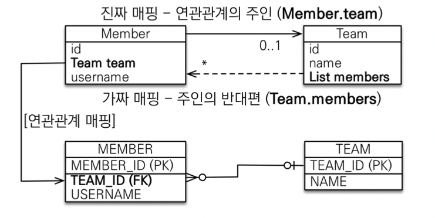

## 연관관계 매핑 기초

### 단방향 연관관계


* 객체 연관관계
  * 회원 객체는 `Member.team` 필드로 팀 객체와 연관관계를 맺는다.
  * 회원 객체와 팀 객체는 단방향 관계다. 회원은 `Member.team` 필드를 통해서 팀을 알 수 있지만 반대로 팀은 회원을 알 수 없다.

* 테이블 연관관계
  * 회원 테이블은 `TEAM_ID` 외래 키로 팀 테이블과 연관관계를 맺는다.
  * 회원 테이블과 팀 테이블은 양방향 관계다. 회원 테이블 `TEAM_ID` 외래 키를 통해서 회원과 팀을 조인할 수 있고 
  반대로 팀과 회원을 조인할 수 있다.

#### 객체 관계 매핑


```java

@Entity
public class Member {

    @Id
    @GeneratedValue
    @Column(name = "MEMBER_ID")
    private Long id;

    @Column(name = "NAME")
    @JoinColumn(name = "TEAM_ID")
    private String name;

//    @Column(name = "TEAM_ID")
//    private Long teamId;

    @ManyToOne
    @JoinColumn(name = "TEAM_ID")
    private Team team;
}
```

* `@ManyToOne`: 이름 그대로 다대일(1:N) 관계라는 매핑 정보다. 회원과 팀은 다대일 관계다. 연관관계를 매핑할 때 이렇게
  다중성을 나타내는 어노테이션을 필수로 사용해야 한다.


* `@JoinColumn(name = "TEAM_ID")`: 조인 칼럼은 외래 키를 매핑할 때 사용한다. `name` 속성에는 매핑할 외래 키
  이름을 지정한다. 회원과 팀 테이블은 `TEAM_ID` 외래키로 연관관계를 맺으므로 이 값을 지정하면 된다. 이 어노테이션은 생략할
  수 있다.


```java
Team team = new Team();
team.setName("TeamA");
em.persist(team);

Member member = new Member();
member.setName("member1");
member.setTeam(team );
em.persist(member);

Member findMember = em.find(Member.class, member.getId());

Team findTeam = findMember.getTeam();
System.out.println("findTeam = " + findTeam);

tx.commit();
```


### 양방향 연관관계


#### 객체와 테이블이 관계를 맺는 차이
* 객체 연관관계 2개
  * 회원 -> 팀 연관관계 1개
  * 팀 -> 회원 연관관계 1개


* 회원 < - > 팀의 연관관계 1개(양방향)

#### 객체의 양방향 관계

* 객체의 양방향 관계는 사실 양방향 관계가 아니라 서로 단방향 관계 2개 이다.

* 객체를 양방향으로 참조하려면 단방향 연관관계를 2개 만들어야 한다.


#### 테이블의 양방향 연관관계

* 테이블의 외래 키 하나로 두 테이블의 연관관계를 관리

* `MEMBER.TEAM_ID` 외래 키 하나로 양방향 연관관계 가짐
  (양쪽에 조인이 가능하다.)

```sql
SELECT *
    FROM MEMBER M
    JOIN TEAM T ON M.TEAM_ID = T.TEAM_ID
    
SELECT *
    FROM TEAM T
    JOIN MEMBER M ON T.TEAM_ID = M.TEAD_ID
```

#### 연관관계의 주인(Owner)

양방향 매핑 규칙

  * 객체의 두 관계중 하나를 연과관계의 주인으로 지정
  * 연관관계의 주인만이 외래 키를 관리(등록, 수정)
  * 주인이 아닌쪽은 읽기만 가능
  * 주인은 `mappedBy` 속성 사용 X
  * 주인이 아니면 `mappedBy` 속성으로 주인 지정

#### 누구를 주인으로?

* 외래 키가 있는 있는 곳을 주인으로 정해라

* 여기서는 `Member.team`이 연관관계의 주인



```java
Team team = new Team();
team.setName("TeamA");
en.persist(team);

Member member = new Member();
member.setName("member1");

team.getMembers().add(member);
em.persist(member);
```

* `members`에 직접 등록해도 아무 일도 일어나지 않음

* `members`에서 조회는 가능하다.

> #### 외래키가 있는 곳을 주인으로 매핑해라 (`mappedBy` X)
> 그렇지 않으면 `Team` 테이블을 조작했는지 `Member` 테이블에 업데이트
> 성능이슈도 있음

### 양방향 매핑시 가장 많이 하는 실수

```java
Team team = new Team();
team.setName("TeamA");
em.persist(team);

Member member = new Member();
member.setName("member1");
em.persist(member);

em.flush();
en.clear();

tx.commit();
```

### 양방향 매핑시 연관관꼐의 주인에 값을 입력해야 한다.

* `team`의 `getMembers()`를 참고하면 이 시점에 `JPA`에서 `fk`를 이용하여 `members`의 데이터를 긁어오는 새로운 쿼리를 
  만들기 때문에 `members`를 관리해줄 필요가 없다.

* 하지만 `em.flush();` `en.clear();` 를 해주지 않는다면 영속성 컨텍스츠의 1차 캐시에서 이미 조회되어 긁어오는 쿼리를 날리지 않음으로
  조회가 불가능하다. 이를 방지하기 위해서; 객체지향적으로 양방향의 조회를 하는 매커니즘에 맞추어 `team.getMembers().add(member)`를
  해주는게 좋다.

* 이러한 방법도 좋다.

```java
@Entity
public class Member {
    
    @ManyToOne
    @JoinColumn(name = "TEAM_ID")
    private Team team;

    public Team getTeam() {
        return team;
    }

    public void setTeam(Team team) {
        this.team = team;
        team.getMembers().add(this);
    }
}
```

* 양방향 매핑시 무한 루프를 조심해야 한다.
  * 예: `toString`, `lombok`, `json`

## 양방향 매핑 정리

* #### 단방향 매핑만으로도 이미 연관관계 매핑은 완료

* 양방향 매핑은 반대 방향으로 조회(객체 그래프 탐색) 기능이 추가된 것 뿐

* JPQL 에서 역방향으로 탐색할 일이 많음

* 단방향 매핑을 잘 하고 양방향은 필요할 때 추가해도 됨

## 연관관계의 주인을 정하는 기준

* 비즈니스 로직을 기준으로 연관관계의 주인을 선택하면 안됨
* 연관관계의 주인은 외래 키의 위치를 기준으로 정해야 함

