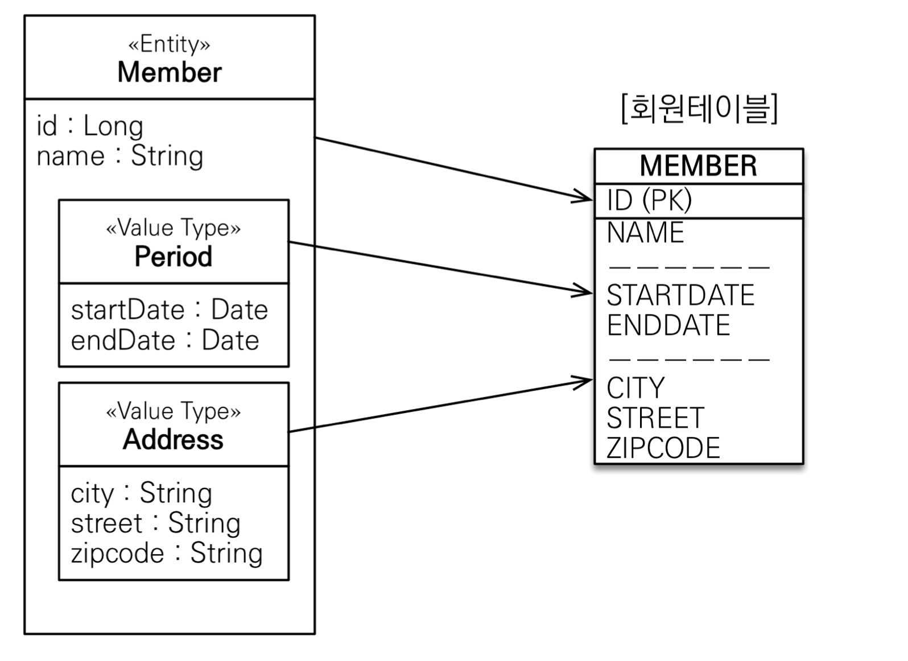
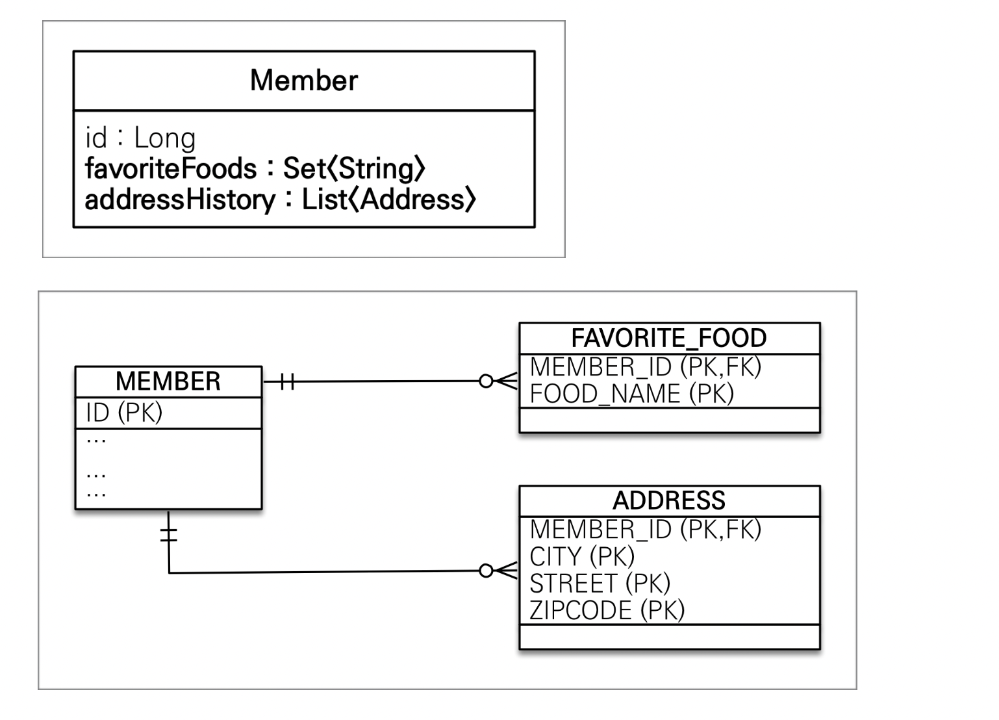

# 값 타입

## JPA의 데이터 타입 분류

### 엔티티 타입
  * @Entity로 정의하는 객체
  * 데이터가 변해도 식별자로 지속해서 추적 가능

### 값 타입
* int, Integar, String 처럼 단순히 값으로 사용하는 자바 기본 타입이나 객체
* 식별자가 없고 값만 있으므로 변경시 추적 불가

## 값 타입의 분류

### 기본값 타입
* 자바 기본 타입
* 래퍼 클래스
* String

### 임베디드 타입(embedded type, 복합 값 타입)

### 컬렉션 값 타입

## 기본값 타입

* 생명주기를 엔티티에 의존
* 값 타입은 공유하면 안된다.

> 참고
> 
> 자바의 기본 타입은 절대 공유하면 안됨
> int, double 같은 기본 타입은 절대 공유하지 않는다.
> 기본 타입은 항상 값을 복사함
> 
> Integer같은 래퍼 클래스나 String 같은 특수한 클래스는 공유 가능한 객체이지만 변경되지 않음!!!

## 임베디드 타입

* 새로운 값 타입을 직접 정의할 수 있음
* JPA는 임베디드 타입이라 함
* 주로 기본 값 타입을 모아서 만들어서 복합 값 타입이라고도 함
* int, String과 같은 값 타입

## 임베디드 타입 사용법

* `@Embeddable`: 값 타입을 정희하는 곳에 표시
* `@Embedded`: 값 타입을 사용하는 곳에 표기
* 기본 생성자 필수

## 임베디드 타입의 장점
* 재사용
* 높은 응집도
* 의미 있는 메서드를 만들 수 있다.
* 임베디드 타입을 포함한 모든 값 타입은, 값 타입을 소유한 엔티티에 생명주기를 의존함

## 임베디드 타입과 테이블 매핑



* 임베디드 타입은 엔티티의 값일 뿐이다.
* 임베디드 타입을 사용하기 전과 후에 매핑하는 테이블은 같다.
* 객체와 테이블을 아주 세밀하게 매핑하는 것이 가능
* 잘 설계한 ORM 매플리케이션은 매핑한 테이블 수보다 클래스의 수가 더 많음

## `@AttributeOverride`: 속성 재정의

* 한 엔티티에서 같은 값 타입을 사용
* 칼럼 명이 중복됨
* `@AttributeOverrides`, `@AttributeOverride` 를 사용해서 칼럼 명 속성을 재정의

## 임베디드 타입과 null
* 임베비드 타입 값이 `null`이면 매핑한 칼럼 값은 모두 `null`

## 값 타입과 불변 객체

값 타입은 복잡한 객체 세상을 조금이라도 단순화하려고 만든 개념이다. 따라서 값 타입은 단순하고 안전하게 다룰 수 있어야 한다.

## 값 타입 공유 참조
* 임베디드 타입 같은 값 타입을 여러 엔티티에서 공유하면 위험함
* 부작용 `side effect` 발생

## 값 타입 복사

* 값 타입의 실제 인스턴스인 값을 공유하는 것은 위험
* 대신 인스턴스를 복사해서 사용

## 값 타입의 한계

* 항상 값을 복사해서 사용하면 공유 참조로 인해 발생하는 부작용을 피할 수 있다.
* 문제는 임베디드 타입처럼 직접 정의한 값 타입은 자바의 기본 타입이 아니라 객체 타입니다.
* 자바 기본 타입에 값을 대입하면 값을 복사한다.
* 객체 타입은 참조 값을 직접 대입하는 것을 막을 방법이 앖다.
* 객체의 공유 참조는 피할 수 없다.

## 불변 객체

* 객체 타입을 수정할 수 없게 만들면 부작용을 원천 차단
* 값 타입을 불변 객체ㄹ 설계해야 함
* 불변 객체: 생성 시점 이후 절대 값을 변경할 수 없는 객체
* 생성자로만 값을 설정하고 수정자를 만들지 않으면 됨

> 참고
> 
> `Integer`, `String` 은 자바가 제공하는 대표적인 불변 객체

## 값 타입의 비교

* 동일성 비교: 인스턴스 참조 값을 비교, == 사용
* 동등성 비교: 인스턴스 값을 비교, `equals()` 사용
* 값 타입은 `a.equals(b)`를 사용해서 동등성 비교를 해야 함
* 값 타입의 `equals()` 메서드를 절절하게 재정의 주로 모든 필드 사용)

## 값 타입 컬렉션


* 값 타입을 하나 이상 저장할 때 사용
* `@ElementCollection`, `@CollectionTable`
* 데이터베이스는 컬렉션을 같은 테이블에 저장할 수 없다.
* 컬렉션을 저장하기 위한 별도의 테이블이 필요함
* 지연로딩함


```java
public class Member {
    ...
    
    @ElementCollection
    @CollectionTable(name = "FAVORITE_FOOD", joinColumns =
        @JoinColumn(name = "MEMBER_ID")
    )
    @Column(name = "FOOD_NAME")
    private Set<String> favoriteFoods = new HashSet<>();

    @ElementCollection
    @CollectionTable(name = "ADDRESS", joinColumns =
        @JoinColumn(name = "MEMBER_ID")
    )
    private Set<Address> addressHistory = new HashSet<>();
}
```

### 값 타입 저장

```java
    
    Member member = new Member();
    member.getAddressHistory().add(new Address("old1", "street1", "1"));
    member.getAddressHistory().add(new Address("old2", "street2", "2"));
    
    em.persist(member);

    Member findMemer = em.find(Member.class, 1L);
    //지연로딩    
    List<Address> addressHistory = findMember.getAddressHistory();
```

### 값 타입 수정

```java
    findMember.getForvoriteFoods().remove("치킨");
    findMember.getFovoriteFoods().add("한식");
    
    // equals 정의 중요
    findMember.getAddressHistory().remove(new Address("old1", "street1", "10000"));
    findMember.getAddressHistory().add(new Address("newcity1", "street1", "10000"))
```

> 참고
> 
> 값 타입 컬렉션은 영속성 전에(Cascade) + 고아 객체 제 거 기능을 필수로 가진다고 볼 수 있다.

## 값 타입 컬렉션의 제약사항

* 값 타입은 엔티티와 다르게 식별자 개념이 없다.
* 값 변경하면 추적이 어렵다.
* 값 타입 컬렉션에 변경 사항이 발생하면, 주인 엔티티와 연관된 모든 데이터를 삭제하고, 값 타입 컬렉션에 있는 현재  
  값을 모두 다시 저장한다.
* 값 타입 컬렉션을 매핑하는 테이블은 모든 컬럼을 묶어서 기본키를 구성해야 함: null 입력x, 중복 저장x

## 값 타입 컬렉션 대안
* 실무에서는 강황에 따라 값 타입 컬렉션 대신에 일대다 관계를 고려
* 일대다 관계를 위한 엔티티를 만들고, 여기에서 값 타입을 사용
* 영속성 전이 + 고아 객체 제거를 사용해서 값 타입 컬렉션 처럼 사용

```java

@Entity
@Table(name = "ADDRESS")
public class AddressEntity{
    
    @Id @GeneratedValue
    private Long id;
    
    private Address address;
}

public class Member {
    ...
    
    @ElementCollection
    @CollectionTable(name = "FAVORITE_FOOD", joinColumns =
        @JoinColumn(name = "MEMBER_ID")
    )
    @Column(name = "FOOD_NAME")
    private Set<String> favoriteFoods = new HashSet<>();

//    @ElementCollection
//    @CollectionTable(name = "ADDRESS", joinColumns =
//        @JoinColumn(name = "MEMBER_ID")
//    )
    @OneToMany(cascade = CascadeType.ALL, orphanRemoval = true)
    @JoinColumn(name = "MEMBER_ID")
    private List<addressEntity> addressHistory = new ArrayList<>();
}
```
```
