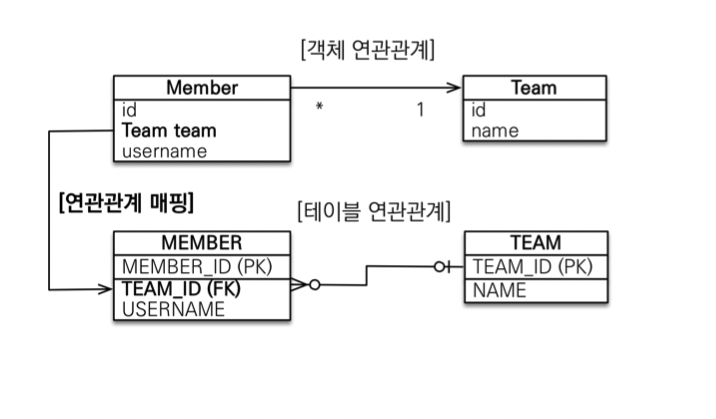
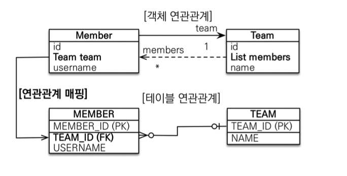
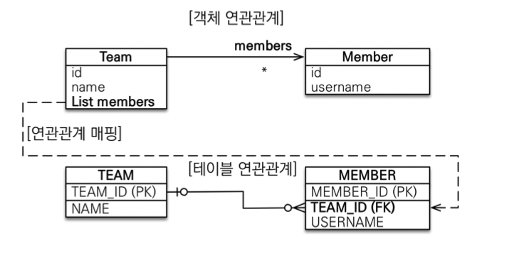
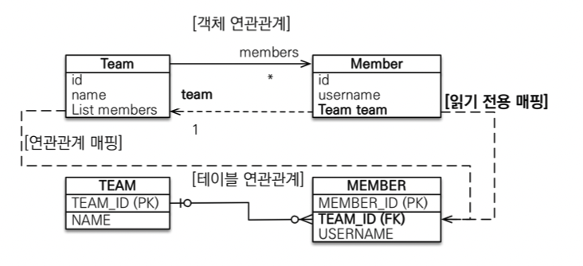
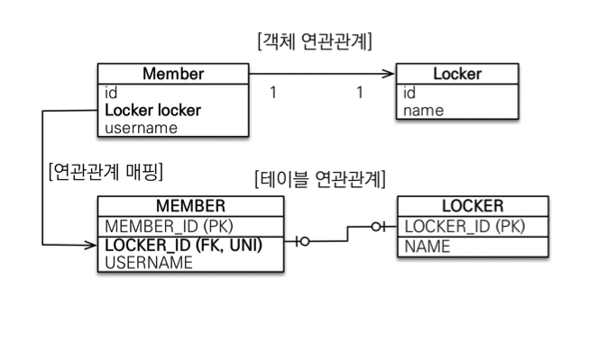
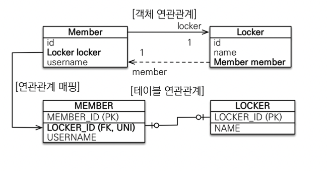
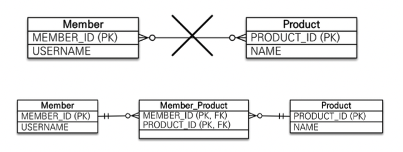
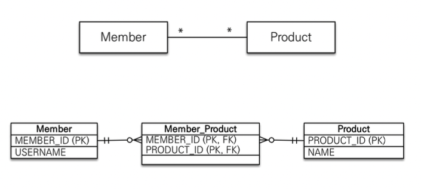

## 연관관계 매핑시 고려사항 3가지

* 다중성

* 단방향, 양방향

* 연관관계 주인

### 다중성

* 다대일: `@ManyToOne`

* 일대다: `@OneToMany`

* 일대일: `@OneToOne`

* 다대다: `@ManyToMany`

### 단방향, 양방향

* 테이블
  * 외래 키 하나로 양쪽으로 조인 가능
  * 사실 방향이라는 개념이 없음

* 객체
  * 참조용 필드가 있는 쪽으로는 참조 가능
  * 한쪽만 참조하면 단방향
  * 양쪽이 서로 참조하면 양방향

### 연관관계의 주인

* 테이블은 외래 키 하나로 두 테이블의 연관관계를 맺음

* 객체 양방향 관계는 A->B, B->A 처럼 참조가 2군데

* 객체 양방향 관계는 참조가 2군데 있음. 둘중 테이블의 외래 키를 관리할 곳을 지정해야 함

* 연관관계의 주인: 외래 키를 관리하는 참조

* 주인의 반대편: 외래 키에 영향을 주지 않음, 단순 조회만 가능

## 다대일 [N: 1]

### 다대일 단방향

* 가장 많이 사용하는 연관관계

* 다대일의 반대는 일대다

### 다대일 양방향

* 외래 키가 있는 쪽이 연관관계의 주인

* 양쪽을 서로 참조하도록 개발

## 일대다 [1: N]

### 일대다 단방향

> 주의 !
> 표준 스펙이지만 권장하지는 않음

* 일대다 단방향은 일대다에서 일이 연관관계의 주인

* 테이블 일대다 관계는 항상 다 쪽에 외래 키가 있음

* 객체와 테이블의 차이 때문에 반대편 테이블의 외래 키를 관리하는 특이한 구조

* `@JoinColumn`을 꼭 사용해야 함. 그렇지 않으면 조인 테이블 방식을 사용함

### 일대다 단방향 정리

* 일대다 단방향 매핑의 단점
  * 엔티티가 관리하는 외래 키가 테이에 있음
  * 연관관계 관리를 위해 추가로 `UPDATE` 실행
* 일대다 단방향 매핑보다는 다대일 양방향 매핑을 사용하자

### 일대다 양방향

* 이런 매핑은 공식적으로 존재하지 않음

* `JoinColumn(insertable=false, updatable=false)`

* 읽기 전용 필드를 사용해서 양방향 처럼 사용하는 방법

* 다대일 양방향을 사용하자

### 일대일 관계

* 일대일 관계는 그 반대도 일대일
* 주 테이블이나 대상 테이블 중에 외래 키 선택 가능
  * 주 테이블 외래 키
  * 대상 테이블 외래 키
* 외래 키에 데이터베이스 유니크 제약조건 추가

### 일대일: 주 테이블에 외래 키 양방향

### 일대일 정리

* #### 주 테이블에 외래 키
  * 주 객체가 대상 객체의 참조를 가지는 것 처럼
    주 테이블에 외래 키를 두고 대상 테이블을 찾음
  * 객체지향 개발자 선호
  * JPA 매핑 편리
  * 장점: 주 테이블만 조회해도 대상 테이블에 데이터가 있는지 확인 가능
  * 단점: 값이 없으면 외래 키에 null 허용

* #### 대상 테이블에 외래 키
  * 대상 테이블에 외래 키가 존재
  * 전통적인 데이터베이스 개발자 선호
  * 장점: 주 테이블과 대상 테이블을 일대일에서 일대다 관계로 변경할 때 테이블 구조 유지
  * 단점: 프록시 기능의 한계로 지연 로딩으로 설정해도 항상 즉시 로딩됨

## 다대다 [N: M]

* 관계형 데이터베이스는 정규화된 테이블 2개로 다대다 관꼐를 표현할 수 없음

* 연결 테이블을 추가해서 일대다, 다대일 관계로 풀어야 함

* 객체는 컬렉션을 사용해서 객체 2개로 다대다 관계 가능

* #### `@ManyToMany` 사용

* #### `@JoinTable`로 연결 테이블 지정

* 다대다 매핑: 단방향, 양방향 가능

### 다대다 매핑의 한계

* #### 편리해 보이지만 실무에서 사용 X

* 연결 테이블이 단순히 연결만 하고 끝나지 않음 

* 주문시간, 수량 같은 데이터가 들어올 수 있음

### 다대다 한계 극복

* 연결 테이블용 엔티티 추가(연결 테이블을 엔티티로 승격)

* `@ManyToMany` -> `@OneToMany` `@ManyToOne`

