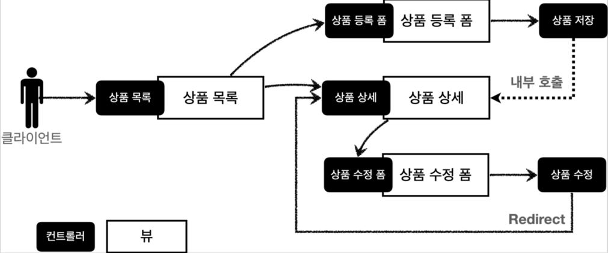

# 스프링 MVC - 웹 피이지 제작

## 프로젝트 색성

#### build.gradle

```java
plugins {
    id 'org.springframework.boot' version '2.6.4'
    id 'io.spring.dependency-management' version '1.0.11.RELEASE'
    id 'java'
}

group = 'hello'
version = '0.0.1-SNAPSHOT'
sourceCompatibility = '11'

configurations {
    compileOnly {
        extendsFrom annotationProcessor
    }
}

repositories {
    mavenCentral()
}

dependencies {
    implementation 'org.springframework.boot:spring-boot-starter-thymeleaf'
    implementation 'org.springframework.boot:spring-boot-starter-web'
    compileOnly 'org.projectlombok:lombok'
    annotationProcessor 'org.projectlombok:lombok'
    testImplementation 'org.springframework.boot:spring-boot-starter-test'
}

tasks.named('test') {
    useJUnitPlatform()
}
```


### Welcome 페이지

```html
<!DOCTYPE html>
<html>
<head>
    <meta charset="UTF-8">
    <title>Title</title>
</head>
<body> <ul>
    <li>상품 관리 <ul>
        <li><a href="/basic/items">상품 관리 - 기본</a></li> </ul>
    </li> </ul>
</body>
</html>
```

## 요구사항 분석

#### 상품 도메인 모델
* 상품 
* ID 
* 상품명 
* 가격 
* 수량

#### 상품 관리 기능
* 상품 목록 
* 상품 상세 
* 상품 등록 
* 상품 수정


#### 서비스 제공 흐름



### 상품 도메인 개발

#### Item - 상품 객체

```java
package hello.itemservice.domain;

import lombok.Data;

@Data
public class Item {
    private Long id;
    private String itemName;
    private Integer price;
    private Integer quantity;

    public Item(){}

    public Item(String itemName, Integer price, Integer quantity) {
        this.itemName = itemName;
        this.price = price;
        this.quantity = quantity;
    }

}
```

#### ItemRepository - 상품 저장소

```java
package hello.itemservice.domain;

import org.springframework.stereotype.Repository;

import java.util.HashMap;
import java.util.Map;

@Repository
public class ItemRepository {
    private static final Map<Long, Item> store = new HashMap<>();
    private static long sequence = 0L;
    
    public Item save(Item item){
        item.setId(++sequence);
        store.put(item.getId(), item);
        return item;
    }
    
    public Item findById(Long id){
        return store.get(id);
    }
    
    public void update(Long itemId, Item updateParam){
        Item findItem = findById(itemId);
        findItem.setItemName(updateParam.getItemName());
        findItem.setPrice(updateParam.getPrice());
        findItem.setQuantity(updateParam.getQuantity());
    }
    
    public void clearStore(){
        store.clear();
    }
}
```

#### ItemRepositoryTest - 상품 저장소 테스트

```java
package hello.itemservice.domain;

import org.assertj.core.api.Assertions;
import org.junit.jupiter.api.AfterEach;
import org.junit.jupiter.api.Test;

import java.util.List;

import static org.assertj.core.api.Assertions.*;
import static org.junit.jupiter.api.Assertions.*;

class ItemRepositoryTest {

    ItemRepository itemRepository = new ItemRepository();

    @AfterEach
    void afterEach() {
        itemRepository.clearStore();
    }

    @Test
    public void save() throws Exception{
        //given
        Item item = new Item("itemA", 1000, 10);

        //when
        Item savedItem = itemRepository.save(item);

        //then
        Item findItem = itemRepository.findById(item.getId());
        assertThat(findItem).isEqualTo(savedItem);
    }

    @Test
    public void findAll() throws Exception{
        //given
        Item item1 = new Item("item1", 10000, 10);
        Item item2 = new Item("item2", 20000, 20);

        itemRepository.save(item1);
        itemRepository.save(item2);

        //when
        List<Item> result = itemRepository.findAll();

        //then
        assertThat(result.size()).isEqualTo(2);
        assertThat(result).contains(item1, item2);
    }

    @Test
    public void updateItem() throws Exception{
        //given
        Item item = new Item("item1", 10000, 10);

        Item savedItem = itemRepository.save(item);
        Long itemId = savedItem.getId();

        //when
        Item updateParam = new Item("item2", 20000, 30);
        itemRepository.update(itemId, updateParam);

        //then
        Item findItem = itemRepository.findById(itemId);

        assertThat(findItem.getItemName()).isEqualTo(updateParam.getItemName());
        assertThat(findItem.getPrice()).isEqualTo(updateParam.getPrice());
        assertThat(findItem.getQuantity()).isEqualTo(updateParam.getQuantity());
    }
}
```

## 상품 서비스 HTML

#### 상품 목록 HTML

```html
<!DOCTYPE HTML>
<html>
<head>
    <meta charset="utf-8">
    <link href="../css/bootstrap.min.css" rel="stylesheet">
</head>
<body>
<div class="container" style="max-width: 600px">
    <div class="py-5 text-center">
        <h2>상품 목록</h2> </div>
    <div class="row">
        <div class="col">
            <button class="btn btn-primary float-end" onclick="location.href='addForm.html'" type="button">상품
                등록</button> </div>
    </div>
    <hr class="my-4">
    <div>
        <table class="table">
            <thead>
            <tr>
                <th>ID</th> <th>상품명</th> <th>가격</th> <th>수량</th>
            </tr>
            </thead>
            <tbody>
            <tr>
                <td><a href="item.html">1</a></td>
                <td><a href="item.html">테스트 상품1</a></td>
                <td>10000</td>
                <td>10</td>
            </tr>
            <tr>
                <td><a href="item.html">2</a></td>
                <td><a href="item.html">테스트 상품2</a></td> <td>20000</td>
                <td>20</td>
            </tr>
            </tbody>
        </table>
    </div>
</div> <!-- /container -->
</body>
</html>
```

#### 상품 상세

```html
<!DOCTYPE HTML>
<html>
<head>
    <meta charset="utf-8">
    <link href="../css/bootstrap.min.css" rel="stylesheet">
    <style>
        .container {
        max-width: 560px;
        }
    </style>
</head>
<body>
<div class="container">
    <div class="py-5 text-center">
        <h2>상품 상세</h2>
    </div>
    <div>
        <label for="itemId">상품 ID</label>
        <input type="text" id="itemId" name="itemId" class="form-control" value="1" readonly>
    </div>
    <div>
        <label for="itemName">상품명</label>
        <input type="text" id="itemName" name="itemName" class="form-control" value="상품A" readonly> </div>
    <div>
        <label for="price">가격</label>
        <input type="text" id="price" name="price" class="form-control" value="10000" readonly>
    </div>
    <div>
        <label for="quantity">수량</label>
        <input type="text" id="quantity" name="quantity" class="form-control" value="10" readonly>
    </div>
    <hr class="my-4">
    <div class="row">
        <div class="col">
            <button class="w-100 btn btn-primary btn-lg"
                    onclick="location.href='editForm.html'" type="button">상품 수정</button>
        </div>
        <div class="col">
            <button class="w-100 btn btn-secondary btn-lg"
                    onclick="location.href='items.html'" type="button">목록으로</button> </div>
    </div>
</div> <!-- /container -->
</body>
</html>
```

#### 상품 등록

```html
<!DOCTYPE HTML>
<html>
<head>
    <meta charset="utf-8">
    <link href="../css/bootstrap.min.css" rel="stylesheet">
    <style>
        .container {
            max-width: 560px;
        } </style>
</head>
<body>
<div class="container">
    <div class="py-5 text-center">
        <h2>상품 등록 폼</h2> </div>
    <h4 class="mb-3">상품 입력</h4>
    <form action="item.html" method="post">
        <div>
            <label for="itemName">상품명</label>
            <input type="text" id="itemName" name="itemName"
                   class="form-control" placeholder="이름을 입력하세요"> </div>
        <div>
            <label for="price">가격</label>
            <input type="text" id="price" name="price" class="form-control" placeholder="가격을 입력하세요">
        </div>
        <div>
            <label for="quantity">수량</label>
            <input type="text" id="quantity" name="quantity" class
                    ="form-control" placeholder="수량을 입력하세요">
        </div>
        <hr class="my-4">
        <div class="row">
            <div class="col">
                <button class="w-100 btn btn-primary btn-lg" type="submit">상품
                    등록</button> </div>
            <div class="col">
                <button class="w-100 btn btn-secondary btn-lg"
                        onclick="location.href='items.html'" type="button">취소</button> </div>
        </div>
    </form>
</div> <!-- /container -->
</body>
</html>
```

#### 상품 수정

```html
<html>
<head>
    <meta charset="utf-8">
    <link href="../css/bootstrap.min.css" rel="stylesheet">
    <style>
        .container {
            max-width: 560px;
        } </style>
</head>
<body>
<div class="container">
    <div class="py-5 text-center">
        <h2>상품 수정 폼</h2> </div>
    <form action="item.html" method="post">
        <div>
            <label for="id">상품 ID</label>
            <input type="text" id="id" name="id" class="form-control" value="1"
                   readonly>
        </div>
        <div>
            <label for="itemName">상품명</label>
            <input type="text" id="itemName" name="itemName" class="form- control" value="상품A">
        </div>
        <div>
            <label for="price">가격</label>
            <input type="text" id="price" name="price" class="form-control"
                   value="10000">
        </div>
        <div>
            <label for="quantity">수량</label>
            <input type="text" id="quantity" name="quantity" class="form-control" value="10">
        </div>
        <hr class="my-4">
        <div class="row">
            <div class="col">
                <button class="w-100 btn btn-primary btn-lg" type="submit">저장
                </button>
            </div>
            <div class="col">
                <button class="w-100 btn btn-secondary btn-lg"
                        onclick="location.href='item.html'" type="button">취소</button> </div>
        </div>
    </form>
</div> <!-- /container -->
</body>
</html>
```

## 상품 목록 - 타임리프

#### BasicItemController

```java
package hello.itemservice.web.item.basic;

import hello.itemservice.domain.Item;
import hello.itemservice.domain.ItemRepository;
import lombok.RequiredArgsConstructor;
import org.springframework.stereotype.Controller;
import org.springframework.ui.Model;
import org.springframework.web.bind.annotation.GetMapping;
import org.springframework.web.bind.annotation.RequestMapping;

import javax.annotation.PostConstruct;
import java.util.List;

@Controller
@RequestMapping("/basic/items")
@RequiredArgsConstructor
public class BasicItemController {
    private final ItemRepository itemRepository;
    
    @GetMapping
    public String items(Model model){
        List<Item> items =itemRepository.findAll();
        model.addAttribute("items", items);
        return "basic/items";
    }
    
    @PostConstruct
    public void init(){
        itemRepository.save(new Item("testA", 10000, 10));
        itemRepository.save(new Item("testB", 20000, 20));
    }
}
```

#### items.html

```html
<!DOCTYPE HTML>
<html>
<head>
    <meta charset="utf-8">
    <link href="../css/bootstrap.min.css" rel="stylesheet">
</head>
<body>
<div class="container" style="max-width: 600px">
    <div class="py-5 text-center">
        <h2>상품 목록</h2> </div>
    <div class="row">
        <div class="col">
            <button class="btn btn-primary float-end" onclick="location.href='addForm.html'" type="button">상품
                등록</button> </div>
    </div>
    <hr class="my-4">
    <div>
        <table class="table">
            <thead>
            <tr>
                <th>ID</th> <th>상품명</th> <th>가격</th> <th>수량</th>
            </tr>
            </thead>
            <tbody>
            <tr>
                <td><a href="item.html">1</a></td>
                <td><a href="item.html">테스트 상품1</a></td>
                <td>10000</td>
                <td>10</td>
            </tr>
            <tr>
                <td><a href="item.html">2</a></td>
                <td><a href="item.html">테스트 상품2</a></td> <td>20000</td>
                <td>20</td>
            </tr>
            </tbody>
        </table>
    </div>
</div> <!-- /container -->
</body>
</html>
```


### 타임리프

#### 타입리프 사용 선언

`<html xmlns:th="http://www.thymleaf.org">`

#### 속성 변경 - th:href

`th:href="@{/css/bootstrap.min.css}"`

* `href="value1"`을 `th:href="value2"`의 값으로 변경한다.
* 타임리프 뷰 템플릿을 거치게 되면 원래 값을 `th:xxx`값으로 변경한다. 만약 값이 없다면 새로 생성한다.
* HTML을 그래도 볼 때는 `href` 속성이 사용되고, 뷰 템플릿을 거치면 `th:href`의 값이 `href`로 대체되면서 동적으로 변경할 수 있다.
* 대부분의 HTML 속성을 `th:xxx` 로 변경할 수 있다.


### 타임리프 핵심

* 핵심은 `th:xxx`가 붙은 부분은 서버사이드에서 렌더링 되고, 기존 것을 대체한다. `th:xxx`이 없으면 기존 html의 `xxx` 속성을 그대로 사용한다.
* HTML을 파일로 직접 열었을 때, `th:xxx`가 있어도 웹 브라우저느 `th:` 속성을 알지 못하므로 무시한다.
* 따라서 HTML을 파일 보기를 유지하면서 템플릿 기능도 할 수 있다.

