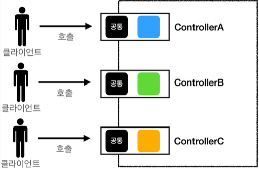

# MVC 프레임워크 만들기

## 프론트 컨트롤러 패턴

#### 프론트 컨트롤러 도입 전



#### 프론트 컨트롤러 도입 후


#### FrontController 패턴 특징

* 프론트 컨트롤러 서블릿 하나로 클라이언트의 요청을 받는다, 
* 프론트 컨트롤러가 요청에 맞는 컨트롤러를 찾아서 호출한다. 
* 입구를 하나로 통일한다.
* 공통 처리 가능하다.
* 프론트 컨트롤러를 제외한 나머지 컨트롤러는 서블릿을 사용하지 않아도 된다.

#### 스프링 웹 MVC와 프론트 컨트롤러

스프링 웹 MVC의 핵심은 `FrontController`
스프링 웹 MVC의 `DispatcherServlet`이 `FrontController` 패턴으로 구현되어 있음


## 프론트 컨트롤러 도입 - v1

#### V1 구조


#### [ControllerV1](src/main/java/com/example/servlet3/web/frontcontroller/v1/ControllerV1.java)

```java
package com.example.servlet3.web.frontcontroller.v1;

import javax.servlet.ServletException;
import javax.servlet.http.HttpServletRequest;
import javax.servlet.http.HttpServletResponse;
import java.io.IOException;

public interface ControllerV1 {

    void process(HttpServletRequest request, HttpServletResponse response) throws ServletException, IOException;
}
```

서블릿과 비슷한 모양의 컨트롤러 인터페이스를 도입한다. 각 컨트롤러들은 이 인터페이스를 구현하면 된다. 프론트 컨트롤러는 이 인터페이스를 호출해서
구현과 관계없이 로직의 일관성을 가져갈 수 있다.


이제 이 인터페이스를 구현한 컨트롤러를 만들어보자. 지금 단계에서는 기존 로직을 최대한 유지하는게 핵심이다.


#### [MemberFormControllerV1 - 회원 등록 컨트롤러](/src/main/java/com/example/servlet3/web/frontcontroller/v1/controller/MemberFormControllerV1.java)

```java
package com.example.servlet3.web.frontcontroller.v1.controller;

import com.example.servlet3.web.frontcontroller.v1.ControllerV1;

import javax.servlet.RequestDispatcher;
import javax.servlet.ServletException;
import javax.servlet.http.HttpServletRequest;
import javax.servlet.http.HttpServletResponse;
import java.io.IOException;

public class MemberFormControllerV1 implements ControllerV1 {

    @Override
    public void process(HttpServletRequest request, HttpServletResponse response) throws ServletException, IOException {
        String viewPath = "/WEB-INF/views/new-form.jsp";
        RequestDispatcher dispatcher = request.getRequestDispatcher(viewPath);
        dispatcher.forward(request, response);
    }
}
```


#### [MemberSaveControllerV1 - 회원 저장 컨트롤러](/src/main/java/com/example/servlet3/web/frontcontroller/v1/controller/MemberSaveControllerV1.java)

```java
package com.example.servlet3.web.frontcontroller.v1.controller;

import com.example.servlet3.domain.member.Member;
import com.example.servlet3.domain.member.MemberRepository;
import com.example.servlet3.web.frontcontroller.v1.ControllerV1;

import javax.servlet.RequestDispatcher;
import javax.servlet.ServletException;
import javax.servlet.http.HttpServletRequest;
import javax.servlet.http.HttpServletResponse;
import java.io.IOException;

public class MemberSaveControllerV1 implements ControllerV1 {

    private MemberRepository memberRepository = MemberRepository.getInstance();

    @Override
    public void process(HttpServletRequest request, HttpServletResponse response) throws ServletException, IOException {
        String username = request.getParameter("username");
        int age = Integer.parseInt(request.getParameter("age"));

        Member member = new Member(username, age);
        memberRepository.save(member);

//        모델에 데이터 보관
        request.setAttribute("member", member);

        String viewPath = "/WEB-INF/views/save-result.jsp";
        RequestDispatcher dispatcher = request.getRequestDispatcher(viewPath);
        dispatcher.forward(request, response);
    }
}
```

##### [MemberListControllerV1 - 회원 목록 컨트롤러](/src/main/java/com/example/servlet3/web/frontcontroller/v1/controller/MemberListControllerV1.java)

```java
package com.example.servlet3.web.frontcontroller.v1.controller;

import com.example.servlet3.domain.member.Member;
import com.example.servlet3.domain.member.MemberRepository;
import com.example.servlet3.web.frontcontroller.v1.ControllerV1;

import javax.servlet.RequestDispatcher;
import javax.servlet.ServletException;
import javax.servlet.http.HttpServletRequest;
import javax.servlet.http.HttpServletResponse;
import java.io.IOException;
import java.util.List;

public class MemberListControllerV1 implements ControllerV1 {

    private MemberRepository memberRepository = MemberRepository.getInstance();

    @Override
    public void process(HttpServletRequest request, HttpServletResponse response) throws ServletException, IOException {
        List<Member> members = memberRepository.findAll();

        request.setAttribute("members", members);

        String viewPath = "/WEB-INF/views/members.jsp";
        RequestDispatcher dispatcher = request.getRequestDispatcher(viewPath);
        dispatcher.forward(request, response);
    }
}
```

#### [FrontControllerServletV1 - 프론트 컨트롤러](/src/main/java/com/example/servlet3/web/frontcontroller/v1/FrontControllerServletV1.java)

```java
package com.example.servlet3.web.frontcontroller.v1;

import com.example.servlet3.web.frontcontroller.v1.controller.MemberFormControllerV1;
import com.example.servlet3.web.frontcontroller.v1.controller.MemberListControllerV1;
import com.example.servlet3.web.frontcontroller.v1.controller.MemberSaveControllerV1;

import javax.servlet.ServletException;
import javax.servlet.annotation.WebServlet;
import javax.servlet.http.HttpServlet;
import javax.servlet.http.HttpServletRequest;
import javax.servlet.http.HttpServletResponse;
import java.io.IOException;
import java.util.HashMap;
import java.util.Map;

@WebServlet(name = "frontControllerServletV1", urlPatterns = "/front-controller/v1/*")
public class FrontControllerServletV1 extends HttpServlet {

    private Map<String, ControllerV1> controllerMap = new HashMap<>();

    public FrontControllerServletV1() {
        controllerMap.put("/front-controller/v1/members/new-form", new MemberFormControllerV1());
        controllerMap.put("/front-controller/v1/members/save", new MemberSaveControllerV1());
        controllerMap.put("/front-controller/v1/members", new MemberListControllerV1());
    }

    @Override
    protected void service(HttpServletRequest request, HttpServletResponse response) throws ServletException, IOException {
        System.out.println("FrontControllerServletV1.service");

        String requestURI = request.getRequestURI();
        ControllerV1 controller = controllerMap.get(requestURI);

        if(controller == null){
            response.setStatus(HttpServletResponse.SC_NOT_FOUND);
            return;
        }
        controller.process(request, response);
    }
}
```

### 프론트 컨트롤러 분석

#### urlPatterns
* `urlPatterns = "/front-controller/v1/*"` : `/front-controller/v1` 를 포함한 하위 모든 요청은 이 서블릿에서 받아들인다.
* 예) `/front-controller/v1` , `/front-controller/v1/a` , `/front-controller/v1/a/b`


#### controllerMap
* key: 매핑 URL 
* value: 호출될 컨트롤러

#### service()
먼저 requestURI 를 조회해서 실제 호출할 컨트롤러를 `controllerMap` 에서 찾는다. 만약 없다면 404(SC_NOT_FOUND) 상태 코드를 반환한다.
컨트롤러를 찾고 `controller.process(request, response);` 을 호출해서 해당 컨트롤러를 실행한다.

## View 분리 - v2

모든 컨트롤러에서 뷰로 이동하는 부분에 중복이 있고, 깔끔하지 않다.

```java
String viewPath = "/WEB-INF/views/new-form.jsp";
RequestDispatcher dispatcher = request.getRequestDispatcher(viewPath);
dispatcher.forward(request, response);
```

#### [MyView](/src/main/java/com/example/servlet3/web/frontcontroller/MyView.java)

```java
package com.example.servlet3.web.frontcontroller;

import javax.servlet.RequestDispatcher;
import javax.servlet.ServletException;
import javax.servlet.http.HttpServletRequest;
import javax.servlet.http.HttpServletResponse;
import java.io.IOException;
import java.util.Map;

public class MyView {

    private String viewPath;

    public MyView(String viewPath) {
        this.viewPath = viewPath;
    }

    public void render(HttpServletRequest request, HttpServletResponse response) throws ServletException, IOException {
        RequestDispatcher dispatcher = request.getRequestDispatcher(viewPath);
        dispatcher.forward(request, response);
    }

    public void render(Map<String, Object> model, HttpServletRequest request, HttpServletResponse response) throws ServletException, IOException {
        modelToRequestAttribute(model, request);
        RequestDispatcher dispatcher = request.getRequestDispatcher(viewPath);
        dispatcher.forward(request, response);
    }

    private void modelToRequestAttribute(Map<String, Object> model, HttpServletRequest request) {
        model.forEach((key, value) -> request.setAttribute(key, value));
    }
}
```
