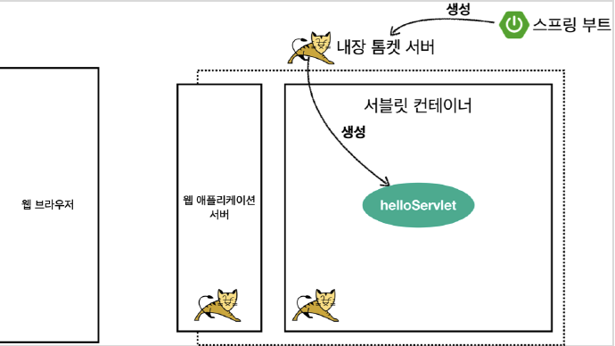
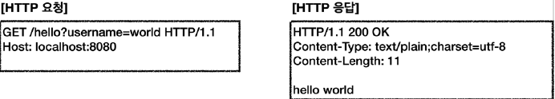
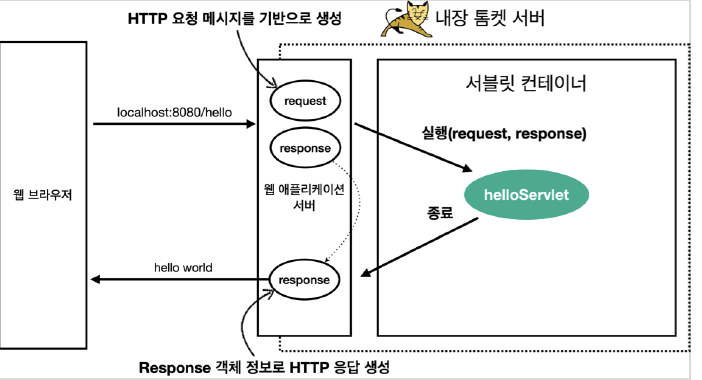

# 서블릿

## Hello 서블릿

스프링 부트 환경에서 서블릿 등록하고 사용

> 참고
> 
> 서블릿은 톰캣 같은 웹 어플리케이션 서버를 직접 설치하고, 그 위에 서블릿 코드를 클래스 파일로 빌드해서 올린 다음, 톰캣 서버를
> 실행하면 된다. 하지만 과정은 매우 번거롭다.
> 스프링 부트는 톰캣 서버를 내장하고 있으므로, 톰캣 서버 설치 없이 편리하게 서블릿 코드를 실행할 수 있다.

### 스프링 부트 서블릿 환경 구성

#### `@ServletComponentScan`
스프링 부트는 서블릿을 직접 등록해서 사용할 수 있도록 `@ServletComponentScan` 을 지원한다. 

#### [ServletApplication](./src/main/java/hello/servlet/ServletApplication.java)

```java
package hello.servlet;

import org.springframework.boot.SpringApplication;
import org.springframework.boot.autoconfigure.SpringBootApplication;
import org.springframework.boot.web.servlet.ServletComponentScan;

@ServletComponentScan  // 서블릿 자동 등록
@SpringBootApplication
public class ServletApplication {

    public static void main(String[] args) {
        SpringApplication.run(ServletApplication.class, args);
    }

}
```

### 서블릿 등록하기

#### [HelloServlet](./src/main/java/hello/servlet/basic/HelloServlet.java)

```java
package hello.servlet.basic;

import lombok.extern.slf4j.Slf4j;

import javax.servlet.ServletException;
import javax.servlet.annotation.WebServlet;
import javax.servlet.http.HttpServlet;
import javax.servlet.http.HttpServletRequest;
import javax.servlet.http.HttpServletResponse;
import java.io.IOException;

@Slf4j
@WebServlet(name = "helloServlet", urlPatterns = "/hello")
public class HelloServlet extends HttpServlet {
  @Override
  protected void service(HttpServletRequest request, HttpServletResponse response) throws ServletException, IOException {

    log.debug("HelloServlet.service");
    log.debug("request = {}", request);
    log.debug("response = {}", response);

    String username = request.getParameter("username");
    log.debug("username = {}", username);

    response.setContentType("text/plain");
    response.setCharacterEncoding("utf-8");
    response.getWriter().write("hello " + username);
  }
}
```

* `@WebServlet` 서브릿 애노테이션
  * name: 서브릿 이름
  * urlPattern: URL 매핑 

```java
package javax.servlet.annotation;

import java.lang.annotation.Documented;
import java.lang.annotation.ElementType;
import java.lang.annotation.Retention;
import java.lang.annotation.RetentionPolicy;
import java.lang.annotation.Target;

@Target(ElementType.TYPE)
@Retention(RetentionPolicy.RUNTIME)
@Documented
public @interface WebServlet {
    
    String name() default "";
    
    String[] value() default {};
    
    String[] urlPatterns() default {};
    
    int loadOnStartup() default -1;
    
    WebInitParam[] initParams() default {};
    
    boolean asyncSupported() default false;
    
    String smallIcon() default "";
    
    String largeIcon() default "";
    
    String description() default "";
    
    String displayName() default "";
}
```


* HTTP 요청을 통해 매핑된 URL 이 호출되면 서블릿 컨테이너는 다음 메서드를 실행한다.
  * `protected void service(HttpServletRequest request, HttpServletResponse response)`


* 웹브라우저 실행

```http request
http://localhost:8080/hello?username=world
```

* 콘솔 실행 결과

```logcatfilter
2022-08-16 18:16:58.494  INFO 63663 --- [nio-8080-exec-2] hello.servlet.basic.HelloServlet         : HelloServlet.service
2022-08-16 18:16:58.499  INFO 63663 --- [nio-8080-exec-2] hello.servlet.basic.HelloServlet         : request = org.apache.catalina.connector.RequestFacade@2fd6a807
2022-08-16 18:16:58.500  INFO 63663 --- [nio-8080-exec-2] hello.servlet.basic.HelloServlet         : response = org.apache.catalina.connector.ResponseFacade@1cb04a39
2022-08-16 18:16:58.502  INFO 63663 --- [nio-8080-exec-2] hello.servlet.basic.HelloServlet         : username = world
```

### HTTP 요청 메시지 로그로 확인하기

서버를 다시 시작하고, 요청해보면 서버가 받은 HTTP 요청 메시지를 출력하는 것을 확인할 수 있다.

```http request
Host: 127.0.0.1:8080
Connection: keep-alive
Cache-Control: max-age=0
sec-ch-ua: " Not A;Brand";v="99", "Chromium";v="96", "Google Chrome";v="96"
sec-ch-ua-mobile: ?0
sec-ch-ua-platform: "macOS"
Upgrade-Insecure-Requests: 1
User-Agent: Mozilla/5.0 (Macintosh; Intel Mac OS X 10_15_7) AppleWebKit/537.36 (KHTML, like Gecko) Chrome/96.0.4664.110 Safari/537.36
Accept: text/html,application/xhtml+xml,application/xml;q=0.9,image/avif,image/webp,image/apng,*/*;q=0.8,application/signed-exchange;v=b3;q=0.9
Sec-Fetch-Site: none
Sec-Fetch-Mode: navigate
Sec-Fetch-User: ?1
Sec-Fetch-Dest: document
Accept-Encoding: gzip, deflate, br
Accept-Language: ko-KR,ko;q=0.9,en-US;q=0.8,en;q=0.7
Cookie: csrftoken=l4KkyRgmn1vadS5ZWHeEbtilXTC8ilGIV8cwDaJRZk1hdyFwMJmAtDKJdIvvJzmV; sessionid=21ia6d6hfxowwgs29itfucvzwlcb9yy5
```

> 참고
> 
> 운영서버에 이렇게 모든 요청 정보를 다 남기면 성능저하가 발생할 수 있다. 개발 단계에서만 적용할 것

### 서블릿 컨테이너 동작 방식

#### 내장 톰캣 서버 생성



#### HTTP 요청, HTTP 응답 메시지



#### 웹 애플리케이션 서버의 요청 응답 구조




