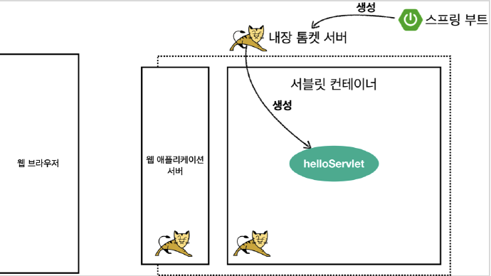
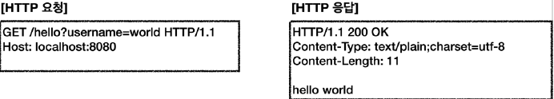
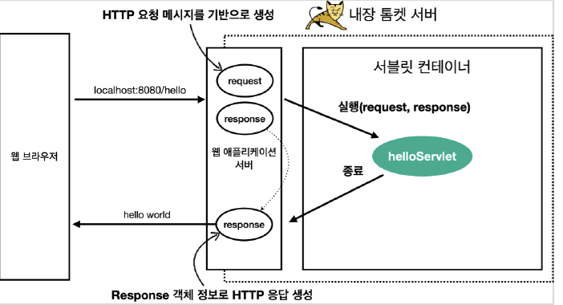

###`@WebServlet` 서브릿 애노테이션
  * name: 서브릿 이름
  * urlPattern: URL 매핑
  
    HTTP 요청을 통해 매핑된 URL 이 호출되면 서블릿 컨테이너는 다음 메서드를 실행한다.
    
    `protected void service(HttpServletRequest request, HttpServletResponse response)`


* 웹브라우저 실행
  * http://localhost:8080/hello?username=world
  * 결과: hello world


* 콘솔 실행 결과
```shell
HelloServlet.service
request = org.apache.catalina.connector.RequestFacade@7bbd1dac
response = org.apache.catalina.connector.ResponseFacade@755aeee1
username = world
```

### HTTP 요청 메시지 로그로 확인하기

다음설정을 추가
`application.properties`
```properties
logging.level.org.apache.coyote.http11=debug
```

서버를 다시 시작하고, 요청해보면 서버가 받은 HTTP 요청 메시지를 출력하는 것을 확인할 수 있다.

```shell
Host: 127.0.0.1:8080
Connection: keep-alive
Cache-Control: max-age=0
sec-ch-ua: " Not A;Brand";v="99", "Chromium";v="96", "Google Chrome";v="96"
sec-ch-ua-mobile: ?0
sec-ch-ua-platform: "macOS"
Upgrade-Insecure-Requests: 1
User-Agent: Mozilla/5.0 (Macintosh; Intel Mac OS X 10_15_7) AppleWebKit/537.36 (KHTML, like Gecko) Chrome/96.0.4664.110 Safari/537.36
Accept: text/html,application/xhtml+xml,application/xml;q=0.9,image/avif,image/webp,image/apng,*/*;q=0.8,application/signed-exchange;v=b3;q=0.9
Sec-Fetch-Site: none
Sec-Fetch-Mode: navigate
Sec-Fetch-User: ?1
Sec-Fetch-Dest: document
Accept-Encoding: gzip, deflate, br
Accept-Language: ko-KR,ko;q=0.9,en-US;q=0.8,en;q=0.7
Cookie: csrftoken=l4KkyRgmn1vadS5ZWHeEbtilXTC8ilGIV8cwDaJRZk1hdyFwMJmAtDKJdIvvJzmV; sessionid=21ia6d6hfxowwgs29itfucvzwlcb9yy5
```

> *참고*
> 
> 운영서버에 이렇게 모든 요청 정보를 다 남기면 성능저하가 발생할 수 있다. 개발 단계에서만 적용할 것

### 서블릿 컨테이너 동작 방식 설명

  **내장 톰캣 서버 생성**



  **HTTP 요청, HTTP 응답 메시지**



  **웹 애플리케이션 서버의 요청 응답 구조**



### Welcome 페이지 추가
  지금부터 개발할 내용을 편리하게 참고할 수 있도록 페이지 구성
  
  `webapp` 경로에 `index.html`을 두면 http://localhost:8080 호출시 `index.html` 페이지 오픈
  
  `main/webapp/index.html`
  ```html
  <!DOCTYPE html>
  <html>
  <head>
    <meta charset="UTF-8">
    <title>Title</title>
  </head>
  <body>
  <ul>
    <li><a href="basic.html">서블릿 basic</a></li>
  </ul>
  </body>
  </html>
  ```

  이번 장에서 학습할 내용은 다음 `basic.html`이다.
  `main/webapp/basic.html`
  ```html
  <!DOCTYPE html>
  <html>
  <head>
    <meta charset="UTF-8">
    <title>Title</title>
  </head>
  <body>
  <ul>
    <li>hello 서블릿
      <ul>
        <li><a href="/hello?username=servlet">hello 서블릿 호출</a></li>
      </ul>
    </li>
    <li>HttpServletRequest
      <ul>
        <li><a href="/request-header">기본 사용법, Header 조회</a></li>
        <li>HTTP 요청 메시지 바디 조회
          <ul>
            <li><a href="/request-param?username=hello&age=20">GET -
              쿼리 파라미터</a></li>
            <li><a href="/basic/hello-form.html">POST - HTML Form</a></
            li>
            <li>HTTP API - MessageBody -> Postman 테스트</li>
          </ul>
        </li>
      </ul>
    </li>
    <li>HttpServletResponse
      <ul>
        <li><a href="/response-header">기본 사용법, Header 조회</a></li>
        <li>HTTP 응답 메시지 바디 조회
          <ul>
            <li><a href="/response-html">HTML 응답</a></li>
            <li><a href="/response-json">HTTP API JSON 응답</a></li>
          </ul>
        </li>
      </ul>
    </li>
  </ul>
  </body>
  </html>
  ```

