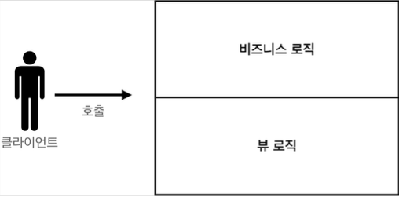
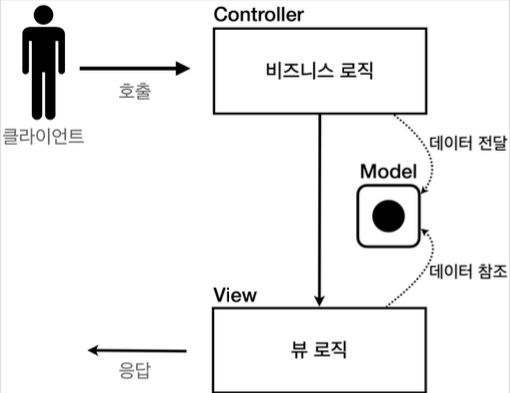
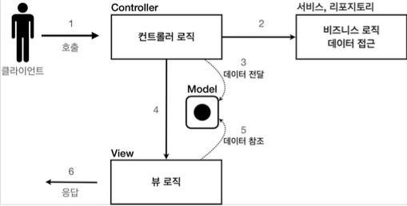

# 서블릿, JSP, MVC 패턴

#### [Member](./src/main/java/com/example/servlet3/domain/member/Member.java)

```java
package com.example.servlet3.domain.member;

import lombok.AllArgsConstructor;
import lombok.Getter;
import lombok.NoArgsConstructor;
import lombok.Setter;

@Getter @Setter
@NoArgsConstructor
@AllArgsConstructor
public class Member {

    private Long id;
    private String username;
    private int age;

    public Member(String username, int age){
        this.username = username;
        this.age = age;
    }

}
```

#### [MemberRepository](./src/main/java/com/example/servlet3/domain/member/MemberRepository.java)

```java
package com.example.servlet3.domain.member;

import lombok.AccessLevel;
import lombok.NoArgsConstructor;

import java.util.ArrayList;
import java.util.HashMap;
import java.util.List;
import java.util.Map;

/**
 * 동시성 문제가 고려되어 있지 않음, ConcurrentHashMap, AtomicLong 사용 고려
 */
@NoArgsConstructor(access = AccessLevel.PRIVATE)
public class MemberRepository {

    private static Map<Long, Member> store = new HashMap<>();
    private static long sequence = 0L;

    private static final MemberRepository intstance = new MemberRepository();

    public static MemberRepository getInstance(){
        return intstance;
    }

    public Member save(Member member){
        member.setId(++sequence);
        store.put(member.getId(), member);
        return member;
    }


    public List<Member> findAll(){
        return new ArrayList<>(store.values());
    }

    public void clearStore(){
        store.clear();
    }

    public Member findById(Long id){
        return store.get(id);
    }
}
```

싱글톤 패턴은 객체를 단 하나만 생성해서 공유해야 하므로 생성자를 `private` 접근자로 막아둔다.

#### [MemberRepositoryTest](./src/test/java/com/example/servlet3/domain/member/MemberRepositoryTest.java)

```java
package com.example.servlet3.domain.member;

import org.assertj.core.api.Assertions;
import org.junit.Test;
import org.junit.jupiter.api.AfterAll;
import org.junit.jupiter.api.AfterEach;

import java.util.List;

import static org.assertj.core.api.Assertions.*;
import static org.junit.Assert.*;

public class MemberRepositoryTest {


    MemberRepository memberRepository = MemberRepository.getInstance();

    @AfterEach
    void afterEach() {
        memberRepository.clearStore();
    }

    @Test
    public void save() throws Exception {
        //given
        Member member = new Member("hello", 20);

        //when
        Member savedMember = memberRepository.save(member);

        //then
        Member findMember = memberRepository.findById(savedMember.getId());
        assertEquals(savedMember.getId(), findMember.getId());
    }

    @Test
    public void findAll() throws Exception {
        //given
        Member member1 = new Member("member1", 20);
        Member member2 = new Member("member2", 30);

        memberRepository.save(member1);
        memberRepository.save(member2);
        //when
        List<Member> result = memberRepository.findAll();

        //then
        assertEquals(result.size(), 2);
        assertThat(result).contains(member1, member2);
    }

}
```

## 서블릿으로 회원 관리 웹 애플리케이션 만들기

가장 먼저 서블릿으로 회원 등록 HTML 폼을 제공


#### MemberFromServlet - 회원 등록 폼

```java
package com.example.servlet3.web.servlet;

import com.example.servlet3.domain.member.MemberRepository;

import javax.servlet.ServletException;
import javax.servlet.annotation.WebServlet;
import javax.servlet.http.HttpServlet;
import javax.servlet.http.HttpServletRequest;
import javax.servlet.http.HttpServletResponse;
import java.io.IOException;
import java.io.PrintWriter;

@WebServlet(name = "memberFormServlet", urlPatterns = "/servlet/members/new-form")
public class MemberFormServlet extends HttpServlet {

    private MemberRepository memberRepository = MemberRepository.getInstance();

    @Override
    protected void service(HttpServletRequest request, HttpServletResponse response) throws ServletException, IOException {

        response.setContentType("text/html");
        response.setCharacterEncoding("utf-8");

        PrintWriter writer = response.getWriter();
        writer.write("<!DOCTYPE html>\n" +
                "<html>\n" +
                "<head>\n" +
                "    <meta charset=\"UTF-8\">\n" +
                "    <title>Title</title>\n" +
                "</head>\n" +
                "<body>\n" +
                "<form action=\"/servlet/members/save\" method=\"post\">\n" +
                "    username: <input type=\"text\" name=\"username\" />\n" +
                "    age:      <input type=\"text\" name=\"age\" />\n" +
                " <button type=\"submit\">전송</button>\n" + "</form>\n" +
                "</body>\n" +
                "</html>\n");
    }
}
```

자바 코드로 HTML을 제공해야 하므로 쉽지 않은 작업이다.


#### MemberSaveServlet - 회원 저장

```java
package com.example.servlet3.web.servlet;

import com.example.servlet3.domain.member.Member;
import com.example.servlet3.domain.member.MemberRepository;

import javax.servlet.ServletException;
import javax.servlet.annotation.WebServlet;
import javax.servlet.http.HttpServlet;
import javax.servlet.http.HttpServletRequest;
import javax.servlet.http.HttpServletResponse;
import java.io.IOException;
import java.io.PrintWriter;

@WebServlet(name = "memberSaveServlet", urlPatterns = "/servlet/members/save")
public class MemberSaveServlet extends HttpServlet {

    private MemberRepository memberRepository = MemberRepository.getInstance();

    @Override
    protected void service(HttpServletRequest request, HttpServletResponse response) throws ServletException, IOException {
        System.out.println("MemberSaveServlet.service");

        String username = request.getParameter("username");
        int age = Integer.parseInt(request.getParameter("age"));

        Member member = new Member(username, age);
        memberRepository.save(member);

        response.setContentType("text/html");
        response.setCharacterEncoding("utf-8");
        PrintWriter writer = response.getWriter();
        writer.write("<html>\n" +
                "<head>\n" +
                " <meta charset=\"UTF-8\">\n" + "</head>\n" +
                "<body>\n" +
                "성공\n" +
                "<ul>\n" +
                "    <li>id="+member.getId()+"</li>\n" +
                "    <li>username="+member.getUsername()+"</li>\n" +
                " <li>age="+member.getAge()+"</li>\n" + "</ul>\n" +
                "<a href=\"/index.html\">메인</a>\n" + "</body>\n" +
                "</html>");
    }
}
```

`MemberSaveServlet` 은 다음 순서로 동작한다.


1. 파라미터를 조회해서 `Member` 객체를 만든다.
2. `Member` 객체를 `MemberRepository`를 통해서 저장한다.
3. `Member` 객체를 사용해서 결과 화면용 HTML을 동적으로 만들어서 응답한다.


#### MemberListServlet - 회원 목록

```java
package com.example.servlet3.web.servlet;

import com.example.servlet3.domain.member.Member;
import com.example.servlet3.domain.member.MemberRepository;

import javax.servlet.ServletException;
import javax.servlet.annotation.WebServlet;
import javax.servlet.http.HttpServlet;
import javax.servlet.http.HttpServletRequest;
import javax.servlet.http.HttpServletResponse;
import java.io.IOException;
import java.io.PrintWriter;
import java.util.List;

@WebServlet(name = "memberListServlet", urlPatterns = "/servlet/members")
public class MemberListServlet extends HttpServlet {

    private MemberRepository memberRepository = MemberRepository.getInstance();

    @Override
    protected void service(HttpServletRequest request, HttpServletResponse response) throws ServletException, IOException {
        List<Member> members = memberRepository.findAll();

        response.setContentType("text/html");
        response.setCharacterEncoding("utf-8");

        PrintWriter w = response.getWriter();
        w.write("<html>");
        w.write("<head>");
        w.write("    <meta charset=\"UTF-8\">");
        w.write("    <title>Title</title>");
        w.write("</head>");
        w.write("<body>");
        w.write("<a href=\"/index.html\">메인</a>");
        w.write("<table>");
        w.write("    <thead>");
        w.write("    <th>id</th>");
        w.write("    <th>username</th>");
        w.write("    <th>age</th>");
        w.write("    </thead>");
        w.write("    <tbody>");

        for (Member member : members) {
            w.write("    <tr>");
            w.write("        <td>" + member.getId() + "</td>");
            w.write("        <td>" + member.getUsername() + "</td>");
            w.write("        <td>" + member.getAge() + "</td>");
            w.write("    </tr>");
        }
        w.write("    </tbody>");
        w.write("</table>");
        w.write("</body>");
        w.write("</html>");

    }
}
```

`MemberListServlet` 은 다음 순서로 동작한다.


1. `memberRepository.findAll()` 을 통해 모든 회원을 조회한다.
2. 회원 목록 HTML을 for 루프를 통해서 회원 수 만큼 동적으로 생성하고 응답한다.

#### 템플릿 엔진

서블릿과 자바 코드만으로 HTML을 만들어보았다. 서블릿 덕분에 동적으로 원하는 HTML을 만들 수 있었다.
정적인 HTML 문서라면 화면이 계속 달라지는 회원의 저장 결과, 회원 목록 같은 동적인 HTML을 만드는 일은 불가능하다.

그런데, 코드에서 보듯이 매우 복잡하고 비효율 적이다. 자바 코드로 HTML을 만들어 내는 것 보다 
차라리 HTML 문서에 동적으로 변경해야 하는 부분만 자바 코드를 넣을 수 있다면 더 편리할 것이다. 
이것이 바로 템플릿 엔진이 나온 이유이다. 템플릿 엔진을 사용하면 HTML 문서에서 필요한 곳만 코드를 적용해서 동적으로 변경할 수 있다.


## JSP로 회원 관리 웹 애플리케이션 만들기

### JSP 라이브러리 추가

#### build.gradle

```groovy
plugins {
    id 'org.springframework.boot' version '2.6.3'
    id 'io.spring.dependency-management' version '1.0.11.RELEASE'
    id 'java'
    id 'war'
}

group = 'com.example'
version = '0.0.1-SNAPSHOT'
sourceCompatibility = '11'

configurations {
    compileOnly {
        extendsFrom annotationProcessor
    }
}

repositories {
    mavenCentral()
}

dependencies {
    implementation 'org.springframework.boot:spring-boot-starter-web'
    implementation 'junit:junit:4.13.1'

    //JSP 추가
    implementation 'org.apache.tomcat.embed:tomcat-embed-jasper'
    implementation 'javax.servlet:jstl'

    compileOnly 'org.projectlombok:lombok'
    annotationProcessor 'org.projectlombok:lombok'
    providedRuntime 'org.springframework.boot:spring-boot-starter-tomcat'
    testImplementation 'org.springframework.boot:spring-boot-starter-test'
}

tasks.named('test') {
    useJUnitPlatform()
}
```

## MVC 패턴

#### 너무 많은 역할

하나의 서블릿이나 JSP만으로 비즈니스 로직과 뷰 렌더링까지 모두 처리하게 되면, 너무 많은 역할을 하게되고, 결과적으로 유지보수가 어려워진다. 
비즈니스 로직을 호출하는 부분에 변경이 발생해도 해당 코드를 손대야 하고, UI를 변경할 일이 있어도 비즈니스 로직이 함께 있는 해당 파일을 수정해야 한다.


#### 변경의 라이프 사이클
문제는 둘 사이에 변경의 라이프 사이클이 다르다는 점이다. 
예를 들어서 UI 를 일부 수정하는 일과 비즈니스 로직을 수정하는 일은 각각 다르게 발생할 가능성이 매우 높고 대부분 서로에게 영향을 주지 않는다.
이렇게 변경의 라이프 사이클이 다른 부분을 하나의 코드로 관리하는 것은 유지보수하기 좋지 않다.

#### 기능 특화
특히 JSP 같은 뷰 템플릿은 화면을 렌더링 하는데 최적화 되어 있기 때문에 이 부분의 업무만 담당하는 것이 가장 효과적이다.

#### Model View Controller
MVC 패턴은 지금까지 학습한 것 처럼 하나의 서블릿이나, JSP로 처리하던 것을 컨트롤러(Controller)와 뷰(View)라는 영역으로 서로 역할을 나눈 것을 말한다. 
웹 애플리케이션은 보통 이 MVC 패턴을 사용한다.

#### 컨트롤러
HTTP 요청을 받아서 파라미터를 검증하고, 비즈니스 로직을 실행한다. 그리고 뷰에 전달할 결과 데이터를 조회해서 모델에 담는다.

#### 모델 
뷰에 출력할 데이터를 담아둔다. 뷰가 필요한 데이터를 모두 모델에 담아서 전달해주는 덕분에 뷰는 비즈니스 로직이나 데이터 접근을 몰라도 되고, 
화면을 렌더링 하는 일에 집중할 수 있다.

#### 뷰
모델에 담겨있는 데이터를 사용해서 화면을 그리는 일에 집중한다. 여기서는 HTML을 생성하는 부분을 말한다.

#### MVC 패턴 이전




#### MVC 패턴1



#### MVC 패턴2




## MVC 패턴 - 적용

서블릿을 컨트롤러로 사용하고, JSP를 뷰로 사용해서 MVC 패턴을 적용


Model은 HttpServletRequest 객체를 사용한다. request는 내부에 데이터 저장소를 가지고 있는데, 
`request.setAttribute()` ,`request.getAttribute()` 를 사용하면 데이터를 보관하고, 조회할 수 있다.

### 회원 등록

#### [MvcMemberFormServlet](./src/main/java/com/example/servlet3/web/servletmvc/MvcMemberFormServlet.java)

```java
package com.example.servlet3.web.servletmvc;

import javax.servlet.RequestDispatcher;
import javax.servlet.ServletException;
import javax.servlet.annotation.WebServlet;
import javax.servlet.http.HttpServlet;
import javax.servlet.http.HttpServletRequest;
import javax.servlet.http.HttpServletResponse;
import java.io.IOException;

@WebServlet(name = "mvcMemberFormServlet", urlPatterns = "/servlet-mvc/members/new-form")
public class MvcMemberFormServlet extends HttpServlet {

    @Override
    protected void service(HttpServletRequest request, HttpServletResponse response) throws ServletException, IOException {
        String viewPath = "/WEB-INF/views/new-form.jsp";
        RequestDispatcher dispatcher = request.getRequestDispatcher(viewPath);
        dispatcher.forward(request, response);
    }
}
```

* `dispatcher.forward()` : 다른 서블릿이나 JSP로 이동할 수 있는 기능이다. 
  서버 내부에서 다시 호출이 발생한다.


> /WEB-INF
>
> 이 경로안에 JSP가 있으면 외부에서 직접 JSP를 호출할 수 없다. 
> 우리가 기대하는 것은 항상 컨트롤러를 통해서 JSP를 호출하는 것이다.


> redirect vs forward
>
> 리다이렉트는 실제 클라이언트(웹 브라우저)에 응답이 나갔다가, 
> 클라이언트가 redirect 경로로 다시 요청한다. 
> 따라서 클라이언트가 인지할 수 있고, URL 경로도 실제로 변경된다. 
> 반면에 포워드는 서버 내부에서 일어나는 호출이기 때문에 클라이언트가 전혀 인지하지 못한다.


#### [new-form](./src/main/webapp/WEB-INF/views/new-form.jsp)

```jsp
<%--
  Created by IntelliJ IDEA.
  User: mac
  Date: 2022/02/16
  Time: 5:42 PM
  To change this template use File | Settings | File Templates.
--%>
<%@ page contentType="text/html;charset=UTF-8" language="java" %>
<html>
<head>
    <title>Title</title>
</head>
<body>
<form action="save" method="post">
    username: <input type="text" name="username"/>
    age: <input type="text", name="age"/>
    <button type="submit">전송</button>
</form>

</body>
</html>
```

* 여기서 form의 action을 보면 절대 경로(로 시작)이 아니라 상대경로(로 시작X)하는 것을 확인할 수 있다. 
  이렇게 상대경로를 사용하면 폼 전송시 현재 URL이 속한 계층 경로 + save가 호출된다. 
* 현재 계층 경로: `/servlet-mvc/members/`
* 결과: `/servlet-mvc/members/save`

### 회원 저장


#### [MvcMemberSaveServlet](./src/main/java/com/example/servlet3/web/servletmvc/MvcMemberSaveServlet.java)

```java
package com.example.servlet3.web.servletmvc;


import ch.qos.logback.classic.helpers.MDCInsertingServletFilter;
import com.example.servlet3.domain.member.Member;
import com.example.servlet3.domain.member.MemberRepository;

import javax.servlet.RequestDispatcher;
import javax.servlet.ServletException;
import javax.servlet.annotation.WebServlet;
import javax.servlet.http.HttpServlet;
import javax.servlet.http.HttpServletRequest;
import javax.servlet.http.HttpServletResponse;
import java.io.IOException;

@WebServlet(name = "mvcMemberSaveServlet", urlPatterns = "/servlet-mvc/members/save")
public class MvcMemberSaveServlet extends HttpServlet {

    MemberRepository memberRepository = MemberRepository.getInstance();

    @Override
    protected void service(HttpServletRequest request, HttpServletResponse response) throws ServletException, IOException {

        String username = request.getParameter("username");
        int age = Integer.parseInt(request.getParameter("age"));

        Member member = new Member(username, age);
        memberRepository.save(member);

//        모델에 데이터 보관
        request.setAttribute("member", member);

        String viewPath = "/WEB-INF/views/save-result.jsp";
        RequestDispatcher dispatcher = request.getRequestDispatcher(viewPath);
        dispatcher.forward(request, response);

    }
}
```

* `HttpServletRequest`를 Model로 사용한다. 
* request가 제공하는 `setAttribute()` 를 사용하면 request 객체에 데이터를 보관해서 뷰에 전달할 수 있다. 
* 뷰는 `request.getAttribute()` 를 사용해서 데이터를 꺼내면 된다.

#### 회원 저장 - 뷰

```jsp
<%@ page import="com.example.servlet3.domain.member.Member" %>
<%@ page import="com.example.servlet3.domain.member.MemberRepository" %><%--
  Created by IntelliJ IDEA.
  User: mac
  Date: 2022/02/16
  Time: 1:23 AM
  To change this template use File | Settings | File Templates.
--%>
<%@ page contentType="text/html;charset=UTF-8" language="java" %>
<html>
<head>
    <title>Title</title>
</head>
<body>
성공
<ul>
    <li>id=${member.id}</li>
    <li>username=${member.username}</li>
    <li>username=${member.age}</li>
</ul>
<a href="/index.html">메인</a>
</body>
</html>
```

* `<%= request.getAttribute("member")%>` 로 모델에 저장한 `member` 객체를 꺼낼 수 있지만, 
  너무 복잡해진다. 
* JSP는 `${}` 문법을 제공하는데, 이 문법을 사용하면 request의 attribute에 담긴 데이터를 편리하게 조회할 수 있다.

### 회원 목록 조회

#### [MvcMemberListServlet](./src/main/java/com/example/servlet3/web/servletmvc/MvcMemberListServlet.java)

```java
package com.example.servlet3.web.servletmvc;

import com.example.servlet3.domain.member.Member;
import com.example.servlet3.domain.member.MemberRepository;

import javax.servlet.RequestDispatcher;
import javax.servlet.ServletException;
import javax.servlet.annotation.WebServlet;
import javax.servlet.http.HttpServlet;
import javax.servlet.http.HttpServletRequest;
import javax.servlet.http.HttpServletResponse;
import java.io.IOException;
import java.util.List;

@WebServlet(name = "mvcMemberListServlet", urlPatterns = "/servlet-mvc/members")
public class MvcMemberListServlet extends HttpServlet {

    private MemberRepository memberRepository = MemberRepository.getInstance();

    @Override
    protected void service(HttpServletRequest request, HttpServletResponse response) throws ServletException, IOException {

        List<Member> members = memberRepository.findAll();

        request.setAttribute("members", members);

        String viewPath = "/WEB-INF/views/members.jsp";
        RequestDispatcher dispatcher = request.getRequestDispatcher(viewPath);
        dispatcher.forward(request, response);
    }
}
```

* request 객체를 사용해서 `List<Member> members` 를 모델에 보관했다.

#### [members.jsp](./src/main/webapp/WEB-INF/views/members.jsp)


```jsp
<%@ page import="com.example.servlet3.domain.member.MemberRepository" %>
<%@ page import="com.example.servlet3.domain.member.Member" %>
<%@ page import="java.util.List" %>
<%@ taglib prefix="c" uri="http://java.sun.com/jsp/jstl/core" %>
<%--
  Created by IntelliJ IDEA.
  User: mac
  Date: 2022/02/16
  Time: 1:28 AM
  To change this template use File | Settings | File Templates.
--%>
<%@ page contentType="text/html;charset=UTF-8" language="java" %>
<html>
<head>
    <title>Title</title>
</head>
<body>
<a href="/index.html">메인</a>
<table>
    <thead>
    <th>id</th>
    <th>username</th>
    <th>age</th>
    </thead>
    <tbody>
    <tr>
        <td></td>
        <td></td>
        <td></td>
    </tr>
    <c:forEach var="item" items="${members}">
        <tr>
            <td>${item.id}</td>
            <td>${item.username}</td>
            <td>${item.age}</td>
        </tr>
    </c:forEach>
    </tbody>
</table>


</body>
</html>
```

* 모델에 담아둔 members를 JSP가 제공하는 taglib기능을 사용해서 반복하면서 출력했다. 
* `members` 리스트에서 `member` 를 순서대로 꺼내서 `item` 변수에 담고, 출력하는 과정을 반복한다

`<c:forEach>` 이 기능을 사용하려면 다음과 같이 선언해야 한다.
`<%@ taglib prefix="c" uri="http://java.sun.com/jsp/jstl/core"%>`


## MVC 패턴 - 한계

MVC 패턴을 적용한 덕분에 컨트롤러의 역할과 뷰를 렌더링 하는 역할을 명확하게 구분할 수 있다.
특히 뷰는 화면을 그리는 역할에 충실한 덕분에, 코드가 깔끔하고 직관적이다. 단순하게 모델에서 필요한 데이터를 꺼내고, 화면을 만들면 된다.
그런데 컨트롤러는 딱 봐도 중복이 많고, 필요하지 않는 코드들도 많이 보인다.

### MVC 컨트롤러의 단점

#### 포워드 중복


View로 이동하는 코드가 항상 중복 호출되더야 한다. 물론 이 부분을 메서드로 공통화해도 되지만, 해당 메서드도 항상 직접 호출해야 한다.

```java
RequestDispatecher dispatcher = request.getRequestDispatcher(viewPath);
dispatcher.forward(request, response);
```

#### ViewPath에 중복

```java
String viewPath = "/WEB-INF/views/new-form.jsp";
```

* `prefix`: `/WEB-INF/views/` 
* `suffix`: `.jsp`

#### 사용하지 않는 코드

다음 코드를 사용할 때도 있고, 사용하지 않을 때도 있다. 특히 response는 현재 코드에서 사용되지 않는다.

```java
HttpServletRequest request, HttpServletResponse response
```


#### 공통 처리가 어렵다.
기능이 복잡해질 수 록 컨트롤러에서 공통으로 처리해야 하는 부분이 점점 더 많이 증가할 것이다. 
단순히 공통 기능을 메서드로 뽑으면 될 것 같지만, 결과적으로 해당 메서드를 항상 호출해야 하고, 실수로 호출하지 않으면 문제가 될 것이다. 
그리고 호출하는 것 자체도 중복이다.


#### 정리하면 공통 처리가 어렵다는 문제가 있다.
이 문제를 해결하려면 컨트롤러 호출 전에 먼저 공통 기능을 처리해야 한다. 
`프론트 컨트롤러(Front Controller)` 패턴을 도입하면 이런 문제를 깔끔하게 해결할 수 있다. (입구를 하나로)
스프링 MVC의 핵심도 바로 이 프론트 컨트롤러에 있다.

