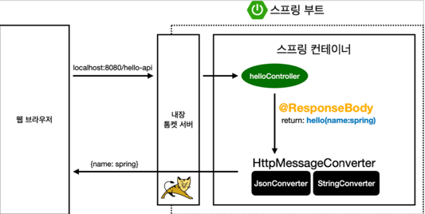
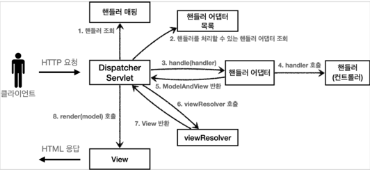
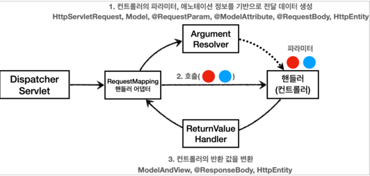
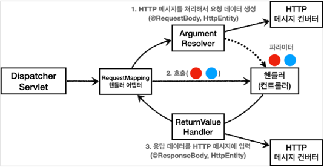

# 스프링 MVC - 기본 기능

## 프로젝트 구성

#### build.gradle

```java
plugins {
    id 'org.springframework.boot' version '2.6.3'
    id 'io.spring.dependency-management' version '1.0.11.RELEASE'
    id 'java'
}

group = 'hello'
version = '0.0.1-SNAPSHOT'
sourceCompatibility = '11'

configurations {
    compileOnly {
        extendsFrom annotationProcessor
    }
}

repositories {
    mavenCentral()
}

dependencies {
    implementation 'org.springframework.boot:spring-boot-starter-thymeleaf'
    implementation 'org.springframework.boot:spring-boot-starter-web'
    compileOnly 'org.projectlombok:lombok'
    annotationProcessor 'org.projectlombok:lombok'
    testImplementation 'org.springframework.boot:spring-boot-starter-test'
}

tasks.named('test') {
    useJUnitPlatform()
}
```

## 요청 매핑

#### [MappingController](./src/main/java/hello/springmvc/basic/requestmapping/MappingController.java)

```java
package hello.springmvc.basic.requestmapping;

import lombok.extern.slf4j.Slf4j;
import org.slf4j.Logger;
import org.slf4j.LoggerFactory;
import org.springframework.web.bind.annotation.*;

@RestController
public class MappingController {

    private Logger log = LoggerFactory.getLogger(getClass());

    @RequestMapping("/hello-basic")
    public String helloBasic() {
        log.info("helloBasic");
        return "ok";
    }
}
```

### 매핑 정보

* `@RestController`
  * `@Controller`는 반환 값이 `String`이면 뷰 이름으로 인식된다. 그래서 뷰를 찾고 뷰가 렌더링 된다.
  * `@RestController`는 반환 값으로 뷰를 찾는 것이 아니라, HTTP 메시지 바디에 바로 입력한다.
    따라서 실행 결과로 ok 메시지를 받을 수 있다. `@ResponseBody`와 관련이 있다.
* `@RequestMapping("/hello-basic")`
  * `/hello-basic` URL 호출이 오면 이 메서드가 실행되도록 매핑한다.
  * 대부분의 속성을 `배열[]`로 제공하므로 다중 설정이 가능하다. `{"/hello-basic", "/hello-go"}`


### HTTP 메서드 

`@RequestMapping`에 `method` 속성으로 HTTP 메서드를 지정하지 않으면 HTTP 메서드와 무관하게 호출된다.

모두 혀용 GET, HEAD, POST, PUT, PATCH, DELETE

### HTTP 메서드 매핑

```java
/**
 * method 특정 HTTP 메서드 요청만 허용
 * GET, HEAD, POST, PUT, PATCH, DELETE
 */
@RequestMapping(value = "/mapping-get-v1", method = RequestMethod.GET)
public String mappingGetV1(){
    log.info("mappingGetV1");
    return "ok";
}
```

만약 여기에 POST 요청을 하면 스프링 MVC는 HTTP 405 상태코드(Method Not Allowed)를 반환한다.

#### HTTP 메서드 매핑 축약

```java
/**
 * 편리한 축약 애노테이션
 * @GetMapping
 * @PostMapping
 * @PutMapping
 * @DeleteMapping
 * @PatchMapping
 */
@GetMapping("/mapping-get-v2")
public String mappingGetV2(){
    log.info("mapping-get-v2");
    return "ok";
}
```


HTTP 메서드를 축약한 애노테이션을 사용하는 것이 더 직관적이다. 코드를 보면 내부에서 
`@RequestMapping` 과 `method` 를 지정해서 사용하는 것을 확인할 수 있다.

#### PathVariable 사용 

```java
/**
 * PathVariable 사용
 * 변수명이 같으면 생략 가능
 *
 * @PathVariable("userId") String userId -> @PathVariable userId
 * /mapping/userA
 */
@GetMapping("/mapping/{userId}")
public String mappingPath(@PathVariable("userId") String data){
    log.info("mappingPath userId = {}", data);
    return "ok";
}
```

### 특정 파라미터 조건 매핑

```java
/**
 * 파라미터 추가 매핑
 * 해당 파라미터가 없으면 매핑 되지 않음
 * params="mode",
 * params="!mode",
 * params="mode=debug",
 * params="mode=!debug",
 * params={"mode=debug", "data=good"}
 */
@GetMapping(value = "/mapping-param", params = "mode=debug")
public String mappingParam(){
    log.info("mappingParam");
    return "ok";
}
```

#### 실행

* http://localshot:8080/mapping-param?mode=debug

### 특정 헤더 조건 매핑

```java
/**
 * 특정 헤더로 추가 매핑
 * headers="mode",
 * headers="!mode",
 * headers="mode=debug",
 * headers="mode=!debug",
 */
@GetMapping(value = "/mapping-header", headers = "mode=debug")
public String mappingHeader(){
    log.info("mappingParam");
    return "ok";
}
```

### 미디어 타입 조건 매핑 - HTTP 요청 Content-Type, consume

```java
/**
 * Content-Type 헤더 기반 추가 매핑 Media Type * consumes="application/json"
 * consumes="!application/json"
 * consumes="application/*"
 * consumes="*\/*"
 * MediaType.APPLICATION_JSON_VALUE
 */
@PostMapping(value = "/mapping-consume", consumes = "application/json")
public String mappingConsumes(){
    log.info("mappingConsumes");
    return "ok";
}
```

* HTTP 요청의 Content-Type 헤더를 기반으로 미디어 타입으로 매핑한다.
* 맞지 않으면 HTTP 415 상태코드(Unsupported Media Type)을 반환한다.

### 미디어 타입 조건 매핑 - HTTP 요청 Accept, produce

```java
/**
 * Accept 헤더 기반 Media Type
 * produces="text/html"
 * consumes="!text/html"
 * consumes="text/*"
 * consumes="*\/*"
 * MediaType.APPLICATION_JSON_VALUE
 * @return
 */
@PostMapping(value = "/mapping-consume", produces = "text/html")
public String mappingProduces(){
    log.info("mappingConsumes");
    return "ok";
}
```

HTTP 요청의 Accept 헤더를 기반으로 미디어 타입으로 매핑한다.
만약 맞지 않으면 HTTP 406 상태코드(Not Acceptable)을 반환한다.

## 요청 매핑 - API

### 회원 관리 API

|     분류     |   메서드    | API                |
|:----------:|:--------:|:-------------------|
|  회원 목록 조회  |   GET    | `/users`           |
|   회원 등록    |   POST   | `/users`           |
|   회원 조회    |   GET    | `/users/{userId}`  |
|   회원 수정    |  PATCH   | `/users/{userId}`  |
|   회원 삭제    |  DELETE  | `/users/{userId}`  |

#### [MappingClassController](./src/main/java/hello/springmvc/basic/requestmapping/MappingClassController.java)

```java
package hello.springmvc.basic.requestmapping;

import org.springframework.web.bind.annotation.*;

@RestController
@RequestMapping("/mapping/users")
public class MappingClassController {

    @GetMapping
    public String user(){
        return "get users";
    }

    @PostMapping
    public String addUser(){
        return "post user";
    }

    @GetMapping("/{userId}")
    public String findUser(@PathVariable String userId){
        return "get userId =" + userId;
    }

    @PatchMapping("/{userId}")
    public String updateUser(@PathVariable String userId){
        return "update userId = " + userId;
    }

    @DeleteMapping("/{userId}")
    public String deleteUser(@PathVariable String userId){
        return "delete userId = " + userId;
    }

}
```

* `@RequestMapping("/mapping/users")`
  * 클래스 레벨에 매핑 정보를 두면 메서드 레벨에서 해당 정보를 조합해서 사용한다.

## HTTP 요청 - 기본, 헤더 조회

#### [RequestHeaderController](./src/main/java/hello/springmvc/basic/request/RequestHeaderController.java)

```java
package hello.springmvc.basic.request;

import lombok.extern.slf4j.Slf4j;
import org.springframework.http.HttpMethod;
import org.springframework.util.MultiValueMap;
import org.springframework.web.bind.annotation.CookieValue;
import org.springframework.web.bind.annotation.RequestHeader;
import org.springframework.web.bind.annotation.RequestMapping;
import org.springframework.web.bind.annotation.RestController;

import javax.servlet.http.HttpServletRequest;
import javax.servlet.http.HttpServletResponse;
import java.util.Locale;

@Slf4j
@RestController
public class RequestHeaderController {

  @RequestMapping("/headers")
  public String headers(
          HttpServletRequest request,
          HttpServletResponse response,
          HttpMethod httpMethod,
          Locale locale,
          @RequestHeader MultiValueMap<String, String> headerMap,
          @RequestHeader("host") String host,
          @CookieValue(value = "myCookie", required = false) String cookie
  ){
    log.info("request={}", request);
    log.info("response={}", response);
    log.info("httpMethod={}", httpMethod);
    log.info("locale={}", locale);
    log.info("headerMap={}", headerMap);
    log.info("host={}", host);
    log.info("cookie={}", cookie);
    return "ok";
  }
}
```

* `HttpServletRequest`
* `HttpServletResponse`
* `HttpMethod`: HTTP 메서드를 조회한다. - `org.springframework.http.HttpMethod`
* `Locale`: Locale 정보를 조회한다.
* `@RequestHeader MultiValueMap<String, String> headerMap`
  * 모든 HTTP 헤더를 MultiValueMap 형식으로 조회
* `@RequestHeader("host") String host`
  * 특정 HTTP 헤더를 조회한다.
  * 속성
    * 필수 값 여부: `required`
    * 기본 값 속성: defaultValue
* `@CookieValue(value = "myCookie", required = false) String cookie`
  * 특정 쿠키를 조회한다.
  * 속성
    * 필수 값 여부: required
    * 기본값: defaultValue

#### `MultiValueMap`

* Map과 유사한 형태로, 하나의 키에 여러 값을 받을 수 있다.
* Http header, HTTP 쿼리 파라미터와 같이 하나의 키에 여러 값을 받을 때 사용한다.
  * `KetA=value1&keyA=value2`

```java
MultiValueMap<String, String> map = new LinkedMultiValueMap();
map.add("keyA", "value1");
map.add("keyA", "value2");

List<String> values = map.get("keyA");
```

## HTTP 요청 파라미터 - 쿼리 파라미터, HTML Form

### HTTP 요청 데이터 조회 - 개요

#### 클라이언트에서 서버로 데이터를 전달할 때는 주로 3가지 방법을 사용한다.

* GET - 쿼리 파라미터
  * /url?username=hello&age=20
  * 메시지 바디 없이, URL의 쿼리 파라미터에 데이터를 포함하는 전달
* POST - HTML Form
  * content-type:application/x-www-form-urlencoded
  * 메시지 바디에 쿼리 파라미터 형식으로 전달 username=hello?age=20
* HTTP message body에 데이터를 직접 담이서 요청
  * HTTP API에서 주로 사용, JSON, XML, TEXT
  * 데이터 형식은 주로 JSON 사용
  * POST, PUT, PATCH


#### [RequestParamController](./src/main/java/hello/springmvc/basic/request/RequestParamController.java)

```java
package hello.springmvc.basic.request;

import hello.springmvc.basic.HelloData;
import lombok.extern.slf4j.Slf4j;
import org.springframework.stereotype.Controller;
import org.springframework.web.bind.annotation.ModelAttribute;
import org.springframework.web.bind.annotation.RequestMapping;
import org.springframework.web.bind.annotation.RequestParam;
import org.springframework.web.bind.annotation.ResponseBody;

import javax.servlet.http.HttpServletRequest;
import javax.servlet.http.HttpServletResponse;
import java.io.IOException;
import java.util.Map;

@Slf4j
@Controller
public class RequestParamController {

    @RequestMapping("/request-param-v1")
    public void requestParamV1(HttpServletRequest request, HttpServletResponse response) throws IOException {
        String username = request.getParameter("username");
        int age = Integer.parseInt(request.getParameter("age"));
        log.info("username = {}, age = {}", username, age);

        response.getWriter().write("ok");
    }

    /**
     * @ResponseBody -> @RestController
     */
    @ResponseBody
    @RequestMapping("/request-param-v2")
    public String requestParamV2(
            @RequestParam("username") String memberName,
            @RequestParam("age") int memberAge
    ){
        log.info("username = {}, age = {}", memberName, memberAge);
        return "ok";
    }

    @ResponseBody
    @RequestMapping("/request-param-v3")
    public String requestParamV3(
            @RequestParam String username,
            @RequestParam int age
    ){
        log.info("username = {}, age = {}", username, age);
        return "ok";
    }

    @ResponseBody
    @RequestMapping("/request-param-v4")
    public String requestParamV4(String username, int age){
        log.info("username = {}, age = {}", username, age);
        return "ok";
    }

    @ResponseBody
    @RequestMapping("/request-param-required")
    public String requestParamRequired(
            @RequestParam(required = true) String username,
            @RequestParam(required = false) Integer age){
        log.info("username = {}, age = {}", username, age);
        return "ok";
    }


    @ResponseBody
    @RequestMapping("/request-param-default")
    public String requestParamDefault(
            @RequestParam(required = true, defaultValue = "guest") String username,
            @RequestParam(required = false, defaultValue = "-1") int age){
        log.info("username = {}, age = {}", username, age);
        return "ok";
    }

    @ResponseBody
    @RequestMapping("/request-param-map")
    public String requestParamMap(
            @RequestParam Map<String, Object> paramMap
    ){
        log.info("username = {}, age = {}", paramMap.get("username"), paramMap.get("age"));
        return "ok";
    }

    @ResponseBody
    @RequestMapping("/model-attribute-v1")
    public String modelAttributeV1(
            @ModelAttribute HelloData helloData
    ){
        log.info("username = {}, age = {}",
                helloData.getUsername(), helloData.getAge());
        return "ok";
    }
    
    @ResponseBody
    @RequestMapping("/model-attribute-v2")
    public String modelAttributeV2(
            HelloData helloData
    ){
        log.info("username = {}, age = {}",
                helloData.getUsername(), helloData.getAge());
        return "ok";
    }
}
```

## HTTP 요청 파라미터 - @ModelAttribute

#### [HelloData](./src/main/java/hello/springmvc/basic/HelloData.java)

```java
package hello.springmvc.basic;

import lombok.Data;

@Data
public class HelloData {
    private String username;
    private int age;
}
```

#### @ModelAttribute 적용 - modelAttributeV1

```java
@ResponseBody
@RequestMapping("/model-attribute-v1")
public String modelAttributeV1(
        @ModelAttribute HelloData helloData
){
    log.info("username = {}, age = {}",
            helloData.getUsername(), helloData.getAge());
    return "ok";
}
```

* 스프링 MVC는 `@ModelAttribute`가 있으면 다음을 실행시킨다.

  * HelloData 객체를 생성한다.
  * 요청 파라미터의 이름으로 `HelloData` 객체의 프로퍼티를 찾는다. 그리고 해당 프로퍼티의 setter를 호출해서
    파라미터를 바인딩한다.

#### 프로퍼티

* 객체에 `getUsername()`, `setUsername()` 메서드가 있으면, 이 객체는 `username`이라는 프로퍼티를 가지고 있는 것이다.
* `username` 프로퍼티의 값을 변경하면 `setUsername()`이 호출되고, 조회하면 `getUsername()`이 호출된다.

#### @ModelAttribute 생략 - modelAttributeV2

```java
@ResponseBody
@RequestMapping("/model-attribute-v2")
public String modelAttributeV2(
        HelloData helloData
){
    log.info("username = {}, age = {}",
            helloData.getUsername(), helloData.getAge());
    return "ok";
}
```

* `@ModelAttribute`는 생략할 수 있다.

## HTTP 요청 메시지 - 단순 텍스트

* HTTP message body에 데이터를 직접 담아서 요청
  * HTTP API에서 주로 사용, JSON, XML, TEXT
  * 데이터 형식은 주로 JSON 사용
  * POST, PATCH, PUT

* 요청 파라미터와 다르게 HTTP 메시지 바디를 통해 데이터가 직접 데이터가 넘어오는 경우는
  `@RequestParam`, `@ModelAttribute`를 사용할 수 없다.

  * HTTP 메시지의 바디의 데이터를 `InputStream`을 사용하여 직접 읽을 수 있다.

#### [RequestBodyStringController](./src/main/java/hello/springmvc/basic/request/RequestBodyStringController.java)

```java
package hello.springmvc.basic.request;

import lombok.extern.slf4j.Slf4j;
import org.springframework.http.HttpEntity;
import org.springframework.http.HttpStatus;
import org.springframework.http.RequestEntity;
import org.springframework.http.ResponseEntity;
import org.springframework.stereotype.Controller;
import org.springframework.util.StreamUtils;
import org.springframework.web.bind.annotation.PostMapping;
import org.springframework.web.bind.annotation.RequestBody;

import javax.servlet.ServletInputStream;
import javax.servlet.http.HttpServletRequest;
import javax.servlet.http.HttpServletResponse;
import java.io.IOException;
import java.io.InputStream;
import java.io.Writer;
import java.nio.charset.StandardCharsets;

@Slf4j
@Controller
public class RequestBodyStringController {

    @PostMapping("/request-body-string-v1")
    public void requestBodyString(HttpServletRequest request, HttpServletResponse response) throws IOException {
        ServletInputStream inputStream = request.getInputStream();
        String messageBody = StreamUtils.copyToString(inputStream, StandardCharsets.UTF_8);

        log.info("messageBody={}", messageBody);
        response.getWriter().write("ok");
    }

    @PostMapping("/request-body-string-v2")
    public void requestBodyStringV2(InputStream inputStream, Writer responseWriter) throws IOException {
        String messageBody = StreamUtils.copyToString(inputStream, StandardCharsets.UTF_8);

        log.info("messageBody={}", messageBody);
        responseWriter.write("ok");
    }

    @PostMapping("/request-body-string-v3")
    public HttpEntity<String> requestBodyStringV3(RequestEntity<String> httpEntity) throws IOException {
        String messageBody = httpEntity.getBody();

        log.info("messageBody={}", messageBody);
        return new ResponseEntity<>("ok", HttpStatus.OK);
    }

    @PostMapping("/request-body-string-v4")
    public String requestBodyStringV4(@RequestBody String messageBody) throws IOException {

        log.info("messageBody={}", messageBody);
        return "ok";
    }
}
```

#### 스프링 MVC는 다음 파라미터를 지원한다.

* InputStream(Reader): HTTP 요청 메시지 바디의 내용을 직접 조회 
* OutputStream(Writer): HTTP 응답 메시지의 바디에 직접 결과 출력

#### HttpEntity - requestBodyStringV2

```java
@PostMapping("/request-body-string-v3")
public HttpEntity<String> requestBodyStringV3(RequestEntity<String> httpEntity) throws IOException {
    String messageBody = httpEntity.getBody();

    log.info("messageBody={}", messageBody);
    return new ResponseEntity<>("ok", HttpStatus.OK);
}
```

#### 스프링 MVC는 다음 파라미터를 지원한다.

* HttpEntity: HTTP header, body 정보를 편리하게 조회
  * 메시지 바디 정보를 직접 조회
  * 요청 파라미터를 조회하는 기능과 관계 없음
* HttpEntity는 응답에도 사용 가능
  * 메시지 바디 정보 직접 반환
  * 헤더 정보 포함 가능
  * view 조회 X

`HttpEntity`를 상속받은 다음 객체들도 같은 기능을 제공한다.

* RequestEntity
  * HttpMethod, url 정보가 추가, 요청에서 사용
* ResponseEntity
  * HTTP 상태 코드 설정 가능, 응답에서 사용
  * `return new ResponseEntity<String>("Hello World", responseHeaders, HttpStatus.CREATED);`

#### @RequestBody

`@RequestBody`를 사용하면 HTTP 메시지 바디 정보를 편리하게 조회할 수 있다.
헤더 정보가 필요하다면 `HttpEntity`를 사용하거나 `@RequestHeader`를 사용하면 된다.
이렇게 메시지 바디를 직접 조회하는 기능은 요청 파라미터를 조회하는 `@RequestParam`, `@ModelAttribute`
와는 전혀 관계가 없다.


#### 요청 파라미터와 HTTP 메시지 바디

* 요청 파라미터를 조회하는 기능: `@RequestParam`, `@ModelAttribute`
* HTTP 메시지 바디를 직접 조회하는 기능: `@RequestBody`

#### @ResponseBody

`@ResponseBody`를 사용하면 응답 결과를 HTTP 메시지 바디에 직접 담아서 전달할 수 있다.

## HTTP 요청 메시지 - JSON

JSON 데이터 형식을 이용한 조회


#### [RequestBodyJsonController](./src/main/java/hello/springmvc/basic/request/RequestBodyJsonController.java)

```java
package hello.springmvc.basic.request;

import com.fasterxml.jackson.databind.ObjectMapper;
import hello.springmvc.basic.HelloData;
import lombok.extern.slf4j.Slf4j;
import org.springframework.http.HttpEntity;
import org.springframework.stereotype.Controller;
import org.springframework.util.StreamUtils;
import org.springframework.web.bind.annotation.PostMapping;
import org.springframework.web.bind.annotation.RequestBody;
import org.springframework.web.bind.annotation.ResponseBody;

import javax.servlet.ServletInputStream;
import javax.servlet.http.HttpServletRequest;
import javax.servlet.http.HttpServletResponse;
import java.io.IOException;
import java.nio.charset.StandardCharsets;

@Slf4j
@Controller
public class RequestBodyJsonController {

    private ObjectMapper objectMapper = new ObjectMapper();

    @PostMapping("/request-body-json-v1")
    public void requestBodyJsonV1(HttpServletRequest request, HttpServletResponse response) throws IOException {
        ServletInputStream inputStream = request.getInputStream();
        String messageBody = StreamUtils.copyToString(inputStream, StandardCharsets.UTF_8);

        log.info("messageBody={}", messageBody);
        HelloData helloData = objectMapper.readValue(messageBody, HelloData.class);
        log.info("username={}, age={}", helloData.getUsername(), helloData.getAge());
    }

    @ResponseBody
    @PostMapping("/request-body-json-v2")
    public String requestBodyJsonV2(@RequestBody String messageBody) throws IOException {

        log.info("messageBody={}", messageBody);
        HelloData helloData = objectMapper.readValue(messageBody, HelloData.class);
        log.info("username={}, age={}", helloData.getUsername(), helloData.getAge());

        return "ok";
    }

    @ResponseBody
    @PostMapping("/request-body-json-v3")
    public String requestBodyJsonV3(@RequestBody HelloData helloData) {

        log.info("username={}, age={}", helloData.getUsername(), helloData.getAge());

        return "ok";
    }

    @ResponseBody
    @PostMapping("/request-body-json-v4")
    public String requestBodyJsonV4(HttpEntity<HelloData> data) {
        HelloData helloData = data.getBody();
        log.info("username={}, age={}", helloData.getUsername(), helloData.getAge());

        return "ok";
    }

    @ResponseBody
    @PostMapping("/request-body-json-v5")
    public HelloData requestBodyJsonV5(@RequestBody HelloData helloData) {
        log.info("username={}, age={}", helloData.getUsername(), helloData.getAge());

        return helloData;
    }
}
```

* `HttpServletRequest`를 사용해서 직접 HTTP 메시지 바디에서 데이터를 읽어와서, 문자로 변환한다.
* 문자로 된 JSON 데이터를 Jackson 라이브러리인 `objectMapper`를 사용해서 자바 객체로 반환한다.

#### @RequestBody 문자 변환

```java
@ResponseBody
@PostMapping("/request-body-json-v2")
public String requestBodyJsonV2(@RequestBody String messageBody) throws IOException {

    log.info("messageBody={}", messageBody);
    HelloData helloData = objectMapper.readValue(messageBody, HelloData.class);
    log.info("username={}, age={}", helloData.getUsername(), helloData.getAge());

    return "ok";
}
```

* `@RequestBody`를 사용해서 HTTP 메시지에서 데이터를 꺼내고 messageBody에 저장한다.
* 문자로 된 JSON 데이터인 `messageBody`를 `objectMapper`를 통해서 자바 객체로 변환한다.

#### requestBodyJsonV3 - @RequestBody 객체 변환

```java
@ResponseBody
@PostMapping("/request-body-json-v3")
public String requestBodyJsonV3(@RequestBody HelloData data){
    log.info("username={}, age={}", data.getUsername(), data.getAge());
    return "ok";
}
```

#### @RequestBody 객체 파라미터

* `@RequestBody HelloData data`
* `@RequestBody`에 직접 만든 객체를 지정할 수 있다.

`HttpEntity`, `@RequestBody`를 사용하면 HTTP 메시지 컨버터가 HTTP 메시지 바디의 내용을 우리가 원하는 문자나 객체 등으로 변환해준다.
HTTP 메시지 컨버터는 문자 뿐만 아니라 JSON도 객체로 변환해주는데, 우리가 방금 V2에서 했던 작업을 대신 처리해준다.


##### @RequestBody는 생략 불가능

스프링은 `@ModelAttribute`, `@RequestParam` 해당 생략시 다음과 같은 규칙을 적용한다.
* `String`, `int`, `Integer` 같은 단순 타입 = `@RequestParam`
* 나머지 = `@ModelAttribute` (argument resolver로 지정해둔 타입 외)

따라서 이 경우 HelloData에 `@RequestBody`를 생략하면 `@ModelAttribute`가 적용되어버린다.
`HelloData data` -> `@ModelAttribute HelloData data`
따라서 생략하면 HTTP 메시지 바디가 아니라 요청 파라미터를 처리하게 된다.

> 주의
> 
> HTTP 요청시에 content-type이 appliction/json인지 꼭! 확인해야 한다. 그래야 JSON을 처리할 수 있는 HTTP 메시지 컨버터가 실행된다.


#### requestBodyJsonV4 - HttpEntity

```java
@ResponseBody
@PostMapping("/request-body-json-v4")
public String requestBodyJsonV4(HttpEntity<HelloData> httpEntity){
    HelloData data = httpEntity.getBody();
    log.info("username={}, age={}", data.getUsername(), data.getAge());
    return "ok";
}
```

#### requestBodyJsonV5

```java
@ResponseBody
@PostMapping("/request-body-json-v5")
public HelloData requestBodyJsonV5(@RequestBody HelloData data){
    log.info("username={}, age={}", data.getUsername(), data.getAge());    
}
```

* `@RequestBody`: 응답의 경우에도 `@RequestBody`를 사용하면 해당 객체를 HTTP 메시지 바디에 직접 넣어줄수 있다.
  물론 이 경우에도 `HTTPEntity`를 사용해도 된다.

## HTTP 응답 - 정적 리소스, 뷰 템플릿

* 정적 리소스
  * 예) 웹 브라우저에 정적인 HTML, css, js를 제공할 때는, 정적 리소스를 사용한다.
* 뷰 템플릿 사용
  * 예) 웹 브라우저에 동적인 HTML을 제공할 때는 뷰 텝플릿을 사용한다.

#### 정적 리소스

스프링 부트는 클래스패스의 다음 디렉토리에 있는 정적 리소스를 제공한다.
* `/static`
* `/public`
* `/resources`
* `/META-INF/resources`


`src/main/resources`는 리소스를 보관하는 곳이고, 또 클래스패스의 시작 경로이다.
따라서 다음 디렉토리에 리소스를 넣어두면 스프링 부트가 정적 리소스 서비스를 제공한다.

#### 정적 리소스 경로
`src/main/resources/static`


다음 경로에 파일이 들어있으면 - `src/main/resources/static/basic/hello-form.html`


웹 브라우저에서 다음과 같이 실행하면 된다. - `http://localhost:8080/basic/hello-form.html`


### 뷰 템플릿

뷰 템플릿을 거쳐서 HTML이 생성되고, 뷰가 응답을 만들어서 전달한다.
일반적으로 HTML을 동적으로 생성하는 용도로 사용하지만, 다른 것들도 가능하다. 뷰 템플릿을 만들 수 있는 것이라면 뭐든지 가능하다.


#### 뷰 템플릿 경로
`src/main/resources/templates`

#### 뷰 템플릿 생성
`src/main/resources/templates/responses/hello.html`

```html
<!Doctype html>
<html xmln:th="http://www.thymleaf.orf">
<head>
  <meta charset="UTF-8">
</head>
<body>
    <p th:text="${data}">empty</p>
</body>
</html>
```

#### [ResponseViewController - 뷰 템플릿을 호출하는 컨트롤러](./src/main/java/hello/springmvc/basic/response/ResponseViewController.java)

```java
package hello.springmvc.basic.response;

import org.springframework.stereotype.Controller;
import org.springframework.ui.Model;
import org.springframework.web.bind.annotation.RequestMapping;
import org.springframework.web.servlet.ModelAndView;

@Controller
public class ResponseViewController {

    @RequestMapping("/response-view-v1")
    public ModelAndView responseViewV1(){
        ModelAndView mv = new ModelAndView("response/hello")
                .addObject("data", "hello!");
        return mv;
    }

    @RequestMapping("/response-view-v2")
    public String responseViewV2(Model model){
        model.addAttribute("data", "hello!");
        return "response/hello";
    }

    @RequestMapping("/response/hello")
    public void responseViewV3(Model model){
        model.addAttribute("data", "hello!");
    }

}
```

#### String을 반환하는 경우 - View or HTTP 메시지

`@ResponseBody`가 없으면 `response/hello`로 뷰 리졸버가 실행되어서 뷰를 찾고, 렌더링 한다.
`@ResponseBody`가 있으면 뷰 리졸버를 실행하지 않고, HTTP 바디에 직접 `response/hello`라는 문자가 입렫된다.

여기서는 뷰의 논리 이름인 `response/hello`를 반환하면 다음 경로의 뷰 템플릿이 렌더링 되는 것을 확인할 수 있다.

* 실행: `templates/response/hello.html`

#### Void를 반환하는 경우

* `@Controller`를 사용하고, `HttpServletResponse`, `OutputStream(Writer)` 같은 HTTP 메시지 바디를 처리하는 파라미터가 없으면
  요청 URL을 참고해서 논리 뷰 이름으로 사용

#### HTTP 메시지

`@ResposneBody`, `HttpEntity`를 사용하면, 뷰 템플릿을 사용하는 것이 아니라, HTTP 메시지 바디에 직접 응답 데이터를 출력할 수 있다.


## HTTP 응답 - HTTP API, 메시지 바디에 직접 입력

HTTP API를 제공하는 경우에는 HTML이 아니라 데이터를 전달해야 하므로, HTTP 메시지 바디에 JSON 같은 형식으로 데이터를 실어 보낸다.


> 참고
> 
> HTML이나 뷰 템플릿을 사용해도 HTTP 응답 메시지 바디에 HTML 데이터가 담겨서 전달된다. 여기서 설명하는 내용은 정적 리소스나 뷰 템플릿을 거치지 않고,
> 직접 HTTP 응답 메시지를 전달하는 경우를 말한다.

#### [ResponseBodyController](./src/main/java/hello/springmvc/basic/response/ResponseBodyController.java)

```java
package hello.springmvc.basic.response;

import hello.springmvc.basic.HelloData;
import org.springframework.http.HttpStatus;
import org.springframework.http.ResponseEntity;
import org.springframework.stereotype.Controller;
import org.springframework.web.bind.annotation.GetMapping;
import org.springframework.web.bind.annotation.ResponseBody;
import org.springframework.web.bind.annotation.ResponseStatus;

import javax.servlet.http.HttpServletResponse;
import java.io.IOException;

@Controller
public class ResponseBodyController {

    @GetMapping("/response-body-string-v1")
    public void responseBodyV1(HttpServletResponse response) throws IOException {
        response.getWriter().write("ok");
    }

    @GetMapping("/response-body-string-v2")
    public ResponseEntity<String> responseBodyV2() throws IOException {
        return new ResponseEntity<>("ok", HttpStatus.OK);
    }


    @GetMapping("/response-body-string-v3")
    public String responseBodyV3() throws IOException {
        return "ok";
    }

    @GetMapping("/response-body-json-v1")
    public ResponseEntity<HelloData> responseBodyJsonV1(){
        HelloData helloData = new HelloData();
        helloData.setUsername("userA");
        helloData.setAge(20);
        return new ResponseEntity<>(helloData, HttpStatus.OK);
    }

    @ResponseStatus(HttpStatus.OK)
    @ResponseBody
    @GetMapping("/response-body-json-v2")
    public HelloData responseBodyJsonV2(){
        HelloData helloData = new HelloData();
        helloData.setUsername("userA");
        helloData.setAge(20);
        return helloData;
    }
}
```

#### responseBodyV1

서블릿을 직접 다룰 때 처럼 HttpServletResponse 객체를 통해서 HTTP 메시지 바디에 직접 `ok` 응답 메시지를 전달한다.
`response.getWriter().write("ok")`


#### responseBodyV2

`ResponseEntity` 엔티티는 `HttpEntity`를 상속 받았는데, HttpEntity는 Http 메시지의 헤더, 바디 정보를 가지고 있다. `ResponseEntity`는
여기에 더해서 HTTP 응답 코드를 설정할 수 있다.

`HttpStatus.CREATED`로 변경하면 201 응답이 나가는 것을 확인할 수 있다.


#### responseBodyV3

`@ResponseBody`를 사용하면 view를 사용하지 않고, HTTP 메시지 컨버터를 통해서 HTTP 메시지를 직접 입력할 수 있다. 
`ResponseEntity`도 동일한 방식으로 동작한다.

#### responseBodyJsonV1

`ResponseEntity`를 반환한다. HTTP 메시지 컨버터를 통해서 JSON 형식으로 반환되어서 반환된다.

#### responseBodyJsonV2

`ResponseEntity`는 HTTP 응답 코드를 설정할 수 있는데, `@ResponseBody`를 사용하면 이런 것을
설정하기 까다롭다.

`@ResponseStatus(HttpStatus.OK)` 애노테이션을 사용하면 응답 코드도 설정할 수 있다.


#### @RestController

`@Controller` 대신에 `@RestController` 애노테이션을 사용하면, 
해당 컨트롤러에 모두 `@ResponseBody` 가 적용되는 효과가 있다. 
따라서 뷰 템플릿을 사용하는 것이 아니라, HTTP 메시지 바디에 직접 데이터를 입력한다. 
이름 그대로 Rest API(HTTP API)를 만들 때 사용하는 컨트롤러이다.


`@ResponseBody` 는 클래스 레벨에 두면 전체에 메서드에 적용되는데, `@RestController` 에노테이션 안에 `@ResponseBody` 가 적용되어 있다.

## HTTP 메시지 컨버터

뷰 템플릿으로 HTML을 생성해서 응답하는 것이 아니라, HTTP API처럼 JSON 데이터를 HTTP 메시지
바디에서 직접 읽거나 쓰는 경우 HTTP 메시지 컨버터를 사용하면 편리하다.

#### @ResponseBody 사용 원리



* `@ResponseBody`를 사용
  * HTTP의 BODY에 문자 내용을 직접 반환
  * `viewResolver` 대신에 `HttpMessageConverter`가 동작
  * 기본 문자처리: `StringHttpMessageConverter`
  * 기본 객체처리: `MappingJackson2HttpMessageConverter`
  * byte 처리 등등 기타 여러 `HttpMessageConverter`가 기본으로 등록되어 있음

> 참고
> 
> 응답의 경우 클라이언트의 HTTP Accept 헤더와 서버의 컨트롤러 반환 타입 정보 둘을 조합해서
> `HttpMessageConverter`가 선택된다.


#### 스프링 MVC는 다음의 경우에 HTTP 메시지 컨버터를 적용한다.
* HTTP 요청: `@RequestBody`, `HttpEntity(RequestEntity)`
* HTTP 응답: `@ResponseBody`, `HttpEntity(ResponseEntity)`

#### HTTP 메시지 컨버터 인터페이스

```java
/*
 * Copyright 2002-2021 the original author or authors.
 *
 * Licensed under the Apache License, Version 2.0 (the "License");
 * you may not use this file except in compliance with the License.
 * You may obtain a copy of the License at
 *
 *      https://www.apache.org/licenses/LICENSE-2.0
 *
 * Unless required by applicable law or agreed to in writing, software
 * distributed under the License is distributed on an "AS IS" BASIS,
 * WITHOUT WARRANTIES OR CONDITIONS OF ANY KIND, either express or implied.
 * See the License for the specific language governing permissions and
 * limitations under the License.
 */

package org.springframework.http.converter;

import java.io.IOException;
import java.util.Collections;
import java.util.List;

import org.springframework.http.HttpInputMessage;
import org.springframework.http.HttpOutputMessage;
import org.springframework.http.MediaType;
import org.springframework.lang.Nullable;

/**
 * Strategy interface for converting from and to HTTP requests and responses.
 *
 * @author Arjen Poutsma
 * @author Juergen Hoeller
 * @author Rossen Stoyanchev
 * @since 3.0
 * @param <T> the converted object type
 */
public interface HttpMessageConverter<T> {

	/**
	 * Indicates whether the given class can be read by this converter.
	 * @param clazz the class to test for readability
	 * @param mediaType the media type to read (can be {@code null} if not specified);
	 * typically the value of a {@code Content-Type} header.
	 * @return {@code true} if readable; {@code false} otherwise
	 */
	boolean canRead(Class<?> clazz, @Nullable MediaType mediaType);

	/**
	 * Indicates whether the given class can be written by this converter.
	 * @param clazz the class to test for writability
	 * @param mediaType the media type to write (can be {@code null} if not specified);
	 * typically the value of an {@code Accept} header.
	 * @return {@code true} if writable; {@code false} otherwise
	 */
	boolean canWrite(Class<?> clazz, @Nullable MediaType mediaType);

	/**
	 * Return the list of media types supported by this converter. The list may
	 * not apply to every possible target element type and calls to this method
	 * should typically be guarded via {@link #canWrite(Class, MediaType)
	 * canWrite(clazz, null}. The list may also exclude MIME types supported
	 * only for a specific class. Alternatively, use
	 * {@link #getSupportedMediaTypes(Class)} for a more precise list.
	 * @return the list of supported media types
	 */
	List<MediaType> getSupportedMediaTypes();

	/**
	 * Return the list of media types supported by this converter for the given
	 * class. The list may differ from {@link #getSupportedMediaTypes()} if the
	 * converter does not support the given Class or if it supports it only for
	 * a subset of media types.
	 * @param clazz the type of class to check
	 * @return the list of media types supported for the given class
	 * @since 5.3.4
	 */
	default List<MediaType> getSupportedMediaTypes(Class<?> clazz) {
		return (canRead(clazz, null) || canWrite(clazz, null) ?
				getSupportedMediaTypes() : Collections.emptyList());
	}

	/**
	 * Read an object of the given type from the given input message, and returns it.
	 * @param clazz the type of object to return. This type must have previously been passed to the
	 * {@link #canRead canRead} method of this interface, which must have returned {@code true}.
	 * @param inputMessage the HTTP input message to read from
	 * @return the converted object
	 * @throws IOException in case of I/O errors
	 * @throws HttpMessageNotReadableException in case of conversion errors
	 */
	T read(Class<? extends T> clazz, HttpInputMessage inputMessage)
			throws IOException, HttpMessageNotReadableException;

	/**
	 * Write an given object to the given output message.
	 * @param t the object to write to the output message. The type of this object must have previously been
	 * passed to the {@link #canWrite canWrite} method of this interface, which must have returned {@code true}.
	 * @param contentType the content type to use when writing. May be {@code null} to indicate that the
	 * default content type of the converter must be used. If not {@code null}, this media type must have
	 * previously been passed to the {@link #canWrite canWrite} method of this interface, which must have
	 * returned {@code true}.
	 * @param outputMessage the message to write to
	 * @throws IOException in case of I/O errors
	 * @throws HttpMessageNotWritableException in case of conversion errors
	 */
	void write(T t, @Nullable MediaType contentType, HttpOutputMessage outputMessage)
			throws IOException, HttpMessageNotWritableException;

}
```

#### HTTP 메지시 컨버터는 HTTP 요청, HTTP 응답 둘 다 사용된다.

* `canRead()`, `canWrite()`: 메시지 컨버터가 해당 클래스, 미디어타입을 지원하는지 체크
* `read()`, `write()`: 메시지 컨버터를 통해서 메시지를 읽고 쓰는 기능

#### 스프링 부트 기본 메지지 컨버터

```
  0 = ByteArrayHttpMessageConverter
  1 = StringHttpMessageConverter
  2 = MappingJackson2HttpMessageConverter
```

스프링 부트는 다양한 메시지 컨버터를 제공하는데, 대상 클래스 타입과 미디어 타입 둘을 체크해서 사용여부를 결정한다. 
만약 만족하지 않으면 다음 메시지 컨버터로 우선순위가 넘어간다.

* `ByteArrayHttpMessageConverter` : `byte[]` 데이터를 처리한다. 
  * 클래스 타입: `byte[]` , 미디어타입: `*/*` ,
  * 요청 예) `@RequestBody byte[] data`
  * 응답 예) `@ResponseBody return byte[]` 쓰기 미디어타입 `application/octet-stream`
* `StringHttpMessageConverter` : `String` 문자로 데이터를 처리한다. 
  * 클래스 타입: `String` , 미디어타입: `*/*`
  * 요청 예) `@RequestBody String data`
  * 응답 예) `@ResponseBody return "ok"` 쓰기 미디어타입 `text/plain`
* `MappingJackson2HttpMessageConverter` : application/json
  * 클래스 타입: 객체 또는 `HashMap` , 미디어타입 `application/json` 관련
  * 요청 예) `@RequestBody HelloData data`
  * 응답 예) `@ResponseBody return helloData` 쓰기 미디어타입 `application/json` 관련

#### HTTP 요청 데이터 읽기 

* HTTP 요청이 오고, 컨트롤러에서 `@RequestBody` , `HttpEntity` 파라미터를 사용한다. 
* 메시지 컨버터가 메시지를 읽을 수 있는지 확인하기 위해 `canRead()` 를 호출한다.
  * 대상 클래스 타입을 지원하는가.
    * 예) `@RequestBody` 의 대상 클래스 ( `byte[]` , `String` , `HelloData` )
  * HTTP 요청의 Content-Type 미디어 타입을 지원하는가. 
    * 예) `text/plain` , `application/json` , `*/*`
* `canRead()` 조건을 만족하면 `read()` 를 호출해서 객체 생성하고, 반환한다.
     

#### HTTP 응답 데이터 생성
* 컨트롤러에서 `@ResponseBody` , `HttpEntity` 로 값이 반환된다.
* 메시지 컨버터가 메시지를 쓸 수 있는지 확인하기 위해 `canWrite()` 를 호출한다.
  * 대상 클래스 타입을 지원하는가.
    * 예) return의 대상 클래스 ( `byte[]` , `String` , `HelloData` )
  * HTTP 요청의 Accept 미디어 타입을 지원하는가.(더 정확히는 `@RequestMapping` 의 `produces` ) 
    * 예) `text/plain` , `application/json` , `*/*`
* `canWrite()` 조건을 만족하면 `write()` 를 호출해서 HTTP 응답 메시지 바디에 데이터를 생성한다.


## 요청 매핑 헨들러 어뎁터 구조

#### SpringMVC 구조



애노테이션 기반의 컨트롤러, 그러니까 `@RequestMapping`을 처리하는 핸들러 어댑터인
`RequestMappingHandlerAdapter`(요청 매핑 헨들러 러뎁터)이다.


#### RequestMappingHandlerAdapter 동작 방식




#### ArgumentResolver

애노테이션 기반의 컨트롤러는 매우 다양한 파라미터를 사용할 수 있었다.
`HttpServletRequest` , `Model` 은 물론이고, `@RequestParam` , `@ModelAttribute` 
같은 애노테이션 그리고 `@RequestBody` , `HttpEntity` 같은 HTTP 메시지를 처리하는 부분까지 
매우 큰 유연함을 보여주었다.
이렇게 파라미터를 유연하게 처리할 수 있는 이유가 바로 `ArgumentResolver` 덕분이다.


애노테이션 기반 컨트롤러를 처리하는 `RequestMappingHandlerAdaptor` 는 바로 이 
`ArgumentResolver` 를 호출해서 컨트롤러(핸들러)가 필요로 하는 다양한 파라미터의 값(객체)을 생성한다.
그리고 이렇게 파리미터의 값이 모두 준비되면 컨트롤러를 호출하면서 값을 넘겨준다.

정확히는 `HandlerMethodArgumentResolver`인데 줄여서 `ArgumentResolver`라고 부른다.

```java
/*
 * Copyright 2002-2014 the original author or authors.
 *
 * Licensed under the Apache License, Version 2.0 (the "License");
 * you may not use this file except in compliance with the License.
 * You may obtain a copy of the License at
 *
 *      https://www.apache.org/licenses/LICENSE-2.0
 *
 * Unless required by applicable law or agreed to in writing, software
 * distributed under the License is distributed on an "AS IS" BASIS,
 * WITHOUT WARRANTIES OR CONDITIONS OF ANY KIND, either express or implied.
 * See the License for the specific language governing permissions and
 * limitations under the License.
 */

package org.springframework.web.method.support;

import org.springframework.core.MethodParameter;
import org.springframework.lang.Nullable;
import org.springframework.web.bind.WebDataBinder;
import org.springframework.web.bind.support.WebDataBinderFactory;
import org.springframework.web.context.request.NativeWebRequest;

/**
 * Strategy interface for resolving method parameters into argument values in
 * the context of a given request.
 *
 * @author Arjen Poutsma
 * @since 3.1
 * @see HandlerMethodReturnValueHandler
 */
public interface HandlerMethodArgumentResolver {

	/**
	 * Whether the given {@linkplain MethodParameter method parameter} is
	 * supported by this resolver.
	 * @param parameter the method parameter to check
	 * @return {@code true} if this resolver supports the supplied parameter;
	 * {@code false} otherwise
	 */
	boolean supportsParameter(MethodParameter parameter);

	/**
	 * Resolves a method parameter into an argument value from a given request.
	 * A {@link ModelAndViewContainer} provides access to the model for the
	 * request. A {@link WebDataBinderFactory} provides a way to create
	 * a {@link WebDataBinder} instance when needed for data binding and
	 * type conversion purposes.
	 * @param parameter the method parameter to resolve. This parameter must
	 * have previously been passed to {@link #supportsParameter} which must
	 * have returned {@code true}.
	 * @param mavContainer the ModelAndViewContainer for the current request
	 * @param webRequest the current request
	 * @param binderFactory a factory for creating {@link WebDataBinder} instances
	 * @return the resolved argument value, or {@code null} if not resolvable
	 * @throws Exception in case of errors with the preparation of argument values
	 */
	@Nullable
	Object resolveArgument(MethodParameter parameter, @Nullable ModelAndViewContainer mavContainer,
			NativeWebRequest webRequest, @Nullable WebDataBinderFactory binderFactory) throws Exception;

}
```

#### 동작 방식

`ArgumentResolver`의 `supportsParameter()`를 호출해서 해당 파라미터를 지원하는지 체크하고,
지원하면 `resolverArgument()`를 호출해서 실제 객체를 생성한다. 그리고 이렇게 생성된 객체가
컨트롤러 호출시 넘어간다.

그리고 원한다면 직접 이 인터페이스를 확장해서 원하는 `ArgumentResolver`를 만들 수 있다.

#### ReturnValueHandler

`HandlerMethodReturnsValueHandler`를 줄여서 `ReturnValueHandler`라 부른다.
`ArgumentResolver`와 비슷한데, 이것은 응답 값을 변환하고 처리한다.


### HTTP 메시지 컨버터

#### HTTP 메시지 컨버터 위치




HTTP 메시지 컨버터를 사용하는 `@RequestBody`도 컨트롤러가 필요로 하는 파라미터의 값에 사용된다.
`@ResponseBody`의 경우도 컨트롤러의 반환 값을 이용한다.


요청의 경우 `@RequestBody`를 처리하는 `ArgumentResolver`가 있고, 
`HttpEntity` 를 처리하는 `ArgumentResolver` 가 있다. 
이 `ArgumentResolver` 들이 HTTP 메시지 컨버터를 사용해서 필요한 객체를 생성하는 것이다. 


응답의 경우 `@ResponseBody` 와 `HttpEntity` 를 처리하는 `ReturnValueHandler` 가 있다. 
그리고 여기에서 HTTP 메시지 컨버터를 호출해서 응답 결과를 만든다.


### 확장
스프링은 다음을 모두 인터페이스로 제공한다. 따라서 필요하면 언제든지 기능을 확장할 수 있다.
* `HandlerMethodArgumentResolver` 
* `HandlerMethodReturnValueHandler` 
* `HttpMessageConverter`

#### WebMvcConfigurer

```java
/*
 * Copyright 2002-2021 the original author or authors.
 *
 * Licensed under the Apache License, Version 2.0 (the "License");
 * you may not use this file except in compliance with the License.
 * You may obtain a copy of the License at
 *
 *      https://www.apache.org/licenses/LICENSE-2.0
 *
 * Unless required by applicable law or agreed to in writing, software
 * distributed under the License is distributed on an "AS IS" BASIS,
 * WITHOUT WARRANTIES OR CONDITIONS OF ANY KIND, either express or implied.
 * See the License for the specific language governing permissions and
 * limitations under the License.
 */

package org.springframework.web.servlet.config.annotation;

import java.util.List;

import org.springframework.core.convert.converter.Converter;
import org.springframework.format.Formatter;
import org.springframework.format.FormatterRegistry;
import org.springframework.http.converter.HttpMessageConverter;
import org.springframework.lang.Nullable;
import org.springframework.validation.MessageCodesResolver;
import org.springframework.validation.Validator;
import org.springframework.web.cors.CorsConfiguration;
import org.springframework.web.method.support.HandlerMethodArgumentResolver;
import org.springframework.web.method.support.HandlerMethodReturnValueHandler;
import org.springframework.web.servlet.DispatcherServlet;
import org.springframework.web.servlet.HandlerExceptionResolver;
import org.springframework.web.servlet.HandlerMapping;
import org.springframework.web.servlet.mvc.method.annotation.RequestMappingHandlerAdapter;

/**
 * Defines callback methods to customize the Java-based configuration for
 * Spring MVC enabled via {@code @EnableWebMvc}.
 *
 * <p>{@code @EnableWebMvc}-annotated configuration classes may implement
 * this interface to be called back and given a chance to customize the
 * default configuration.
 *
 * @author Rossen Stoyanchev
 * @author Keith Donald
 * @author David Syer
 * @since 3.1
 */
public interface WebMvcConfigurer {

	/**
	 * Help with configuring {@link HandlerMapping} path matching options such as
	 * whether to use parsed {@code PathPatterns} or String pattern matching
	 * with {@code PathMatcher}, whether to match trailing slashes, and more.
	 * @since 4.0.3
	 * @see PathMatchConfigurer
	 */
	default void configurePathMatch(PathMatchConfigurer configurer) {
	}

	/**
	 * Configure content negotiation options.
	 */
	default void configureContentNegotiation(ContentNegotiationConfigurer configurer) {
	}

	/**
	 * Configure asynchronous request handling options.
	 */
	default void configureAsyncSupport(AsyncSupportConfigurer configurer) {
	}

	/**
	 * Configure a handler to delegate unhandled requests by forwarding to the
	 * Servlet container's "default" servlet. A common use case for this is when
	 * the {@link DispatcherServlet} is mapped to "/" thus overriding the
	 * Servlet container's default handling of static resources.
	 */
	default void configureDefaultServletHandling(DefaultServletHandlerConfigurer configurer) {
	}

	/**
	 * Add {@link Converter Converters} and {@link Formatter Formatters} in addition to the ones
	 * registered by default.
	 */
	default void addFormatters(FormatterRegistry registry) {
	}

	/**
	 * Add Spring MVC lifecycle interceptors for pre- and post-processing of
	 * controller method invocations and resource handler requests.
	 * Interceptors can be registered to apply to all requests or be limited
	 * to a subset of URL patterns.
	 */
	default void addInterceptors(InterceptorRegistry registry) {
	}

	/**
	 * Add handlers to serve static resources such as images, js, and, css
	 * files from specific locations under web application root, the classpath,
	 * and others.
	 * @see ResourceHandlerRegistry
	 */
	default void addResourceHandlers(ResourceHandlerRegistry registry) {
	}

	/**
	 * Configure "global" cross origin request processing. The configured CORS
	 * mappings apply to annotated controllers, functional endpoints, and static
	 * resources.
	 * <p>Annotated controllers can further declare more fine-grained config via
	 * {@link org.springframework.web.bind.annotation.CrossOrigin @CrossOrigin}.
	 * In such cases "global" CORS configuration declared here is
	 * {@link org.springframework.web.cors.CorsConfiguration#combine(CorsConfiguration) combined}
	 * with local CORS configuration defined on a controller method.
	 * @since 4.2
	 * @see CorsRegistry
	 * @see CorsConfiguration#combine(CorsConfiguration)
	 */
	default void addCorsMappings(CorsRegistry registry) {
	}

	/**
	 * Configure simple automated controllers pre-configured with the response
	 * status code and/or a view to render the response body. This is useful in
	 * cases where there is no need for custom controller logic -- e.g. render a
	 * home page, perform simple site URL redirects, return a 404 status with
	 * HTML content, a 204 with no content, and more.
	 * @see ViewControllerRegistry
	 */
	default void addViewControllers(ViewControllerRegistry registry) {
	}

	/**
	 * Configure view resolvers to translate String-based view names returned from
	 * controllers into concrete {@link org.springframework.web.servlet.View}
	 * implementations to perform rendering with.
	 * @since 4.1
	 */
	default void configureViewResolvers(ViewResolverRegistry registry) {
	}

	/**
	 * Add resolvers to support custom controller method argument types.
	 * <p>This does not override the built-in support for resolving handler
	 * method arguments. To customize the built-in support for argument
	 * resolution, configure {@link RequestMappingHandlerAdapter} directly.
	 * @param resolvers initially an empty list
	 */
	default void addArgumentResolvers(List<HandlerMethodArgumentResolver> resolvers) {
	}

	/**
	 * Add handlers to support custom controller method return value types.
	 * <p>Using this option does not override the built-in support for handling
	 * return values. To customize the built-in support for handling return
	 * values, configure RequestMappingHandlerAdapter directly.
	 * @param handlers initially an empty list
	 */
	default void addReturnValueHandlers(List<HandlerMethodReturnValueHandler> handlers) {
	}

	/**
	 * Configure the {@link HttpMessageConverter HttpMessageConverter}s for
	 * reading from the request body and for writing to the response body.
	 * <p>By default, all built-in converters are configured as long as the
	 * corresponding 3rd party libraries such Jackson JSON, JAXB2, and others
	 * are present on the classpath.
	 * <p><strong>Note</strong> use of this method turns off default converter
	 * registration. Alternatively, use
	 * {@link #extendMessageConverters(java.util.List)} to modify that default
	 * list of converters.
	 * @param converters initially an empty list of converters
	 */
	default void configureMessageConverters(List<HttpMessageConverter<?>> converters) {
	}

	/**
	 * Extend or modify the list of converters after it has been, either
	 * {@link #configureMessageConverters(List) configured} or initialized with
	 * a default list.
	 * <p>Note that the order of converter registration is important. Especially
	 * in cases where clients accept {@link org.springframework.http.MediaType#ALL}
	 * the converters configured earlier will be preferred.
	 * @param converters the list of configured converters to be extended
	 * @since 4.1.3
	 */
	default void extendMessageConverters(List<HttpMessageConverter<?>> converters) {
	}

	/**
	 * Configure exception resolvers.
	 * <p>The given list starts out empty. If it is left empty, the framework
	 * configures a default set of resolvers, see
	 * {@link WebMvcConfigurationSupport#addDefaultHandlerExceptionResolvers(List, org.springframework.web.accept.ContentNegotiationManager)}.
	 * Or if any exception resolvers are added to the list, then the application
	 * effectively takes over and must provide, fully initialized, exception
	 * resolvers.
	 * <p>Alternatively you can use
	 * {@link #extendHandlerExceptionResolvers(List)} which allows you to extend
	 * or modify the list of exception resolvers configured by default.
	 * @param resolvers initially an empty list
	 * @see #extendHandlerExceptionResolvers(List)
	 * @see WebMvcConfigurationSupport#addDefaultHandlerExceptionResolvers(List, org.springframework.web.accept.ContentNegotiationManager)
	 */
	default void configureHandlerExceptionResolvers(List<HandlerExceptionResolver> resolvers) {
	}

	/**
	 * Extending or modify the list of exception resolvers configured by default.
	 * This can be useful for inserting a custom exception resolver without
	 * interfering with default ones.
	 * @param resolvers the list of configured resolvers to extend
	 * @since 4.3
	 * @see WebMvcConfigurationSupport#addDefaultHandlerExceptionResolvers(List, org.springframework.web.accept.ContentNegotiationManager)
	 */
	default void extendHandlerExceptionResolvers(List<HandlerExceptionResolver> resolvers) {
	}

	/**
	 * Provide a custom {@link Validator} instead of the one created by default.
	 * The default implementation, assuming JSR-303 is on the classpath, is:
	 * {@link org.springframework.validation.beanvalidation.OptionalValidatorFactoryBean}.
	 * Leave the return value as {@code null} to keep the default.
	 */
	@Nullable
	default Validator getValidator() {
		return null;
	}

	/**
	 * Provide a custom {@link MessageCodesResolver} for building message codes
	 * from data binding and validation error codes. Leave the return value as
	 * {@code null} to keep the default.
	 */
	@Nullable
	default MessageCodesResolver getMessageCodesResolver() {
		return null;
	}

}
```