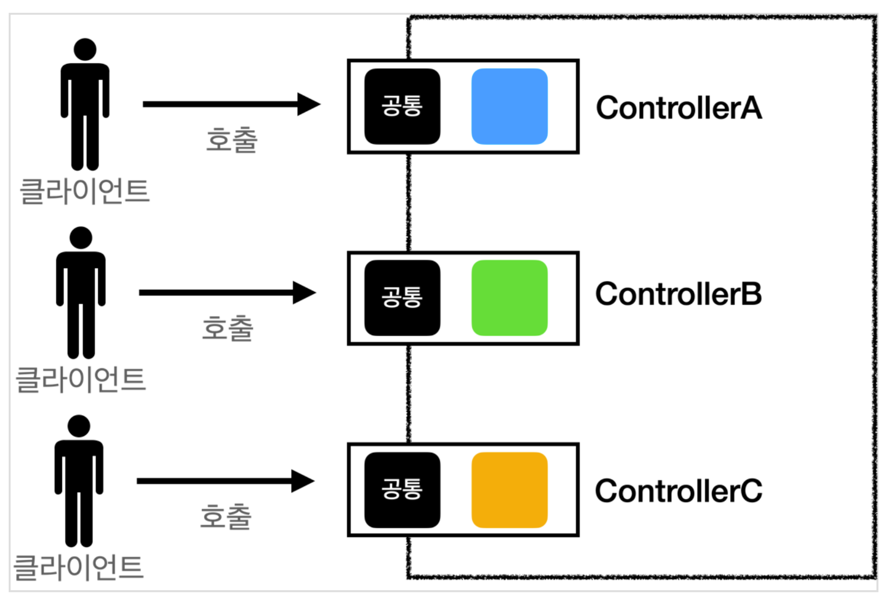
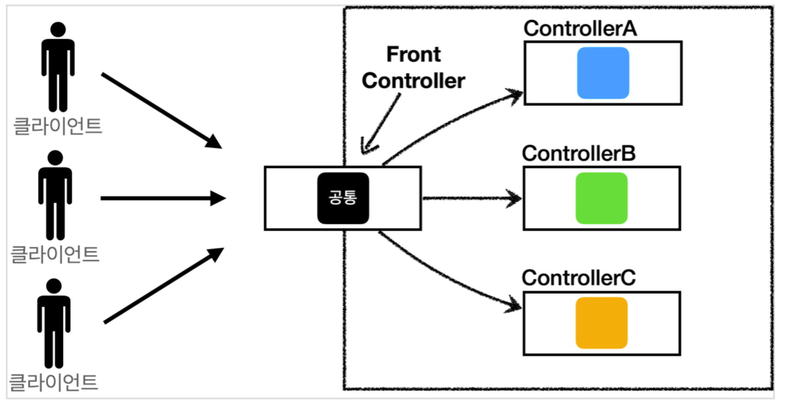
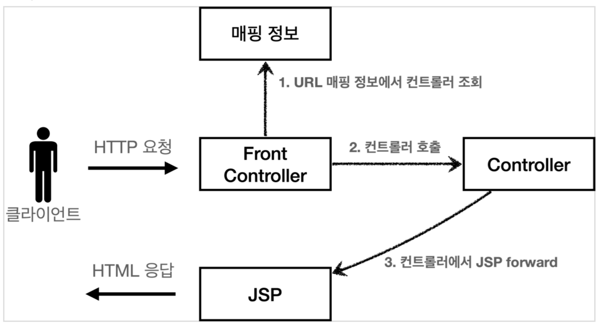
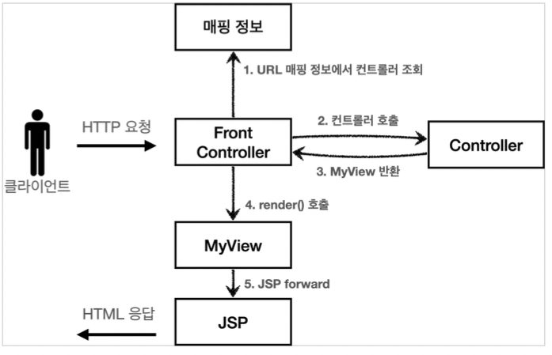
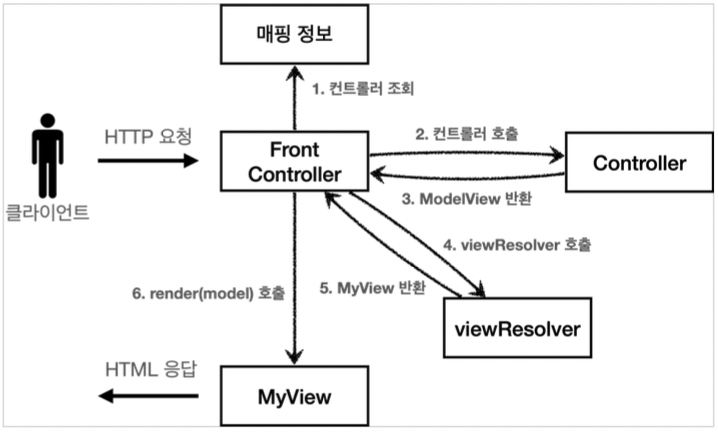
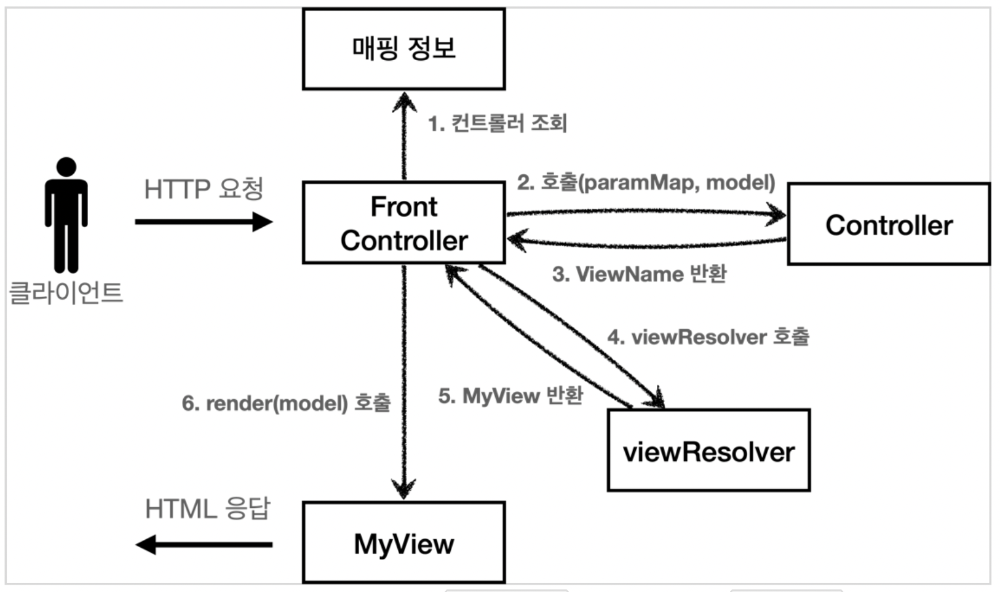
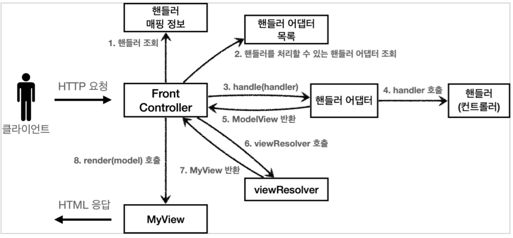
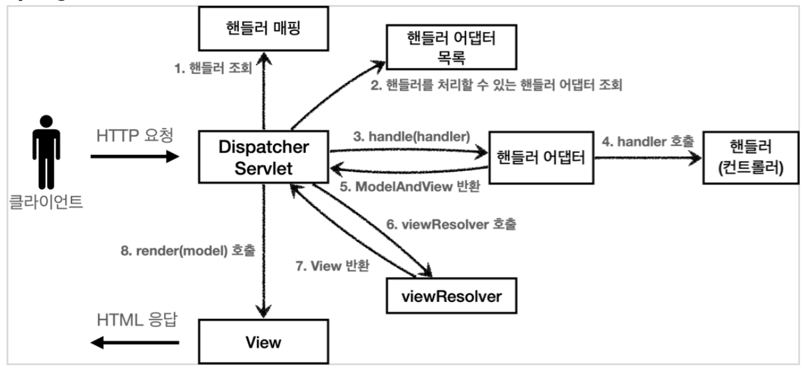

# MVC 프레임워크 만들기

## 프론트 컨트롤러 패턴 소개

### 프론트 컨트롤러 도입 전


### 프론트 컨트롤러 도입 후


### FrontController 패턴 특징

* 프론트 컨트롤러 서블릿 하나로 클라이언트의 요청을 받음 
* 프론트 컨트롤러가 요청에 맞는 컨트롤러를 찾아서 호출
* 입구를 하나로!
* 공통 처리 가능
* 프론트 컨트롤러를 제외한 나머지 컨트롤러는 서블릿을 사용하지 않아도 됨

### 스프링 웹 MVC와 프론트 컨트롤러
* 스프링 웹 MVC의 핵심도 바로 `FrontController`
* 스프링 웹 MVC의 `DispatcherServlet`이 `FrontController` 패턴으로 구현되어 있음


## 프론트 컨트롤러 도입 - v1



서블릿과 비슷한 모양의 컨트롤러 인터페이스를 도입한다. 각 컨트롤러들은 이 인터페이스를 구현하면 된다. 
프론트 컨트롤러는 이 인테페이스를 호출해서 구현과 관계업이 로직의 일관성을 가져갈 수 있다.


### urlpatterns
* `urlPatterns = "/front-controller/v1/*"` : `/front-controller/v1` 를 포함한 하위 모든 요청은 이 서블릿에서 받아들인다.
* 예) `/front-controller/v1` , `/front-controller/v1/a` ,` /front-controller/v1/a/b`


### controllerMap

* key: 매핑 URL
* value: 호출될 컨트롤러

### service()

먼저 requestURI 를 조회해서 실제 호출할 컨트롤러를 `controllerMap` 에서 찾는다. 
만약 없다면 `404(SC_NOT_FOUND)` 상태 코드를 반환한다.
컨트롤러를 찾고` controller.process(request, response);` 을 호출해서 해당 컨트롤러를 실행한다.

### View 분리 - V2



## Model 추가

### 서블릿 종속성 제거

> 컨트롤러 입장에서 `HttpServletRequest`, `HttpServletResponse이` 꼭 필요할까?
> 
> 요청 파라미터 정보는 자바의 `Map`으로 대신 넘기도록 하면 지금 구조에서는 컨트롤러가 서블릿 기술을 몰라도 동작할 수 있다.
> 그리고 request 객체를 `Model`로 사용하는 대신에 별도의 Model 객체를 만들어서 반환하면 된다. 우리가 구현하는 컨트롤러가 서블릿 기술을 전혀 사용하지 않도록 변경해보자.
> 이렇게 하면 구현 코드도 매우 단순해지고, 테스트 코드 작성이 쉽다.

### 뷰 이름 중복 제거

컨트롤러에서 지정하는 뷰 이름에 중복이 있는 것을 확인할 수 있다.
컨트롤러는 뷰의 논리 이름을 반환하고, 실제 물리 위치의 이름은 프론트 컨트롤러에서 처리하도록 단순화 하자.
이렇게 해두면 향후 뷰의 폴더 위치가 함께 이동해도 프론트 컨트롤러만 고치면 된다.

* `/WEB-INF/views/new-form.jsp` -> `new-form`
* `/WEB-INF/views/save-result.jsp` -> `save-result `
* `/WEB-INF/views/members.jsp` -> `members`
      


### ModelView

지금까지 컨트롤러에서 서블릿에 종속적인 HttpServletRequest를 사용했다. 그리고 Model도 request.setAttribute() 를 통해
데이터를 저장하고 뷰에 전달했다.

서블릿의 종속성을 제거하기 위해 Model을 직접 만들고, 추가로 View 이름까지 전달하는 객체를 만들어보자.

## 단순하고 실용적인 컨트롤러

실제 컨트롤러 인터페이스를 구현하는 개발자 입장에서 보면, 항상 ModelView 객체를 생성하고 반환해야 하는 부분이 조금은 번거롭다.
좋은 프레임워크는 아키텍처도 중요하지만, 그와 더불어 실제 개발하는 개발자가 단순하고 편리하게 사용할 수 있어야 한다. 소위 실용성이 있어야 한다.



### 어댑터 패턴

지금까지 개발한 컨트롤러는 하나의 인터페이스만 사용할 수 있다.
어댑터 패턴을 사용해서 컨트롤러가 다양한 방식의 컨트롤러를 처리할 수 있도록 변경한다.



* 핸들러 어댑터: 중간에 어댑터 역할을 하는 어댑터가 추가되었는데 이름이 핸들러 어댑터이다. 여기서 어댑터 역할을 
  해주는 덕분에 다양한 종류의 컨트롤러를 호출할 수 있다.

* 핸들러: 컨트롤러의 이름을 더 넓은 범위인 핸들러로 변경했다. 그 이유는 이제 어댑터가 있기 때문에 꼭 컨트롤러의 
  개념 뿐만 아니라 어떠한 것이든 해당하는 종류의 어댑터만 있으면 다 처리할 수 있기 때문이다.

## 스프링 MVC - 구조 이해

### 스프링 MVC 전체 구조

* springMVC 구조



### DispatcherServlet 구조
`org.springframwork.web.servlet.DispatcherServlet`

스프링 MVC도 프론트 컨트롤러 패턴으로 구현되어 있다.
스프링 MVC의 프론트 컨트롤러가 바로 디스패처 서블릿이다.
그리고 이 디스패터 서블릿이 스프링 MVC의 핵심이다.

### DispatcherServlet 서블릿 등록

* `DispacherServlet` 도 부모 클래스에서 `HttpServlet` 을 상속 받아서 사용하고, 서블릿으로 동작한다.
  * `DispatcherServlet` -> `FrameworkServlet` -> `HttpServletBean` -> `HttpServlet`
* 스프링 부트는 `DispacherServlet`을 서블릿으로 자동으로 등록하면서 모든 경로에 대해서 매핑한다.
  * 참고: 더 자세한 경로가 우선순귀가 높다. 그래서 기본에 등록한 서블릿도 함께 동작한다.

### 요청흐름

* 서블릿이 호출되면 `HttpServlet`이 제공하는 `service()`가 호출된다.
* 스프링MVC는 `DispatcherServlet` 의 부모인 `FrameworkServlet` 에서 `service()` 를 오버라이드 해두었다.
* `FrameworkServlet.service()` 를 시작으로 여러 메서드가 호출되면서 `DispatcherServlet.doDispatch()` 가 호출된다.

## 핸들러 매핑과 핸들러 어댑터

지금은 전혀 사용하지 않지만, 과거에 주로 사용했던 스프링이 제공하는 간단한 컨트롤러를 핸들러 매핑과 어댑터

### Controller 인터페이스

* 과거 버전 스프링 컨트롤러

```java
import org.springframework.web.servlet.ModelAndView;

import javax.servlet.http.HttpServletRequest;
import javax.servlet.http.HttpServletResponse;

public interface Controller {
    
  ModelAndView handleRequest(HttpServletRequest request, HttpServletResponse response) throws Exception;
  
}
```

> 참고
> 
> Controller 인터페이스는 `@Controller` 애노테이션과는 전혀 다르다.

```java
package com.example.servlet3.web.springmvc.old;

import org.springframework.stereotype.Component;
import org.springframework.web.servlet.ModelAndView;
import org.springframework.web.servlet.mvc.Controller;

import javax.servlet.http.HttpServletRequest;
import javax.servlet.http.HttpServletResponse;

@Component("/springmvc/old-controller")
public class OldController implements Controller {

    @Override
    public ModelAndView handleRequest(HttpServletRequest request, HttpServletResponse response) throws Exception {
        System.out.println("OldController.handleRequest");
        return null;
    }
}

```

이 컨트롤러가 호출되려면 2가지가 필요하다.

* `HandlerMapping`
  * 핸들러 매핑에서 이 컨트롤러를 찾을 수 있어야 한다.
  * 스프링 빈의 이름으로 핸들러를 찾을 수 있는 핸들러가 필요하다.

* `HandlerAdapter`
  * 핸들러 매핑을 통해서 찾은 핸들러를 실행할 수 있는 핸들러 어댑터가 필요하다.

* 스프링 부트가 자동으로 등록하는 핸들러 매핑과 핸들러 어댑터

HandlerMapping
```text
0 = RequestMappingHandlerMapping : 애노테이션 기반의 컨트롤러인 @RequestMapping
1 = BeanNameUrlHandlerMapping : 스프링 빈의 이름으로 핸들러를 찾는다.
```

HandlerAdapter
```text
0 = RequestMappingHandlerAdapter : 애노테이션 기반의 컨트롤러인 @RequestMapping에서 사용
1 = HttpRequestHandlerAdapter : HttpReqeustHandler 처리
2 = SimpleControllerHandlerAdapter : Controllerr 인터페이스(애노테이션x, 과거에 사용) 처리
```

1 핸들러 매핑으로 핸들러 조회

  `HandlerMapping` 을 순서대로 실행해서, 핸들러를 찾는다.
  이 경우 빈 이름으로 핸들러를 찾아야 하기 때문에 이름 그대로 빈 이름으로 핸들러를 찾아주는
  `BeanNameUrlHandlerMapping` 가 실행헤 성공하고 핸들러인 `OldController`를 반환한다.

2. 핸들러 어댑터 조회

  `HandlerAdapter` 의 `support()` 를 순서대로 호출한다.
  `SimpleControllerHandlerAdapter` 가 `Controller` 인터페이스를 지원하므로 대상이 된다.
  
3. 핸들러 어댑터의 실행
   
  디스패터 서블릿이 조회한 `SimpleControllerHandlerAdapter` 를 실행하면서 핸들러 정보도 함께 넘겨준다.
  `SimpleControllerHandlerAdapter` 는 핸들러인 `OldController` 를 내부에서 실행하고, 그 결과를 반환한다.
  
### 뷰 리졸버 - InternalResourceViewResolver

스프링 부트는 `InternalResourceViewResolver` 라는 뷰 리졸버를 자동으로
등록하는데, 이때 `application.properties` 에 등록한 `spring.mvc.view.prefix`
, `spring.mvc.view.suffix` 설정 정보를 사용해서 등록한다.

```java
package com.example.servlet3;

import org.springframework.boot.SpringApplication;
import org.springframework.boot.autoconfigure.SpringBootApplication;
import org.springframework.boot.web.servlet.ServletComponentScan;
import org.springframework.context.annotation.Bean;
import org.springframework.web.servlet.ViewResolver;
import org.springframework.web.servlet.view.InternalResourceViewResolver;

@ServletComponentScan
@SpringBootApplication
public class Servlet3Application {

	public static void main(String[] args) {
		SpringApplication.run(Servlet3Application.class, args);
	}
	
    // 해당 코드와 같음 
	@Bean
	ViewResolver internalResourceViewResolver() {
		return new InternalResourceViewResolver("/WEB-INF/views/", ".jsp");
	}

}
```


스프링 부트가 자동으로 등록하는 뷰 리졸버

```text
1 = BeanNameViewResolver : 빈 이름으로 뷰를 찾아서 반환한다. (예: 엑셀 파일 생성 기능에 사용)
2 = InternalResourceViewResolver : JSP를 처리할 수 있는 뷰를 반환한다.
```

1. 핸들러 어댑터 호출
   핸들러 어댑터를 통해 `new-form` 이라는 논리 이름을 획득한다.

2. ViewResolver 호출
   * `new-from` 이라는 뷰 이름으로 `viewResolver`를 순서대로 호출한다.
   * `BeanNameViewResolver` 는 `new-form` 이라는 이름의 스프링 빈으로 등록된 뷰를 찾아야 하는데 없다.
   * `InternalResourceViewResolver` 가 호출된다.

3. InternalResourceViewResolver
  이 뷰 리졸버는 `InternalResourceViewResolver` 를 반환한다.

4. 뷰 - `InternalResourceView`

  `InternalResourceView` 는 JSP처럼 포워드 `forword()` 를 사용해서 JSP를 실행한다.
  
5. view.render()
  `view.render()` 가 호출되고 `InternalResourceView` 는 `forword()` 를 사용해서 JSP를 실행시킨다.

> 참고
> 
> `InternalResourceViewResolver` 는 만약 JSTL 라이브러리가 있으면 `InternalResourceView` 를 상속받은
> `JstlVie` 를 반환한다. `JstlView` 는 JSTL 태그 사용시 약간의 부가 기능이 추가된다.

> 참고
> 
> 다른 뷰는 실제 뷰를 렌더링하니잠 JSP의 경우 `forword()` 통해서 해당 JSP로 이동해야 렌더링된다. JSP를 
> 제외한 나머지 뷰 템플릿들은 `forword()` 과정 없이 바로 렌더링 된다.


> 참고
> 
> Thymeleaf 뷰 템플릿을 사용하면 `ThymleafViewResolver` 를 동록해야 한다. 최근에는 라이브러리만 추가하면
> 스프링 부트가 이런 작업도 모두 자동화해준다.

