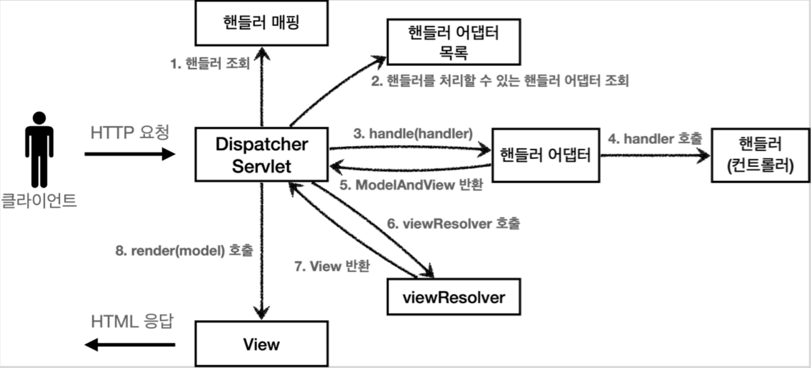

# 스프링 MVC - 구조

## 스프링 MVC 전체 구조

#### 현재까지의 MVC framework


#### 실제 SpringMVC


### 비교

* FrontController -> DispatcherServlet
* handlerMappingMap -> HandlerMapping
* MyHandlerAdapter -> HandlerAdapter
* ModelView -> ModelAndView
* viewResolver -> ViewResolver
* MyView -> View

### DispatcherServlet 구조

`org.springframework.web.servlet.DispatcherServlet`


스프링 MVC도 프론트 컨트롤러 패턴으로 구현되어 있다.
스프링 MVC의 프론트 컨트롤러가 `DispatcherServlet`이다.


#### DispatcherServlet 서블릿 등록

* `DispatcherServlet`도 부모 클래스에서 `HttpServlet`을 상속 받아서 사용하고, 서블릿으로 동작한다.
  * `DispatcherServlet` -> `FrameworkServlet` -> `HttpServletBean` -> `HttpServlet`
* 스프링 부트는 `DispatcherServlet`을 서블릿으로 자동으로 등록하면서 모든 경로(`urlPatterns="/"`)에 대해서 매핑한다.

> 참고
> 
> 더 자세한 경로가 우선순위가 높다. 그래서 기존에 등록한 서블릿도 함께 작동시킬 수 있다.


### 요청 흐름

* 서블릿이 호출되면 `HttpServlet`이 제공하는 `service()`가 호출된다.
* 스프링 MVC는 `DispatcherServlet`의 부모인 `FrameworkServlet`에서 `service()`를 오버라이드 해두었다.
* `FrameWorkServlet.service()`를 시작으로 여러 메서드가 호출되면서 `DispatcherServlet.doDispatch()`가 호출된다.

#### DispatcherServlet.diDispatch()

```java
protected void doDispatch(HttpServletRequest request, HttpServletResponse response) throws Exception {
    HttpServletRequest processedRequest = request;
    HandlerExecutionChain mappedHandler = null;
    boolean multipartRequestParsed = false;

    WebAsyncManager asyncManager = WebAsyncUtils.getAsyncManager(request);

    try {
        ModelAndView mv = null;
        Exception dispatchException = null;

        try {
            processedRequest = checkMultipart(request);
            multipartRequestParsed = (processedRequest != request);

            // Determine handler for the current request.
            // 1. 핸들러 조회
            mappedHandler = getHandler(processedRequest);
            if (mappedHandler == null) {
                noHandlerFound(processedRequest, response);
                return;
            }

            // Determine handler adapter for the current request.
            // 핸들러 어댑터 조회 - 핸들러를 처리할 수 있는 어댑터
            HandlerAdapter ha = getHandlerAdapter(mappedHandler.getHandler());

            // Process last-modified header, if supported by the handler.
            String method = request.getMethod();
            boolean isGet = HttpMethod.GET.matches(method);
            if (isGet || HttpMethod.HEAD.matches(method)) {
                long lastModified = ha.getLastModified(request, mappedHandler.getHandler());
                if (new ServletWebRequest(request, response).checkNotModified(lastModified) && isGet) {
                    return;
                }
            }

            if (!mappedHandler.applyPreHandle(processedRequest, response)) {
                return;
            }

            // Actually invoke the handler.
            // 3. 핸들러 어댑터 실행 -> 4. 핸들러 어댑터를 통해 핸들러 실행 -> 5. ModelAndView 반환
            mv = ha.handle(processedRequest, response, mappedHandler.getHandler());

            if (asyncManager.isConcurrentHandlingStarted()) {
                return;
            }

            applyDefaultViewName(processedRequest, mv);
            mappedHandler.applyPostHandle(processedRequest, response, mv);
        }
        catch (Exception ex) {
            dispatchException = ex;
        }
        catch (Throwable err) {
            // As of 4.3, we're processing Errors thrown from handler methods as well,
            // making them available for @ExceptionHandler methods and other scenarios.
            dispatchException = new NestedServletException("Handler dispatch failed", err);
        }
        processDispatchResult(processedRequest, response, mappedHandler, mv, dispatchException);
    }
    catch (Exception ex) {
        triggerAfterCompletion(processedRequest, response, mappedHandler, ex);
    }
    catch (Throwable err) {
        triggerAfterCompletion(processedRequest, response, mappedHandler,
                new NestedServletException("Handler processing failed", err));
    }
    finally {
        if (asyncManager.isConcurrentHandlingStarted()) {
            // Instead of postHandle and afterCompletion
            if (mappedHandler != null) {
                mappedHandler.applyAfterConcurrentHandlingStarted(processedRequest, response);
            }
        }
        else {
            // Clean up any resources used by a multipart request.
            if (multipartRequestParsed) {
                cleanupMultipart(processedRequest);
            }
        }
    }
}
```


```java
private void processDispatchResult(HttpServletRequest request, HttpServletResponse response,
        @Nullable HandlerExecutionChain mappedHandler, @Nullable ModelAndView mv,
        @Nullable Exception exception) throws Exception {

    boolean errorView = false;

    if (exception != null) {
        if (exception instanceof ModelAndViewDefiningException) {
            logger.debug("ModelAndViewDefiningException encountered", exception);
            mv = ((ModelAndViewDefiningException) exception).getModelAndView();
        }
        else {
            Object handler = (mappedHandler != null ? mappedHandler.getHandler() : null);
            mv = processHandlerException(request, response, handler, exception);
            errorView = (mv != null);
        }
    }

    // Did the handler return a view to render?
    if (mv != null && !mv.wasCleared()) {
        // 뷰 렌더링 호출
        render(mv, request, response);
        if (errorView) {
            WebUtils.clearErrorRequestAttributes(request);
        }
    }
    else {
        if (logger.isTraceEnabled()) {
            logger.trace("No view rendering, null ModelAndView returned.");
        }
    }

    if (WebAsyncUtils.getAsyncManager(request).isConcurrentHandlingStarted()) {
        // Concurrent handling started during a forward
        return;
    }

    if (mappedHandler != null) {
        // Exception (if any) is already handled..
        mappedHandler.triggerAfterCompletion(request, response, null);
    }
}
```


```java
protected void render(ModelAndView mv, HttpServletRequest request, HttpServletResponse response) throws Exception {
    // Determine locale for request and apply it to the response.
    Locale locale =
            (this.localeResolver != null ? this.localeResolver.resolveLocale(request) : request.getLocale());
    response.setLocale(locale);

    View view;
    String viewName = mv.getViewName();
    if (viewName != null) {
        // We need to resolve the view name.
        //6. 뷰 리졸버를 통해서 뷰 찾기,7.View 반환
        view = resolveViewName(viewName, mv.getModelInternal(), locale, request);
        if (view == null) {
            throw new ServletException("Could not resolve view with name '" + mv.getViewName() +
                    "' in servlet with name '" + getServletName() + "'");
        }
    }
    else {
        // No need to lookup: the ModelAndView object contains the actual View object.
        view = mv.getView();
        if (view == null) {
            throw new ServletException("ModelAndView [" + mv + "] neither contains a view name nor a " +
                    "View object in servlet with name '" + getServletName() + "'");
        }
    }

    // Delegate to the View object for rendering.
    if (logger.isTraceEnabled()) {
        logger.trace("Rendering view [" + view + "] ");
    }
    try {
        if (mv.getStatus() != null) {
            request.setAttribute(View.RESPONSE_STATUS_ATTRIBUTE, mv.getStatus());
            response.setStatus(mv.getStatus().value());
        }
        // 8. 뷰 렌더링
        view.render(mv.getModelInternal(), request, response);
    }
    catch (Exception ex) {
        if (logger.isDebugEnabled()) {
            logger.debug("Error rendering view [" + view + "]", ex);
        }
        throw ex;
    }
}
```

### SpringMVC 구조




#### 동작 순서 

1. 핸들러 조회: 핸들러 매핑을 통해 요청 URL에 매핑된 핸들러(컨트롤러)를 조회한다.
2. 핸들러 어댑터 조회: 핸들러를 실행할 수 있는 핸들러 어댑터를 조회한다.
3. 핸들러 어댑터 실행: 핸들러 어댑터를 실행한다.
4. 핸들러 실행: 핸들러 어댑터가 실제 핸들러를 실행한다.
5. `ModelAndView` 반환: 핸들러 어댑터는 핸들러가 반환하는 정보를 `ModelAndView`로 변환해서 반환한다.
6. `viewResolver` 호출: 뷰 리졸버를 찾고 실행한다.
    * JSP의 경우: `InternalResourceViewResolver`가 자동 등록되고, 사용된다.
7. `View` 반환: 뷰 리졸버는 뷰의 논리 이름을 물리 이름으로 바꾸고, 렌더링 역할을 담당하는 뷰 객체를 반환한다.
   * JSP의 경우 `InternalResourceView(JstlView)`를 반환하는데, 내부에 `forward()` 로직이 있다.
8. 뷰 렌더링: 뷰를 통해서 뷰를 렌더링 한다.

#### 인터페이스

* 스프링 MVC의 큰 강점은 `DispatcherServlet` 코드의 변경 없이, 원하는 기능을 변경하거나 확장할 수 있다. 
  기능을 확장할 수 있는 인터페이스를 제공한다.
* 인 인터페이스들만 구현해서 `DispatcherServlet`에 등록하면 필요한 컨트롤러를 직접 만들어 사용할 수 있다.

### 주요 인터페이스

* 핸들러 매핑: `org.springframework.web.servlet.HandlerMapping`
* 핸들러 어댑터: `org.springframework.web.servlet.HandlerAdapter`
* 뷰 리졸버: `org.springframework.web.servlet.ViewResolver`
* 뷰: `org.springframework.web.servlet.View`

## 핸들러 매핑과 핸들러 어댑터


### Controller 인터페이스

* 과거 버전의 스프링 컨트롤러

#### `org.springframework.web.servlet.mvc.Controller`

```java
@FunctionalInterface
public interface Controller {

	/**
	 * Process the request and return a ModelAndView object which the DispatcherServlet
	 * will render. A {@code null} return value is not an error: it indicates that
	 * this object completed request processing itself and that there is therefore no
	 * ModelAndView to render.
	 * @param request current HTTP request
	 * @param response current HTTP response
	 * @return a ModelAndView to render, or {@code null} if handled directly
	 * @throws Exception in case of errors
	 */
	@Nullable
	ModelAndView handleRequest(HttpServletRequest request, HttpServletResponse response) throws Exception;

}
```


#### OlController - 간단한 구현체

```java
package com.example.servlet3.web.springmvc.old;

import org.springframework.stereotype.Component;
import org.springframework.web.servlet.ModelAndView;
import org.springframework.web.servlet.mvc.Controller;

import javax.servlet.http.HttpServletRequest;
import javax.servlet.http.HttpServletResponse;

@Component("/springmvc/old-controller")
public class OldController implements Controller {

    @Override
    public ModelAndView handleRequest(HttpServletRequest request, HttpServletResponse response) throws Exception {
        System.out.println("OldController.handleRequest");
        return new ModelAndView("new-form");
    }
}
```

* 빈의 이름으로 URL을 매핑한다.

### 이 컨틀롤러가 호출되는 과정

#### 스프링 MVC 구조


이 컨트롤러가 호출되려면 다음 2가지가 필요하다.

* `HandlerMapping`
  * 핸들러 매핑에서 이 컨트롤러를 찾을 수 있어야 한다.
  * 스프링 빈의 이름으로 핸들러를 찾을 수 있는 핸들러 매핑이 필요하다.
* `HandlerAdapter`
  * 핸들러 매핑을 통해서 찾은 핸들러를 실행할 수 있는 핸들러 어댑터가 필요하다.
  * 예) `Controller` 인터페이스를 실행할 수 있는 핸들러 어댑터를 찾고 실행해야 한다.

### 스프링 부트가 자동 등록하는 핸들러 매핑과 핸들러 어댑터

#### HandlerMapping

1. `RequestMappingHandlerMapping`: 애노테이션 기반의 컨틀롤러인 `@RequestMapping`에서 사용
2. `BeanNameUrlHandlerMapping`: 스프링 빈의 이름으로 핸들러를 찾는다.

#### HandlerAdapter

1. `RequestMappingHandlerAdapter`: 애노테이션 기반의 컨트롤러인 `@RequestMapping`에서 사용
2. `HttpRequestHandlerAdapter`: `HttpRequestHandler` 처리
3. `SimpleControllerHandlerAdpater`: `Controller` 인터페이스


핸들러 매핑도, 핸들러 어댑터도 모두 순서대로 찾고 만약 없으면 다음 순서로 넘어간다.


#### 1. 핸들러 매핑으로 핸들러 조회

1. `HandlerMapping`을 순서대로 실행해서, 핸들러를 찾는다.
2. 이 경우 빈 이름으로 핸들러를 찾아야 하기 때문에 이름 그대로 빈 이름으로 핸들러를 찾아주는 
   `BeanNameUrlMapping`가 실행에 성공하고 핸들러인 `OldController`를 반환한다.


#### 2. 핸들러 어댑터 조회

1. `HandlerAdapter`의 `supports()`를 순서대로 호출한다.
2. `SimpleControllerHandlerAdapter`가 `Controller` 인터페이스를 지원하므로 대상이 된다.

#### 3. 핸들러 어댑터 실행

1. `DispatcherServlet`이 조회한 `SimpleControllerHandlerAdapter`를 실행하면서 핸들러 정보도 함께 넘겨준다.
2. `SimpleControllerHandlerAdapter`는 핸들러인 `OldController`를 내부에서 실행하고, 그 결과를 반환한다.

