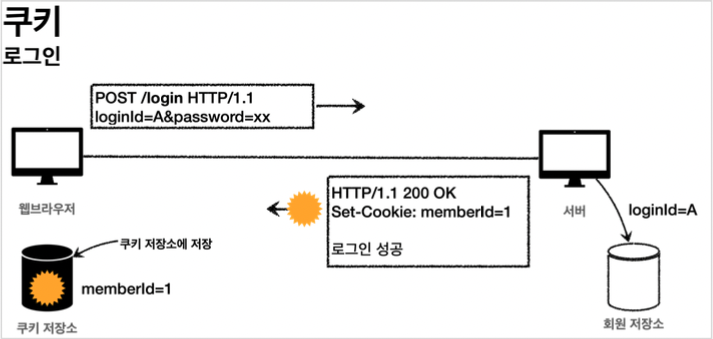
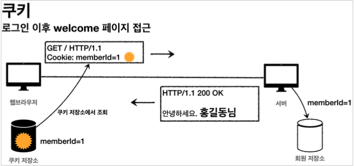
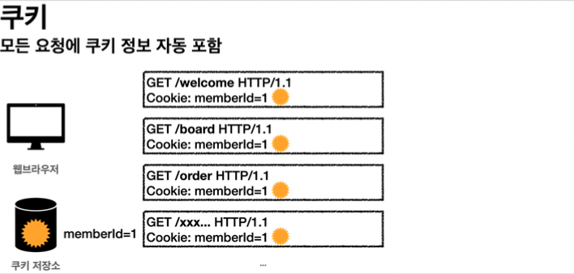
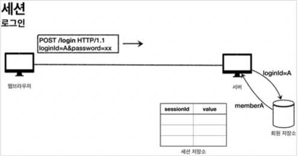
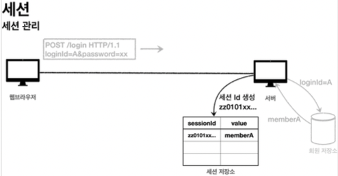
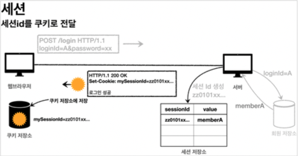
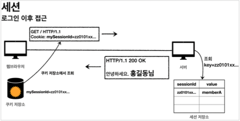

# 로그인 처리 - 쿠키, 세션


### 로그인 요구사항
* 홈 화면 - 로그인 전 
  * 회원 가입
  * 로그인
* 홈 화면 - 로그인 후
  * 본인 이름(누구님 환영합니다.) 
  * 상품 관리
  * 로그 아웃
* 보안 요구사항
  * 로그인 사용자만 상품에 접근하고, 관리할 수 있음
  * 로그인 하지 않은 사용자가 상품 관리에 접근하면 로그인 화면으로 이동
* 회원 가입, 상품 관리


### 패키지 구조 설계

#### package 구조 
* hello.login
  * domain 
    * item
    * member
    * login 
  * web
    * item 
    * member 
    * login


### 로그인 처리하기 - 쿠키 사용

#### 로그인 상태 유지하기

##### 쿠키

서버에서 로그인에 성공하면 HTTP 응답에 쿠키를 담아서 브라우저에 전달 그러면 브라우저는 앞으로 해당 쿠키를 지속해서 보내준다.

#### 쿠키 생성



#### 클라이언트 쿠키 전달





#### 쿠키에는 영속 쿠키와 세션 쿠키가 있다.

* 영속 쿠키: 만료 날짜를 입력하면 해당 날짜까지 유지 
* 세션 쿠키: 만료 날짜를 생략하면 브라우저 종료시 까지만 유지

#### 쿠키 생성 로직

```java
Cookie idCookie = new Cookie("memberId", String.valueOf(loginMember.getId()));
response.addCookie(idCookie);
```

로그인에 성공하면 쿠키를 생성하고 `HttpServletResponse` 에 담는다. 
쿠키 이름은 `memberId` 이고, 값은 회원의 `id`를담아둔다. 웹브라우저는 종료 전까지 회원의 `id`를 서버에 계속 보내줄 것이다.

### 쿠키와 보안 문제

쿠키를 사용해서 로그인Id를 전달해서 로그인을 유지할 수 있었다. 그런데 여기에는 심각한 보안 문제가 있다.

#### 보안 문제
* 쿠키 값은 임의로 변경할 수 있다.
  * 클라이언트가 쿠키를 강제로 변경하면 다른 사용자가 된다.
  * 실제 웹브라우저 개발자모드 Application Cookie 변경으로 확인
  * `Cookie: memberId=1` -> `Cookie: memberId=2` (다른 사용자의 이름이 보임) 
* 쿠키에 보관된 정보는 훔쳐갈 수 있다.
  * 만약 쿠키에 개인정보나, 신용카드 정보가 있다면?
  * 이 정보가 웹 브라우저에도 보관되고, 네트워크 요청마다 계속 클라이언트에서 서버로 전달된다. 
  * 쿠키의 정보가 나의 로컬 PC가 털릴 수도 있고, 네트워크 전송 구간에서 털릴 수도 있다.
* 해커가 쿠키를 한번 훔쳐가면 평생 사용할 수 있다.
  * 해커가 쿠키를 훔쳐가서 그 쿠키로 악의적인 요청을 계속 시도할 수 있다.

#### 대안

* 쿠키에 중요한 값을 노출하지 않고, 사용자 별로 예측 불가능한 임의의 토큰(랜덤 값)을 노출하고, 
  서버에서 토큰과 사용자 id를 매핑해서 인식한다. 그리고 서버에서 토큰을 관리한다.
* 토큰은 해커가 임의의 값을 넣어도 찾을 수 없도록 예상 불가능 해야 한다.
* 해커가 토큰을 털어가도 시간이 지나면 사용할 수 없도록 서버에서 해당 토큰의 만료시간을 짧게(예: 30분) 유지한다. 
  또는 해킹이 의심되는 경우 서버에서 해당 토큰을 강제로 제거하면 된다.


### 로그인 처리하기 - 세션 동작 방식

앞서 쿠키에 중요한 정보를 보관하는 방법은 여러가지 보안 이슈가 있었다. 
이 문제를 해결하려면 결국 중요한 정보를 모두 서버에 저장해야 한다. 그리고 클라이언트와 서버는 추정 불가능한 임의의 식별자 값으로 연결해야 한다.

#### 세션 동작 방식

##### 로그인



* 사용자가 `loginId` , `password` 정보를 전달하면 서버에서 해당 사용자가 맞는지 확인한다.



* 세션 ID를 생성하는데, 추정 불가능해야 한다. 
* **UUID는 추정이 불가능하다.**
  * `Cookie: mySessionId=zz0101xx-bab9-4b92-9b32-dadb280f4b61` 
* 생성된 세션 ID와 세션에 보관할 값( `memberA` )을 서버의 세션 저장소에 보관한다.

##### 세션 id를 응답 쿠키로 전달



#### 클라이언트와 서버는 결국 쿠키로 연결이 되어야 한다.
* 서버는 클라이언트에 `mySessionId` 라는 이름으로 세션ID 만 쿠키에 담아서 전달한다. 
* 클라이언트는 쿠키 저장소에 `mySessionId` 쿠키를 보관한다.

#### 중요
* 여기서 중요한 포인트는 회원과 관련된 정보는 전혀 클라이언트에 전달하지 않는다는 것이다. 
* 오직 추정 불가능한 세션 ID만 쿠키를 통해 클라이언트에 전달한다.

#### 클라이언트의 세션id 쿠키 전달



* 클라이언트는 요청시 항상 `mySessionId` 쿠키를 전달한다.
* 서버에서는 클라이언트가 전달한 `mySessionId` 쿠키 정보로 세션 저장소를 조회해서 로그인시 보관한 세션 정보를 사용한다.


### 로그인 처리하기 - 세션 직접 만들기 세션을 직접 개발해서 적용해보자.

세션 관리는 크게 다음 3가지 기능을 제공하면 된다.

#### 세션 생성

* sessionId 생성 (임의의 추정 불가능한 랜덤 값
* 세션 저장소에 sessionId와 보관할 값 저장
* sessionId로 응답 쿠키를 생성해서 클라이언트에 전달 

#### 세션 조회

* 클라이언트가 요청한 sessionId 쿠키의 값으로, 세션 저장소에 보관한 값 조회 

#### 세션 만료

* 클라이언트가 요청한 sessionId 쿠키의 값으로, 세션 저장소에 보관한 sessionId와 값 제거

### 로그인 처리하기 - 서블릿 HTTP 세션

#### HttpSession 소개

서블릿이 제공하는 `HttpSession` 도 결국 우리가 직접 만든 `SessionManager` 와 같은 방식으로 동작한다. 
서블릿을 통해 `HttpSession` 을 생성하면 다음과 같은 쿠키를 생성한다. 쿠키 이름이 `JSESSIONID` 이고, 값은 추정 불가능한 랜덤 값이다.

`Cookie: JSESSIONID=5B78E23B513F50164D6FDD8C97B0AD05`


#### 세션 생성과 조회

세션을 생성하려면 `request.getSession(true)` 를 사용하면 된다. 

`public HttpSession getSession(boolean create);`

세션의 `create` 옵션 
* `request.getSession(true)`
  * 세션이 있으면 기존 세션을 반환한다.
  * 세션이 없으면 새로운 세션을 생성해서 반환한다. 
* `request.getSession(false)`
  * 세션이 있으면 기존 세션을 반환한다.
  * 세션이 없으면 새로운 세션을 생성하지 않는다. `null` 을 반환한다.


* `request.getSession()` : 신규 세션을 생성하는 `request.getSession(true)` 와 동일하다.


#### 세션에 로그인 회원 정보 보관

`session.setAttribute(SessionConst.LOGIN_MEMBER, loginMember);`

세션에 데이터를 보관하는 방법은 `request.setAttribute(..)` 와 비슷하다. 하나의 세션에 여러 값을
저장할 수 있다.

* `sessionId` : 세션Id, `JSESSIONID` 의 값이다. 예) 34B14F008AA3527C9F8ED620EFD7A4E1 
* `maxInactiveInterval` : 세션의 유효 시간, 예) 1800초, (30분)
* `creationTime` : 세션 생성일시
* `lastAccessedTime` :세션과 연결된 사용자가 최근에 서버에 접근한 시간,클라이언트에서 서버로
* `sessionId` ( `JSESSIONID` )를 요청한 경우에 갱신된다.
* `isNew` : 새로 생성된 세션인지, 아니면 이미 과거에 만들어졌고, 클라이언트에서 서버로
* `sessionId` ( `JSESSIONID` )를 요청해서 조회된 세션인지 여부

#### 세션 타임아웃 설정

세션은 사용자가 로그아웃을 직접 호출해서 `session.invalidate()` 가 호출 되는 경우에 삭제된다. 
그런데 대부분의 사용자는 로그아웃을 선택하지 않고, 그냥 웹 브라우저를 종료한다. 
문제는 HTTP가 비 연결성(ConnectionLess)이므로 서버 입장에서는 해당 사용자가 웹 브라우저를 종료한 것인지 아닌지를
인식할 수 없다. 따라서 서버에서 세션 데이터를 언제 삭제해야 하는지 판단하기가 어렵다.

* 세션과 관련된 쿠키( `JSESSIONID` )를 탈취 당했을 경우 오랜 시간이 지나도 해당 쿠키로 악의적인 요청을 할 수 있다.
* 세션은 기본적으로 메모리에 생성된다. 
  메모리의 크기가 무한하지 않기 때문에 꼭 필요한 경우만 생성해서 사용해야 한다. 
  10만명의 사용자가 로그인하면 10만개의 세션이 생성되는 것이다.

#### 세션의 종료 시점


세션의 종료 시점을 어떻게 정하면 좋을까? 가장 단순하게 생각해보면, 
세션 생성 시점으로부터 30분 정도로 잡으면 될 것 같다. 
그런데 문제는 30분이 지나면 세션이 삭제되기 때문에, 열심히 사이트를 돌아다니다가 또 로그인을 해서 세션을 생성해야 한다
그러니까 30분 마다 계속 로그인해야 하는 번거로움이 발생한다.

더 나은 대안은 세션 생성 시점이 아니라 사용자가 서버에 최근에 요청한 시간을 기준으로 30분 정도를 유지해주는 것이다. 
이렇게 하면 사용자가 서비스를 사용하고 있으면, 세션의 생존 시간이 30분으로 계속 늘어나게 된다.
따라서 30분 마다 로그인해야 하는 번거로움이 사라진다. HttpSession 은 이 방식을 사용한다.

#### 세션 타임아웃 설정

스프링 부트로 글로벌 설정
`application.properties` 

`server.servlet.session.timeout=60` : 60초, 기본은 1800(30분)

(글로벌 설정은 분 단위로 설정해야 한다. 60(1분), 120(2분), ...)

#### 특정 세션 단위로 시간 설정

```java
session.setMaxInactiveInterval(1800); //1800초
```

#### 세션 타임아웃 발생

세션의 타임아웃 시간은 해당 세션과 관련된 `JSESSIONID` 를 전달하는 HTTP 요청이 있으면 현재 시간으로 다시 초기화 된다. 
이렇게 초기화 되면 세션 타임아웃으로 설정한 시간동안 세션을 추가로 사용할 수 있다. 

`session.getLastAccessedTime()` : 최근 세션 접근 시간

`LastAccessedTime` 이후로 timeout 시간이 지나면, WAS가 내부에서 해당 세션을 제거한다.

