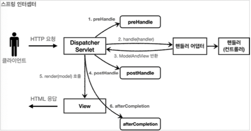
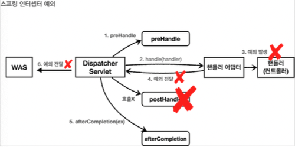

# 로그인 처리 - 쿠키, 세션


### 로그인 요구사항
* 홈 화면 - 로그인 전 
  * 회원 가입
  * 로그인
* 홈 화면 - 로그인 후
  * 본인 이름(누구님 환영합니다.) 
  * 상품 관리
  * 로그 아웃
* 보안 요구사항
  * 로그인 사용자만 상품에 접근하고, 관리할 수 있음
  * 로그인 하지 않은 사용자가 상품 관리에 접근하면 로그인 화면으로 이동
* 회원 가입, 상품 관리


### 패키지 구조 설계

#### package 구조 
* hello.login
  * domain 
    * item
    * member
    * login 
  * web
    * item 
    * member 
    * login


### 로그인 처리하기 - 쿠키 사용

#### 로그인 상태 유지하기

##### 쿠키

서버에서 로그인에 성공하면 HTTP 응답에 쿠키를 담아서 브라우저에 전달 그러면 브라우저는 앞으로 해당 쿠키를 지속해서 보내준다.

#### 쿠키 생성


#### 클라이언트 쿠키 전달


#### 쿠키에는 영속 쿠키와 세션 쿠키가 있다.

* 영속 쿠키: 만료 날짜를 입력하면 해당 날짜까지 유지 
* 세션 쿠키: 만료 날짜를 생략하면 브라우저 종료시 까지만 유지

#### 쿠키 생성 로직

```java
Cookie idCookie = new Cookie("memberId", String.valueOf(loginMember.getId()));
response.addCookie(idCookie);
```

로그인에 성공하면 쿠키를 생성하고 `HttpServletResponse` 에 담는다. 
쿠키 이름은 `memberId` 이고, 값은 회원의 `id`를담아둔다. 웹브라우저는 종료 전까지 회원의 `id`를 서버에 계속 보내줄 것이다.

### 쿠키와 보안 문제

쿠키를 사용해서 로그인Id를 전달해서 로그인을 유지할 수 있었다. 그런데 여기에는 심각한 보안 문제가 있다.

#### 보안 문제
* 쿠키 값은 임의로 변경할 수 있다.
  * 클라이언트가 쿠키를 강제로 변경하면 다른 사용자가 된다.
  * 실제 웹브라우저 개발자모드 Application Cookie 변경으로 확인
  * `Cookie: memberId=1` -> `Cookie: memberId=2` (다른 사용자의 이름이 보임) 
* 쿠키에 보관된 정보는 훔쳐갈 수 있다.
  * 만약 쿠키에 개인정보나, 신용카드 정보가 있다면?
  * 이 정보가 웹 브라우저에도 보관되고, 네트워크 요청마다 계속 클라이언트에서 서버로 전달된다. 
  * 쿠키의 정보가 나의 로컬 PC가 털릴 수도 있고, 네트워크 전송 구간에서 털릴 수도 있다.
* 해커가 쿠키를 한번 훔쳐가면 평생 사용할 수 있다.
  * 해커가 쿠키를 훔쳐가서 그 쿠키로 악의적인 요청을 계속 시도할 수 있다.

#### 대안

* 쿠키에 중요한 값을 노출하지 않고, 사용자 별로 예측 불가능한 임의의 토큰(랜덤 값)을 노출하고, 
  서버에서 토큰과 사용자 id를 매핑해서 인식한다. 그리고 서버에서 토큰을 관리한다.
* 토큰은 해커가 임의의 값을 넣어도 찾을 수 없도록 예상 불가능 해야 한다.
* 해커가 토큰을 털어가도 시간이 지나면 사용할 수 없도록 서버에서 해당 토큰의 만료시간을 짧게(예: 30분) 유지한다. 
  또는 해킹이 의심되는 경우 서버에서 해당 토큰을 강제로 제거하면 된다.


### 로그인 처리하기 - 세션 동작 방식

앞서 쿠키에 중요한 정보를 보관하는 방법은 여러가지 보안 이슈가 있었다. 
이 문제를 해결하려면 결국 중요한 정보를 모두 서버에 저장해야 한다. 그리고 클라이언트와 서버는 추정 불가능한 임의의 식별자 값으로 연결해야 한다.

#### 세션 동작 방식

##### 로그인


* 사용자가 `loginId` , `password` 정보를 전달하면 서버에서 해당 사용자가 맞는지 확인한다.


* 세션 ID를 생성하는데, 추정 불가능해야 한다. 
* **UUID는 추정이 불가능하다.**
  * `Cookie: mySessionId=zz0101xx-bab9-4b92-9b32-dadb280f4b61` 
* 생성된 세션 ID와 세션에 보관할 값( `memberA` )을 서버의 세션 저장소에 보관한다.

##### 세션 id를 응답 쿠키로 전달


#### 클라이언트와 서버는 결국 쿠키로 연결이 되어야 한다.
* 서버는 클라이언트에 `mySessionId` 라는 이름으로 세션ID 만 쿠키에 담아서 전달한다. 
* 클라이언트는 쿠키 저장소에 `mySessionId` 쿠키를 보관한다.

#### 중요
* 여기서 중요한 포인트는 회원과 관련된 정보는 전혀 클라이언트에 전달하지 않는다는 것이다. 
* 오직 추정 불가능한 세션 ID만 쿠키를 통해 클라이언트에 전달한다.

#### 클라이언트의 세션id 쿠키 전달


* 클라이언트는 요청시 항상 `mySessionId` 쿠키를 전달한다.
* 서버에서는 클라이언트가 전달한 `mySessionId` 쿠키 정보로 세션 저장소를 조회해서 로그인시 보관한 세션 정보를 사용한다.


### 로그인 처리하기 - 세션 직접 만들기 세션을 직접 개발해서 적용해보자.

세션 관리는 크게 다음 3가지 기능을 제공하면 된다.

#### 세션 생성

* sessionId 생성 (임의의 추정 불가능한 랜덤 값
* 세션 저장소에 sessionId와 보관할 값 저장
* sessionId로 응답 쿠키를 생성해서 클라이언트에 전달 

#### 세션 조회

* 클라이언트가 요청한 sessionId 쿠키의 값으로, 세션 저장소에 보관한 값 조회 

#### 세션 만료

* 클라이언트가 요청한 sessionId 쿠키의 값으로, 세션 저장소에 보관한 sessionId와 값 제거

### 로그인 처리하기 - 서블릿 HTTP 세션

#### HttpSession 소개

서블릿이 제공하는 `HttpSession` 도 결국 우리가 직접 만든 `SessionManager` 와 같은 방식으로 동작한다. 
서블릿을 통해 `HttpSession` 을 생성하면 다음과 같은 쿠키를 생성한다. 쿠키 이름이 `JSESSIONID` 이고, 값은 추정 불가능한 랜덤 값이다.

`Cookie: JSESSIONID=5B78E23B513F50164D6FDD8C97B0AD05`


#### 세션 생성과 조회

세션을 생성하려면 `request.getSession(true)` 를 사용하면 된다. 

`public HttpSession getSession(boolean create);`

세션의 `create` 옵션 
* `request.getSession(true)`
  * 세션이 있으면 기존 세션을 반환한다.
  * 세션이 없으면 새로운 세션을 생성해서 반환한다. 
* `request.getSession(false)`
  * 세션이 있으면 기존 세션을 반환한다.
  * 세션이 없으면 새로운 세션을 생성하지 않는다. `null` 을 반환한다.


* `request.getSession()` : 신규 세션을 생성하는 `request.getSession(true)` 와 동일하다.


#### 세션에 로그인 회원 정보 보관

`session.setAttribute(SessionConst.LOGIN_MEMBER, loginMember);`

세션에 데이터를 보관하는 방법은 `request.setAttribute(..)` 와 비슷하다. 하나의 세션에 여러 값을
저장할 수 있다.

* `sessionId` : 세션Id, `JSESSIONID` 의 값이다. 예) 34B14F008AA3527C9F8ED620EFD7A4E1 
* `maxInactiveInterval` : 세션의 유효 시간, 예) 1800초, (30분)
* `creationTime` : 세션 생성일시
* `lastAccessedTime` :세션과 연결된 사용자가 최근에 서버에 접근한 시간,클라이언트에서 서버로
* `sessionId` ( `JSESSIONID` )를 요청한 경우에 갱신된다.
* `isNew` : 새로 생성된 세션인지, 아니면 이미 과거에 만들어졌고, 클라이언트에서 서버로
* `sessionId` ( `JSESSIONID` )를 요청해서 조회된 세션인지 여부

#### 세션 타임아웃 설정

세션은 사용자가 로그아웃을 직접 호출해서 `session.invalidate()` 가 호출 되는 경우에 삭제된다. 
그런데 대부분의 사용자는 로그아웃을 선택하지 않고, 그냥 웹 브라우저를 종료한다. 
문제는 HTTP가 비 연결성(ConnectionLess)이므로 서버 입장에서는 해당 사용자가 웹 브라우저를 종료한 것인지 아닌지를
인식할 수 없다. 따라서 서버에서 세션 데이터를 언제 삭제해야 하는지 판단하기가 어렵다.

* 세션과 관련된 쿠키( `JSESSIONID` )를 탈취 당했을 경우 오랜 시간이 지나도 해당 쿠키로 악의적인 요청을 할 수 있다.
* 세션은 기본적으로 메모리에 생성된다. 
  메모리의 크기가 무한하지 않기 때문에 꼭 필요한 경우만 생성해서 사용해야 한다. 
  10만명의 사용자가 로그인하면 10만개의 세션이 생성되는 것이다.

#### 세션의 종료 시점


세션의 종료 시점을 어떻게 정하면 좋을까? 가장 단순하게 생각해보면, 
세션 생성 시점으로부터 30분 정도로 잡으면 될 것 같다. 
그런데 문제는 30분이 지나면 세션이 삭제되기 때문에, 열심히 사이트를 돌아다니다가 또 로그인을 해서 세션을 생성해야 한다
그러니까 30분 마다 계속 로그인해야 하는 번거로움이 발생한다.

더 나은 대안은 세션 생성 시점이 아니라 사용자가 서버에 최근에 요청한 시간을 기준으로 30분 정도를 유지해주는 것이다. 
이렇게 하면 사용자가 서비스를 사용하고 있으면, 세션의 생존 시간이 30분으로 계속 늘어나게 된다.
따라서 30분 마다 로그인해야 하는 번거로움이 사라진다. HttpSession 은 이 방식을 사용한다.

#### 세션 타임아웃 설정

스프링 부트로 글로벌 설정
`application.properties` 

`server.servlet.session.timeout=60` : 60초, 기본은 1800(30분)

(글로벌 설정은 분 단위로 설정해야 한다. 60(1분), 120(2분), ...)

#### 특정 세션 단위로 시간 설정

```java
session.setMaxInactiveInterval(1800); //1800초
```

#### 세션 타임아웃 발생

세션의 타임아웃 시간은 해당 세션과 관련된 `JSESSIONID` 를 전달하는 HTTP 요청이 있으면 현재 시간으로 다시 초기화 된다. 
이렇게 초기화 되면 세션 타임아웃으로 설정한 시간동안 세션을 추가로 사용할 수 있다. 

`session.getLastAccessedTime()` : 최근 세션 접근 시간

`LastAccessedTime` 이후로 timeout 시간이 지나면, WAS가 내부에서 해당 세션을 제거한다.


## 로그인 처리2 - 필터, 인터셉터

### 공통 관심 사항

요구사항을 보면 로그인 한 사용자만 상품 관리 페이지에 들어갈 수 있어야 한다.
앞에서 로그인을 하지 않은 사용자에게는 상품 관리 버튼이 보이지 않기 때문에 문제가 없어 보인다. 
그런데 문제는 로그인 하지 않은 사용자도 다음 URL을 직접 호출하면 상품 관리 화면에 들어갈 수 있다는 점이다.


상품 관리 컨트롤러에서 로그인 여부를 체크하는 로직을 하나하나 작성하면 되겠지만, 등록, 수정, 삭제, 조회 등등 상품관리의 
모든 컨트롤러 로직에 공통으로 로그인 여부를 확인해야 한다. 더 큰 문제는 향후 로그인과 관련된 로직이 변경될 때 이다. 
작성한 모든 로직을 다 수정해야 할 수 있다.

이렇게 애플리케이션 여러 로직에서 공통으로 관심이 있는 있는 것을 공통 관심사(cross-cutting concern)라고 한다. 
여기서는 등록, 수정, 삭제, 조회 등등 여러 로직에서 공통으로 인증에 대해서 관심을 가지고 있다.

이러한 공통 관심사는 스프링의 AOP로도 해결할 수 있지만, 웹과 관련된 공통 관심사는 지금부터 
설명할 서블릿 필터 또는 스프링 인터셉터를 사용하는 것이 좋다. 
웹과 관련된 공통 관심사를 처리할 때는 HTTP의 헤더나 URL의 정보들이 필요한데, 
서블릿 필터나 스프링 인터셉터는 `HttpServletRequest` 를 제공한다.

### 서블릿 필터

#### 필터 흐름

```txt
HTTP 요청 ->WAS-> 필터 -> 서블릿 -> 컨트롤러
```

필터를 적용하면 필터가 호출 된 다음에 서블릿이 호출된다. 
그래서 모든 고객의 요청 로그를 남기는 요구사항이 있다면 필터를 사용하면 된다. 
참고로 필터는 특정 URL 패턴에 적용할 수 있다. `/*` 이라고 하면 모든 요청에 필터가 적용된다.


#### 필터 제한

```txt
HTTP 요청 ->WAS-> 필터1-> 필터2-> 필터3-> 서블릿 -> 컨트롤러
```

필터에서 적절하지 않은 요청이라고 판단하면 거기에서 끝을 낼 수도 있다. 그래서 로그인 여부를 체크하기에 딱 좋다.

#### 필터 체인

```txt
HTTP 요청 ->WAS-> 필터1-> 필터2-> 필터3-> 서블릿 -> 컨트롤러
```

필터를 등록하는 방법은 여러가지가 있지만, 스프링 부트를 사용한다면 `FilterRegistrationBean` 을 사용해서 등록하면 된다.

* `setFilter(new LogFilter())` : 등록할 필터를 지정한다.
* `setOrder(1)` : 필터는 체인으로 동작한다. 따라서 순서가 필요하다. 낮을 수록 먼저 동작한다. 
* `addUrlPatterns("/*")` : 필터를 적용할 URL 패턴을 지정한다. 한번에 여러 패턴을 지정할 수 있다.

> 참고
> 
>  `@ServletComponentScan` `@WebFilter(filterName = "logFilter", urlPatterns = "/*")` 로
> 필터 등록이 가능하지만 필터 순서 조절이 안된다. 따라서 `FilterRegistrationBean` 을 사용하자.

#### 서블릿 필터 - 인증 체크

로그인 되지 않은 사용자는 상품 관리 뿐만 아니라 미래에 개발될
페이지에도 접근하지 못하도록 하자.

`whitelist = {"/", "/members/add", "/login", "/logout","/css/*"};`
  * 인증 필터를 적용해도 홈, 회원가입, 로그인 화면, css 같은 리소스에는 접근할 수 있어야 한다. 
    이렇게 화이트 리스트 경로는 인증과 무관하게 항상 허용한다. 화이트 리스트를 제외한 나머지 모든 경로에는 인증 체크 로직을 적용한다.

`isLoginCheckPath(requestURI)`
  * 화이트 리스트를 제외한 모든 경우에 인증 체크 로직을 적용한다. 

`httpResponse.sendRedirect("/login?redirectURL=" + requestURI);`
  * 미인증 사용자는 로그인 화면으로 리다이렉트 한다. 그런데 로그인 이후에 다시 홈으로 이동해버리면, 
    원하는 경로를 다시 찾아가야 하는 불편함이 있다. 예를 들어서 상품 관리 화면을 보려고 들어갔다가 로그인 화면으로 이동하면, 
    로그인 이후에 다시 상품 관리 화면으로 들어가는 것이 좋다. 
    이런 부분이 개발자 입장에서는 좀 귀찮을 수 있어도 사용자 입장으로 보면 편리한 기능이다. 
    이러한 기능을 위해 현재 요청한 경로인 `requestURI` 를 `/login` 에 쿼리 파라미터로 함께 전달한다. 
    물론 `/login` 컨트롤러에서 로그인 성공시 해당 경로로 이동하는 기능은 추가로 개발해야 한다.

return; 여기가 중요하다. 필터를 더는 진행하지 않는다. 이후 필터는 물론 서블릿, 컨트롤러가 더는 호출되지 않는다. 
앞서 redirect 를 사용했기 때문에 redirect 가 응답으로 적용되고 요청이 끝난다.

#### WebConfig - loginCheckFilter()

```java
@Bean
public FilterRegistrationBean loginCheckFilter(){
    FilterRegistrationBean<Filter> filterRegistrationBean = new FilterRegistrationBean<>();
    filterRegistrationBean.setFilter(new LoginCheckFilter());
    filterRegistrationBean.setOrder(2);
    filterRegistrationBean.addUrlPatterns("/*");
    return filterRegistrationBean;
}
```

* `setFilter(new LoginCheckFilter())` : 로그인 필터를 등록한다. 
* `setOrder(2)` : 순서를 2번으로 잡았다. 로그 필터 다음에 로그인 필터가 적용된다. 
* `addUrlPatterns("/*")` : 모든 요청에 로그인 필터를 적용한다.


### 스프링 인터셉터 - 소개

스프링 인터셉터도 서블릿 필터와 같이 웹과 관련된 공통 관심 사항을 효과적으로 해결할 수 있는 기술이다. 
서블릿 필터가 서블릿이 제공하는 기술이라면, 스프링 인터셉터는 스프링 MVC가 제공하는 기술이다. 
둘다 웹과 관련된 공통 관심 사항을 처리하지만, 적용되는 순서와 범위, 그리고 사용방법이 다르다.

#### 스프링 인터셉터 흐름

```
HTTP 요청 ->WAS-> 필터 -> 서블릿 -> 스프링 인터셉터 -> 컨트롤러
```

스프링 인터셉터는 디스패처 서블릿과 컨트롤러 사이에서 컨트롤러 호출 직전에 호출 된다.
스프링 인터셉터는 스프링 MVC가 제공하는 기능이기 때문에 결국 디스패처 서블릿 이후에 등장하게 된다. 스프링 MVC의 시작점이 디스패처 서블릿이라고 생각해보면 이해가 될 것이다.
스프링 인터셉터에도 URL 패턴을 적용할 수 있는데, 서블릿 URL 패턴과는 다르고, 매우 정밀하게 설정할 수 있다.

#### 스프링 인터셉터 제한

```
HTTP 요청 -> WAS -> 필터 -> 서블릿 -> 스프링 인터셉터 -> 컨트롤러 //로그인 사용자
HTTP 요청 -> WAS -> 필터 -> 서블릿 -> 스프링 인터셉터(적절하지 않은 요청이라 판단, 컨트롤러 호출 X) // 비 로그인 사용자
```

#### 스프링 인터셉터 체인

```
HTTP 요청 -> WAS -> 필터 -> 서블릿 -> 인터셉터1 -> 인터셉터2 -> 컨트롤러
```

스프링 인터셉터는 체인으로 구성되는데, 중간에 인터셉터를 자유롭게 추가할 수 있다. 
예를 들어서 로그를 남기는 인터셉터를 먼저 적용하고, 그 다음에 로그인 여부를 체크하는 인터셉터를 만들 수 있다.

지금까지 내용을 보면 서블릿 필터와 호출 되는 순서만 다르고, 제공하는 기능은 비슷해 보인다. 
앞으로 설명하겠지만, 스프링 인터셉터는 서블릿 필터보다 편리하고, 더 정교하고 다양한 기능을 지원한다.

#### 스프링 인터셉터 인터페이스

```java
public interface HandlerInterceptor {
    
	default boolean preHandle(HttpServletRequest request, HttpServletResponse response, Object handler)
			throws Exception {

		return true;
	}
    
	default void postHandle(HttpServletRequest request, HttpServletResponse response, Object handler,
			@Nullable ModelAndView modelAndView) throws Exception {
	}
    
	default void afterCompletion(HttpServletRequest request, HttpServletResponse response, Object handler,
			@Nullable Exception ex) throws Exception {
	}

}
```

* 서블릿 필터의 경우 단순하게 `doFilter()` 하나만 제공된다. 인터셉터는 컨트롤러 호출 전( `preHandle` ), 호출 후( `postHandle` ), 
  요청 완료 이후( `afterCompletion` )와 같이 단계적으로 잘 세분화 되어 있다. 
* 서블릿 필터의 경우 단순히 `request` , `response` 만 제공했지만, 인터셉터는 어떤 컨트롤러( `handler` )가 호출되는지 호출 정보도 받을 수 있다. 
  그리고 어떤 `modelAndView` 가 반환되는지 응답 정보도 받을 수 있다.



#### 정상 흐름
`preHandle` : 컨트롤러 호출 전에 호출된다. (더 정확히는 핸들러 어댑터 호출 전에 호출된다.) 
  * `preHandle` 의 응답값이 `true` 이면 다음으로 진행하고, `false` 이면 더는 진행하지 않는다. 
    false 인 경우 나머지 인터셉터는 물론이고, 핸들러 어댑터도 호출되지 않는다. 그림에서 1번에서 끝이 나버린다.
  * `postHandle` : 컨트롤러 호출 후에 호출된다. (더 정확히는 핸들러 어댑터 호출 후에 호출된다.) 
  * `afterCompletion` : 뷰가 렌더링 된 이후에 호출된다.

#### 스프링 인터셉터 예외 상황



#### 예외가 발생시

`preHandle` : 컨트롤러 호출 전에 호출된다.
`postHandle` : 컨트롤러에서 예외가 발생하면 postHandle 은 호출되지 않는다.
`afterCompletion` : `afterCompletion` 은 항상 호출된다. 
  이 경우 예외( ex )를 파라미터로 받아서 어떤 예외가 발생했는지 로그로 출력할 수 있다.

#### `afterCompletion`은 예외가 발생해도 호출된다.

* 예외가 발생하면 `postHandle()` 는 호출되지 않으므로 예외와 무관하게 공통 처리를 하려면 `afterCompletion()` 을 사용해야 한다.
* 예외가 발생하면 `afterCompletion()` 에 예외 정보( ex )를 포함해서 호출된다.

* `String uuid = UUID.randomUUID().toString()`
  * 요청 로그를 구분하기 위한 `uuid` 를 생성한다.
* `equest.setAttribute(LOG_ID, uuid)`
  * 서블릿 필터의 경우 지역변수로 해결이 가능하지만, 스프링 인터셉터는 호출 시점이 완전히 분리되어 있다. 
    따라서 `preHandle` 에서 지정한 값을 `postHandle` , `afterCompletion` 에서 함께 사용하려면 어딘가에 담아두어야 한다.
    `LogInterceptor` 도 싱글톤 처럼 사용되기 때문에 맴버변수를 사용하면 위험하다. 
    따라서 `request` 에 담아두었다. 이 값은 `afterCompletion` 에서 `request.getAttribute(LOG_ID)` 로 찾아서 사용한다. 
* `return true` 
  * `true` 면 정상 호출이다. 다음 인터셉터나 컨트롤러가 호출된다.


```java
if (handler instanceof HandlerMethod) {
    HandlerMethod hm = (HandlerMethod) handler; //호출할 컨트롤러 메서드의 모든 정보가포함되어 있다. 
}
```

#### HandlerMethod

핸들러 정보는 어떤 핸들러 매핑을 사용하는가에 따라 달라진다. 스프링을 사용하면 일반적으로 `@Controller` , `@RequestMapping` 을 활용한 
핸들러 매핑을 사용하는데, 이 경우 핸들러 정보로 `HandlerMethod` 가 넘어온다.


#### ResourceHttpRequestHandler

`@Controller` 가 아니라 `/resources/static` 와 같은 정적 리소스가 호출 되는 경우 `ResourceHttpRequestHandler`가 
핸들러 정보로 넘어오기 때문에 타입에 따라서 처리가 필요하다.

#### postHandle, afterCompletion

종료 로그를 `postHandle` 이 아니라 `afterCompletion` 에서 실행한 이유는, 예외가 발생한 경우 `postHandle` 가 호출되지 않기 때문이다.
afterCompletion 은 예외가 발생해도 호출 되는 것을 보장한다.


```java
package hello.login;

import hello.login.web.filter.LogFilter;
import hello.login.web.filter.LoginCheckFilter;
import hello.login.web.interceptor.LogInterceptor;
import org.springframework.boot.web.servlet.FilterRegistrationBean;
import org.springframework.context.annotation.Bean;
import org.springframework.context.annotation.Configuration;
import org.springframework.web.servlet.config.annotation.InterceptorRegistry;
import org.springframework.web.servlet.config.annotation.WebMvcConfigurer;

import javax.servlet.Filter;

@Configuration
public class WebConfig implements WebMvcConfigurer {

    @Override
    public void addInterceptors(InterceptorRegistry registry) {
        registry.addInterceptor(new LogInterceptor())
                .order(1)
                .addPathPatterns("/**")
                .excludePathPatterns("/css/**", "/*.ico", "/error");
    }

//    @Bean
    public FilterRegistrationBean logFilter(){
        FilterRegistrationBean<Filter> filterRegistrationBean = new FilterRegistrationBean<>();
        filterRegistrationBean.setFilter(new LogFilter());
        filterRegistrationBean.setOrder(1);
        filterRegistrationBean.addUrlPatterns("/*");
        return filterRegistrationBean;
    }

    @Bean
    public FilterRegistrationBean loginCheckFilter(){
        FilterRegistrationBean<Filter> filterRegistrationBean = new FilterRegistrationBean<>();
        filterRegistrationBean.setFilter(new LoginCheckFilter());
        filterRegistrationBean.setOrder(2);
        filterRegistrationBean.addUrlPatterns("/*");
        return filterRegistrationBean;
    }

}
```

인터셉터와 필터가 중복되지 않도록 필터를 등록하기 위한 `logFilter()` 의 `@Bean` 은 주석처리하자.

`WebMvcConfigurer` 가 제공하는 `addInterceptors()` 를 사용해서 인터셉터를 등록할 수 있다.

* `registry.addInterceptor(new LogInterceptor())` : 인터셉터를 등록한다.
* `order(1)` : 인터셉터의 호출 순서를 지정한다. 낮을 수록 먼저 호출된다.
* `addPathPatterns("/**")` : 인터셉터를 적용할 URL 패턴을 지정한다. 
* `excludePathPatterns("/css/**", "/*.ico", "/error")` : 인터셉터에서 제외할 패턴을 지정한다.

필터와 비교해보면 인터셉터는 `addPathPatterns` , `excludePathPatterns` 로 매우 정밀하게 URL 패턴을 지정할 수 있다.

#### PathPattern 공식 문서

```
? 한 문자 일치
* 경로(/) 안에서 0개 이상의 문자 일치
** 경로 끝까지 0개 이상의 경로(/) 일치
{spring} 경로(/)와 일치하고 spring이라는 변수로 캡처
{spring:[a-z]+} matches the regexp [a-z]+ as a path variable named "spring" {spring:[a-z]+} regexp [a-z]+ 와 일치하고, "spring" 경로 변수로 캡처
{*spring} 경로가 끝날 때 까지 0개 이상의 경로(/)와 일치하고 spring이라는 변수로 캡처

/pages/t?st.html — matches /pages/test.html, /pages/tXst.html but not /pages/
toast.html
/resources/*.png — matches all .png files in the resources directory
/resources/** — matches all files underneath the /resources/ path, including /
resources/image.png and /resources/css/spring.css
/resources/{*path} — matches all files underneath the /resources/ path and
captures their relative path in a variable named "path"; /resources/image.png
will match with "path" → "/image.png", and /resources/css/spring.css will match
with "path" → "/css/spring.css"
/resources/{filename:\\w+}.dat will match /resources/spring.dat and assign the
value "spring" to the filename variable
```

doc : https://docs.spring.io/spring-framework/docs/current/javadoc-api/org/ springframework/web/util/pattern/PathPattern.html


### 스프링 인터셉터 - 인증 체크

#### LoginCheckInterceptor

```java
package hello.login.web.interceptor;

import hello.login.web.SessionConst;
import lombok.extern.slf4j.Slf4j;
import org.springframework.web.servlet.HandlerInterceptor;

import javax.servlet.http.HttpServletRequest;
import javax.servlet.http.HttpServletResponse;
import javax.servlet.http.HttpSession;

@Slf4j
public class LoginCheckInterceptor implements HandlerInterceptor {

    @Override
    public boolean preHandle(HttpServletRequest request, HttpServletResponse response, Object handler) throws Exception {

        String requestURI = request.getRequestURI();
        log.info("인증 체크 인터셉터 실행 {}", requestURI);

        HttpSession session = request.getSession();

        if(session == null || session.getAttribute(SessionConst.LOGIN_MEMBER) == null) {
            log.info("미인증 사용자 요청");

            response.sendRedirect("/login?redirectURL=" + requestURI);
            return false;
        }
        return true;
    }
}
```

서블릿 필터와 비교해서 코드가 매우 간결하다. 인증이라는 것은 컨트롤러 호출 전에만 호출되면 된다. 따라서 `preHandle` 만 구현하면 된다.


인터셉터를 적용하거나 하지 않을 부분은 `addPathPatterns` 와 `excludePathPatterns` 에 작성하면 된다. 
기본적으로 모든 경로에 해당 인터셉터를 적용하되 ( `/**` ), 홈( `/` ), 회원가입( `/members/add` ), 
로그인( `/login` ), 리소스 조회( `/css/**` ), 오류( `/error` )와 같은 부분은 로그인 체크 인터셉터를
적용하지 않는다. 서블릿 필터와 비교해보면 매우 편리한 것을 알 수 있다.


### ArgumentResolver 활용


#### HomeController

```java
@GetMapping("/")
public String homeLoginV3ArgumentResolver(
        @Login Member member,
        Model model){

    if(member == null) {
        return "home";
    }

    model.addAttribute("member", member);
    return "loginHome";
}
```


* `homeLoginV3Spring()` 의 `@GetMapping` 주석 처리
* 다음에 설명하는 `@Login` 애노테이션을 만들어야 컴파일 오류가 사라진다.

`@Login` 애노테이션이 있으면 직접 만든 `ArgumentResolver` 가 동작해서 자동으로 세션에 있는 로그인 회원을 찾아주고, 
만약 세션에 없다면 `null` 을 반환하도록 개발해보자.

#### `@Login` 애노테이션

```java
package hello.login.web.argumentresolver;

import java.lang.annotation.ElementType;
import java.lang.annotation.Retention;
import java.lang.annotation.RetentionPolicy;
import java.lang.annotation.Target;

@Target(ElementType.PARAMETER)
@Retention(RetentionPolicy.RUNTIME)
public @interface Login {
}
```

* `@Target(ElementType.PARAMETER)` : 파라미터에만 사용
* `@Retention(RetentionPolicy.RUNTIME)` : 리플렉션 등을 활용할 수 있도록 런타임까지 애노테이션 정보가 남아있음

#### LoginMemberArgumentResolver

```java
package hello.login.web.argumentresolver;

import hello.login.domain.member.Member;
import hello.login.web.SessionConst;
import lombok.extern.slf4j.Slf4j;
import org.springframework.core.MethodParameter;
import org.springframework.web.bind.support.WebDataBinderFactory;
import org.springframework.web.context.request.NativeWebRequest;
import org.springframework.web.method.support.HandlerMethodArgumentResolver;
import org.springframework.web.method.support.ModelAndViewContainer;

import javax.servlet.http.HttpServletRequest;
import javax.servlet.http.HttpSession;

@Slf4j
public class LoginMemberArgumentResolver implements HandlerMethodArgumentResolver {

    @Override
    public boolean supportsParameter(MethodParameter parameter) {
        log.info("supportsParameter 실행");

        boolean hasLoginAnnotation = parameter.hasParameterAnnotation(Login.class);
        boolean hasMemberType = Member.class.isAssignableFrom(parameter.getParameterType());
        return hasLoginAnnotation && hasMemberType;
    }

    @Override
    public Object resolveArgument(MethodParameter parameter, ModelAndViewContainer mavContainer, NativeWebRequest webRequest, WebDataBinderFactory binderFactory) throws Exception {
        log.info("resolveArgument 실행");

        HttpServletRequest request = (HttpServletRequest) webRequest.getNativeRequest();
        HttpSession session = request.getSession(false);

        if(session == null){
            return null;
        }
        return session.getAttribute(SessionConst.LOGIN_MEMBER);
    }
}
```

* `supportsParameter()` : `@Login` 애노테이션이 있으면서 `Member` 타입이면 해당 `ArgumentResolver` 가 사용된다.
* `resolveArgument()` : 컨트롤러 호출 직전에 호출 되어서 필요한 파라미터 정보를 생성해준다. 
  여기서는 세션에 있는 로그인 회원 정보인 `member` 객체를 찾아서 반환해준다. 
  이후 스프링MVC는 컨트롤러의 메서드를 호출하면서 여기에서 반환된 `member` 객체를 파라미터에 전달해준다.

#### WebMvcConfigurer

```java
@Override
public void addArgumentResolvers(List<HandlerMethodArgumentResolver> resolvers) {
    resolvers.add(new LoginMemberArgumentResolver());
}
```

