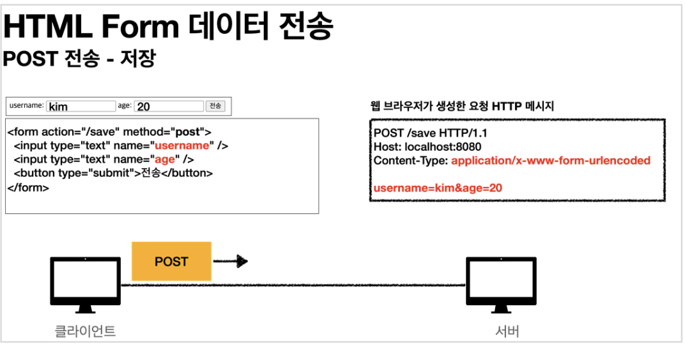
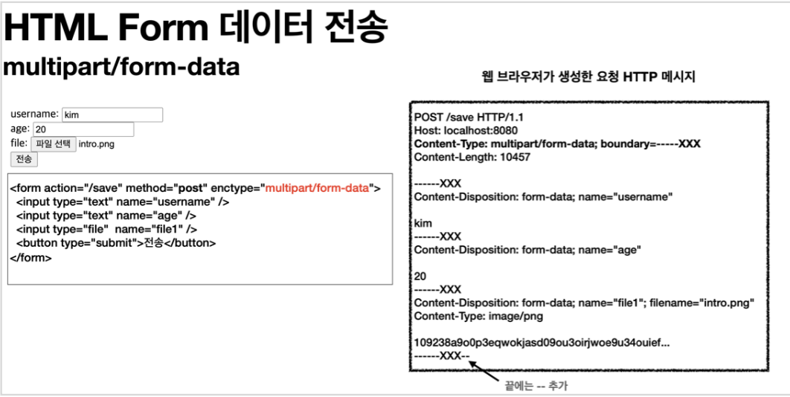

# 파일 업로드

### HTML 폼 전송 방식

* application/x-www-form-urlencoded 
* multipart/form-data



`application/x-www-form-urlencoded` 방식은 HTML 폼 데이터를 서버로 전송하는 가장 기본적인 방법이다. 
`Form` 태그에 별도의 `enctype` 옵션이 없으면 웹 브라우저는 요청 HTTP 메시지의 헤더에 다음
내용을 추가한다.


`Content-Type: application/x-www-form-urlencoded`


그리고 폼에 입력한 전송할 항목을 HTTP Body에 문자로 `username=kim&age=20` 와 같이 `&` 로 구분해서 전송한다.


파일을 업로드 하려면 파일은 문자가 아니라 바이너리 데이터를 전송해야 한다. 
문자를 전송하는 이 방식으로 파일을 전송하기는 어렵다. 그리고 또 한가지 문제가 더 있는데, 
보통 폼을 전송할 때 파일만 전송하는 것이 아니라는 점이다.

```
- 이름
- 나이
- 첨부파일
```

여기는 이름과 나이도 전송해야 하고, 첨부파일도 함께 전송해야 한다. 
문제는 이름과 나이는 문자로 전송하고, 첨부파일은 바이너리로 전송해야 한다는 점이다. 
여기에서 문제가 발생한다. 문자와 바이너리를 동시에 전송해야 하는 상황이다.


이 문제를 해결하기 위해 HTTP는 `multipart/form-data` 라는 전송 방식을 제공한다.


`multipart/form-data 방식`



이 방식을 사용하려면 Form 태그에 별도의 `enctype="multipart/form-data"` 를 지정해야 한다.

`multipart/form-data` 방식은 다른 종류의 여러 파일과 폼의 내용 함께 전송할 수 있다. (그래서 이름이 `multipart` 이다.)


폼의 입력 결과로 생성된 HTTP 메시지를 보면 각각의 전송 항목이 구분이 되어있다. 
`Content- Disposition` 이라는 항목별 헤더가 추가되어 있고 여기에 부가 정보가 있다. 
`username` , `age` , `file1` 이 각각 분리되어 있고, 폼의 일반 데이터는 각 항목별로 문자가 전송되고,
파일의 경우 파일 이름과 `Content-Type`이 추가되고 바이너리 데이터가 전송된다.


`multipart/form-data` 는 이렇게 각각의 항목을 구분해서, 한번에 전송하는 것이다.


#### Part

`multipart/form-data` 는 `application/x-www-form-urlencoded` 와 비교해서 
매우 복잡하고 각각의 부분( `Part` )로 나누어져 있다.


### 서블릿과 파일 업로드1

#### ServletUploadControllerV1

```java
package hello.upload.controller;


import lombok.extern.slf4j.Slf4j;
import org.springframework.stereotype.Controller;
import org.springframework.web.bind.annotation.GetMapping;
import org.springframework.web.bind.annotation.PostMapping;
import org.springframework.web.bind.annotation.RequestMapping;

import javax.servlet.ServletException;
import javax.servlet.http.HttpServletRequest;
import javax.servlet.http.Part;
import java.io.IOException;
import java.util.Collection;

@Slf4j
@Controller
@RequestMapping("/servlet/v1")
public class ServletUploadControllerV1 {

    @GetMapping("/upload")
    public String newFile(){
        return "upload-form";
    }

    @PostMapping("/upload")
    public String saveFileV1(HttpServletRequest request) throws ServletException, IOException {
        log.info("request={}", request);

        String itemName = request.getParameter("itemName");
        log.info("itemName={}", itemName);

        Collection<Part> parts = request.getParts();
        log.info("parts={}", parts);

        return "upload-form";
    }
}
```

`request.getParts()` : `multipart/form-data` 전송 방식에서 각각 나누어진 부분을 받아서 확인할 수 있다.


#### 멀티파트 사용 옵션

#### 업로드 사이즈 제한

```yaml
spring.servlet.multipart.max-file-size=1MB
spring.servlet.multipart.max-request-size=10MB
```


큰 파일을 무제한 업로드하게 둘 수는 없으므로 업로드 사이즈를 제한할 수 있다. 
사이즈를 넘으면 예외( `SizeLimitExceededException` )가 발생한다. 

`max-file-size` : 파일 하나의 최대 사이즈, 기본 1MB

#### spring.servlet.multipart.enabled 끄기


`spring.servlet.multipart.enabled=false`


#### 결과 로그

```
request=org.apache.catalina.connector.RequestFacade@xxx
itemName=null
parts=[]
```

멀티파트는 일반적인 폼 요청인 `application/x-www-form-urlencoded` 보다 훨씬 복잡하다. 
`spring.servlet.multipart.enabled` 옵션을 끄면 서블릿 컨테이너는 멀티파트와 관련된 처리를 하지 않는다.


그래서 결과 로그를 보면 `request.getParameter("itemName")` , `request.getParts()` 의 결과가 비어있다.


#### spring.servlet.multipart.enabled 켜기


`spring.servlet.multipart.enabled=true` (기본 true)


이 옵션을 켜면 스프링 부트는 서블릿 컨테이너에게 멀티파트 데이터를 처리하라고 설정한다. 참고로 기본 값은 `true` 이다.


```
request=org.springframework.web.multipart.support.StandardMultipartHttpServletR
equest
itemName=Spring
parts=[ApplicationPart1, ApplicationPart2]
```


`request.getParameter("itemName")` 의 결과도 잘 출력되고, 
`request.getParts()` 에도 요청한 두 가지 멀티파트의 부분 데이터가 포함된 것을 확인할 수 있다. 
이 옵션을 켜면 복잡한 멀티파트 요청을 처리해서 사용할 수 있게 제공한다.


로그를 보면 `HttpServletRequest` 객체가 `RequestFacade` -> `StandardMultipartHttpServletRequest` 로 변한 것을 확인할 수 있다.

> 참고
> 
> `spring.servlet.multipart.enabled` 옵션을 켜면 스프링의 `DispatcherServlet` 에서 멀티파트 리졸버( `MultipartResolver` )를 실행한다.
> 멀티파트 리졸버는 멀티파트 요청인 경우 서블릿 컨테이너가 전달하는 일반적인 `HttpServletRequest` 를 `MultipartHttpServletRequest` 로 변환해서 반환한다.
> `MultipartHttpServletRequest` 는 `HttpServletRequest` 의 자식 인터페이스이고, 멀티파트와 관련된 추가 기능을 제공한다.
> 스프링이 제공하는 기본 멀티파트 리졸버는 `MultipartHttpServletRequest` 인터페이스를 구현한 `StandardMultipartHttpServletRequest` 를 반환한다.
> 이제 컨트롤러에서 `HttpServletRequest` 대신에 `MultipartHttpServletRequest` 를 주입받을 수 있는데, 
> 이것을 사용하면 멀티파트와 관련된 여러가지 처리를 편리하게 할 수 있다.

