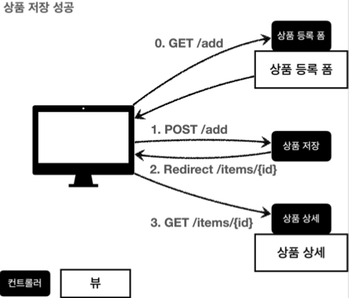
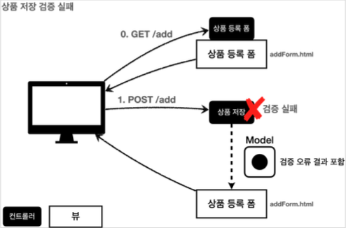

## 검증 직접 처리

#### 상품 저장 성공



사용자가 상품 등록 폼에서 정상 범위의 데이터를 입력하면, 서버에서는 검증 로직이 통과하고, 상품을 저장하고, 
상품 상세 화면으로 redirect한다.

#### 상품 저장 실패



고객이 상품 등록 폼에서 상품명을 입력하지 않거나, 가격, 수량 등이 너무 작거나 커서 검증 범위를 넘어서면, 서버 검증 로직이 실패해야 한다. 
이렇게 검증에 실패한 경우 고객에게 다시 상품 등록 폼을 보여주고, 어떤 값을 잘못 입력했는지 친절하게 알려주어야 한다.

#### 검증 오류 보관

`Map<String, String> errors = new HashMap<>();`

만약 검증시 오류가 발생하면 어떤 검증에서 오류가 발생했는지 정보를 담아둔다.

#### 검증 로직


```java
if (!StringUtils.hasText(item.getItemName())) { 
    errors.put("itemName", "상품 이름은 필수입니다.");
}
```

특정 필드를 넘어서는 오류를 처리해야 할 수도 있다. 이때는 필드 이름을 넣을 수 없으므로 `globalError` 라는 key 를 사용한다.


#### 글로벌 오류 메시지
```html
<div th:if="${errors?.containsKey('globalError')}">
    <p class="field-error" th:text="${errors['globalError']}">전체 오류 메시지</p>
</div>
```

> 참고
> 
> 만약 여기에서 `errors` 가 `null` 이라면 어떻게 될까?
> 생각해보면 등록폼에 진입한 시점에는 `errors` 가 없다.
> 따라서 `errors.containsKey()` 를 호출하는 순간 `NullPointerException` 이 발생한다.
> 
> `errors?.` 은 `errors` 가 `null` 일때 `NullPointerException` 이 발생하는 대신, `null` 을 반환하는 문법이다.
> `th:if` 에서 `null` 은 실패로 처리되므로 오류 메시지가 출력되지 않는다
> 
> 이것은 스프링의 SpringEL이 제공하는 문법이다. 자세한 내용은 다음을 참고하자.
> https://docs.spring.io/spring-framework/docs/current/reference/html/core.html#expressions-operator-safe-navigation

#### 남은 문제점

* 뷰 템플릿에서 중복 처리가 많다. 뭔가 비슷하다.

* 타입 오류 처리가 안된다. `Item` 의 `price` , `quantity` 같은 숫자 필드는 
  타입이 `Integer` 이므로 문자 타입으로 설정하는 것이 불가능하다.
  숫자 타입에 문자가 들어오면 오류가 발생한다. 
  그런데 이러한 오류는 스프링MVC에서 컨트롤러에 진입하기도 전에 예외가 발생하기 때문에, 
  컨트롤러가 호출되지도 않고, 400 예외가 발생하면서 오류 페이지를 띄워준다.

* `Item`의 `price`에 문자를 입력하는 것 처럼 타입 오류가 발생해도 고객이 입력한 문자를 화면에 남겨야 한다. 
  만약 컨트롤러가 호출된다고 가정해도 `Item` 의 `price` 는 `Integer` 이므로 문자를 보관할 수가 없다. 
  결국 문자는 바인딩이 불가능하므로 고객이 입력한 문자가 사라지게 되고, 고객은 본인이 어떤 내용을 입력해서 오류가 발생했는지 이해하기 어렵다.
  결국 고객이 입력한 값도 어딘가에 별도로 관리가 되어야 한다.

### BindingResult

#### ValidationItemControllerV2 - addItemV1

```java
@PostMapping("/add")
public String addItemV1(@ModelAttribute Item item, BindingResult bindingResult,
                      RedirectAttributes redirectAttributes, Model model) {
    
    Map<String, String> errors = new HashMap<>();

    if(!StringUtils.hasText(item.getItemName())) {
        errors.put("itemName", "상품 이름은 필수입니다.");
        bindingResult.addError(
                new FieldError("item", "itemName", "상품 이름은 필수입니다."));
    }
    if (item.getPrice() == null || item.getPrice() < 1000 || item.getPrice() > 1000000){
        errors.put("price", "가격은 1000 ~ 1,000,000 까지 허용합니다.");
        bindingResult.addError(
                new FieldError("item", "price", "가격은 1000 ~ 1,000,000 까지 허용합니다."));
    }
    if (item.getQuantity() == null || item.getQuantity() >= 9999){
        errors.put("quantity", "수량은 최대 9,999 까지 허용합니다.");
        bindingResult.addError(
                new FieldError("item", "quantity", "수량은 최대 9,999 까지 허용합니다."));
    }

    if (item.getPrice() != null && item.getQuantity() != null) {
        int resultPrice = item.getPrice() * item.getQuantity();
        if(resultPrice < 10000){
            errors.put("globalError", "가격 * 수량의 합은 10,000원 이상이어야 합니다. 현재 값 = " + resultPrice);
            bindingResult.addError(
                    new ObjectError("item",
                            "가격 * 수량의 합은 10,000원 이상이어야 합니다. 현재 값 = " + resultPrice));
        }
    }

    if(bindingResult.hasErrors()){
        log.info("errors = {}", bindingResult);
        return "validation/v2/addForm";
    }

    Item savedItem = itemRepository.save(item);
    redirectAttributes.addAttribute("itemId", savedItem.getId());
    redirectAttributes.addAttribute("status", true);
    return "redirect:/validation/v2/items/{itemId}";
}
```

#### 주의

`BindingResult bindingResult` 파라미터 위치는 `@ModelAttribute Item item` 다음에 와야 한다.

#### 필드 오류 - FieldError

```java
public FieldError(String objectName, String field, String defaultMessage) {}
```

필드에 오류가 있으면 `FieldError` 객체를 생성해서 `bindingResult` 에 담아두면 된다. 
* `objectName` : `@ModelAttribute` 이름 
* `field` : 오류가 발생한 필드 이름 
* `defaultMessage` : 오류 기본 메시지

#### 글로벌 오류 - ObjectError

```java
public ObjectError(String objectName, String defaultMessage) {}
```

특정 필드를 넘어서는 오류가 있으면 `ObjectError` 객체를 생성해서 `bindingResult` 에 담아두면 된다. 
* `objectName` : `@ModelAttribute` 의 이름
* `defaultMessage` : 오류 기본 메시지

### BindingResult2

* 스프링이 제공하는 검증 오류를 보관하는 객체이다. 검증 오류가 발생하면 여기에 보관하면 된다. 
* `BindingResult` 가 있으면 `@ModelAttribute` 에 데이터 바인딩 시 오류가 발생해도 컨트롤러가 호출된다!

#### 예) @ModelAttribute에 바인딩 시 타입 오류가 발생하면?

* `BindingResult` 가 없으면 400 오류가 발생하면서 컨트롤러가 호출되지 않고, 오류 페이지로
  이동한다.

* `BindingResult` 가 있으면 오류 정보( `FieldError` )를 `BindingResult` 에 담아서 컨트롤러를
  정상 호출한다.

#### `BindingResult`에 검증 오류를 적용하는 3가지 방법

* `@ModelAttribute` 의 객체에 타입 오류 등으로 바인딩이 실패하는 경우 스프링이 `FieldError` 생성해서
  `BindingResult` 에 넣어준다.
* 개발자가 직접 넣어준다. 
* `Validator` 사용

#### 타입 오류 확인

숫자가 입력되어야 할 곳에 문자를 입력해서 타입을 다르게 해서 `BindingResult` 를 호출하고 `bindingResult` 의 값을 확인해보자.


#### 주의

* `BindingResult` 는 검증할 대상 바로 다음에 와야한다. 순서가 중요하다. 예를 들어서 `@ModelAttribute Item item` , 
  바로 다음에 `BindingResult` 가 와야 한다.
* `BindingResult` 는 `Model`에 자동으로 포함된다.

### `BindingResult`와 `Errors`

* `org.springframework.validation.Errors`
* `org.springframework.validation.BindingResul`

`BindingResult` 는 인터페이스이고, `Errors` 인터페이스를 상속받고 있다.
실제 넘어오는 구현체는 `BeanPropertyBindingResult` 라는 것인데, 둘다 구현하고 있으므로 `BindingResult` 대신에 `Errors` 를 사용해도 된다. 
`Errors` 인터페이스는 단순한 오류 저장과 조회 기능을 제공한다. `BindingResult` 는 여기에 더해서 추가적인 기능들을 제공한다. 
`addError()` 도 `BindingResult` 가 제공하므로 여기서는 `BindingResult` 를 사용하자. 주로 관례상 `BindingResult` 를 많이 사용한다.


### `FieldError`, `ObjectError`


```java
    @PostMapping("/add")
    public String addItemV2(@ModelAttribute Item item, BindingResult bindingResult,
                            RedirectAttributes redirectAttributes, Model model) {

        Map<String, String> errors = new HashMap<>();

        if(!StringUtils.hasText(item.getItemName())) {
            errors.put("itemName", "상품 이름은 필수입니다.");
            bindingResult.addError(
                    new FieldError(
                            "item",
                            "itemName",
                            item.getItemName(),
                            false,
                            null,
                            null,
                            "상품 이름은 필수입니다."));
        }
        if (item.getPrice() == null || item.getPrice() < 1000 || item.getPrice() > 1000000){
            errors.put("price", "가격은 1000 ~ 1,000,000 까지 허용합니다.");
            bindingResult.addError(
                    new FieldError("item",
                            "price",
                            item.getPrice(),
                            false,
                            null,
                            null,
                            "가격은 1000 ~ 1,000,000 까지 허용합니다."));
        }
        if (item.getQuantity() == null || item.getQuantity() >= 9999){
            errors.put("quantity", "수량은 최대 9,999 까지 허용합니다.");
            bindingResult.addError(
                    new FieldError("item",
                            "quantity",
                            item.getQuantity(),
                            false,
                            null,
                            null,
                            "수량은 최대 9,999 까지 허용합니다."));
        }

        if (item.getPrice() != null && item.getQuantity() != null) {
            int resultPrice = item.getPrice() * item.getQuantity();
            if(resultPrice < 10000){
                errors.put("globalError", "가격 * 수량의 합은 10,000원 이상이어야 합니다. 현재 값 = " + resultPrice);
                bindingResult.addError(
                        new ObjectError("item",
                                null,
                                null,
                                "가격 * 수량의 합은 10,000원 이상이어야 합니다. 현재 값 = " + resultPrice));
            }
        }

        if(bindingResult.hasErrors()){
            log.info("errors = {}", bindingResult);
            return "validation/v2/addForm";
        }

        Item savedItem = itemRepository.save(item);
        redirectAttributes.addAttribute("itemId", savedItem.getId());
        redirectAttributes.addAttribute("status", true);
        return "redirect:/validation/v2/items/{itemId}";
    }
```

#### FieldError 생성자

`FieldError` 는 두 가지 생성자를 제공한다.

```java
public FieldError(String objectName, String field, String defaultMessage);
public FieldError(String objectName, String field, @Nullable Object rejectedValue, 
        boolean bindingFailure, @Nullable String[] codes,@Nullable Object[] arguments, 
        @Nullable String defaultMessage)
```

파라미터 목록

* `objectName` : 오류가 발생한 객체 이름 
* `field` : 오류 필드 
* `rejectedValue` : 사용자가 입력한 값(거절된 값)
* `bindingFailure` : 타입 오류 같은 바인딩 실패인지, 검증 실패인지 구분 값 codes : 메시지 코드 
* `arguments` : 메시지에서 사용하는 인자 
* `defaultMessage` : 기본 오류 메시지

#### 오류 발생시 사용자 입력 값 유지

` new FieldError("item", "price", item.getPrice(), false, null, null, "가격은 1,000 ~1,000,000 까지 허용합니다.")`

사용자의 입력 데이터가 컨트롤러의 `@ModelAttribute` 에 바인딩되는 시점에 오류가 발생하면 모델 객체에 사용자 입력 값을 유지하기 어렵다. 
예를 들어서 가격에 숫자가 아닌 문자가 입력된다면 가격은 `Integer` 타입이므로 문자를 보관할 수 있는 방법이 없다. 
그래서 오류가 발생한 경우 사용자 입력 값을 보관하는 별도의 방법이 필요하다. 
그리고 이렇게 보관한 사용자 입력 값을 검증 오류 발생시 화면에 다시 출력하면 된다.
`FieldError` 는 오류 발생시 사용자 입력 값을 **저장**하는 기능을 제공한다.

#### 타임리프의 사용자 입력 값 유지

`th:field="*{price}"`

타임리프의 `th:field` 는 매우 똑똑하게 동작하는데, 정상 상황에는 모델 객체의 값을 사용하지만, 
오류가 발생하면 `FieldError` 에서 보관한 값을 사용해서 값을 출력한다.

#### 스프링의 바인딩 오류 처리

타입 오류로 바인딩에 실패하면 스프링은 `FieldError` 를 생성하면서 사용자가 입력한 값을 넣어둔다. 
그리고 해당 오류를 `BindingResult` 에 담아서 컨트롤러를 호출한다. 
따라서 타입 오류 같은 바인딩 실패시에도 사용자의 오류 메시지를 정상 출력할 수 있다.

