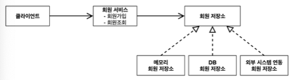
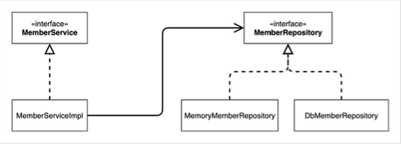
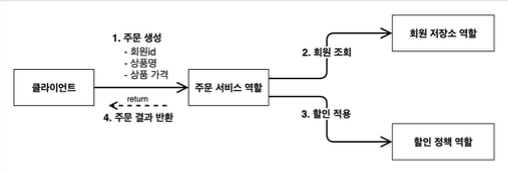
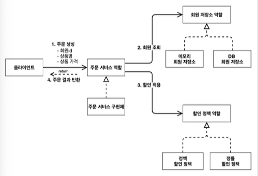
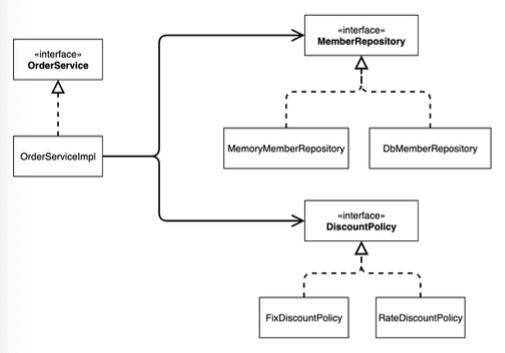
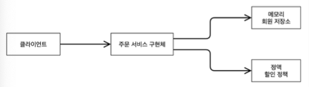
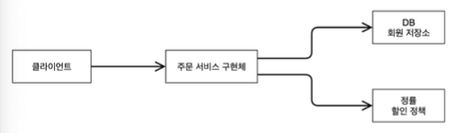

# 스프링 핵심 원리 이해 - 예제


## 비즈니스 요구사항과 설계

* 회원
  * 회원을 가입하고 조회할 수 있다.
  * 회원은 일반과 VIP 두 가지 등급이 있다.
  * 회원 데이터는 자체 DB를 구축할 수 있고, 외부 시스템과 연동할 수 있다. (미확정)
* 주문과 할인 정책
  * 회원은 상품을 주문할 수 있다.
  * 회원 등급에 따라 할인 정책을 적용할 수 있다.
  * 할인 정책은 모든 VIP는 1000원을 할인해주는 고정 금액 할인을 적용해달라. (나중에 변경 될 수 있다.)
  * 할인 정책은 변경 가능성이 높다. 회사의 기본 할인 정책을 아직 정하지 못했고, 오픈 직전까지 고민을 미루고 싶다. 
    최악의 경우 할인을 적용하지 않을 수 도 있다. (미확정)

## 회원 도메인 설계

* 회원 도메인 요구사항
  * 회원을 가입하고 조회할 수 있다.
  * 회원은 일반과 VIP 두 가지 등급이 있다.
  * 회원 데이터는 자체 DB를 구축할 수 있고, 외부 시스템과 연동할 수 있다. (미확정)

#### 회원 도메인 협력 관계



#### 회원 클래스 다이어그램




#### 회원 객체 다이어그램


## 회원 도메인 개발

#### [Grade.java](./src/main/java/hello/core/member/Grade.java)

```java
package hello.core.member;

public enum Grade {
    BASIC,
    VIP
}
```

#### [Member.java](./src/main/java/hello/core/member/Member.java)

```java
package hello.core.member;

public class Member {
    private Long id;
    private String name;
    private Grade grade;

    public Member(Long id, String name, Grade grade) {
        this.id = id;
        this.name = name;
        this.grade = grade;
    }

    public Long getId() {
        return id;
    }

    public void setId(Long id) {
        this.id = id;
    }

    public String getName() {
        return name;
    }

    public void setName(String name) {
        this.name = name;
    }

    public Grade getGrade() {
        return grade;
    }

    public void setGrade(Grade grade) {
        this.grade = grade;
    }
}
```

#### [MemberRepository.java](./src/main/java/hello/core/member/MemberRepository.java)

```java
package hello.core.member;

public interface MemberRepository {
    
    void save(Member member);
    
    Member findById(Long memberId);
}
```

#### [MemoryMemberRepository](./src/main/java/hello/core/member/MemoryMemberRepository.java)

```java
package hello.core.member;

import java.util.HashMap;
import java.util.Map;

public class MemoryMemberRepository implements MemberRepository{
    private static Map<Long, Member> store = new HashMap<>();
    @Override
    public void save(Member member) {
        store.put(member.getId(), member);
    }

    @Override
    public Member findById(Long memberId) {
        return store.get(memberId);
    }
}
```


* 데이터베이스가 아직 확정이 안되었다. 그래도 개발은 진행해야 하니 가장 단순한, 메모리 회원 저장소를 구현해서 우선 개발을 진행하는 것으로 가정한다.

> 참고
> 
> `HashMap`은 동시성 이슈가 발생할 수 있다. 이런 경우 `ConcurrentHashMap`을 사용해야 한다.


### 회원 서비스

#### [MemberService.java](./src/main/java/hello/core/member/MemberService.java) 

```java
package hello.core.member;

public interface MemberService {
    
    void join(Member member);
    
    Member findMember(Long memberId);
}

```

#### [MemberServiceImpl.java](./src/main/java/hello/core/member/MemberServiceImpl.java)

```java
package hello.core.member;

public class MemberServiceImpl implements MemberService{
    
    private final MemberRepository memberRepository = new MemoryMemberRepository();

    @Override
    public void join(Member member) {
        memberRepository.save(member);
    }

    @Override
    public Member findMember(Long memberId) {
        return memberRepository.findById(memberId);
    }
    
}
```

## 회원 도메인 실행과 테스트

#### [MemberServiceTest.java - join](./src/test/java/hello/core/member/MemberServiceTest.java)

```java
package hello.core.member;

import org.assertj.core.api.Assertions;
import org.junit.jupiter.api.Test;

import static org.assertj.core.api.Assertions.*;
import static org.junit.jupiter.api.Assertions.*;

class MemberServiceTest {

  MemberService memberService = new MemberServiceImpl();

  @Test
  void join() {
    Member member = new Member(1L, "memberA", Grade.VIP);

    memberService.join(member);
    Member findMember = memberService.findMember(1L);

    assertThat(member).isEqualTo(findMember);
  }
}
```

### 회원 도메인 설계의 문제점 
* 다른 저장소로 변경할 때 OCP 원칙을 잘 준수했을까?
* DIP를 잘 지키고 있을까?
* 의존관계가 인터페이스 뿐만 아니라 구현까지 모두 의존하는 문제점이 있음
  * 주문까지 만들고나서 문제점과 해결 방안을 설명

## 주문과 할인 도메인 설계

* 주문과 할인 정책
  * 회원은 상품을 주문할 수 있다.
  * 회원 등급에 따라 할인 정책을 적용할 수 있다.
  * 할인 정책은 모든 VIP는 1000원을 할인해주는 고정 금액 할인을 적용해달라. (나중에 변경 될 수 있다.)
  * 할인 정책은 변경 가능성이 높다. 회사의 기본 할인 정책을 아직 정하지 못했고, 오픈 직전까지 고민을 미루고 싶다. 
    최악의 경우 할인을 적용하지 않을 수 도 있다. (미확정)

### 주문 도메인 협력, 역할, 책임



1. 주문 생성: 클라이언트는 주문 서비스에 주문 생성을 요청한다.
2. 회원 조회: 할인을 위해서는 회원 등급이 필요하다. 그래서 주문 서비스는 회원 저장소에서 회원을 조회한다.
3. 할인 적용: 주문 서비스는 회원 등급에 따른 할인 여부를 할인 정책에 위임한다.
4. 주문 결과 반환: 주문 서비스는 할인 결과를 포함한 주문 결과를 반환한다.

### 주문 도메인 전체



역할과 구현을 분리해서 자유롭게 구현 객체를 조립할 수 있게 설계했다. 덕분에 회원 저장소는 물론이고, 할인 정책도 유연하게 변경할 수 있다.

### 주문 도메인 클래스 다이어그램



### 주문 도메인 객체 다이어그램1



회원을 메모리에서 조회하고, 정액 할인 정책(고정 금액)을 지원해도 주문 서비스를 변경하지 않아도 된다. 역할들의 협력 관계를 그대로 재사용 할 수 있다.

### 주문 도메인 객체 다이어그램2




## 주문과 할인 도메인 개발

#### [DiscountPolicy](./src/main/java/hello/core/discount/DiscountPolicy.java)

```java
package hello.core.discount;

import hello.core.member.Member;

public interface DiscountPolicy {

    /**
     * 
     * @param member
     * @param price
     * @return 할인 대상 금액
     */
    int discount(Member member, int price);
}
```

#### [FixDiscountPolicy.java](./src/main/java/hello/core/discount/FixDiscountPolicy.java)

```java
package hello.core.discount;

import hello.core.member.Grade;
import hello.core.member.Member;

public class FixDiscountPolicy implements DiscountPolicy{
    private int discountFixAmout = 1000;
    @Override
    public int discount(Member member, int price) {
        if(member.getGrade() == Grade.VIP){
            return discountFixAmout;
        } else {
            return 0;
        }
    }
}
```

#### [Order.java](./src/main/java/hello/core/order/Order.java)

```java
package hello.core.order;

public class Order {
    private Long memberId;
    private String itemName;
    private int itemPrice;
    private int discountPrice;

    public Order(Long memberId, String itemName, int itemPrice, int discountPrice) {
        this.memberId = memberId;
        this.itemName = itemName;
        this.itemPrice = itemPrice;
        this.discountPrice = discountPrice;
    }

    public Long getMemberId() {
        return memberId;
    }

    public void setMemberId(Long memberId) {
        this.memberId = memberId;
    }

    public String getItemName() {
        return itemName;
    }

    public void setItemName(String itemName) {
        this.itemName = itemName;
    }

    public int getItemPrice() {
        return itemPrice;
    }

    public void setItemPrice(int itemPrice) {
        this.itemPrice = itemPrice;
    }

    public int getDiscountPrice() {
        return discountPrice;
    }

    public void setDiscountPrice(int discountPrice) {
        this.discountPrice = discountPrice;
    }

    @Override
    public String toString() {
        return "Order{" +
                "memberId=" + memberId +
                ", itemName='" + itemName + '\'' +
                ", itemPrice=" + itemPrice +
                ", discountPrice=" + discountPrice +
                '}';
    }
}
```

#### [OrderService.java](./src/main/java/hello/core/order/OrderService.java)

```java
package hello.core.order;

public interface OrderService {
    Order createOrder(Long memberId, String itemName, int itemPrice);
}
```

#### [OrderServiceImpl.java](./src/main/java/hello/core/order/OrderServiceImpl.java)


```java
package hello.core.order;

import hello.core.discount.DiscountPolicy;
import hello.core.discount.FixDiscountPolicy;
import hello.core.member.Member;
import hello.core.member.MemberRepository;
import hello.core.member.MemoryMemberRepository;

public class OrderServiceImpl implements OrderService{
    
    private final MemberRepository memberRepository = new MemoryMemberRepository();
    private final DiscountPolicy discountPolicy = new FixDiscountPolicy();
    
    @Override
    public Order createOrder(Long memberId, String itemName, int itemPrice) {
        Member member = memberRepository.findById(memberId);
        int discountPrice = discountPolicy.discount(member, itemPrice);
        
        return new Order(memberId, itemName, itemPrice, discountPrice);
    }
}
```

주문 생성 요청이 오면, 회원 정보를 조회하고, 할인 정책을 적용한 다음 주문 객체를 생성해서 반환한다. 
메모리 회원 리포지토리와, 고정 금액 할인 정책을 구현체로 생성한다.

## 주문과 할인 도메인 실행과 테스트

#### [OrderServiceTest.java](./src/test/java/hello/core/order/OrderServiceTest.java)

```java
package hello.core.order;

import hello.core.member.Grade;
import hello.core.member.Member;
import hello.core.member.MemberService;
import hello.core.member.MemberServiceImpl;
import org.junit.jupiter.api.Assertions;
import org.junit.jupiter.api.Test;

import static org.junit.jupiter.api.Assertions.*;

class OrderServiceTest {
    MemberService memberService = new MemberServiceImpl();
    OrderService orderService = new OrderServiceImpl();

    @Test
    void createOrder() {
        long memberId = 1L;
        Member member = new Member(memberId, "memberA", Grade.VIP);
        memberService.join(member);

        Order order = orderService.createOrder(memberId, "itemA", 10000);
        org.assertj.core.api.Assertions.assertThat(order.getDiscountPrice()).isEqualTo(1000);
    }
}
```

