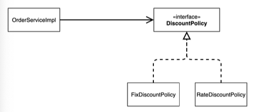
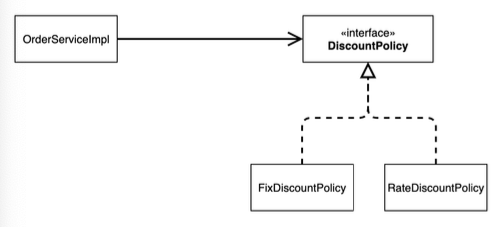
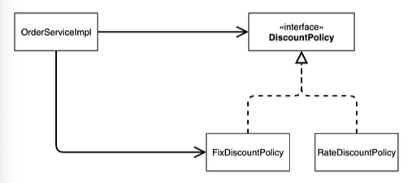
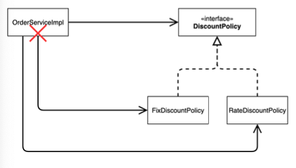
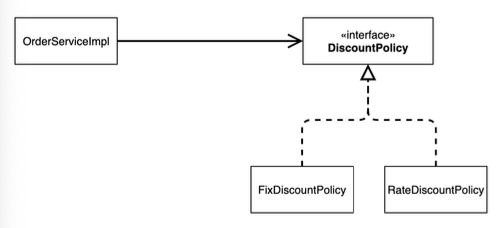
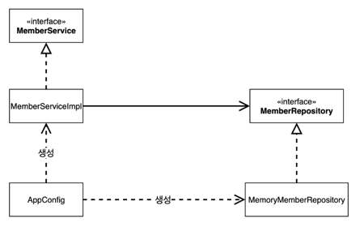
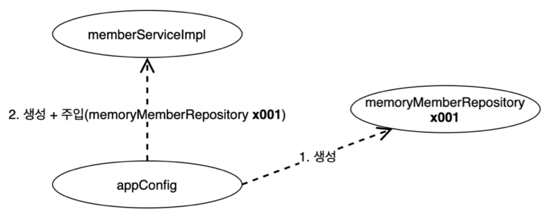

# 스프링 핵심 원리 이해2 - 객체 지향 원리 적용

## 새로운 할인 정책 개발

#### RateDiscountPolicy 추가



#### [RateDiscountPolicy 코드 추가](./src/main/java/hello/core/discount/RateDiscountPolicy.java)

```java
package hello.core.discount;

import hello.core.member.Grade;
import hello.core.member.Member;

public class RateDiscountPolicy implements DiscountPolicy{
    private int discountPercent = 10;

    @Override
    public int discount(Member member, int price) {
        if (member.getGrade() == Grade.VIP) {
            return price * discountPercent / 100;
        } else {
            return 0;
        }
    }
}
```

#### 테스트 작성

```java
package hello.core.discount;

import hello.core.member.Grade;
import hello.core.member.Member;
import org.junit.jupiter.api.DisplayName;
import org.junit.jupiter.api.Test;

import static org.assertj.core.api.Assertions.*;

class RateDiscountPolicyTest {
    RateDiscountPolicy discountPolicy = new RateDiscountPolicy();

    @Test
    @DisplayName("VIP는 10% 할인이 적용되어야 한다.")
    void vip_o() {
        Member member = new Member(1L, "memberVIP", Grade.VIP);
        int discount = discountPolicy.discount(member, 10000);
        assertThat(discount).isEqualTo(1000);
    }

    @Test
    @DisplayName("VIP가 아니면 할인이 적용되지 않아야 한다.")
    void vip_x() {
        Member member = new Member(2L, "memberBASIC", Grade.BASIC);
        int discount = discountPolicy.discount(member, 1000);
        assertThat(discount).isEqualTo(1000);
    }
}
```

## 새로운 할인 정책 적용과 문제점

#### 비율 할인 정책을 적용


할인 정책을 변경하려면 클라이언트인 `OrderServiceImpl` 코드를 고쳐야 한다.

```java
public class OrderServiceImpl implements OrderService { 
//    private final DiscountPolicy discountPolicy = new FixDiscountPolicy();
    private final DiscountPolicy discountPolicy = new RateDiscountPolicy();
}
```


#### 문제점

* 역할과 구현을 충실하게 분리했다.
* 다형성도 활용하고, 인터페이스와 구현 객체를 분리했다.
* OCP, DIP 같은 객체지향 설계 원칙을 준수했다.
  * 그렇지 않다.
* DIP: 주문서비스 클라이언트(`OrderServiceImpl`)는 `DiscountPolicy` 인터페이스에 의존하면서 DIP를 지킨것인가
  * 클래스 의존관계를 분석하면 추상뿐만 아니라 구체 클래스에도 의존하고 있다.
    * 추상 의존: `DiscountPolicy`
    * 구체 클래스: `FixDiscountPolicy`, `RateDiscountPolicy'
* OCP: 변경하지 않고 확장해야 한다,
  * 현재 코드는 기능을 확장해서 변경하면, 클라이언트 코드에 영향을 준다. 따라서 OCP를 위반했다.

#### 왜 클라이언트 코드를 변경해야 하는가?

#### 기대했던 의존관계



지금까지 단순히 `DiscountPolicy` 인터페이스만 의존한다고 생각했다.


#### 실제 의존관계



잘보면 클라이언트인 `OrderServiceImpl` 이 `DiscountPolicy` 인터페이스 뿐만 아니라 
`FixDiscountPolicy` 인 구체 클래스도 함께 의존하고 있다. 실제 코드를 보면 의존하고 있다 


DIP 위반

#### 정책 변경



> 중요!
> 
> `FixDiscountPolicy` 를 `RateDiscountPolicy` 로 변경하는 순간 `OrderServiceImpl` 의 소스 코드도 함께 변경해야 한다
> 
> OCP 위반


### 어떻게 문제를 해결하는 방법

* 클라이언트 코드인 `OrderServiceImpl` 은 `DiscountPolicy` 의 인터페이스 뿐만 아니라 구체 클래스도 함께 의존한다. 
* 그래서 구체 클래스를 변경할 때 클라이언트 코드도 함께 변경해야 한다. 
* DIP 위반 -> 추상에만 의존하도록 변경(인터페이스에만 의존)
* DIP를 위반하지 않도록 인터페이스에만 의존하도록 의존관계를 변경하면 된다.

### 인터페이스에만 의존하도록 설계를 변경



#### 인터페이스에만 의존하도록 코드 변경

```java
public class OrderServiceImpl implements OrderService {
    //private final DiscountPolicy discountPolicy = new RateDiscountPolicy();
    private DiscountPolicy discountPolicy;
}
```


* 인터페이스에만 의존하도록 설계와 코드를 변경했다. 
* 구현체가 없는데 코드를 실행하는 방법은? 
* 실제 실행을 해보면 NPE(null pointer exception)가 발생한다.


#### 해결방안

이 문제를 해결하려면 누군가가 클라이언트인 `OrderServiceImpl` 에 `DiscountPolicy` 의
구현 객체를 대신 생성하고 주입해주어야 한다.


## 관심사의 분리

### AppConfig

* 애플리케이션의 전체 동작 방식을 구성(config) 하기 위해, 구현 객체를 생성하고, 연결하는 책임을 가지는 별도의 설정 클래스

#### AppConfig

```java
package hello.core;

import hello.core.discount.FixDiscountPolicy;
import hello.core.member.MemberService;
import hello.core.member.MemberServiceImpl;
import hello.core.member.MemoryMemberRepository;
import hello.core.order.OrderService;
import hello.core.order.OrderServiceImpl;

public class AppConfig {

    public MemberService memberService(){
        return new MemberServiceImpl(new MemoryMemberRepository());
    }
    
    public OrderService orderService(){
        return new OrderServiceImpl(
                new MemoryMemberRepository(),
                new FixDiscountPolicy());
    }
}
```

* AppConfig는 애플리케이션의 실제 동작에 필요한 구현 객체를 생성한다.
  * `MemberServiceImpl` 
  * `MemoryMemberRepository`
  * `OrderServiceImpl`
  * `FixDiscountPolicy`

* AppConfig는 생성한 객체 인스턴스의 참조를 생성자를 통해서 주입해준다.
  * `MemberServiceImpl` -> `MemoryMemberRepository`
  * `OrderServiceImpl` -> `MemoryMemberRepository`, `FixDiscountPolicy` 

#### MemberServiceImpl - 생성자 주입

```java
package hello.core.member;

public class MemberServiceImpl implements MemberService{

    private final MemberRepository memberRepository;

    public MemberServiceImpl(MemberRepository memberRepository) {
        this.memberRepository = memberRepository;
    }

    @Override
    public void join(Member member) {
        memberRepository.save(member);
    }

    @Override
    public Member findMember(Long memberId) {
        return memberRepository.findById(memberId);
    }

}
```

* 설계 변경으로 `MemberServiceImpl`은 `MemoryMemberRepository`를 의존하지 않는다
* 단지 `MemberRepository` 인터페이스만 의존한다.
* `MemberServiceImpl`입장에서 생성자를 통해 어떤 구현 객체가 들어올지는 알 수 없다.
* `MemberSerivceImpl`의 생성자를 통해서 어떤 구현 객체를 주입할지는 오직 외부(`AppConfig`)에서 결정된다.
* `MemberServiceImpl`은 이제부터 의존관계에 대한 고민은 외부에 맡기고 실행에만 집중하면 된다.

#### 클래스 다이어그램




* 객체의 생성과 연결은 `AppConfig`가 담당한다.
* DIP 완성: `MemberServiceImpl`은 `MemberRepository`은 추상에만 의존한다. 이제 구체 클래스를 몰라도 된다.
* 관심사의 분리: 객체를 생성하고 연결하는 역할과 실행하는 역할이 명확히 분리되었다.

#### 회원 객체 인스턴스 다이어그램 



* `appConfig` 객체는 `memoryMemberRepository` 객체를 생성하고 그 참조값을 `memberServiceImpl`을 생성하면서 생성자로 전달한다.
* 클라이언트인 `memberServiceImpl` 입장에서 보면 의존관계를 마치 외부에서 주입해주는 것 같다고 해서 DI(Dependency Injection)
  우리말로 의존관계 주입 또는 의존성 주입이라 한다.

#### OrderServiceImpl - 생성자 주입

```java
package hello.core.order;

import hello.core.discount.DiscountPolicy;
import hello.core.discount.FixDiscountPolicy;
import hello.core.member.Member;
import hello.core.member.MemberRepository;
import hello.core.member.MemoryMemberRepository;

public class OrderServiceImpl implements OrderService{

    private final MemberRepository memberRepository;
    private final DiscountPolicy discountPolicy;

    public OrderServiceImpl(MemberRepository memberRepository, DiscountPolicy discountPolicy) {
        this.memberRepository = memberRepository;
        this.discountPolicy = discountPolicy;
    }

    @Override
    public Order createOrder(Long memberId, String itemName, int itemPrice) {
        Member member = memberRepository.findById(memberId);
        int discountPrice = discountPolicy.discount(member, itemPrice);

        return new Order(memberId, itemName, itemPrice, discountPrice);
    }
}
```

* 설계 변경으로 `OrderSerivceImpl`은 `FixDiscountPolicy`를 의존하지 않는다
* 단지 `DiscountPolicy` 인터페이스에만 의존한다.
* `OrderServiceImpl` 입장에서 생성자를 통해 어떤 구현 객체가 들어올지는 알 수 없다.
* `OrderServiceImpl`의 생성자를 통해서 어떤 구현 객체를 주입할지는 오직 외부 `AppConfig`에서 결정한다.
* `OrderServiceImpl`은 이제부터 실행에만 집중한다.
* `OrderServiceImpl`에는 `MemoryMemberRepository`, `FixDiscountPolicy` 객체의 의존관계가 주입된다.

### AppConfig 실행

#### 사용 클래스 - MemberApp

```java
package hello.core;

import hello.core.member.Grade;
import hello.core.member.Member;
import hello.core.member.MemberService;

public class MemberApp {

    public static void main(String[] args) {
        AppConfig appConfig = new AppConfig();
        MemberService memberService = appConfig.memberService();
        Member member = new Member(1L, "memberA", Grade.VIP);
        memberService.join(member);

        Member findMember = memberService.findMember(1L);
        System.out.println("member = " + member.getName());
        System.out.println("findMember = " + findMember.getName());
    }
}
```

#### 사용 클래스 - OrderApp

```java
package hello.core;

import hello.core.member.Grade;
import hello.core.member.Member;
import hello.core.member.MemberService;
import hello.core.order.Order;
import hello.core.order.OrderService;

public class OrderApp {
  public static void main(String[] args) {
    AppConfig appConfig = new AppConfig();
    MemberService memberService = appConfig.memberService();
    OrderService orderService = appConfig.orderService();

    long memberId = 1L;
    Member member = new Member(memberId, "memberA", Grade.VIP);
    memberService.join(member);

    Order order = orderService.createOrder(memberId, "itemA", 10000);
    System.out.println("order = " + order);
  }
}
```

#### 테스트 코드 오류 수정

```java
package hello.core.member;

import hello.core.AppConfig;
import org.junit.jupiter.api.BeforeEach;
import org.junit.jupiter.api.Test;

import static org.assertj.core.api.Assertions.assertThat;

class MemberServiceTest {

  MemberService memberService;

  @BeforeEach
  public void before() {
    AppConfig appConfig = new AppConfig();
    memberService = appConfig.memberService();
  }

  @Test
  void join() {
    Member member = new Member(1L, "memberA", Grade.VIP);

    memberService.join(member);
    Member findMember = memberService.findMember(1L);

    assertThat(member).isEqualTo(findMember);
  }
}
```


```java
package hello.core.order;

import hello.core.AppConfig;
import hello.core.member.Grade;
import hello.core.member.Member;
import hello.core.member.MemberService;
import hello.core.member.MemberServiceImpl;
import org.junit.jupiter.api.BeforeEach;
import org.junit.jupiter.api.Test;

class OrderServiceTest {
    MemberService memberService;
    OrderService orderService;
    
    @BeforeEach
    public void before(){
        AppConfig appConfig = new AppConfig();
        memberService = appConfig.memberService();
        orderService = appConfig.orderService();
    }

    @Test
    void createOrder() {
        long memberId = 1L;
        Member member = new Member(memberId, "memberA", Grade.VIP);
        memberService.join(member);

        Order order = orderService.createOrder(memberId, "itemA", 10000);
        org.assertj.core.api.Assertions.assertThat(order.getDiscountPrice()).isEqualTo(1000);
    }
}
```

