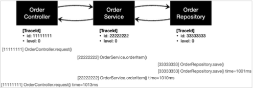
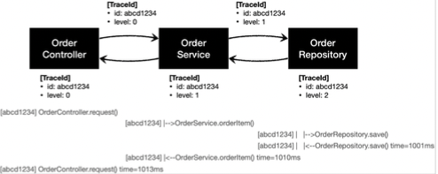

# 1. 예제 만들기

## 예제 프로젝트 만들기 - V0

#### OrderRepositoryV0

```java
package hello.advanced.app.v0;

import lombok.RequiredArgsConstructor;
import org.springframework.stereotype.Repository;

@Repository
@RequiredArgsConstructor
public class OrderRepositoryV0 {

    public void save(String itemId){
        if(itemId.equals("ex")){
            throw new IllegalArgumentException("예외 발생");
        }
        sleep(1000);
    }

    private void sleep(int millis) {
        try {
            Thread.sleep(millis);
        } catch (InterruptedException e) {
            e.printStackTrace();
        }
    }
}
```

#### OrderServiceV0

```java
package hello.advanced.app.v0;

import lombok.RequiredArgsConstructor;
import org.springframework.stereotype.Service;

@Service
@RequiredArgsConstructor
public class OrderServiceV0 {

    private final OrderRepositoryV0 orderRepository;

    public void orderItem(String itemId){
        orderRepository.save(itemId);
    }


}
```

#### OrderControllerV0

```java
package hello.advanced.app.v0;

import lombok.RequiredArgsConstructor;
import org.springframework.web.bind.annotation.GetMapping;
import org.springframework.web.bind.annotation.RestController;

@RestController
@RequiredArgsConstructor
public class OrderControllerV0 {

    private final OrderServiceV0 orderService;

    @GetMapping("/v0/request")
    public String request(String itemId){
        orderService.orderItem(itemId);
        return "ok";
    }
}
```

* `@RestController` : 컴포넌트 스캔과 스프링 Rest 컨트롤러로 인식된다.
* `/v0/request` 메서드는 HTTP 파라미터로 `itemId` 를 받을 수 있다.

### 로그 추적기 - 요구사항 분석

#### 요구사항

* 모든 PUBLIC 메서드의 호출과 응답 정보를 로그로 출력 
* 애플리케이션의 흐름을 변경하면 안됨
  * 로그를 남긴다고 해서 비즈니스 로직의 동작에 영향을 주면 안됨 
* 메서드 호출에 걸린 시간
* 정상 흐름과 예외 흐름 구분
  * 예외 발생시 예외 정보가 남아야 함
* 메서드 호출의 깊이 표현 
* HTTP 요청을 구분
  * HTTP 요청 단위로 특정 ID를 남겨서 어떤 HTTP 요청에서 시작된 것인지 명확하게 구분이 가능해야 함
  * 트랜잭션 ID (DB 트랜잭션X), 여기서는 하나의 HTTP 요청이 시작해서 끝날 때 까지를 하나의 트랜잭션이라 함

#### 예시

```text
정상 요청
[796bccd9] OrderController.request()
[796bccd9] |-->OrderService.orderItem()
[796bccd9] |   |-->OrderRepository.save()
[796bccd9] |   |<--OrderRepository.save() time=1004ms
[796bccd9] |<--OrderService.orderItem() time=1014ms
[796bccd9] OrderController.request() time=1016ms

예외 발생
[b7119f27] OrderController.request()
[b7119f27] |-->OrderService.orderItem()
[b7119f27] | |-->OrderRepository.save() 
[b7119f27] | |<X-OrderRepository.save() time=0ms ex=java.lang.IllegalStateException: 예외 발생! 
[b7119f27] |<X-OrderService.orderItem() time=10ms ex=java.lang.IllegalStateException: 예외 발생! 
[b7119f27] OrderController.request() time=11ms ex=java.lang.IllegalStateException: 예외 발생!
```

> 참고
> 
> 모니터링 툴을 도입하면 많은 부분이 해결되지만, 지금은 학습이 목적


### 로그 추적기 V1 - 프로토타입 개발

애플리케이션의 모든 로직에 직접 로그를 남겨도 되지만, 그것보다는 더 효율적인 개발 방법이 필요하다.


특히 트랜잭션ID와 깊이를 표현하는 방법은 기존 정보를 이어 받아야 하기 때문에 
단순히 로그만 남긴다고 해결할 수 있는 것은 아니다.


먼저 로그 추적기를 위한 기반 데이터를 가지고 있는 TraceId , TraceStatus 클래스를 만든다.

#### TraceId

```java
package hello.advanced.trace;

import java.util.UUID;

public class TraceId {

    private String id;
    private int level;

    public TraceId(){
        this.id = createId();
        this.level = 0;
    }

    private TraceId(String id, int level){
        this.id = id;
        this.level = level;
    }

    private String createId() {
        return UUID.randomUUID().toString().substring(0, 8);
    }

    public TraceId createNextId(){
        return new TraceId(id, level + 1);
    }

    public TraceId createPreviousId() {
        return new TraceId(id, level - 1);
    }

    public boolean isFirstLevel(){
        return level == 0;
    }

    public String getId() {
        return id;
    }

    public int getLevel() {
        return level;
    }
}
```

#### TraceId 클래스
로그 추적기는 트랜잭션ID와 깊이를 표현하는 방법이 필요하다.
여기서는 트랜잭션ID와 깊이를 표현하는 level을 묶어서 `TraceId` 라는 개념을 만들었다. 
`TraceId` 는 단순히 `id` (트랜잭션ID)와 `level` 정보를 함께 가지고 있다.

```
[796bccd9] OrderController.request() //트랜잭션ID:796bccd9, level:0 
[796bccd9] |-->OrderService.orderItem() //트랜잭션ID:796bccd9, level:1 
[796bccd9] | |-->OrderRepository.save()//트랜잭션ID:796bccd9, level:2
```

#### UUID

`TraceId` 를 처음 생성하면 `createId()` 를 사용해서 UUID를 만들어낸다. 
UUID가 너무 길어서 여기서는 앞 8자리만 사용한다. 이 정도면 로그를 충분히 구분할 수 있다. 
여기서는 이렇게 만들어진 값을 트랜잭션ID 로 사용한다.

```
ab99e16f-3cde-4d24-8241-256108c203a2 //생성된 UUID 
ab99e16f //앞 8자리만 사용
```

#### createNextId()

다음 `TraceId` 를 만든다. 예제 로그를 잘 보면 깊이가 증가해도 트랜잭션ID는 같다. 
대신에 깊이가 하나 증가한다.

실행 코드: `new TraceId(id, level + 1)`

```
[796bccd9] OrderController.request()
[796bccd9] |-->OrderService.orderItem() //트랜잭션ID가 같다. 깊이는 하나 증가한다.
```

따라서 `createNextId()` 를 사용해서 현재 `TraceId` 를 기반으로 
다음 `TraceId` 를 만들면 `id` 는 기존과 같고, `level` 은 하나 증가한다.


#### createPreviousId()


`createNextId()` 의 반대 역할을 한다.
`id` 는 기존과 같고, `level` 은 하나 감소한다.


#### isFirstLevel()
 
첫 번째 레벨 여부를 편리하게 확인할 수 있는 메서드

#### TraceStatus

```java
package hello.advanced.trace;

public class TraceStatus {

    private TraceId traceId;
    private Long startTimeMs;
    private String message;

    public TraceStatus(TraceId traceId, Long startTimeMs, String message) {
        this.traceId = traceId;
        this.startTimeMs = startTimeMs;
        this.message = message;
    }

    public TraceId getTraceId() {
        return traceId;
    }

    public Long getStartTimeMs() {
        return startTimeMs;
    }

    public String getMessage() {
        return message;
    }
}
```


`TraceStatus` 클래스: 로그의 상태 정보를 나타낸다.


로그를 시작하면 끝이 있어야 한다.

```
[796bccd9] OrderController.request() //로그 시작
[796bccd9] OrderController.request() time=1016ms //로그 종료
```


`TraceStatus` 는 로그를 시작할 때의 상태 정보를 가지고 있다. 이 상태 정보는 로그를 종료할 때 사용된다.


* `traceId` : 내부에 트랜잭션ID와 level을 가지고 있다.
* `startTimeMs` : 로그 시작시간이다. 로그 종료시 이 시작 시간을 기준으로 시작~종료까지 전체 수행 시간을 구할 수 있다.
* `message` : 시작시 사용한 메시지이다. 이후 로그 종료시에도 이 메시지를 사용해서 출력한다. 


`TraceId` , `TraceStatus` 를 사용해서 실제 로그를 생성하고, 처리하는 기능을 개발해보자.


#### HelloTraceV1

```java
package hello.advanced.trace.hellotrace;

import hello.advanced.trace.TraceId;
import hello.advanced.trace.TraceStatus;
import lombok.extern.slf4j.Slf4j;
import org.springframework.stereotype.Component;

@Slf4j
@Component
public class HelloTraceV1 {

    private static final String START_PREFIX = "-->";
    private static final String COMPLETE_PREFIX = "<--";
    private static final String EX_PREFIX = "<x-";

    public TraceStatus begin(String message){
        TraceId traceId = new TraceId();
        long startTimeMs = System.currentTimeMillis();
        //로그 출력
        log.info("[{}] {}{}",traceId.getId(), addSpace(START_PREFIX, traceId.getLevel()), message);
        return new TraceStatus(traceId, startTimeMs, message);
    }

    public void end(TraceStatus status){
        complete(status, null);
    }

    public void exception(TraceStatus status, Exception e){
        complete(status, e);
    }
    
    private void complete(TraceStatus status, Exception e){
        Long stopTimeMs = System.currentTimeMillis();
        long resultTimeMs = stopTimeMs - status.getStartTimeMs();
        TraceId traceId = status.getTraceId();
        if(e == null){
            log.info("[{}] {}{} time={}ms",
                    traceId.getId(),
                    addSpace(COMPLETE_PREFIX, traceId.getLevel()),
                    status.getMessage(), resultTimeMs);
        } else {
            log.info("[{}] {}{} time={}ms ex={}",
                    traceId.getId(),
                    addSpace(EX_PREFIX, traceId.getLevel()),
                    status.getMessage(),
                    resultTimeMs,
                    e.toString());
        }
    }

    private static String addSpace(String prefix, int level){
        StringBuilder sb = new StringBuilder();
        for (int i = 0; i < level; i++) {
            sb.append((i == level - 1) ? "|" + prefix : "|   ");
        }
        return sb.toString();
    }
}
```


`HelloTraceV1` 을 사용해서 실제 로그를 시작하고 종료할 수 있다. 그리고 로그를 출력하고 실행시간도 측정할 수 있다.

* `@Component` : 싱글톤으로 사용하기 위해 스프링 빈으로 등록한다. 컴포넌트 스캔의 대상이 된다.

#### 공개 메서드 
로그 추적기에서 사용되는 공개 메서드는 다음 3가지 이다.


* `TraceStatus begin(String message)`
  * 로그를 시작한다.
  * 로그 메시지를 파라미터로 받아서 시작 로그를 출력한다. 
  * 응답 결과로 현재 로그의 상태인 `TraceStatus` 를 반환한다.
* `void end(TraceStatus status)`
  * 로그를 정상 종료한다.
  * 파라미터로 시작 로그의 상태( `TraceStatus` )를 전달 받는다. 이 값을 활용해서 실행 시간을 계산하고, 종료시에도 시작할 때와 동일한 로그 메시지를 출력할 수 있다.
  * 정상 흐름에서 호출한다.
* `void exception(TraceStatus status, Exception e)`
  * 로그를 예외 상황으로 종료한다.
  * `TraceStatus` , `Exception` 정보를 함께 전달 받아서 실행시간, 예외 정보를 포함한 결과 로그를 출력한다.
  * 예외가 발생했을 때 호출한다.


#### 비공개 메서드

* `complete(TraceStatus status, Exception e)`
  * `end()` , `exception()` , 의 요청 흐름을 한곳에서 편리하게 처리한다. 실행 시간을 측정하고 로그를 남긴다.

* `String addSpace(String prefix, int level)` : 다음과 같은 결과를 출력한다.
  * prefix: `-->`
    * level 0:
    * level 1: `|-->`
    * level 2: `| |-->`
  * prefix: `<--`
    * level 0:
    * level 1: `|<--`
    * level 2: `| |<--`
  * prefix: `<X-`
    * level 0:
    * level 1: `|<X-`
    * level 2: `| |<X-`


참고로 `HelloTraceV1` 는 아직 모든 요구사항을 만족하지는 못한다. 

#### HelloTraceV1Test

```java
package hello.advanced.trace.hellotrace;

import hello.advanced.trace.TraceStatus;
import org.junit.jupiter.api.Test;

class HelloTraceV1Test {

    @Test
    public void begin_end() throws Exception {
        HelloTraceV1 trace = new HelloTraceV1();
        TraceStatus status = trace.begin("hello");
        trace.end(status);
    }

    @Test
    public void begin_exception() throws Exception {
        HelloTraceV1 trace = new HelloTraceV1();
        TraceStatus status = trace.begin("hello");
        trace.exception(status, new IllegalArgumentException());
    }
}
```

테스트 코드를 보면 로그 추적기를 어떻게 실행해야 하는지, 그리고 어떻게 동작하는지 이해가 될 것이다.

#### begin_end() - 실행 로그

```text
[41bbb3b7] hello
[41bbb3b7] hello time=5ms
```

#### begin_exception() - 실행 로그

```text
[898a3def] hello
[898a3def] hello time=13ms ex=java.lang.IllegalStateException
```


### 로그 추적기 V1 - 적용

#### OrderControllerV1

```java
package hello.advanced.app.v1;

import hello.advanced.trace.TraceStatus;
import hello.advanced.trace.hellotrace.HelloTraceV1;
import lombok.RequiredArgsConstructor;
import org.springframework.web.bind.annotation.GetMapping;
import org.springframework.web.bind.annotation.RestController;

@RestController
@RequiredArgsConstructor
public class OrderControllerV1 {

    private final OrderServiceV1 orderService;
    private final HelloTraceV1 trace;


    @GetMapping("/v1/request")
    public String request(String itemId){


        TraceStatus status = null;
        try {
            status = trace.begin("OrderController.request()");
            orderService.orderItem(itemId);
            trace.end(status);
            return "ok";
        } catch (Exception e){
            trace.exception(status, e);
            throw e;
        }
    }
}
```

* `HelloTraceV1 trace` : `HelloTraceV1` 을 주입 받는다. 참고로 `HelloTraceV1` 은 `@Component` 
  애노테이션을 가지고 있기 때문에 컴포넌트 스캔의 대상이 된다. 따라서 자동으로 스프링 빈으로 등록된다.

* `trace.begin("OrderController.request()")` : 로그를 시작할 때 메시지 이름으로 컨트롤러 이름 + 메서드 이름을 주었다. 
  이렇게 하면 어떤 컨트롤러와 메서드가 호출되었는지 로그로 편리하게 확인할 수 있다. 물론 수작업이다.

* 단순하게 `trace.begin()` , `trace.end()` 코드 두 줄만 적용하면 될 줄 알았지만, 실상은 그렇지 않다. 
  `trace.exception()` 으로 예외까지 처리해야 하므로 지저분한 `try` , `catch` 코드가 추가된다.

* `begin()` 의 결과 값으로 받은 `TraceStatus status` 값을 `end()` , `exception()` 에 넘겨야 한다. 
  결국 `try` , `catch` 블록 모두에 이 값을 넘겨야한다. 따라서 `try` 상위에 `TraceStatus status` 코드를 선언해야 한다. 
  만약 `try` 안에서 `TraceStatus status` 를 선언하면 `try` 블록안에서만 해당 변수가 유효하기 때문에 `catch` 블록에 넘길 수 없다. 
  따라서 컴파일 오류가 발생한다.

* `throw e` : 예외를 꼭 다시 던져주어야 한다. 그렇지 않으면 여기서 예외를 먹어버리고, 이후에 정상 흐름으로 동작한다. 
  로그는 애플리케이션에 흐름에 영향을 주면 안된다. 로그 때문에 예외가 사라지면 안된다.


#### OrderServiceV1

```java
package hello.advanced.app.v1;

import hello.advanced.trace.TraceStatus;
import hello.advanced.trace.hellotrace.HelloTraceV1;
import lombok.RequiredArgsConstructor;
import org.springframework.stereotype.Service;

@Service
@RequiredArgsConstructor
public class OrderServiceV1 {

    private final OrderRepositoryV1 orderRepository;
    private final HelloTraceV1 trace;

    public void orderItem(String itemId){

        TraceStatus status = null;
        try {
            status = trace.begin("OrderService.request()");
            orderRepository.save(itemId);
            trace.end(status);
        } catch (Exception e){
            trace.exception(status, e);
            throw e;
        }
    }
}
```

#### OrderRepositoryV1

```java
package hello.advanced.app.v1;

import hello.advanced.trace.TraceStatus;
import hello.advanced.trace.hellotrace.HelloTraceV1;
import lombok.RequiredArgsConstructor;
import org.springframework.stereotype.Repository;

@Repository
@RequiredArgsConstructor
public class OrderRepositoryV1 {

    private final HelloTraceV1 trace;

    public void save(String itemId){

        TraceStatus status = null;
        try {
            status = trace.begin("OrderRepository.request()");
            if(itemId.equals("ex")){
                throw new IllegalArgumentException("예외 발생");
            }
            sleep(1000);
            trace.end(status);
        } catch (Exception e){
            trace.exception(status, e);
            throw e;
        }

    }

    private void sleep(int millis) {
        try {
            Thread.sleep(millis);
        } catch (InterruptedException e) {
            e.printStackTrace();
        }
    }
}
```

#### 정상 실행 로그

```
[11111111] OrderController.request()
[22222222] OrderService.orderItem()
[33333333] OrderRepository.save()
[33333333] OrderRepository.save() time=1000ms
[22222222] OrderService.orderItem() time=1001ms
[11111111] OrderController.request() time=1001ms
```




### 로그 추적기 V2 - 파라미터로 동기화 개발


#### HelloTraceV2

```java
package hello.advanced.trace.hellotrace;

import hello.advanced.trace.TraceId;
import hello.advanced.trace.TraceStatus;
import lombok.extern.slf4j.Slf4j;
import org.springframework.stereotype.Component;

@Slf4j
@Component
public class HelloTraceV2 {

    private static final String START_PREFIX = "-->";
    private static final String COMPLETE_PREFIX = "<--";
    private static final String EX_PREFIX = "<x-";

    public TraceStatus begin(String message){
        TraceId traceId = new TraceId();
        long startTimeMs = System.currentTimeMillis();
        //로그 출력
        log.info("[{}] {}{}",traceId.getId(), addSpace(START_PREFIX, traceId.getLevel()), message);
        return new TraceStatus(traceId, startTimeMs, message);
    }

    //V2에서 추가
    public TraceStatus beginSync(TraceId beforeTraceId, String message){
        TraceId nextId = beforeTraceId.createNextId();
        long startTimeMs = System.currentTimeMillis();
        //로그 출력
        log.info("[{}] {}{}",nextId.getId(), addSpace(START_PREFIX, nextId.getLevel()), message);
        return new TraceStatus(nextId, startTimeMs, message);
    }

    public void end(TraceStatus status){
        complete(status, null);
    }

    public void exception(TraceStatus status, Exception e){
        complete(status, e);
    }
    
    private void complete(TraceStatus status, Exception e){
        Long stopTimeMs = System.currentTimeMillis();
        long resultTimeMs = stopTimeMs - status.getStartTimeMs();
        TraceId traceId = status.getTraceId();
        if(e == null){
            log.info("[{}] {}{} time={}ms",
                    traceId.getId(),
                    addSpace(COMPLETE_PREFIX, traceId.getLevel()),
                    status.getMessage(), resultTimeMs);
        } else {
            log.info("[{}] {}{} time={}ms ex={}",
                    traceId.getId(),
                    addSpace(EX_PREFIX, traceId.getLevel()),
                    status.getMessage(),
                    resultTimeMs,
                    e.toString());
        }
    }

    private static String addSpace(String prefix, int level){
        StringBuilder sb = new StringBuilder();
        for (int i = 0; i < level; i++) {
            sb.append((i == level - 1) ? "|" + prefix : "|   ");
        }
        return sb.toString();
    }
}
```

`HelloTraceV2` 는 기존 코드인 `HelloTraceV2` 와 같고, `beginSync(..)` 가 추가되었다.

#### beginSync(..)

* 기존 `TraceId` 에서 `createNextId()` 를 통해 다음 ID를 구한다. 
* `createNextId()` 의 `TraceId` 생성 로직은 다음과 같다.
* 트랜잭션ID는 기존과 같이 유지한다.
* 깊이를 표현하는 Level은 하나 증가한다. (`0 -> 1`)


### 로그 추적기 V2 - 적용

#### V2 적용

메서드 호출의 깊이를 표현하고, HTTP 요청도 구분해야 한다.
이렇게 하려면 처음 로그를 남기는 `OrderController.request()` 에서 로그를 남길 때 어떤 깊이와 
어떤 트랜잭션 ID를 사용했는지 다음 차례인 `OrderService.orderItem()` 에서 로그를 남기는 시점에 알아야한다.
결국 현재 로그의 상태 정보인 `트랜잭션ID` 와 `level` 이 다음으로 전달되어야 한다.
이 정보는 `TraceStatus.traceId` 에 담겨있다. 따라서 `traceId` 를 컨트롤러에서 서비스를 호출할 때 넘겨주면 된다.





#### OrderControllerV2

```java
package hello.advanced.app.v2;

import hello.advanced.trace.TraceStatus;
import hello.advanced.trace.hellotrace.HelloTraceV2;
import lombok.RequiredArgsConstructor;
import org.springframework.web.bind.annotation.GetMapping;
import org.springframework.web.bind.annotation.RestController;

@RestController
@RequiredArgsConstructor
public class OrderControllerV2 {

    private final OrderServiceV2 orderService;
    private final HelloTraceV2 trace;


    @GetMapping("/v2/request")
    public String request(String itemId){


        TraceStatus status = null;
        try {
            status = trace.begin("OrderController.request()");
            orderService.orderItem(status.getTraceId(), itemId);
            trace.end(status);
            return "ok";
        } catch (Exception e){
            trace.exception(status, e);
            throw e;
        }
    }
}
```

* `TraceStatus status = trace.begin()` 에서 반환 받은 TraceStatus 에는 `트랜잭션ID` 와 `level` 정보가 있는 TraceId 가 있다.
* `orderService.orderItem()` 을 호출할 때 `TraceId` 를 파라미터로 전달한다.
* `TraceId` 를 파라미터로 전달하기 위해 `OrderServiceV2.orderItem()` 의 파라미터에 `TraceId` 를 추가해야 한다.


#### OrderServiceV2

```java
package hello.advanced.app.v2;

import hello.advanced.trace.TraceId;
import hello.advanced.trace.TraceStatus;
import hello.advanced.trace.hellotrace.HelloTraceV2;
import lombok.RequiredArgsConstructor;
import org.springframework.stereotype.Service;

@Service
@RequiredArgsConstructor
public class OrderServiceV2 {

    private final OrderRepositoryV2 orderRepository;
    private final HelloTraceV2 trace;

    public void orderItem(TraceId traceId, String itemId){

        TraceStatus status = null;
        try {
            status = trace.beginSync(traceId, "OrderService.request()");
            orderRepository.save(status.getTraceId(), itemId);
            trace.end(status);
        } catch (Exception e){
            trace.exception(status, e);
            throw e;
        }
    }
}
```

* `orderItem()` 은 파라미터로 전달 받은 `traceId` 를 사용해서 `trace.beginSync()` 를 실행한다.
* `beginSync()` 는 내부에서 다음 `traceId` 를 생성하면서 트랜잭션ID는 유지하고 `level` 은 하나 증가시킨다.
* `beginSync()` 가 반환한 새로운 `TraceStatus` 를 `orderRepository.save()` 를 호출하면서 파라미터로 전달한다.
* `TraceId` 를 파라미터로 전달하기 위해 `orderRepository.save()` 의 파라미터에 `TraceId` 를 추가해야 한다.


#### OrderRepositoryV2

```java
package hello.advanced.app.v2;

import hello.advanced.trace.TraceId;
import hello.advanced.trace.TraceStatus;
import hello.advanced.trace.hellotrace.HelloTraceV2;
import lombok.RequiredArgsConstructor;
import org.springframework.stereotype.Repository;

@Repository
@RequiredArgsConstructor
public class OrderRepositoryV2 {

    private final HelloTraceV2 trace;

    public void save(TraceId traceId, String itemId){

        TraceStatus status = null;
        try {
            status = trace.beginSync(traceId, "OrderRepository.request()");
            if(itemId.equals("ex")){
                throw new IllegalArgumentException("예외 발생");
            }
            sleep(1000);
            trace.end(status);
        } catch (Exception e){
            trace.exception(status, e);
            throw e;
        }

    }

    private void sleep(int millis) {
        try {
            Thread.sleep(millis);
        } catch (InterruptedException e) {
            e.printStackTrace();
        }
    }
}
```

* `save()` 는 파라미터로 전달 받은 `traceId` 를 사용해서 `trace.beginSync()` 를 실행한다.
* `beginSync()` 는 내부에서 다음 `traceId` 를 생성하면서 트랜잭션ID는 유지하고 `level` 은 하나 증가시킨다.
* `beginSync()` 는 이렇게 갱신된 `traceId` 로 새로운 `TraceStatus` 를 반환한다. 
* `trace.end(status)` 를 호출하면서 반환된 `TraceStatus` 를 전달한다.


## 2. 쓰레드 로컬 - ThreadLocal


#### 필드 동기화 - 개발

#### LogTrace 인터페이스

```java
package hello.advanced.trace.logtrace;

import hello.advanced.trace.TraceStatus;

public interface LogTrace {

    TraceStatus begin(String message);

    void end(TraceStatus status);

    void exception(TraceStatus status, Exception e);
}
```


`LogTrace` 인터페이스에는 로그 추적기를 위한 최소한의 기능인 `begin()` , `end()` , `exception()` 를 정의했다.
이제 파라미터를 넘기지 않고 TraceId 를 동기화 할 수 있는 FieldLogTrace 구현체를 만들어보자.


#### FieldLogTrace

```java
package hello.advanced.trace.logtrace;

import hello.advanced.trace.TraceId;
import hello.advanced.trace.TraceStatus;
import lombok.extern.slf4j.Slf4j;

@Slf4j
public class FieldLogTrace implements LogTrace{

    private static final String START_PREFIX = "-->";
    private static final String COMPLETE_PREFIX = "<--";
    private static final String EX_PREFIX = "<X-";

    private TraceId traceIdHolder; // traceId 동기화, 동시성 이슈 발생

    @Override
    public TraceStatus begin(String message) {
        syncTraceId();
        TraceId traceId = traceIdHolder;
        long startTimeMs = System.currentTimeMillis();
        //로그 출력
        log.info("[{}] {}{}",traceId.getId(), addSpace(START_PREFIX, traceId.getLevel()), message);
        return new TraceStatus(traceId, startTimeMs, message);
    }

    private void syncTraceId(){
        if(traceIdHolder == null){
            traceIdHolder = new TraceId();
        } else {
            traceIdHolder = traceIdHolder.createNextId();
        }
    }

    @Override
    public void end(TraceStatus status) {
        complete(status, null);
    }

    @Override
    public void exception(TraceStatus status, Exception e) {
        complete(status, e);
    }

    private static String addSpace(String prefix, int level){
        StringBuilder sb = new StringBuilder();
        for (int i = 0; i < level; i++) {
            sb.append((i == level - 1) ? "|" + prefix : "|   ");
        }
        return sb.toString();
    }

    private void complete(TraceStatus status, Exception e){
        Long stopTimeMs = System.currentTimeMillis();
        long resultTimeMs = stopTimeMs - status.getStartTimeMs();
        TraceId traceId = status.getTraceId();
        if(e == null){
            log.info("[{}] {}{} time={}ms",
                    traceId.getId(),
                    addSpace(COMPLETE_PREFIX, traceId.getLevel()),
                    status.getMessage(), resultTimeMs);
        } else {
            log.info("[{}] {}{} time={}ms ex={}",
                    traceId.getId(),
                    addSpace(EX_PREFIX, traceId.getLevel()),
                    status.getMessage(),
                    resultTimeMs,
                    e.toString());
        }
        releaseTraceId();
    }

    private void releaseTraceId() {
        if(traceIdHolder.isFirstLevel()){
            traceIdHolder = null; // destory;
        } else {
            traceIdHolder = traceIdHolder.createPreviousId();
        }
    }
}
```

`FieldLogTrace` 는 기존에 만들었던 `HelloTraceV2` 와 거의 같은 기능을 한다.
`TraceId` 를 동기화 하는 부분만 파라미터를 사용하는 것에서 `TraceId traceIdHolder` 필드를 사용하도록 변경되었다.
이제 직전 로그의 `TraceId` 는 파라미터로 전달되는 것이 아니라 `FieldLogTrace` 의 필드인 `traceIdHolder` 에 저장된다.


여기서 중요한 부분은 로그를 시작할 때 호출하는 `syncTraceId()` 와 로그를 종료할 때 호출하는 `releaseTraceId()` 이다.

* `syncTraceId()`
  * `TraceId` 를 새로 만들거나 앞선 로그의 `TraceId` 를 참고해서 동기화하고, `level` 도 증가한다.
  * 최초 호출이면 `TraceId` 를 새로 만든다.
  * 직전 로그가 있으면 해당 로그의 `TraceId` 를 참고해서 동기화하고, `level` 도 하나 증가한다. 
  * 결과를 `traceIdHolder` 에 보관한다.

* `releaseTraceId()`
  * 메서드를 추가로 호출할 때는 `level` 이 하나 증가해야 하지만, 메서드 호출이 끝나면 level 이 하나 감소해야 한다.
  * `releaseTraceId()` 는 `level` 을 하나 감소한다.
  * 만약 최초 호출( `level==0` )이면 내부에서 관리하는 traceId 를 제거한다.


```

[c80f5dbb] OrderController.request() //syncTraceId(): 최초 호출 level=0 
[c80f5dbb] |-->OrderService.orderItem() //syncTraceId(): 직전 로그 있음 level=1 증가
[c80f5dbb] | |-->OrderRepository.save() //syncTraceId(): 직전 로그 있음 level=2 증가
[c80f5dbb] | |<--OrderRepository.save() time=1005ms //releaseTraceId(): level=2->1 감소
[c80f5dbb] |<--OrderService.orderItem() time=1014ms level=1->0 감소
[c80f5dbb] OrderController.request() time=1017ms level==0, traceId 제거
```

### 필드 동기화 - 적용

#### LogTrace 스프링 빈 등록

`FieldLogTrace` 를 수동으로 스프링 빈으로 등록하자. 수동으로 등록하면 향후 구현체를 편리하게 변경할 수 있다는 장점이 있다.

#### LogTraceConfig

```java
package hello.advanced;

import hello.advanced.trace.logtrace.FieldLogTrace;
import hello.advanced.trace.logtrace.LogTrace;
import org.springframework.context.annotation.Bean;
import org.springframework.context.annotation.Configuration;

@Configuration
public class LogTraceConfig {

    @Bean
    public LogTrace logTrace(){
        return new FieldLogTrace();
    }
}
```

#### OrderControllerV3

```java
package hello.advanced.app.v3;

import hello.advanced.trace.TraceStatus;
import hello.advanced.trace.logtrace.LogTrace;
import lombok.RequiredArgsConstructor;
import org.springframework.web.bind.annotation.GetMapping;
import org.springframework.web.bind.annotation.RestController;

@RestController
@RequiredArgsConstructor
public class OrderControllerV3 {

    private final OrderServiceV3 orderService;
    private final LogTrace trace;


    @GetMapping("/v3/request")
    public String request(String itemId){


        TraceStatus status = null;
        try {
            status = trace.begin("OrderController.request()");
            orderService.orderItem(itemId);
            trace.end(status);
            return "ok";
        } catch (Exception e){
            trace.exception(status, e);
            throw e;
        }
    }
}
```

#### OrderServiceV3

```java
package hello.advanced.app.v3;

import hello.advanced.trace.TraceStatus;
import hello.advanced.trace.logtrace.LogTrace;
import lombok.RequiredArgsConstructor;
import org.springframework.stereotype.Service;

@Service
@RequiredArgsConstructor
public class OrderServiceV3 {

    private final OrderRepositoryV3 orderRepository;
    private final LogTrace trace;

    public void orderItem(String itemId){

        TraceStatus status = null;
        try {
            status = trace.begin("OrderService.request()");
            orderRepository.save(itemId);
            trace.end(status);
        } catch (Exception e){
            trace.exception(status, e);
            throw e;
        }
    }
}
```

#### OrderRepositoryV3

```java
package hello.advanced.app.v3;

import hello.advanced.trace.TraceStatus;
import hello.advanced.trace.logtrace.LogTrace;
import lombok.RequiredArgsConstructor;
import org.springframework.stereotype.Repository;

@Repository
@RequiredArgsConstructor
public class OrderRepositoryV3 {

    private final LogTrace trace;

    public void save(String itemId){

        TraceStatus status = null;
        try {
            status = trace.begin("OrderRepository.request()");
            if(itemId.equals("ex")){
                throw new IllegalArgumentException("예외 발생");
            }
            sleep(1000);
            trace.end(status);
        } catch (Exception e){
            trace.exception(status, e);
            throw e;
        }

    }

    private void sleep(int millis) {
        try {
            Thread.sleep(millis);
        } catch (InterruptedException e) {
            e.printStackTrace();
        }
    }
}
```

