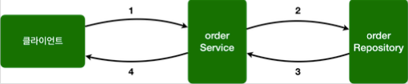
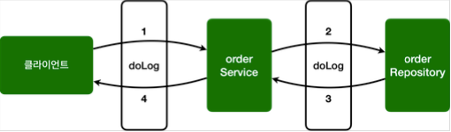
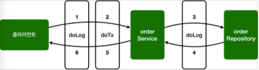
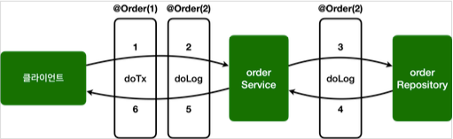

# 스프링 AOP 구현

* [스프링 AOP 구현1](#스프링-AOP-구현1)
* [스프링 AOP 구현2 - 포인트컷 분리](#스프링-AOP-구현2---포인트컷-분리)
* [스프링 AOP 구현3 - 어드바이스 추가](#스프링-AOP-구현3---어드바이스-추가)
* [스프링 AOP 구현4 - 포인트컷 참조](#스프링-AOP-구현4---포인트컷-참조)
* [스프링 AOP 구현5 - 어드바이스 순서](#스프링-AOP-구현5---어드바이스-순서)

#### build.gradle

```groovy
plugins {
    id 'org.springframework.boot' version '2.7.2'
    id 'io.spring.dependency-management' version '1.0.12.RELEASE'
    id 'java'
}

group = 'hello'
version = '0.0.1-SNAPSHOT'
sourceCompatibility = '11'

configurations {
    compileOnly {
        extendsFrom annotationProcessor
    }
}

repositories {
    mavenCentral()
}

dependencies {
    implementation 'org.springframework.boot:spring-boot-starter'
    implementation 'org.springframework.boot:spring-boot-starter-aop'

    compileOnly 'org.projectlombok:lombok'
    annotationProcessor 'org.projectlombok:lombok'
    testImplementation 'org.springframework.boot:spring-boot-starter-test'

    testCompileOnly 'org.projectlombok:lombok'
    testAnnotationProcessor 'org.projectlombok:lombok'
}

tasks.named('test') {
    useJUnitPlatform()
}
```

## 예제 프로젝트

#### OrderRepository

```java
package hello.aop.order;

import lombok.extern.slf4j.Slf4j;
import org.springframework.stereotype.Repository;

@Slf4j
@Repository
public class OrderRepository {

    public String save(String itemId) {
        log.info("[orderRepository] 실행"); //저장 로직
        if (itemId.equals("ex")) {
            throw new IllegalStateException("예외 발생!"); }
        return "ok";
    }
}
```

#### OrderService

```java
package hello.aop.order;

import lombok.extern.slf4j.Slf4j;
import org.springframework.stereotype.Service;

@Slf4j
@Service
public class OrderService {
    private final OrderRepository orderRepository;

    public OrderService(OrderRepository orderRepository) {
        this.orderRepository = orderRepository;
    }

    public void orderItem(String itemId) {
        log.info("[orderService] 실행");
        orderRepository.save(itemId);
    }
}
```

#### AopTest

```java
package hello.aop;

import hello.aop.order.OrderRepository;
import hello.aop.order.OrderService;
import lombok.extern.slf4j.Slf4j;
import org.assertj.core.api.Assertions;
import org.junit.jupiter.api.Test;
import org.springframework.aop.support.AopUtils;
import org.springframework.beans.factory.annotation.Autowired;
import org.springframework.boot.test.context.SpringBootTest;

import static org.assertj.core.api.Assertions.*;
import static org.junit.jupiter.api.Assertions.*;

@Slf4j
@SpringBootTest
class AopTest {

    @Autowired
    OrderService orderService;

    @Autowired
    OrderRepository orderRepository;

    @Test
    public void aopInfo() {
        log.info("isAopProxy, orderService={}", AopUtils.isAopProxy(orderService));
        log.info("isAopProxy, orderRepository={}", AopUtils.isAopProxy(orderRepository));
    }

    @Test
    void success() {
        orderService.orderItem("iteamA");
    }

    @Test
    void exception() {
        assertThatThrownBy(() -> orderService.orderItem("ex"))
                .isInstanceOf(IllegalStateException.class);

    }
}
```


`AopUtils.isAopProxy(...)` 을 통해서 AOP 프록시가 적용 되었는지 확인할 수 있다. 
현재 AOP 관련 코드를 작성하지 않았으므로 프록시가 적용되지 않고, 결과도 `false` 를 반환해야 정상이다.




## 스프링 AOP 구현1

#### [AspectV1](./src/main/java/hello/aop/order/aop/AspectV1.java)


```java
package hello.aop.order.aop;

import lombok.extern.slf4j.Slf4j;
import org.aspectj.lang.ProceedingJoinPoint;
import org.aspectj.lang.annotation.Around;
import org.aspectj.lang.annotation.Aspect;

@Slf4j
@Aspect
public class AspectV1 {

    @Around("execution(* hello.aop.order..*(..))")
    public Object doLog(ProceedingJoinPoint joinPoint) throws Throwable{
        log.info("[log] {}", joinPoint.getSignature());
        return joinPoint.proceed();
    }
}
```

* `@Around` 애너테이션의 값인 `execution(* hello.aop.order..*(..))`는 포인트컷이 된다.
* `@Around` 애노테이션의 메서드인 `doLog`는 어드바이스(`Advice`)가 된다.
* `execution(* hello.aop.order..*(..))`는 `hello.aop.order` 패키지와 그 하위 패키지(`..`)를 지정하는 AspectJ 포인트컷 표현식이다.
* `OrderService`, `OrderRepository`의 모든 메서드는 AOP의 적용 대상이 된다.
  스프링의 프록시 방식의 AOP를 사용하므로 프록시를 통하는 메서드만 적용 대상이 된다.

> 참고
> 
> 스프링 AOP는 AspectJ의 문법을 차용하고, 프록시 방식의 AOP를 제공한다. AspectJ를 직접 사용하는 것이 아니다.
> 스프링 AOP를 사용할 때는 `@Aspect` 애노테이션을 주로 사용하는데, 이 애노테이션도 AspectJ가 제공하는 애노테이션이다.


> 참고
>
> `@Aspect`를 포함한 `org.aspectj` 패키지 관련 기능은 `aspectjweaver.jar` 라이브러리가 제공하는 기능이다. `build.gradle`에
> `spring-boot-starter-aop`를 포함했는데, 이렇게 하면 스프링의 AOP 관련 기능과 함께 `aspectjweaver.jar`도 함께 사용할 수 있게 의존 관계에
>  포함된다.
> 
> 그런데 스프링에서는 AspectJ가 제공하는 애노테이션이나 관련 인터페이스만 사용하는 것이고, 실제 AspectJ가 제공하는 컴파일, 로드타임 위버 등을 사용하는
> 것은 아니다.


`@Aspect`는 애스팩트라는 표식이지 컴포넌트 스캔이 되는 것은 아니다. 따라서 `AspectV1`를 AOP로 사용하려면 스프링 빈으로 등록해야 한다.


* `@Bean`을 사용해서 직접 등록
* `@Component` 컴포넌트 스캔을 사용해서 자동 등록
* `@Import` 주로 설정 파일을 추가할 때 사용(`@Configuration`)


`@Import`는 주로 설정 파일을 추가할 때 사용하지만, 이 기능으로 스프링 빈도 등록할 수 있다.





## 스프링 AOP 구현2 - 포인트컷 분리

`@Around`에 포인트컷 표현식을 직접 넣을 수 도 있지만, `@Pointcut` 애노테이션을 사용해서 별도로 분리할 수 도 있다.

#### [AspectV2](./src/main/java/hello/aop/order/aop/AspectV2.java)

```java
package hello.aop.order.aop;

import lombok.extern.slf4j.Slf4j;
import org.aspectj.lang.ProceedingJoinPoint;
import org.aspectj.lang.annotation.Around;
import org.aspectj.lang.annotation.Aspect;
import org.aspectj.lang.annotation.Pointcut;

@Slf4j
@Aspect
public class AspectV2 {

    @Pointcut("execution(* hello.aop.order..*(..))")
    private void allOrder() {}

    @Around("allOrder()")
    public Object doLog(ProceedingJoinPoint joinPoint) throws Throwable{
        log.info("[log] {}", joinPoint.getSignature());
        return joinPoint.proceed();
    }
}
```

#### `@Pointcut`

* `@Pointcut`에 포인트컷 표현식을 사용한다.
* 메서드 이름과 파라미터를 합쳐서 포인트컷 시그니처라 한다.
* 메서드의 반환 타입은 `void`여야 한다.
* 코드 내용은 비워둔다.
* 포인트컷 시그니처는 `allOrder()`이다. 이름 그대로 주문과 관련된 모든 기능을 대상으로 하는 포인트컷이다.
* `@Around` 어등바이스에서는 포인트컷을 직접 사용해도 되지만, 포인트컷 시그니처를 사용해도 된다.
  여기서는 `@Around("allOrder()")`를 사용한다.
* `private`, `public` 같은 접근 제어자는 내부에서만 사용하면 `private`을 사용해도 되지만, 
  다른 애스팩트에서 참고하려면 `public`을 사용해야 한다.


## 스프링 AOP 구현3 - 어드바이스 추가

앞서 로그를 출력하는 기능에 추가로 트랜잭션을 적용하는 코드를 추가한다.
여기서는 진짜 트랜잭션을 실행하는 것은 아니고 기능이 동작한 것 처럼 로그만 남긴다.


#### 트랜잭션 기능은 보통 다음과 같이 동작한다. 
* 핵심 로직 실행 직전에 트랜잭션을 시작 
* 핵심 로직 실행 
  * 핵심 로직 실행에 문제가 없으면 커밋 
  * 핵심 로직 실행에 예외가 발생하면 롤백

#### [AspectV3](./src/main/java/hello/aop/order/aop/AspectV3.java)

```java
package hello.aop.order.aop;

import lombok.extern.slf4j.Slf4j;
import org.aspectj.lang.ProceedingJoinPoint;
import org.aspectj.lang.annotation.Around;
import org.aspectj.lang.annotation.Aspect;
import org.aspectj.lang.annotation.Pointcut;

@Slf4j
@Aspect
public class AspectV3 {

    @Pointcut("execution(* hello.aop.order..*(..))")
    private void allOrder() {}

    //클래스 이름 패턴이 *Service
    @Pointcut("execution(* *..*Service.*(..))")
    private void allService() {};

    @Around("allOrder()")
    public Object doLog(ProceedingJoinPoint joinPoint) throws Throwable{
        log.info("[log] {}", joinPoint.getSignature());
        return joinPoint.proceed();
    }

    //hello.aop.order 패키지와 하위 패키지 이면서 클래스 이름이 *Service
    @Around("allOrder() && allService()")
    public Object doTransction(ProceedingJoinPoint joinPoint) throws Throwable{
        try{
            log.info("[트랜잭션 시작] {}", joinPoint.getSignature());
            Object result = joinPoint.proceed();
            log.info("[트랜잭션 커밋] {}", joinPoint.getSignature());
            return result;
        } catch (Exception e){
            log.info("[트랜잭션 롤백] {}", joinPoint.getSignature());
            throw e;
        } finally {
            log.info("[리소스 릴리즈] {}", joinPoint.getSignature());
        }
    }
}
```

* `allOrder()` 포인트컷은 `hello.aop.order` 패키지와 하위 패키지를 대상으로 한다.
* `allService()` 포인트컷은 타입 이름 패턴이 `*Service`를 대상으로 한다. `*Service*`와 같은 패턴도 가능하다.
* 여기서 타입 이름 패턴이라고 한 이유는 클래스, 인터페이스에 모두 적용되기 때문이다.

#### @Around("allOrder() && allService()")
* 포인트컷은 이렇게 조합할 수 있다. `&&`, `||`, `!` 이렇게 3가지 조합이 가능하다.
* `hello.aop.order` 패키지와 하위 패키지 이면서 타입 이름 패턴이 `*Service`인 것을 대상으로 한다.
* 결과적으로 `doTransaction()` 어드바이스는 `OrderService`에만 적용된다.
* `doLog()` 어드바이스 `OrderService`, `OrderRepository`에 모두 적용된다.

#### 포인트컷이 적용된 AOP 결과는 다음과 같다.
* `orderService`: `doLog()`, `doTransaction()` 어드바이스 적용
* `orderRepository`: `doLog()` 어드바이스 적용




#### AOP 적용 전
* 클라이언트 -> `orderService.orderItem()` -> `orderRepository.save()`
#### AOP 적용 후
* 클라이언트 -> [`doLog()` -> `doTransaction()`] -> `orderService.orderItem()`
* -> [`doLog()`] -> `orderRepository.save()`


`orderService` 에는 `doLog()` , `doTransaction()` 두가지 어드바이스가 적용되어 있고,
`orderRepository` 에는 `doLog()` 하나의 어드바이스만 적용된 것을 확인할 수 있다.


## 스프링 AOP 구현4 - 포인트컷 참조

포인트컷을 공용으로 사용하기 위해 별도의 외부 클래스에 모아두어도 된다. 
외부에서 호출할 때는 포인트컷의 접근 제어자를 `public` 으로 열어두어야 한다.

#### [Pointcuts](./src/main/java/hello/aop/order/aop/Pointcuts.java)


```java
package hello.aop.order.aop;

import org.aspectj.lang.annotation.Pointcut;

public class Pointcuts {

    @Pointcut("execution(* hello.aop.order..*(..))")
    public void allOrder() {}

    //클래스 이름 패턴이 *Service
    @Pointcut("execution(* *..*Service.*(..))")
    public void allService() {};

    @Pointcut("allOrder() && allService()")
    public void orderAndService() {};
}
```

#### [AspectV4Pointcut](./src/main/java/hello/aop/order/aop/AspectV4Pointcut.java)

```java
package hello.aop.order.aop;

import lombok.extern.slf4j.Slf4j;
import org.aspectj.lang.ProceedingJoinPoint;
import org.aspectj.lang.annotation.Around;
import org.aspectj.lang.annotation.Aspect;
import org.aspectj.lang.annotation.Pointcut;

@Slf4j
@Aspect
public class AspectV4Pointcut {

    @Around("hello.aop.order.aop.Pointcuts.allOrder()")
    public Object doLog(ProceedingJoinPoint joinPoint) throws Throwable{
        log.info("[log] {}", joinPoint.getSignature());
        return joinPoint.proceed();
    }

    //hello.aop.order 패키지와 하위 패키지 이면서 클래스 이름이 *Service
    @Around("hello.aop.order.aop.Pointcuts.orderAndService()")
    public Object doTransaction(ProceedingJoinPoint joinPoint) throws Throwable{
        try{
            log.info("[트랜잭션 시작] {}", joinPoint.getSignature());
            Object result = joinPoint.proceed();
            log.info("[트랜잭션 커밋] {}", joinPoint.getSignature());
            return result;
        } catch (Exception e){
            log.info("[트랜잭션 롤백] {}", joinPoint.getSignature());
            throw e;
        } finally {
            log.info("[리소스 릴리즈] {}", joinPoint.getSignature());
        }
    }

}
```

사용하는 방법은 패키지명을 포함한 클래스 이름과 포인트컷 시그니처를 모두 지정하면 된다. 
포인트컷을 여러 어드바이스에서 함께 사용할 때 이 방법을 사용하면 효과적이다.


## 스프링 AOP 구현5 - 어드바이스 순서


어드바이스는 기본적으로 순서를 보장하지 않는다. 
순서를 지정하고 싶으면 `@Aspect` 적용 단위로 `org.springframework.core.annotation.@Order` 애노테이션을 적용해야 한다. 
문제는 이것을 어드바이스 단위가 아니라 클래스 단위로 적용할 수 있다는 점이다. 
그래서 지금처럼 하나의 애스펙트에 여러 어드바이스가 있으면 순서를 보장 받을 수 없다. 따라서 애스펙트를 별도의 클래스로 분리해야 한다.


현재 로그를 남기는 순서가 아마도 [ `doLog()` ->  `doTransaction()` ] 이 순서로 남을 것이다. 
(이 순서로 실행되지 않는 분도 있을 수 있다. JVM이나 실행 환경에 따라 달라질 수도 있다.)


로그를 남기는 순서를 바꾸어서 [`doTransaction()` ->  `doLog()`] 트랜잭션이 먼저 처리되고, 이후에 로그가 남도록 변경한다.


#### [AspectV5Order](./src/main/java/hello/aop/order/aop/AspectV5Order.java)


```java
package hello.aop.order.aop;

import lombok.extern.slf4j.Slf4j;
import org.aspectj.lang.ProceedingJoinPoint;
import org.aspectj.lang.annotation.Around;
import org.aspectj.lang.annotation.Aspect;
import org.springframework.core.annotation.Order;

@Slf4j
public class AspectV5Order {

    @Aspect
    @Order(2)
    public static class LogAspect{
        @Around("hello.aop.order.aop.Pointcuts.allOrder()")
        public Object doLog(ProceedingJoinPoint joinPoint) throws Throwable{
            log.info("[log] {}", joinPoint.getSignature());
            return joinPoint.proceed();
        }
    }

    @Aspect
    @Order(1)
    public static class TxAspect{
        @Around("hello.aop.order.aop.Pointcuts.orderAndService()")
        public Object doTransaction(ProceedingJoinPoint joinPoint) throws Throwable{
            try{
                log.info("[트랜잭션 시작] {}", joinPoint.getSignature());
                Object result = joinPoint.proceed();
                log.info("[트랜잭션 커밋] {}", joinPoint.getSignature());
                return result;
            } catch (Exception e){
                log.info("[트랜잭션 롤백] {}", joinPoint.getSignature());
                throw e;
            } finally {
                log.info("[리소스 릴리즈] {}", joinPoint.getSignature());
            }
        }
    }
}
```

하나의 애스펙트 안에 있던 어드바이스를 `LogAspect` , `TxAspect` 애스펙트로 각각 분리했다. 그리고 각
애스펙트에 `@Order` 애노테이션을 통해 실행 순서를 적용했다. 숫자가 작을 수록 먼저 실행된다.




