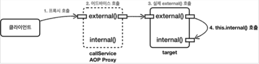

# 스프링 AOP - 실무 주의사항

## 프록시와 내부 호출 - 문제

스프링은 프록시 방식의 AOP를 사용한다.
따라서 AOP를 적용하려면 항상 프록시를 통해서 대상 객체(Target)을 호출해야 한다.
이렇게 해야 프록시에서 먼저 어드바이스를 호출하고, 이후에 대상 객체를 호출한다.
만약 프록시를 거치지 않고 대상 객체를 직접 호출하게 되면 AOP가 적용되지 않고, 어드바이스도 호출되지 않는다.


AOP를 적용하면 스프링은 대상 객체 대신에 프록시를 스프링 빈으로 등록한다. 
따라서 스프링은 의존관계 주입시에 항상 프록시 객체를 주입한다. 
프록시 객체가 주입되기 때문에 대상 객체를 직접 호출하는 문제는 일반적으로 발생하지 않는다. 
하지만 대상 객체의 내부에서 메서드 호출이 발생하면 프록시를 거치지 않고 대상 객체를 직접 호출하는 문제가 발생한다. 

#### CallServiceV0

```java
package hello.aop.internalcall;

import lombok.extern.slf4j.Slf4j;
import org.springframework.stereotype.Component;

@Slf4j
@Component
public class CallServiceV0 {

    public void external(){
        log.info("call external");
        internal();
    }

    public void internal() {
        log.info("call internal");
    }
}
```

`CallServiceV0.external()` 을 호출하면 내부에서 `internal()` 이라는 자기 자신의 메서드를 호출한다. 
자바 언어에서 메서드를 호출할 때 대상을 지정하지 않으면 앞에 자기 자신의 인스턴스를 뜻하는 `this` 가 붙게 된다. 
그러니까 여기서는 `this.internal()` 이라고 이해하면 된다.


#### CallLogAspect

```java
package hello.aop.internalcall;

import lombok.extern.slf4j.Slf4j;
import org.aspectj.lang.JoinPoint;
import org.aspectj.lang.annotation.Aspect;
import org.aspectj.lang.annotation.Before;

@Slf4j
@Aspect
public class CallLogAspect {

    @Before("execution(* hello.aop.inernalcall..*.*(..))")
    public void doLog(JoinPoint joinPoint){
        log.info("aop={}", joinPoint.getSignature());
    }
}
```

#### CallServiceV0Test

```java
package hello.aop.internalcall;

import lombok.extern.slf4j.Slf4j;
import org.junit.jupiter.api.Test;
import org.springframework.beans.factory.annotation.Autowired;
import org.springframework.context.annotation.Import;

import static org.junit.jupiter.api.Assertions.*;

@Slf4j
@Import(CallLogAspect.class)
class CallServiceV0Test {
    
    @Autowired CallServiceV0 callServiceV0;

    @Test
    void external() {
        callServiceV0.external();
    }

    @Test
    void internal() {
        callServiceV0.internal();
    }
}
```


* `@Import(CallLogAspect.class)` : 앞서 만든 간단한 Aspect 를 스프링 빈으로 등록한다. 
  이렇게 해서 `CallServiceV0` 에 AOP 프록시를 적용한다. 
* `@SpringBootTest` : 내부에 컴포넌트 스캔을 포함하고 있다. `CallServiceV0` 에 `@Component` 가 붙어있으므로 
  스프링 빈 등록 대상이 된다.




실행 결과를 보면 `callServiceV0.external()` 을 실행할 때는 프록시를 호출한다. 따라서 `CallLogAspect` 어드바이스가 호출된 것을 확인할 수 있다.
그리고 AOP Proxy는 `target.external()` 을 호출한다.
그런데 여기서 문제는 `callServiceV0.external()` 안에서 `internal()` 을 호출할 때 발생한다. 
이때는 `CallLogAspect` 어드바이스가 호출되지 않는다.


자바 언어에서 메서드 앞에 별도의 참조가 없으면 `this` 라는 뜻으로 자기 자신의 인스턴스를 가리킨다. 
결과적으로 자기 자신의 내부 메서드를 호출하는 `this.internal()` 이 되는데, 여기서 `this` 는 
실제 대상 객체(target)의 인스턴스를 뜻한다. 결과적으로 이러한 내부 호출은 프록시를 거치지 않는다. 따라서 어드바이스도 적용할 수 없다.


외부에서 호출하는 경우 프록시를 거치기 때문에 `internal()` 도 `CallLogAspect` 어드바이스가 적용된 것을 확인할 수 있다.


#### 프록시 방식의 AOP 한계
스프링은 프록시 방식의 AOP를 사용한다. 프록시 방식의 AOP는 메서드 내부 호출에 프록시를 적용할 수 없다. 
지금부터 이 문제를 해결하는 방법을 하나씩 알아보자.


> 참고
> 
> 실제 코드에 AOP를 직접 적용하는 AspectJ를 사용하면 이런 문제가 발생하지 않는다. 프록시를 통하는 것이 아니라 해당 코드에 직접 AOP 적용 코드가 붙어 있기 때문에 내부 호출과 무관하게 AOP를 적용할 수 있다.
> 하지만 로드 타임 위빙 등을 사용해야 하는데, 설정이 복잡하고 JVM 옵션을 주어야 하는 부담이 있다. 그리고 지금부터 설명할 프록시 방식의 AOP에서 내부 호출에 대응할 수 있는 대안들도 있다.
> 
> 이런 이유로 AspectJ를 직접 사용하는 방법은 실무에서는 거의 사용하지 않는다.
> 
> https://docs.spring.io/spring-framework/docs/current/reference/html/core.html#aop-using-aspectj


## 프록시와 내부 호출 - 대안1 자기 자신 주입

#### CallServiceV1

```java
package hello.aop.internalcall;

import lombok.extern.slf4j.Slf4j;
import org.springframework.beans.factory.annotation.Autowired;
import org.springframework.stereotype.Component;

@Slf4j
@Component
public class CallServiceV1 {

    private CallServiceV1 callServiceV1;

    @Autowired
    public void setCallServiceV1(CallServiceV1 callServiceV1) {
        this.callServiceV1 = callServiceV1;
    }

    public void external(){
        log.info("call external");
        callServiceV1.internal();
    }

    public void internal() {
        log.info("call internal");
    }
}
```

`callServiceV1` 를 수정자를 통해서 주입 받는 것을 확인할 수 있다. 
스프링에서 AOP가 적용된 대상을 의존관계 주입 받으면 주입 받은 대상은 실제 자신이 아니라 프록시 객체이다.
`external()` 을 호출하면 `callServiceV1.internal()` 를 호출하게 된다. 주입받은 `callServiceV1` 은 프록시이다. 
따라서 프록시를 통해서 AOP를 적용할 수 있다.
참고로 이 경우 생성자 주입시 오류가 발생한다. 본인을 생성하면서 주입해야 하기 때문에 순환 사이클이 만들어진다. 
반면에 수정자 주입은 스프링이 생성된 이후에 주입할 수 있기 때문에 오류가 발생하지 않는다.


#### CallServiceV1Test

```java
package hello.aop.internalcall;

import lombok.extern.slf4j.Slf4j;
import org.junit.jupiter.api.Test;
import org.springframework.beans.factory.annotation.Autowired;
import org.springframework.context.annotation.Import;

@Slf4j
@Import(CallLogAspect.class)
class CallServiceV1Test {

    @Autowired CallServiceV1 callServiceV1;

    @Test
    void external() {
        callServiceV1.external();
    }
}
```


실행 결과를 보면 이제는 C 을 호출할 때 자기 자신의 인스턴스를 호출하는 것이 아니라 프록시 인스턴스를 통해서 호출하는 것을 확인할 수 있다.


> 주의
> 
> 스프링 부트 2.6부터는 순환 참조를 기본적으로 금지하도록 정책이 변경되었다. 
> 따라서 이번 예제를 스프링 부트 2.6 이상의 버전에서 실행하면 다음과 같은 오류 메시지가 나오면서 정상 실행되지 않는다.
>
> 이 문제를 해결하려면 `application.properties` 에 다음을 추가해야 한다.
> `spring.main.allow-circular-references=true`
> 앞으로 있을 다른 테스트에도 영향을 주기 때문에 스프링 부트 2.6 이상이라면 이 설정을 꼭 추가해야 한다.


