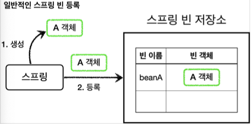
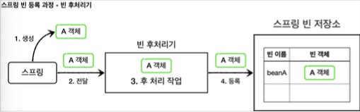
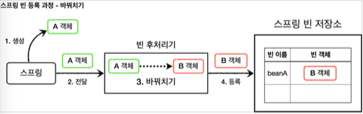
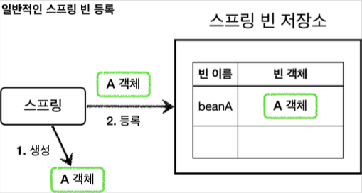
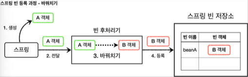
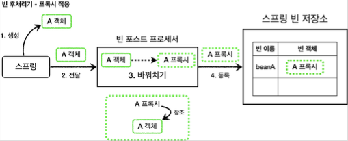
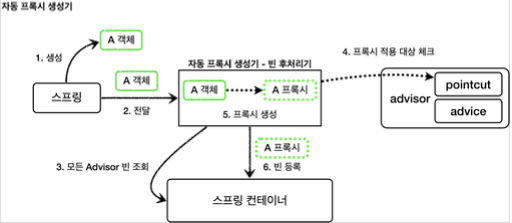
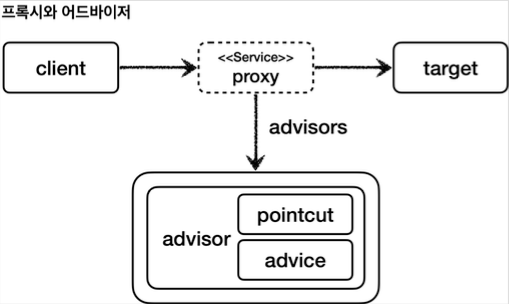

# 빈 후처리기




`@Bean` 이나 컴포넌트 스캔으로 스프링 빈을 등록하면, 
스프링은 대상 객체를 생성하고 스프링 컨테이너 내부의 빈 저장소에 등록한다. 그리고 이후에는 스프링 컨테이너를 통해 등록한 스프링 빈을 조회해서 사용하면 된다.


### 빈 후처리기 - BeanPostProcessor

스프링이 빈 저장소에 등록할 목적으로 생성한 객체를 빈 저장소에 등록하기 직전에 조작하고 싶다면 빈 후처리기를 사용하면 된다.
빈 포스트 프로세서(`BeanPostProcessor`)는 번역하면 빈 후처리기인데, 이름 그대로 빈을 생성한 후에 무언가를 처리하는 용도로 사용한다.


### 빈 후처리기 기능

객체를 조작할 수도 있고, 완전히 다른 객체로 바꿔치기 하는 것도 가능하다.


### 빈 후처리기 과정




### 빈 등록 과정
1. **생성**: 스프링 빈 대상이 되는 객체를 생성한다. (`@Bean` , 컴포넌트 스캔 모두 포함)
2. **전달**: 생성된 객체를 빈 저장소에 등록하기 직전에 빈 후처리기에 전달한다.
3. **후 처리 작업**: 빈 후처리기는 전달된 스프링 빈 객체를 조작하거나 다른 객체로 바뀌치기 할 수 있다. 4. 등록: 빈 후처리기는 빈을 반환한다. 전달 된 빈을 그대로 반환하면 해당 빈이 등록되고, 
   바꿔치기 하면 다른 객체가 빈 저장소에 등록된다.

### 다른 객체로 바꿔치는 빈 후처리기




## 빈 후처리기 - 예제 코드1


### 일반적인 스프링 빈 등록 과정




#### BasicTest

```java
package hello.proxy.postprocessor;

import lombok.extern.slf4j.Slf4j;
import org.junit.jupiter.api.Assertions;
import org.junit.jupiter.api.Test;
import org.springframework.beans.factory.NoSuchBeanDefinitionException;
import org.springframework.context.ApplicationContext;
import org.springframework.context.annotation.AnnotationConfigApplicationContext;
import org.springframework.context.annotation.Bean;
import org.springframework.context.annotation.Configuration;

public class BasicTest {

    @Test
    public void basicConfig() {
        ApplicationContext applicationContext = new AnnotationConfigApplicationContext(BasicConfig.class);

        A a = applicationContext.getBean("beanA", A.class);
        a.helloA();

        Assertions.assertThrows(NoSuchBeanDefinitionException.class,
                () -> applicationContext.getBean(B.class));
    }

    @Slf4j
    @Configuration
    static class BasicConfig{
        @Bean(name = "beanA")
        public A a(){
            return new A();
        }


    }

    @Slf4j
    static class A{
        public void helloA(){
            log.info("hello A");
        }
    }

    @Slf4j
    static class B{
        public void helloB(){
            log.info("hello B");
        }
    }
}
```

`new AnnotationConfigApplicationContext(BasicConfig.class)`
스프링 컨테이너를 생성하면서 `BasicConfig.class` 를 넘겨주었다. `BasicConfig.class` 설정 파일은
스프링 빈으로 등록된다.


### 등록

#### BasicConfig.class

```java
@Slf4j
@Configuration
static class BasicConfig{
    @Bean(name = "beanA")
    public A a(){
        return new A();
    }
}
```

`beanA` 라는 이름으로 `A` 객체를 스프링 빈으로 등록했다.

### 조회

#### `A a = applicationContext.getBean("beanA", A.class)` 
* `beanA`라는 이름으로 `A` 타입의 스프링 빈을 찾을 수 있다.

#### `applicationContext.getBean(B.class)`
* `B` 타입의 객체는 스프링빈으로 등록한 적이 없기 때문에 스프링 컨테이너에서 찾을 수 없다.


## 빈 후처리기 - 예제 코드2

### 빈 후처리기 적용

이번에는 빈 후처리기를 통해서 A 객체를 B 객체로 바꿔치기 한다.





#### BeanPostProcessor 인터페이스 - 스프링 제공

```java
/*
 * Copyright 2002-2019 the original author or authors.
 *
 * Licensed under the Apache License, Version 2.0 (the "License");
 * you may not use this file except in compliance with the License.
 * You may obtain a copy of the License at
 *
 *      https://www.apache.org/licenses/LICENSE-2.0
 *
 * Unless required by applicable law or agreed to in writing, software
 * distributed under the License is distributed on an "AS IS" BASIS,
 * WITHOUT WARRANTIES OR CONDITIONS OF ANY KIND, either express or implied.
 * See the License for the specific language governing permissions and
 * limitations under the License.
 */

package org.springframework.beans.factory.config;

import org.springframework.beans.BeansException;
import org.springframework.lang.Nullable;

/**
 * Factory hook that allows for custom modification of new bean instances &mdash;
 * for example, checking for marker interfaces or wrapping beans with proxies.
 *
 * <p>Typically, post-processors that populate beans via marker interfaces
 * or the like will implement {@link #postProcessBeforeInitialization},
 * while post-processors that wrap beans with proxies will normally
 * implement {@link #postProcessAfterInitialization}.
 *
 * <h3>Registration</h3>
 * <p>An {@code ApplicationContext} can autodetect {@code BeanPostProcessor} beans
 * in its bean definitions and apply those post-processors to any beans subsequently
 * created. A plain {@code BeanFactory} allows for programmatic registration of
 * post-processors, applying them to all beans created through the bean factory.
 *
 * <h3>Ordering</h3>
 * <p>{@code BeanPostProcessor} beans that are autodetected in an
 * {@code ApplicationContext} will be ordered according to
 * {@link org.springframework.core.PriorityOrdered} and
 * {@link org.springframework.core.Ordered} semantics. In contrast,
 * {@code BeanPostProcessor} beans that are registered programmatically with a
 * {@code BeanFactory} will be applied in the order of registration; any ordering
 * semantics expressed through implementing the
 * {@code PriorityOrdered} or {@code Ordered} interface will be ignored for
 * programmatically registered post-processors. Furthermore, the
 * {@link org.springframework.core.annotation.Order @Order} annotation is not
 * taken into account for {@code BeanPostProcessor} beans.
 *
 * @author Juergen Hoeller
 * @author Sam Brannen
 * @since 10.10.2003
 * @see InstantiationAwareBeanPostProcessor
 * @see DestructionAwareBeanPostProcessor
 * @see ConfigurableBeanFactory#addBeanPostProcessor
 * @see BeanFactoryPostProcessor
 */
public interface BeanPostProcessor {

	/**
	 * Apply this {@code BeanPostProcessor} to the given new bean instance <i>before</i> any bean
	 * initialization callbacks (like InitializingBean's {@code afterPropertiesSet}
	 * or a custom init-method). The bean will already be populated with property values.
	 * The returned bean instance may be a wrapper around the original.
	 * <p>The default implementation returns the given {@code bean} as-is.
	 * @param bean the new bean instance
	 * @param beanName the name of the bean
	 * @return the bean instance to use, either the original or a wrapped one;
	 * if {@code null}, no subsequent BeanPostProcessors will be invoked
	 * @throws org.springframework.beans.BeansException in case of errors
	 * @see org.springframework.beans.factory.InitializingBean#afterPropertiesSet
	 */
	@Nullable
	default Object postProcessBeforeInitialization(Object bean, String beanName) throws BeansException {
		return bean;
	}

	/**
	 * Apply this {@code BeanPostProcessor} to the given new bean instance <i>after</i> any bean
	 * initialization callbacks (like InitializingBean's {@code afterPropertiesSet}
	 * or a custom init-method). The bean will already be populated with property values.
	 * The returned bean instance may be a wrapper around the original.
	 * <p>In case of a FactoryBean, this callback will be invoked for both the FactoryBean
	 * instance and the objects created by the FactoryBean (as of Spring 2.0). The
	 * post-processor can decide whether to apply to either the FactoryBean or created
	 * objects or both through corresponding {@code bean instanceof FactoryBean} checks.
	 * <p>This callback will also be invoked after a short-circuiting triggered by a
	 * {@link InstantiationAwareBeanPostProcessor#postProcessBeforeInstantiation} method,
	 * in contrast to all other {@code BeanPostProcessor} callbacks.
	 * <p>The default implementation returns the given {@code bean} as-is.
	 * @param bean the new bean instance
	 * @param beanName the name of the bean
	 * @return the bean instance to use, either the original or a wrapped one;
	 * if {@code null}, no subsequent BeanPostProcessors will be invoked
	 * @throws org.springframework.beans.BeansException in case of errors
	 * @see org.springframework.beans.factory.InitializingBean#afterPropertiesSet
	 * @see org.springframework.beans.factory.FactoryBean
	 */
	@Nullable
	default Object postProcessAfterInitialization(Object bean, String beanName) throws BeansException {
		return bean;
	}

}

```

* 빈 후처리기를 사용하려면 `BeanPostProcessor` 인터페이스를 구현하고, 스프링 빈으로 등록하면 된다.
* `postProcessBeforeInitialization` : 객체 생성 이후에 `@PostConstruct` 같은 초기화가 
  발생하기 전에 호출되는 포스트 프로세서이다. 
* `postProcessAfterInitialization` : 객체 생성 이후에 `@PostConstruct` 같은 초기화가 발생한 다음에 
  호출되는 포스트 프로세서이다.

#### BeanPostProcessorTest

```java
package hello.proxy.postprocessor;

import lombok.extern.slf4j.Slf4j;
import org.junit.jupiter.api.Assertions;
import org.junit.jupiter.api.Test;
import org.springframework.beans.BeansException;
import org.springframework.beans.factory.NoSuchBeanDefinitionException;
import org.springframework.beans.factory.config.BeanPostProcessor;
import org.springframework.context.ApplicationContext;
import org.springframework.context.annotation.AnnotationConfigApplicationContext;
import org.springframework.context.annotation.Bean;
import org.springframework.context.annotation.Configuration;

public class BeanPostProcessorTest {

    @Test
    public void basicConfig() {
        ApplicationContext applicationContext = new AnnotationConfigApplicationContext(BasicConfig.class);

        B b = applicationContext.getBean("beanA", B.class);
        b.helloB();

        Assertions.assertThrows(NoSuchBeanDefinitionException.class,
                () -> applicationContext.getBean(A.class));
    }

    @Slf4j
    @Configuration
    static class BasicConfig{
        @Bean(name = "beanA")
        public A a(){
            return new A();
        }

        @Bean
        public ATOBPostProcessor helloPostProcessor(){
            return new ATOBPostProcessor();
        }
    }

    @Slf4j
    static class A{
        public void helloA(){
            log.info("hello A");
        }
    }

    @Slf4j
    static class B{
        public void helloB(){
            log.info("hello B");
        }
    }

    @Slf4j
    static class ATOBPostProcessor implements BeanPostProcessor{

        @Override
        public Object postProcessAfterInitialization(Object bean, String beanName) throws BeansException {
            log.info("beanName={} bean={}", beanName, bean);
            if (bean instanceof A) {
                return new B();
            }
            return bean;
        }
    }
}
```

#### AToBPostProcessor

* 빈 후처리기이다. 인터페이스인 `BeanPostProcessor` 를 구현하고, 스프링 빈으로 등록하면 스프링 컨테이너가 빈 후처리기로 인식하고 동작한다. 
* 이 빈 후처리기는 A객체를 새로운 B객체로 바꿔치기 한다. 파라미터로 넘어오는빈(`bean`)객체가 `A`의 인스턴스이면 새로운 `B` 객체를 생성해서 반환한다. 
  여기서 `A` 대신에 반환된 값인 `B` 가 스프링 컨테이너에 등록된다. 다음 실행결과를 보면 `beanName=beanA` , `bean=A` 객체의 인스턴스가 
  빈 후처리기에 넘어온 것을 확인할 수 있다.


`B b = applicationContext.getBean("beanA", B.class)`

* 실행 결과를 보면 최종적으로 `"beanA"`라는 스프링 빈 이름에 `A` 객체 대신에 `B` 객체가 등록된 것을
확인할 수 있다. `A`는 스프링 빈으로 등록조차 되지 않는다.


### 정리
빈 후처리기는 빈을 조작하고 변경할 수 있는 후킹 포인트이다.
이것은 빈 객체를 조작하거나 심지어 다른 객체로 바꾸어 버릴 수 있을 정도로 막강하다.
여기서 조작이라는 것은 해당 객체의 특정 메서드를 호출하는 것을 뜻한다.
일반적으로 스프링 컨테이너가 등록하는, 특히 컴포넌트 스캔의 대상이 되는 빈들은 중간에 조작할 방법이 없는데, 
빈 후처리기를 사용하면 개발자가 등록하는 모든 빈을 중간에 조작할 수 있다. 이 말은 빈 객체를 프록시로 교체하는 것도 가능하다는 뜻이다.


> 참고 - `@PostConstruct`
> 
> `@PostConstruct` 는 스프링 빈 생성 이후에 빈을 초기화 하는 역할을 한다. 그런데 생각해보면 빈의 초기화
> 라는 것이 단순히 `@PostConstruct` 애노테이션이 붙은 초기화 메서드를 한번 호출만 하면 된다. 쉽게 
> 이야기해서 생성된 빈을 한번 조작하는 것이다.
> 따라서 빈을 조작하는 행위를 하는 적절한 빈 후처리기가 있으면 될 것 같다.
> 스프링은 `CommonAnnotationBeanPostProcessor` 라는 빈 후처리기를 자동으로 등록하는데, 여기에서 
> `@PostConstruct` 애노테이션이 붙은 메서드를 호출한다. 따라서 스프링 스스로도 스프링 내부의 기능을 확장하기 위해 빈 후처리기를 사용한다.

## 빈 후처리기 - 적용



#### PackageLogTraceProxyPostProcessor

```java
package hello.proxy.config.v4_postprocessor.postprocessor;

import lombok.extern.slf4j.Slf4j;
import org.springframework.aop.Advisor;
import org.springframework.aop.framework.ProxyFactory;
import org.springframework.beans.BeansException;
import org.springframework.beans.factory.config.BeanPostProcessor;

@Slf4j
public class PackageLogTracePostProcessor implements BeanPostProcessor {

    private final String basePackage;
    private final Advisor advisor;

    public PackageLogTracePostProcessor(String basePackage, Advisor advisor) {
        this.basePackage = basePackage;
        this.advisor = advisor;
    }

    @Override
    public Object postProcessAfterInitialization(Object bean, String beanName) throws BeansException {
        log.info("param beanName={}, bean={}", beanName, bean.getClass());

        //프록시 적용 대상 여부 체크
        //프록시 적용 대상이 아니면 원본을 그대로 진행
        String packageName = bean.getClass().getPackageName();
        if(!packageName.startsWith(basePackage)){
            return bean;
        }

        //프록시 대상이면 프록시를 만들어서 반환
        ProxyFactory proxyFactory = new ProxyFactory(bean);
        proxyFactory.addAdvisor(advisor);


        Object proxy = proxyFactory.getProxy();
        log.info("create proxy: target={}, proxy={}", bean.getClass(), proxy.getClass());
        return proxy;
    }
}
```

* `PackageLogTraceProxyPostProcessor` 는 원본 객체를 프록시 객체로 변환하는 역할을 한다. 
* 이때 프록시 팩토리를 사용하는데, 프록시 팩토리는 `advisor` 가 필요하기 때문에 이 부분은 외부에서 주입 받도록 했다. 
* 모든 스프링 빈들에 프록시를 적용할 필요는 없다. 여기서는 특정 패키지와 그 하위에 위치한 스프링 빈들만 프록시를 적용한다. 
  여기서는 `hello.proxy.app` 과 관련된 부분에만 적용하면 된다. 다른 패키지의 객체들은 원본 객체를 그대로 반환한다. 
* 프록시 적용 대상의 반환 값을 보면 원본 객체 대신에 프록시 객체를 반환한다. 따라서 스프링 컨테이너에 원본 객체 대신에 프록시 객체가 스프링 빈으로 등록된다. 
  원본 객체는 스프링 빈으로 등록되지 않는다.

#### BeanPostProcessorConfig

```java
package hello.proxy.config.v4_postprocessor;

import hello.proxy.AppV1Config;
import hello.proxy.AppV2Config;
import hello.proxy.config.v3_proxyfactory.advice.LogTraceAdvice;
import hello.proxy.config.v4_postprocessor.postprocessor.PackageLogTracePostProcessor;
import hello.proxy.trace.logtrace.LogTrace;
import lombok.extern.slf4j.Slf4j;
import org.springframework.aop.Advisor;
import org.springframework.aop.support.DefaultPointcutAdvisor;
import org.springframework.aop.support.NameMatchMethodPointcut;
import org.springframework.context.annotation.Bean;
import org.springframework.context.annotation.Configuration;
import org.springframework.context.annotation.Import;

@Slf4j
@Configuration
@Import({AppV1Config.class, AppV2Config.class})
public class BeanPostProcessorConfig {

    @Bean
    public PackageLogTracePostProcessor logTracePostProcessor(LogTrace logTrace){
        return new PackageLogTracePostProcessor("hello.proxy.app", getAdvisor(logTrace));
    }

    private Advisor getAdvisor(LogTrace logTrace) {
        NameMatchMethodPointcut pointcut = new NameMatchMethodPointcut();
        pointcut.setMappedNames("request*", "order*", "save*");

        LogTraceAdvice advice = new LogTraceAdvice(logTrace);
        return new DefaultPointcutAdvisor(pointcut, advice);
    }
}
```

* `@Import({AppV1Config.class, AppV2Config.class})` : V3는 컴포넌트 스캔으로 자동으로 스프링 빈으로 등록되지만, V1, V2 
  애플리케이션은 수동으로 스프링 빈으로 등록해야 동작한다. `ProxyApplication` 에서 등록해도 되지만 편의상 여기에 등록한다. 
* `@Bean logTraceProxyPostProcessor()` : 특정 패키지를 기준으로 프록시를 생성하는 빈 후처리기를 스프링 빈으로 등록한다. 
  빈 후처리기는 스프링 빈으로만 등록하면 자동으로 동작한다. 여기에 프록시를 적용할 패키지 정보(`hello.proxy.app`)와 
  어드바이저(`getAdvisor(logTrace)`)를 넘겨준다. 
* 이제 프록시를 생성하는 코드가 설정 파일에는 필요 없다. 순수한 빈 등록만 고민하면 된다. 프록시를 생성하고 프록시를 스프링 빈으로 
  등록하는 것은 빈 후처리기가 모두 처리해준다.


#### ProxyApplication

```java
package hello.proxy;

import hello.proxy.config.v4_postprocessor.BeanPostProcessorConfig;
import hello.proxy.trace.logtrace.LogTrace;
import hello.proxy.trace.logtrace.ThreadLocalLogTrace;
import org.springframework.boot.SpringApplication;
import org.springframework.boot.autoconfigure.SpringBootApplication;
import org.springframework.context.annotation.Bean;
import org.springframework.context.annotation.Import;

//@Import(AppV1Config.class)
//@Import({AppV2Config.class, AppV1Config.class})
//@Import(InterfaceProxyConfig.class)
//@Import(ConcreteProxyConfig.class)
//@Import(DynamicProxyBasicConfig.class)
//@Import(DynamicProxyFilterConfig.class)
//@Import(ProxyFactoryConfigV1.class)
//@Import(ProxyFactoryConfigV2.class)
@Import(BeanPostProcessorConfig.class)
@SpringBootApplication(scanBasePackages = "hello.proxy.app") //주의
public class ProxyApplication {

	public static void main(String[] args) {
		SpringApplication.run(ProxyApplication.class, args);
	}

	@Bean
	public LogTrace logTrace(){
		return new ThreadLocalLogTrace();
	}
}
```


#### 프록시 적용 대상 여부 체크
애플리케이션을 실행해서 로그를 확인해보면 알겠지만, 우리가 직접 등록한 스프링 빈들 뿐만 아니라 스프링 부트가 기본으로 등록하는 
수 많은 빈들이 빈 후처리기에 넘어온다. 그래서 어떤 빈을 프록시로 만들 것인지 기준이 필요하다. 
여기서는 간단히 `basePackage` 를 사용해서 특정 패키지를 기준으로 해당 패키지와 그 하위 패키지의 빈들을 프록시로 만든다.
스프링 부트가 기본으로 제공하는 빈 중에는 프록시 객체를 만들 수 없는 빈들도 있다. 따라서 모든 객체를 프록시로 만들 경우 오류가 발생한다.


## 빈 후처리기 - 정리


### 문제1 - 너무 많은 설정
프록시를 직접 스프링 빈으로 등록하는 `ProxyFactoryConfigV1` , `ProxyFactoryConfigV2` 와 같은 설정 파일은 프록시 관련 설정이 지나치게 
많다는 문제가 있다.
예를 들어서 애플리케이션에 스프링 빈이 100개가 있다면 여기에 프록시를 통해 부가 기능을 적용하려면 100개의 프록시 설정 코드가 들어가야 한다.
스프링 빈을 편리하게 등록하려고 컴포넌트 스캔까지 사용하는데, 이렇게 직접 등록하는 것도 모자라서, 프록시를 적용하는 코드까지 빈 생성 코드에 넣어야 했다.

### 문제2 - 컴포넌트 스캔
애플리케이션 V3처럼 컴포넌트 스캔을 사용하는 경우 지금까지 학습한 방법으로는 프록시 적용이 불가능했다.
왜냐하면 컴포넌트 스캔으로 이미 스프링 컨테이너에 실제 객체를 스프링 빈으로 등록을 다 해버린 상태이기 때문이다.
좀 더 풀어서 설명하자면, 지금까지 학습한 방식으로 프록시를 적용하려면, 원본 객체를 스프링 컨테이너에 빈으로 등록하는 것이 아니라
`ProxyFactoryConfigV1` 에서 한 것 처럼, 프록시를 원본 객체 대신 스프링 컨테이너에 빈으로 등록해야 한다. 
그런데 컴포넌트 스캔은 원본 객체를 스프링 빈으로 자동으로 등록하기 때문에 프록시 적용이 불가능하다.


### 문제 해결
빈 후처리기 덕분에 프록시를 생성하는 부분을 하나로 집중할 수 있다. 그리고 컴포넌트 스캔처럼 스프링이 직접 대상을 빈으로 등록하는 경우에도
중간에 빈 등록 과정을 가로채서 원본 대신에 프록시를 스프링 빈으로 등록할 수 있다.
덕분에 애플리케이션에 수 많은 스프링 빈이 추가되어도 프록시와 관련된 코드는 전혀 변경하지 않아도 된다. 
그리고 컴포넌트 스캔을 사용해도 프록시가 모두 적용된다.

>  중요
> 
> 프록시의 적용 대상 여부를 여기서는 간단히 패키지를 기준으로 설정했다. 그런데 잘 생각해보면 포인트컷을 사용하면 더 깔끔할 것 같다.
> 포인트컷은 이미 클래스, 메서드 단위의 필터 기능을 가지고 있기 때문에, 프록시 적용 대상 여부를 정밀하게 설정할 수 있다.
> 참고로 어드바이저는 포인트컷을 가지고 있다. 따라서 어드바이저를 통해 포인트컷을 확인할 수 있다.
> 스프링 AOP는 포인트컷을 사용해서 프록시 적용 대상 여부를 체크한다.
> 결과적으로 포인트컷은 다음 두 곳에 사용된다.
> 
> 1. 프록시 적용 대상 여부를 체크해서 꼭 필요한 곳에만 프록시를 적용한다. (빈 후처리기 - 자동 프록시 생성)
> 2. 프록시의 어떤 메서드가 호출 되었을 때 어드바이스를 적용할 지 판단한다. (프록시 내부)

## 스프링이 제공하는 빈 후처리기1

#### build.gradle - 추가

```groovy
implementation 'org.springframework.boot:spring-boot-starter-aop'
```

이 라이브러리를 추가하면 `aspectjweaver` 라는 `aspectJ` 관련 라이브러리를 등록하고, 
스프링 부트가 AOP 관련 클래스를 자동으로 스프링 빈에 등록한다. 스프링 부트가 없던 시절에는 
`@EnableAspectJAutoProxy` 를 직접 사용해야 했는데, 이 부분을 스프링 부트가 자동으로 처리해준다.
`aspectJ` 는 뒤에서 설명한다. 스프링 부트가 활성화하는 빈은 `AopAutoConfiguration` 를 참고하면 된다.

#### AopAutoConfiguration

```java
/*
 * Copyright 2012-2021 the original author or authors.
 *
 * Licensed under the Apache License, Version 2.0 (the "License");
 * you may not use this file except in compliance with the License.
 * You may obtain a copy of the License at
 *
 *      https://www.apache.org/licenses/LICENSE-2.0
 *
 * Unless required by applicable law or agreed to in writing, software
 * distributed under the License is distributed on an "AS IS" BASIS,
 * WITHOUT WARRANTIES OR CONDITIONS OF ANY KIND, either express or implied.
 * See the License for the specific language governing permissions and
 * limitations under the License.
 */

package org.springframework.boot.autoconfigure.aop;

import org.aspectj.weaver.Advice;

import org.springframework.aop.config.AopConfigUtils;
import org.springframework.beans.factory.config.BeanFactoryPostProcessor;
import org.springframework.beans.factory.support.BeanDefinitionRegistry;
import org.springframework.boot.autoconfigure.condition.ConditionalOnClass;
import org.springframework.boot.autoconfigure.condition.ConditionalOnMissingClass;
import org.springframework.boot.autoconfigure.condition.ConditionalOnProperty;
import org.springframework.context.annotation.Bean;
import org.springframework.context.annotation.Configuration;
import org.springframework.context.annotation.EnableAspectJAutoProxy;

/**
 * {@link org.springframework.boot.autoconfigure.EnableAutoConfiguration
 * Auto-configuration} for Spring's AOP support. Equivalent to enabling
 * {@link EnableAspectJAutoProxy @EnableAspectJAutoProxy} in your configuration.
 * <p>
 * The configuration will not be activated if {@literal spring.aop.auto=false}. The
 * {@literal proxyTargetClass} attribute will be {@literal true}, by default, but can be
 * overridden by specifying {@literal spring.aop.proxy-target-class=false}.
 *
 * @author Dave Syer
 * @author Josh Long
 * @since 1.0.0
 * @see EnableAspectJAutoProxy
 */
@Configuration(proxyBeanMethods = false)
@ConditionalOnProperty(prefix = "spring.aop", name = "auto", havingValue = "true", matchIfMissing = true)
public class AopAutoConfiguration {

	@Configuration(proxyBeanMethods = false)
	@ConditionalOnClass(Advice.class)
	static class AspectJAutoProxyingConfiguration {

		@Configuration(proxyBeanMethods = false)
		@EnableAspectJAutoProxy(proxyTargetClass = false)
		@ConditionalOnProperty(prefix = "spring.aop", name = "proxy-target-class", havingValue = "false")
		static class JdkDynamicAutoProxyConfiguration {

		}

		@Configuration(proxyBeanMethods = false)
		@EnableAspectJAutoProxy(proxyTargetClass = true)
		@ConditionalOnProperty(prefix = "spring.aop", name = "proxy-target-class", havingValue = "true",
				matchIfMissing = true)
		static class CglibAutoProxyConfiguration {

		}

	}

	@Configuration(proxyBeanMethods = false)
	@ConditionalOnMissingClass("org.aspectj.weaver.Advice")
	@ConditionalOnProperty(prefix = "spring.aop", name = "proxy-target-class", havingValue = "true",
			matchIfMissing = true)
	static class ClassProxyingConfiguration {

		@Bean
		static BeanFactoryPostProcessor forceAutoProxyCreatorToUseClassProxying() {
			return (beanFactory) -> {
				if (beanFactory instanceof BeanDefinitionRegistry) {
					BeanDefinitionRegistry registry = (BeanDefinitionRegistry) beanFactory;
					AopConfigUtils.registerAutoProxyCreatorIfNecessary(registry);
					AopConfigUtils.forceAutoProxyCreatorToUseClassProxying(registry);
				}
			};
		}

	}

}
```

#### 자동 프록시 생성기 - AutoProxyCreator

* 스프링 부트 자동 설정으로 `AnnotationAwareAspectJAutoProxyCreator` 라는 빈 후처리기가 스프링 빈에 자동으로 등록된다. 
* 자동으로 프록시를 생성해주는 빈 후처리기이다. 
* 이 빈 후처리기는 스프링 빈으로 등록된 Advisor 들을 자동으로 찾아서 프록시가 필요한 곳에 자동으로 프록시를 적용해준다. 
* `Advisor` 안에는 `Pointcut` 과 `Advice` 가 이미 모두 포함되어 있다. 따라서 `Advisor` 만 알고 있으면 
  그 안에있는 `Pointcut`으로 어떤 스프링빈에 프록시를 적용해야 할지 알 수 있다.그리고 `Advice`로 부가 기능을 적용하면 된다.

> 참고
> 
> `AnnotationAwareAspectJAutoProxyCreator` 는 `@AspectJ`와 관련된 AOP 기능도 자동으로 찾아서 처리해준다.
> Advisor 는 물론이고, `@Aspect` 도 자동으로 인식해서 프록시를 만들고 AOP를 적용해준다. 

#### 자동 프록시 생성기의 작동 과정



1. 생성: 스프링이 스프링 빈 대상이 되는 객체를 생성한다. (`@Bean` , 컴포넌트 스캔 모두 포함)
2. 전달: 생성된 객체를 빈 저장소에 등록하기 직전에 빈 후처리기에 전달한다.
3. 모든 `Advisor` 빈 조회: 자동 프록시 생성기 - 빈 후처리기는 스프링 컨테이너에서 모든 `Advisor` 를 조회한다.
4. 프록시 적용 대상 체크: 앞서 조회한 `Advisor` 에 포함되어 있는 포인트컷을 사용해서 해당 객체가 프록시를 적용할 대상인지 아닌지 판단한다. 
   이때 객체의 클래스 정보는 물론이고, 해당 객체의 모든 메서드를 포인트컷에 하나하나 모두 매칭해본다. 
   그래서 조건이 하나라도 만족하면 프록시 적용 대상이 된다. 
   예를 들어서 10개의 메서드 중에 하나만 포인트컷 조건에 만족해도 프록시 적용 대상이 된다.
5. 프록시 생성: 프록시 적용 대상이면 프록시를 생성하고 반환해서 프록시를 스프링 빈으로 등록한다. 
   만약 프록시 적용 대상이 아니라면 원본 객체를 반환해서 원본 객체를 스프링 빈으로 등록한다.
6. 빈 등록: 반환된 객체는 스프링 빈으로 등록된다.

#### 생성된 프록시



프록시는 내부에 어드바이저와 실제 호출해야할 대상 객체(`target`)을 알고 있다.


#### AutoProxyConfig

```java
package hello.proxy.config.v5_autoproxy;

import hello.proxy.AppV1Config;
import hello.proxy.AppV2Config;
import hello.proxy.config.v3_proxyfactory.advice.LogTraceAdvice;
import hello.proxy.trace.logtrace.LogTrace;
import org.springframework.aop.Advisor;
import org.springframework.aop.support.DefaultPointcutAdvisor;
import org.springframework.aop.support.NameMatchMethodPointcut;
import org.springframework.context.annotation.Bean;
import org.springframework.context.annotation.Configuration;
import org.springframework.context.annotation.Import;

@Configuration
@Import({AppV1Config.class, AppV2Config.class})
public class AutoProxyConfig {

    @Bean
    public Advisor advisor(LogTrace logTrace){
        NameMatchMethodPointcut pointcut = new NameMatchMethodPointcut();
        pointcut.setMappedNames("request*", "order*", "save*");

        LogTraceAdvice advice = new LogTraceAdvice(logTrace);
        return new DefaultPointcutAdvisor(pointcut, advice);
    }

}
```

* `AutoProxyConfig` 코드를 보면 `advisor1` 이라는 어드바이저 하나만 등록했다. 
* 빈 후처리기는 이제 등록하지 않아도 된다. 스프링은 자동 프록시 생성기라는
  (`AnnotationAwareAspectJAutoProxyCreator`) 빈 후처리기를 자동으로 등록해준다.


```java
package hello.proxy;

import hello.proxy.config.v5_autoproxy.AutoProxyConfig;
import hello.proxy.trace.logtrace.LogTrace;
import hello.proxy.trace.logtrace.ThreadLocalLogTrace;
import org.springframework.boot.SpringApplication;
import org.springframework.boot.autoconfigure.SpringBootApplication;
import org.springframework.context.annotation.Bean;
import org.springframework.context.annotation.Import;

//@Import(AppV1Config.class)
//@Import({AppV2Config.class, AppV1Config.class})
//@Import(InterfaceProxyConfig.class)
//@Import(ConcreteProxyConfig.class)
//@Import(DynamicProxyBasicConfig.class)
//@Import(DynamicProxyFilterConfig.class)
//@Import(ProxyFactoryConfigV1.class)
//@Import(ProxyFactoryConfigV2.class)
//@Import(BeanPostProcessorConfig.class)
@Import(AutoProxyConfig.class)
@SpringBootApplication(scanBasePackages = "hello.proxy.app") //주의
public class ProxyApplication {

	public static void main(String[] args) {
		SpringApplication.run(ProxyApplication.class, args);
	}

	@Bean
	public LogTrace logTrace(){
		return new ThreadLocalLogTrace();
	}
}
```

> 중요
> 
> 포인트컷은 2가지에 사용된다.


1. 프록시 적용 여부 판단 - 생성 단계
   * 자동 프록시 생성기는 포인트컷을 사용해서 해당 빈이 프록시를 생성할 필요가 있는지 없는지 체크한다. 
   * 클래스 + 메서드 조건을 모두 비교한다. 이때 모든 메서드를 체크하는데, 포인트컷 조건에 하나하나 매칭해본다. 
     만약 조건에 맞는 것이 하나라도 있으면 프록시를 생성한다.
     * 예) `orderControllerV1` 은 `request()` , `noLog()` 가 있다. 여기에서 `request()` 가 조건에 만족하므로 
       프록시를 생성한다.
     * 만약 조건에 맞는 것이 하나도 없으면 프록시를 생성할 필요가 없으므로 프록시를 생성하지 않는다.

2. 어드바이스 적용 여부 판단 - 사용 단계
   * 프록시가 호출되었을 때 부가 기능인 어드바이스를 적용할지 말지 포인트컷을 보고 판단한다. 
   * 앞서 설명한 예에서 `orderControllerV1` 은 이미 프록시가 걸려있다. 
   * `orderControllerV1` 의 `request()` 는 현재 포인트컷 조건에 만족하므로 프록시는 어드바이스를 먼저 호출하고, 
     `target` 을 호출한다. 
   * `orderControllerV1` 의 `noLog()` 는 현재 포인트컷 조건에 만족하지 않으므로 어드바이스를 호출하지 않고 
     바로 `target` 만 호출한다.


