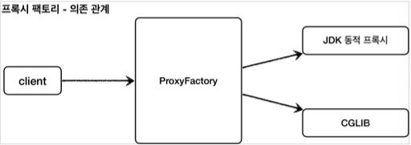
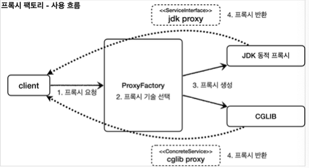
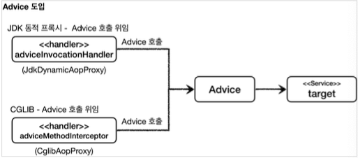
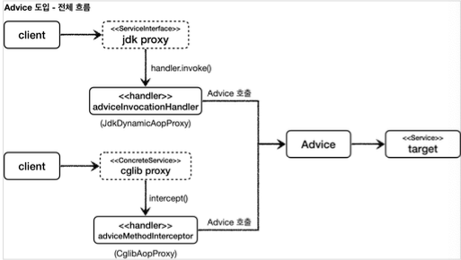
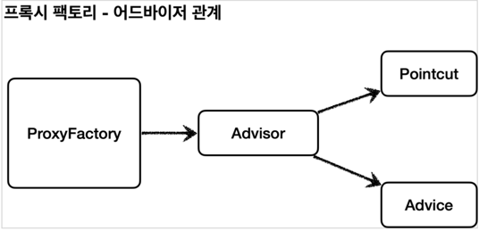
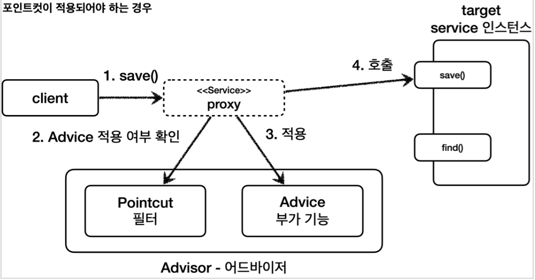
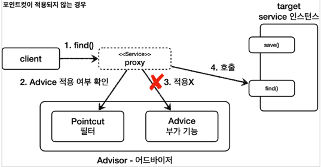

# 스프링이 지원하는 프록시

## 프록시 팩토리


#### 문제점
* 인터페이스가 있는 경우에는 JDK 동적 프록시를 적용하고, 그렇지 않은 경우에는 CGLIB를 적용하는 방법이 있어야 한다.
* 두 기술을 함께 사용할 때 부가 기능을 제공하기 위해 JDK 동적 프록시가 제공하는 `InvocationHandler` 와 CGLIB가 제공하는 
  `MethodInterceptor` 를 통해 해서 관리해야 한다.
* 특정 조건에 맞을 때 프록시 로직을 적용하는 기능도 공통으로 제공되어야 한다.


### 인터페이스가 있는 경우에는 JDK 동적 프록시를 적용하고, 그렇지 않은 경우에는 CGLIB를 적용하는 방법이 있어야 한다.

스프링은 유사한 구체적인 기술들이 있을 때, 그것들을 통합해서 일관성 있게 접근할 수 있고, 더욱 편리하게 사용할 수 있는 추상화된 기술을 제공한다.


스프링은 동적 프록시를 통합해서 편리하게 만들어주는 프록시 팩토리(`ProxyFactory`)라는 기능을 제공한다.


이전에는 상황에 따라서 JDK 동적 프록시를 사용하거나 CGLIB를 사용해야 했다면, 
이 프록시 팩토리 하나로 편리하게 동적 프록시를 생성할 수 있다.


프록시 팩토리는 인터페이스가 있으면 JDK 동적 프록시를 사용하고, 구체 클래스만 있다면 CGLIB를 사용한다. 그리고 이 설정을 변경할 수도 있다.

#### 프록시 팩토리







### 두 기술을 함께 사용할 때 부가 기능을 제공하기 위해 JDK 동적 프록시가 제공하는 `InvocationHandler` 와 CGLIB가 제공하는 `MethodInterceptor` 를 통해 해서 관리해야 한다.


스프링은 이 문제를 해결하기 위해 부가 기능을 적용할 때 `Advice` 라는 새로운 개념을 도입했다. 개발자는 
`InvocationHandler` 나 `MethodInterceptor` 를 신경쓰지 않고, `Advice` 만 만들면 된다.


결과적으로 `InvocationHandler` 나 `MethodInterceptor` 는 `Advice` 를 호출하게 된다.
프록시 팩토리를 사용하면 `Advice` 를 호출하는 전용 `InvocationHandler` , `MethodInterceptor` 를 내부에서 사용한다.








### 특정 조건에 맞을 때 프록시 로직을 적용하는 기능도 공통으로 제공되어야 한다.

앞서 특정 메서드 이름의 조건에 맞을 때만 프록시 부가 기능이 적용되는 코드를 직접 만들었다. 스프링은 Pointcut 이라는 개념을 도입해서 이 문제를 일관성 있게 해결한다.


## 프록시 팩토리 - 예제 코드1

#### Advice 만들기

`Advice` 는 프록시에 적용하는 **부가 기능 로직**이다. 이것은 JDK 동적 프록시가 제공하는 `InvocationHandler` 와 CGLIB가 제공하는
`MethodInterceptor` 의 개념과 유사한다. 둘을 개념적으로 추상화 한 것이다. 프록시 팩토리를 사용하면 둘 대신에 `Advice` 를 사용하면 된다.


Advice 를 만드는 방법은 여러가지가 있지만, 기본적인 방법은 다음 인터페이스를 구현하면 된다.


#### MethodInterceptor - 스프링이 제공하는 코드

```java
package org.aopalliance.intercept;

public interface MethodInterceptor extends Interceptor {
  Object invoke(MethodInvocation invocation) throws Throwable;
}
```

* `MethodInvocation invocation`
  * 내부에는 다음 메서드를 호출하는 방법, 현재 프록시 객체 인스턴스, `args` , 메서드 정보 등이 포함되어 있다. 
    기존에 파라미터로 제공되는 부분들이 이 안으로 모두 들어갔다고 생각하면 된다.
* CGLIB의 `MethodInterceptor` 와 이름이 같으므로 패키지 이름에 주의하자
  * 여기서 사용하는 `org.aopalliance.intercept` 패키지는 스프링 AOP 모듈(`spring-top`) 안에 들어있다.
* `MethodInterceptor` 는 `Interceptor` 를 상속하고 `Interceptor` 는 `Advice` 인터페이스를 상속한다.


#### TimeAdvice

```java
package hello.proxy.common.advice;

import lombok.extern.slf4j.Slf4j;
import org.aopalliance.intercept.MethodInterceptor;
import org.aopalliance.intercept.MethodInvocation;

@Slf4j
public class TimeAdvice implements MethodInterceptor {
    @Override
    public Object invoke(MethodInvocation invocation) throws Throwable {
        log.info("TimeProxy 실행");
        long startTime = System.currentTimeMillis();

        Object result = invocation.proceed();

        long endTime = System.currentTimeMillis();
        long resultTime = endTime - startTime;
        log.info("TimeProxy 종료 resultTime={}", resultTime);
        return result;
    }
}
```

* `TimeAdvice` 는 앞서 설명한 `MethodInterceptor` 인터페이스를 구현한다. 패키지 이름에 주의 
* `Object result = invocation.proceed()`
  * `invocation.proceed()` 를 호출하면 `target` 클래스를 호출하고 그 결과를 받는다.
  * 그런데 기존에 보았던 코드들과 다르게 `target` 클래스의 정보가 보이지 않는다. `target` 
    클래스의 정보는 `MethodInvocation invocation` 안에 모두 포함되어 있다.
  * 그 이유는 바로 다음에 확인할 수 있는데, 프록시 팩토리로 프록시를 생성하는 단계에서 이미 
    `target` 정보를 파라미터로 전달받기 때문이다.


#### ProxyFactoryTest

```java
package hello.proxy.proxyfactory;

import hello.proxy.common.advice.TimeAdvice;
import hello.proxy.common.service.ServiceImpl;
import hello.proxy.common.service.ServiceInterface;
import lombok.extern.slf4j.Slf4j;
import org.junit.jupiter.api.DisplayName;
import org.junit.jupiter.api.Test;
import org.springframework.aop.framework.ProxyFactory;
import org.springframework.aop.support.AopUtils;

import static org.assertj.core.api.Assertions.assertThat;

@Slf4j
public class ProxyFactoryTest {

    @Test
    @DisplayName("인터페이스가 있으면 JDK 동적 프록시 사용")
    public void interfaceProxy() {
        ServiceImpl target = new ServiceImpl();
        ProxyFactory proxyFactory = new ProxyFactory(target);
        proxyFactory.addAdvice(new TimeAdvice());
        ServiceInterface proxy = (ServiceInterface) proxyFactory.getProxy();
        log.info("targetClass={}", target.getClass());
        log.info("proxyClass={}", proxy.getClass());

        proxy.save();

        assertThat(AopUtils.isAopProxy(proxy)).isTrue();
        assertThat(AopUtils.isJdkDynamicProxy(proxy)).isTrue();
        assertThat(AopUtils.isCglibProxy(proxy)).isFalse();
    }
}
```

* `new ProxyFactory(target)` : 프록시 팩토리를 생성할 때, 생성자에 프록시의 호출 대상을 함께 넘겨준다. 
  프록시 팩토리는 이 인스턴스 정보를 기반으로 프록시를 만들어낸다. 만약 이 인스턴스에 인터페이스가 있다면 JDK 동적 프록시를 기본으로 사용하고 
  인터페이스가 없고 구체 클래스만 있다면 CGLIB를 통해서 동적 프록시를 생성한다. 여기서는 `target` 이 `new ServiceImpl()` 의 
  인스턴스이기 때문에 `ServiceInterface` 인터페이스가 있다. 따라서 이 인터페이스를 기반으로 JDK 동적 프록시를 생성한다.
* `proxyFactory.addAdvice(new TimeAdvice())` : 프록시 팩토리를 통해서 만든 프록시가 사용할 부가 기능 로직을 설정한다. 
  JDK 동적 프록시가 제공하는 `InvocationHandler` 와 CGLIB가 제공하는 `MethodInterceptor` 의 개념과 유사하다. 
  이렇게 프록시가 제공하는 부가 기능 로직을 어드바이스 (`Advice`)라 한다. 번역하면 조언을 해준다고 생각하면 된다.
* `proxyFactory.getProxy()` : 프록시 객체를 생성하고 그 결과를 받는다.


#### 프록시 팩토리를 통한 프록시 적용 확인
프록시 팩토리로 프록시가 잘 적용되었는지 확인하려면 다음 기능을 사용하면 된다. 
* `AopUtils.isAopProxy(proxy)` : 프록시 팩토리를 통해서 프록시가 생성되면 JDK 동적 프록시나, CGLIB 모두 참이다. 
* `AopUtils.isJdkDynamicProxy(proxy)` : 프록시 팩토리를 통해서 프록시가 생성되고, JDK 동적 프록시인 경우 참
* `AopUtils.isCglibProxy(proxy)` : 프록시 팩토리를 통해서 프록시가 생성되고, CGLIB 동적 프록시인 경우 경우 참


## 프록시 팩토리 - 예제 코드2

#### ProxyFactoryTest - concreteProxy 추가

```java
@Test
@DisplayName("구체 클래스만 있으면 CGLIB 사용")
public void concreteProxy() {
    ConcreteService target = new ConcreteService();
    ProxyFactory proxyFactory = new ProxyFactory(target);
    proxyFactory.addAdvice(new TimeAdvice());
    ConcreteService proxy = (ConcreteService) proxyFactory.getProxy();
    log.info("targetClass={}", target.getClass());
    log.info("proxyClass={}", proxy.getClass());

    proxy.call();

    assertThat(AopUtils.isAopProxy(proxy)).isTrue();
    assertThat(AopUtils.isJdkDynamicProxy(proxy)).isFalse();
    assertThat(AopUtils.isCglibProxy(proxy)).isTrue();
}
```

프록시 팩토리는 인터페이스 없이 구체 클래스만 있으면 CGLIB를 사용해서 프록시를 적용한다. 
나머지 코드는 기존과 같다.


### proxyTargetClass 옵션


#### ProxyFactoryTest - proxyTargetClass 추가

```java
@Test
@DisplayName("ProxtTargetClass 옵션을 사용하면 인터페이스가 있어도 CGLIB를 사용하고, 클래스 기반 프록시 사용")
public void proxyTargetClass() {
    ServiceImpl target = new ServiceImpl();
    ProxyFactory proxyFactory = new ProxyFactory(target);
    proxyFactory.setProxyTargetClass(true);
    proxyFactory.addAdvice(new TimeAdvice());
    ServiceInterface proxy = (ServiceInterface) proxyFactory.getProxy();
    log.info("targetClass={}", target.getClass());
    log.info("proxyClass={}", proxy.getClass());

    proxy.save();

    assertThat(AopUtils.isAopProxy(proxy)).isTrue();
    assertThat(AopUtils.isJdkDynamicProxy(proxy)).isFalse();
    assertThat(AopUtils.isCglibProxy(proxy)).isTrue();
}
```

인터페이스가 있지만, CGLIB를 사용해서 인터페이스가 아닌 클래스 기반으로 동적 프록시를 만드는 방법이다.
프록시 팩토리는 `proxyTargetClass` 라는 옵션을 제공하는데, 이 옵션에 `true` 값을 넣으면 인터페이스가
있어도 강제로 CGLIB를 사용한다. 그리고 인터페이스가 아닌 클래스 기반의 프록시를 만들어준다.


`ServiceImpl$$EnhancerBySpringCGLIB...` 를 보면 CGLIB 기반의 프록시가 생성된 것을 
확인할 수 있다. 인터페이스가 있지만 `proxyTargetClass` 옵션에 의해 CGLIB가 사용된다.


### 프록시 팩토리의 기술 선택 방법
대상에 인터페이스가 있으면: JDK 동적 프록시, 인터페이스 기반 프록시 
대상에 인터페이스가 없으면: CGLIB, 구체 클래스 기반 프록시
`proxyTargetClass=true` : CGLIB, 구체 클래스 기반 프록시, 인터페이스 여부와 상관없음

### 정리
* 프록시 팩토리의 서비스 추상화 덕분에 구체적인 CGLIB, JDK 동적 프록시 기술에 의존하지 않고, 
  매우 편리하게 동적 프록시를 생성할 수 있다. 
* 프록시의 부가 기능 로직도 특정 기술에 종속적이지 않게 `Advice` 하나로 편리하게 사용할 수 있었다.
  이것은 프록시 팩토리가 내부에서 JDK 동적 프록시인 경우 `InvocationHandler` 가 
  `Advice` 를 호출하도록 개발해두고, CGLIB인 경우 `MethodInterceptor` 가 
  `Advice` 를 호출하도록 기능을 개발해두었기 때문이다.


## 포인트컷, 어드바이스, 어드바이저

#### 포인트컷(`Pointcut`)

어디에 부가 기능을 적용할지, 어디에 부가 기능을 적용하지 않을지 판단하는 필터링 로직이다. 
주로 클래스와 메서드 이름으로 필터링 한다. 
이름 그대로 어떤 포인트(Point)에 기능을 적용할지 하지 않을지 잘라서(cut) 구분하는 것이다.

#### 어드바이스(`Advice`)

이전에 본 것 처럼 프록시가 호출하는 부가 기능이다. 단순하게 프록시 로직이라 생각하면 된다.

#### 어드바이저(`Advisor`)

단순하게 하나의 포인트컷과 하나의 어드바이스를 가지고 있는 것이다.
쉽게 이야기해서 포인트컷1 + 어드바이스1이다.


#### 쉽게 기억하기
* 조언(`Advice`)을 어디(`Pointcut`)에 할 것인가? 
* 조언자(`Advisor`)는 어디(`Pointcut`)에 조언(`Advice`)을 해야할지 할지 알고 있다.


#### 역할과 책임
이렇게 구분한 것은 역할과 책임을 명확하게 분리한 것이다.

* 포인트컷은 대상 여부를 확인하는 필터 역할만 담당한다. 
* 어드바이스는 깔끔하게 부가 기능 로직만 담당한다. 
* 둘을 합치면 어드바이저가 된다. 스프링의 어드바이저는 하나의 포인트컷 + 하나의 어드바이스로 구성된다.


## 예제 코드1 - 어드바이저


어드바이저는 하나의 포인트컷과 하나의 어드바이스를 가지고 있다.
프록시 팩토리를 통해 프록시를 생성할 때 어드바이저를 제공하면 어디에 
어떤 기능을 제공할 지 알 수 있다.


#### AdvisorTest

```java
package hello.proxy.advisor;

import hello.proxy.common.advice.TimeAdvice;
import hello.proxy.common.service.ServiceImpl;
import hello.proxy.common.service.ServiceInterface;
import org.junit.jupiter.api.Test;
import org.springframework.aop.Pointcut;
import org.springframework.aop.framework.ProxyFactory;
import org.springframework.aop.support.DefaultPointcutAdvisor;

public class AdvisorTest {

    @Test
    public void advisorTest1() {
        ServiceInterface target = new ServiceImpl();
        ProxyFactory proxyFactory = new ProxyFactory(target);
        DefaultPointcutAdvisor advisor = new DefaultPointcutAdvisor(Pointcut.TRUE, new TimeAdvice());
        proxyFactory.addAdvisor(advisor);
        ServiceInterface proxy = (ServiceInterface) proxyFactory.getProxy();

        proxy.save();
        proxy.find();
    }
}
```

* `new DefaultPointcutAdvisor` : `Advisor` 인터페이스의 가장 일반적인 구현체이다. 생성자를 통해 하나의 포인트컷과 
  하나의 어드바이스를 넣어주면 된다. 어드바이저는 하나의 포인트컷과 하나의 어드바이스로 구성된다. 
* `Pointcut.TRUE` : 항상 true 를 반환하는 포인트컷이다. 이후에 직접 포인트컷을 구현해볼 것이다.
* `new TimeAdvice()` : 앞서 개발한 `TimeAdvice` 어드바이스를 제공한다. 
* `proxyFactory.addAdvisor(advisor)` : 프록시 팩토리에 적용할 어드바이저를 지정한다.
  어드바이저는 내부에 포인트컷과 어드바이스를 모두 가지고 있다. 
  따라서 어디에 어떤 부가 기능을 적용해야 할지 어드바이스 하나로 알 수 있다. 
  프록시 팩토리를 사용할 때 어드바이저는 필수이다. 
* `proxyFactory.addAdvice(new TimeAdvice())` 이렇게 어드바이저가 아니라 어드바이스를 바로 적용했다. 이것은 단순히 편의 메서드이고 결과적으로 
  해당 메서드 내부에서 지금 코드와 똑같은 다음 어드바이저가 생성된다. 
  `DefaultPointcutAdvisor(Pointcut.TRUE, new TimeAdvice())`





## 예제 코드2 - 직접 만든 포인트컷


#### Pointcut 관련 인터페이스 - 스프링 제공

```java
/*
 * Copyright 2002-2012 the original author or authors.
 *
 * Licensed under the Apache License, Version 2.0 (the "License");
 * you may not use this file except in compliance with the License.
 * You may obtain a copy of the License at
 *
 *      https://www.apache.org/licenses/LICENSE-2.0
 *
 * Unless required by applicable law or agreed to in writing, software
 * distributed under the License is distributed on an "AS IS" BASIS,
 * WITHOUT WARRANTIES OR CONDITIONS OF ANY KIND, either express or implied.
 * See the License for the specific language governing permissions and
 * limitations under the License.
 */

package org.springframework.aop;

/**
 * Core Spring pointcut abstraction.
 *
 * <p>A pointcut is composed of a {@link ClassFilter} and a {@link MethodMatcher}.
 * Both these basic terms and a Pointcut itself can be combined to build up combinations
 * (e.g. through {@link org.springframework.aop.support.ComposablePointcut}).
 *
 * @author Rod Johnson
 * @see ClassFilter
 * @see MethodMatcher
 * @see org.springframework.aop.support.Pointcuts
 * @see org.springframework.aop.support.ClassFilters
 * @see org.springframework.aop.support.MethodMatchers
 */
public interface Pointcut {

	/**
	 * Return the ClassFilter for this pointcut.
	 * @return the ClassFilter (never {@code null})
	 */
	ClassFilter getClassFilter();

	/**
	 * Return the MethodMatcher for this pointcut.
	 * @return the MethodMatcher (never {@code null})
	 */
	MethodMatcher getMethodMatcher();


	/**
	 * Canonical Pointcut instance that always matches.
	 */
	Pointcut TRUE = TruePointcut.INSTANCE;

}
```

포인트컷은 크게 `ClassFilter` 와 `MethodMatcher` 둘로 이루어진다. 이름 그대로 하나는 클래스가
맞는지, 하나는 메서드가 맞는지 확인할 때 사용한다. 둘다 `true` 로 반환해야 어드바이스를 적용할 수 있다.


#### AdvisorTest - advisorTest2() 추가  

```java
@Test
@DisplayName("직접 만든 포인트컷")
public void advisorTest2() {
        ServiceInterface target = new ServiceImpl();
        ProxyFactory proxyFactory = new ProxyFactory(target);
        DefaultPointcutAdvisor advisor = new DefaultPointcutAdvisor(new MyPointcut(), new TimeAdvice());
        proxyFactory.addAdvisor(advisor);
        ServiceInterface proxy = (ServiceInterface) proxyFactory.getProxy();

        proxy.save();
        proxy.find();
}

static class MyPointcut implements Pointcut{

  @Override
  public ClassFilter getClassFilter() {
    return ClassFilter.TRUE;
  }

  @Override
  public MethodMatcher getMethodMatcher() {
    return new MyMethodMatcher();
  }
}

static class MyMethodMatcher implements MethodMatcher{

  private String matchName = "save";

  @Override
  public boolean matches(Method method, Class<?> targetClass) {
    boolean result = method.getName().equals(matchName);
    log.info("포인트컷 호출 method={}, targetClass={}", method.getName(), targetClass);
    log.info("포인트컷 결과 result={}", result);
    return result;
  }

  @Override
  public boolean isRuntime() {
    return false;
  }

  @Override
  public boolean matches(Method method, Class<?> targetClass, Object... args) {
    return false;
  }
}
```


#### MyPointcut
* 직접 구현한 포인트컷이다. `Pointcut` 인터페이스를 구현한다. 
* 현재 메서드 기준으로 로직을 적용하면 된다. 클래스 필터는 항상 `true` 를 반환하도록 했고, 
  메서드 비교 기능은 `MyMethodMatcher` 를 사용한다.


#### MyMethodMatcher
* 직접 구현한 `MethodMatcher` 이다. `MethodMatcher` 인터페이스를 구현한다.
* `matches()` : 이 메서드에 `method` , `targetClass` 정보가 넘어온다. 
  이 정보로 어드바이스를 적용할지 적용하지 않을지 판단할 수 있다. 
* 여기서는 메서드 이름이 `"save"` 인 경우에 `true` 를 반환하도록 판단 로직을 적용했다.
* `isRuntime()` , `matches(... args)` : `isRuntime()` 이 값이 참이면 
  `matches(... args`) 메서드가 대신 호출된다. 동적으로 넘어오는 매개변수를 판단 로직으로 사용할 수 있다.
  * `isRuntime()` 이 `false` 인 경우 클래스의 정적 정보만 사용하기 때문에 
    스프링이 내부에서 캐싱을 통해 성능 향상이 가능하지만, 
    `isRuntime()` 이 `true` 인 경우 매개변수가 동적으로 변경된다고 
    가정하기 때문에 캐싱을 하지 않는다.


#### new DefaultPointcutAdvisor(new MyPointcut(), new TimeAdvice())

어드바이저에 직접 구현한 포인트컷을 사용한다.

#### save() 호출




1. 클라이언트가 프록시의 `save()` 를 호출한다.
2. 포인트컷에 `Service` 클래스의 `save()` 메서드에 어드바이스를 적용해도 될지 물어본다.
3. 포인트컷이 `true` 를 반환한다. 따라서 어드바이스를 호출해서 부가 기능을 적용한다.
4. 이후 실제 인스턴스의 `save()` 를 호출한다.

#### find() 호출





1. 클라이언트가 프록시의 `find()` 를 호출한다.
2. 포인트컷에 `Service` 클래스의 `find()` 메서드에 어드바이스를 적용해도 될지 물어본다.
3. 포인트컷이 `false` 를 반환한다. 따라서 어드바이스를 호출하지 않고, 
   부가 기능도 적용되지 않는다.
4. 실제 인스턴스를 호출한다.

