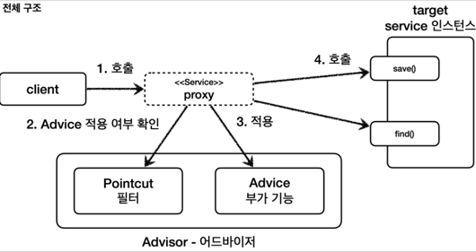
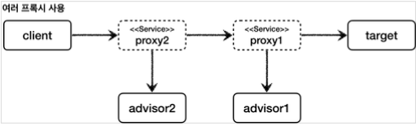
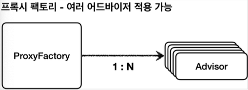
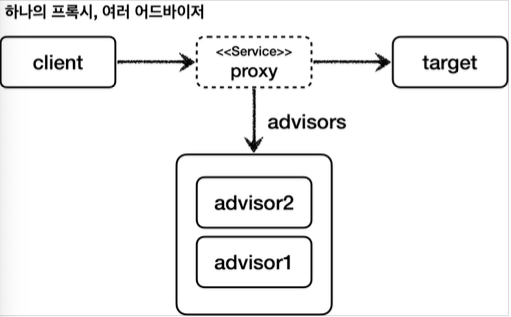

# 스프링이 지원하는 프록시

## 프록시 팩토리


#### 문제점
* 인터페이스가 있는 경우에는 JDK 동적 프록시를 적용하고, 그렇지 않은 경우에는 CGLIB를 적용하는 방법이 있어야 한다.
* 두 기술을 함께 사용할 때 부가 기능을 제공하기 위해 JDK 동적 프록시가 제공하는 `InvocationHandler` 와 CGLIB가 제공하는 
  `MethodInterceptor` 를 통해 해서 관리해야 한다.
* 특정 조건에 맞을 때 프록시 로직을 적용하는 기능도 공통으로 제공되어야 한다.


### 인터페이스가 있는 경우에는 JDK 동적 프록시를 적용하고, 그렇지 않은 경우에는 CGLIB를 적용하는 방법이 있어야 한다.

스프링은 유사한 구체적인 기술들이 있을 때, 그것들을 통합해서 일관성 있게 접근할 수 있고, 더욱 편리하게 사용할 수 있는 추상화된 기술을 제공한다.


스프링은 동적 프록시를 통합해서 편리하게 만들어주는 프록시 팩토리(`ProxyFactory`)라는 기능을 제공한다.


이전에는 상황에 따라서 JDK 동적 프록시를 사용하거나 CGLIB를 사용해야 했다면, 
이 프록시 팩토리 하나로 편리하게 동적 프록시를 생성할 수 있다.


프록시 팩토리는 인터페이스가 있으면 JDK 동적 프록시를 사용하고, 구체 클래스만 있다면 CGLIB를 사용한다. 그리고 이 설정을 변경할 수도 있다.

#### 프록시 팩토리


### 두 기술을 함께 사용할 때 부가 기능을 제공하기 위해 JDK 동적 프록시가 제공하는 `InvocationHandler` 와 CGLIB가 제공하는 `MethodInterceptor` 를 통해 해서 관리해야 한다.


스프링은 이 문제를 해결하기 위해 부가 기능을 적용할 때 `Advice` 라는 새로운 개념을 도입했다. 개발자는 
`InvocationHandler` 나 `MethodInterceptor` 를 신경쓰지 않고, `Advice` 만 만들면 된다.


결과적으로 `InvocationHandler` 나 `MethodInterceptor` 는 `Advice` 를 호출하게 된다.
프록시 팩토리를 사용하면 `Advice` 를 호출하는 전용 `InvocationHandler` , `MethodInterceptor` 를 내부에서 사용한다.


### 특정 조건에 맞을 때 프록시 로직을 적용하는 기능도 공통으로 제공되어야 한다.

앞서 특정 메서드 이름의 조건에 맞을 때만 프록시 부가 기능이 적용되는 코드를 직접 만들었다. 스프링은 Pointcut 이라는 개념을 도입해서 이 문제를 일관성 있게 해결한다.


## 프록시 팩토리 - 예제 코드1

#### Advice 만들기

`Advice` 는 프록시에 적용하는 **부가 기능 로직**이다. 이것은 JDK 동적 프록시가 제공하는 `InvocationHandler` 와 CGLIB가 제공하는
`MethodInterceptor` 의 개념과 유사한다. 둘을 개념적으로 추상화 한 것이다. 프록시 팩토리를 사용하면 둘 대신에 `Advice` 를 사용하면 된다.


Advice 를 만드는 방법은 여러가지가 있지만, 기본적인 방법은 다음 인터페이스를 구현하면 된다.


#### MethodInterceptor - 스프링이 제공하는 코드

```java
package org.aopalliance.intercept;

public interface MethodInterceptor extends Interceptor {
  Object invoke(MethodInvocation invocation) throws Throwable;
}
```

* `MethodInvocation invocation`
  * 내부에는 다음 메서드를 호출하는 방법, 현재 프록시 객체 인스턴스, `args` , 메서드 정보 등이 포함되어 있다. 
    기존에 파라미터로 제공되는 부분들이 이 안으로 모두 들어갔다고 생각하면 된다.
* CGLIB의 `MethodInterceptor` 와 이름이 같으므로 패키지 이름에 주의하자
  * 여기서 사용하는 `org.aopalliance.intercept` 패키지는 스프링 AOP 모듈(`spring-top`) 안에 들어있다.
* `MethodInterceptor` 는 `Interceptor` 를 상속하고 `Interceptor` 는 `Advice` 인터페이스를 상속한다.


#### TimeAdvice

```java
package hello.proxy.common.advice;

import lombok.extern.slf4j.Slf4j;
import org.aopalliance.intercept.MethodInterceptor;
import org.aopalliance.intercept.MethodInvocation;

@Slf4j
public class TimeAdvice implements MethodInterceptor {
    @Override
    public Object invoke(MethodInvocation invocation) throws Throwable {
        log.info("TimeProxy 실행");
        long startTime = System.currentTimeMillis();

        Object result = invocation.proceed();

        long endTime = System.currentTimeMillis();
        long resultTime = endTime - startTime;
        log.info("TimeProxy 종료 resultTime={}", resultTime);
        return result;
    }
}
```

* `TimeAdvice` 는 앞서 설명한 `MethodInterceptor` 인터페이스를 구현한다. 패키지 이름에 주의 
* `Object result = invocation.proceed()`
  * `invocation.proceed()` 를 호출하면 `target` 클래스를 호출하고 그 결과를 받는다.
  * 그런데 기존에 보았던 코드들과 다르게 `target` 클래스의 정보가 보이지 않는다. `target` 
    클래스의 정보는 `MethodInvocation invocation` 안에 모두 포함되어 있다.
  * 그 이유는 바로 다음에 확인할 수 있는데, 프록시 팩토리로 프록시를 생성하는 단계에서 이미 
    `target` 정보를 파라미터로 전달받기 때문이다.


#### ProxyFactoryTest

```java
package hello.proxy.proxyfactory;

import hello.proxy.common.advice.TimeAdvice;
import hello.proxy.common.service.ServiceImpl;
import hello.proxy.common.service.ServiceInterface;
import lombok.extern.slf4j.Slf4j;
import org.junit.jupiter.api.DisplayName;
import org.junit.jupiter.api.Test;
import org.springframework.aop.framework.ProxyFactory;
import org.springframework.aop.support.AopUtils;

import static org.assertj.core.api.Assertions.assertThat;

@Slf4j
public class ProxyFactoryTest {

    @Test
    @DisplayName("인터페이스가 있으면 JDK 동적 프록시 사용")
    public void interfaceProxy() {
        ServiceImpl target = new ServiceImpl();
        ProxyFactory proxyFactory = new ProxyFactory(target);
        proxyFactory.addAdvice(new TimeAdvice());
        ServiceInterface proxy = (ServiceInterface) proxyFactory.getProxy();
        log.info("targetClass={}", target.getClass());
        log.info("proxyClass={}", proxy.getClass());

        proxy.save();

        assertThat(AopUtils.isAopProxy(proxy)).isTrue();
        assertThat(AopUtils.isJdkDynamicProxy(proxy)).isTrue();
        assertThat(AopUtils.isCglibProxy(proxy)).isFalse();
    }
}
```

* `new ProxyFactory(target)` : 프록시 팩토리를 생성할 때, 생성자에 프록시의 호출 대상을 함께 넘겨준다. 
  프록시 팩토리는 이 인스턴스 정보를 기반으로 프록시를 만들어낸다. 만약 이 인스턴스에 인터페이스가 있다면 JDK 동적 프록시를 기본으로 사용하고 
  인터페이스가 없고 구체 클래스만 있다면 CGLIB를 통해서 동적 프록시를 생성한다. 여기서는 `target` 이 `new ServiceImpl()` 의 
  인스턴스이기 때문에 `ServiceInterface` 인터페이스가 있다. 따라서 이 인터페이스를 기반으로 JDK 동적 프록시를 생성한다.
* `proxyFactory.addAdvice(new TimeAdvice())` : 프록시 팩토리를 통해서 만든 프록시가 사용할 부가 기능 로직을 설정한다. 
  JDK 동적 프록시가 제공하는 `InvocationHandler` 와 CGLIB가 제공하는 `MethodInterceptor` 의 개념과 유사하다. 
  이렇게 프록시가 제공하는 부가 기능 로직을 어드바이스 (`Advice`)라 한다. 번역하면 조언을 해준다고 생각하면 된다.
* `proxyFactory.getProxy()` : 프록시 객체를 생성하고 그 결과를 받는다.


#### 프록시 팩토리를 통한 프록시 적용 확인
프록시 팩토리로 프록시가 잘 적용되었는지 확인하려면 다음 기능을 사용하면 된다. 
* `AopUtils.isAopProxy(proxy)` : 프록시 팩토리를 통해서 프록시가 생성되면 JDK 동적 프록시나, CGLIB 모두 참이다. 
* `AopUtils.isJdkDynamicProxy(proxy)` : 프록시 팩토리를 통해서 프록시가 생성되고, JDK 동적 프록시인 경우 참
* `AopUtils.isCglibProxy(proxy)` : 프록시 팩토리를 통해서 프록시가 생성되고, CGLIB 동적 프록시인 경우 경우 참


## 프록시 팩토리 - 예제 코드2

#### ProxyFactoryTest - concreteProxy 추가

```java
@Test
@DisplayName("구체 클래스만 있으면 CGLIB 사용")
public void concreteProxy() {
    ConcreteService target = new ConcreteService();
    ProxyFactory proxyFactory = new ProxyFactory(target);
    proxyFactory.addAdvice(new TimeAdvice());
    ConcreteService proxy = (ConcreteService) proxyFactory.getProxy();
    log.info("targetClass={}", target.getClass());
    log.info("proxyClass={}", proxy.getClass());

    proxy.call();

    assertThat(AopUtils.isAopProxy(proxy)).isTrue();
    assertThat(AopUtils.isJdkDynamicProxy(proxy)).isFalse();
    assertThat(AopUtils.isCglibProxy(proxy)).isTrue();
}
```

프록시 팩토리는 인터페이스 없이 구체 클래스만 있으면 CGLIB를 사용해서 프록시를 적용한다. 
나머지 코드는 기존과 같다.


### proxyTargetClass 옵션


#### ProxyFactoryTest - proxyTargetClass 추가

```java
@Test
@DisplayName("ProxtTargetClass 옵션을 사용하면 인터페이스가 있어도 CGLIB를 사용하고, 클래스 기반 프록시 사용")
public void proxyTargetClass() {
    ServiceImpl target = new ServiceImpl();
    ProxyFactory proxyFactory = new ProxyFactory(target);
    proxyFactory.setProxyTargetClass(true);
    proxyFactory.addAdvice(new TimeAdvice());
    ServiceInterface proxy = (ServiceInterface) proxyFactory.getProxy();
    log.info("targetClass={}", target.getClass());
    log.info("proxyClass={}", proxy.getClass());

    proxy.save();

    assertThat(AopUtils.isAopProxy(proxy)).isTrue();
    assertThat(AopUtils.isJdkDynamicProxy(proxy)).isFalse();
    assertThat(AopUtils.isCglibProxy(proxy)).isTrue();
}
```

인터페이스가 있지만, CGLIB를 사용해서 인터페이스가 아닌 클래스 기반으로 동적 프록시를 만드는 방법이다.
프록시 팩토리는 `proxyTargetClass` 라는 옵션을 제공하는데, 이 옵션에 `true` 값을 넣으면 인터페이스가
있어도 강제로 CGLIB를 사용한다. 그리고 인터페이스가 아닌 클래스 기반의 프록시를 만들어준다.


`ServiceImpl$$EnhancerBySpringCGLIB...` 를 보면 CGLIB 기반의 프록시가 생성된 것을 
확인할 수 있다. 인터페이스가 있지만 `proxyTargetClass` 옵션에 의해 CGLIB가 사용된다.


### 프록시 팩토리의 기술 선택 방법
대상에 인터페이스가 있으면: JDK 동적 프록시, 인터페이스 기반 프록시 
대상에 인터페이스가 없으면: CGLIB, 구체 클래스 기반 프록시
`proxyTargetClass=true` : CGLIB, 구체 클래스 기반 프록시, 인터페이스 여부와 상관없음

### 정리
* 프록시 팩토리의 서비스 추상화 덕분에 구체적인 CGLIB, JDK 동적 프록시 기술에 의존하지 않고, 
  매우 편리하게 동적 프록시를 생성할 수 있다. 
* 프록시의 부가 기능 로직도 특정 기술에 종속적이지 않게 `Advice` 하나로 편리하게 사용할 수 있었다.
  이것은 프록시 팩토리가 내부에서 JDK 동적 프록시인 경우 `InvocationHandler` 가 
  `Advice` 를 호출하도록 개발해두고, CGLIB인 경우 `MethodInterceptor` 가 
  `Advice` 를 호출하도록 기능을 개발해두었기 때문이다.


## 포인트컷, 어드바이스, 어드바이저

#### 포인트컷(`Pointcut`)

어디에 부가 기능을 적용할지, 어디에 부가 기능을 적용하지 않을지 판단하는 필터링 로직이다. 
주로 클래스와 메서드 이름으로 필터링 한다. 
이름 그대로 어떤 포인트(Point)에 기능을 적용할지 하지 않을지 잘라서(cut) 구분하는 것이다.

#### 어드바이스(`Advice`)

이전에 본 것 처럼 프록시가 호출하는 부가 기능이다. 단순하게 프록시 로직이라 생각하면 된다.

#### 어드바이저(`Advisor`)

단순하게 하나의 포인트컷과 하나의 어드바이스를 가지고 있는 것이다.
쉽게 이야기해서 포인트컷1 + 어드바이스1이다.


#### 쉽게 기억하기
* 조언(`Advice`)을 어디(`Pointcut`)에 할 것인가? 
* 조언자(`Advisor`)는 어디(`Pointcut`)에 조언(`Advice`)을 해야할지 할지 알고 있다.


#### 역할과 책임
이렇게 구분한 것은 역할과 책임을 명확하게 분리한 것이다.

* 포인트컷은 대상 여부를 확인하는 필터 역할만 담당한다. 
* 어드바이스는 깔끔하게 부가 기능 로직만 담당한다. 
* 둘을 합치면 어드바이저가 된다. 스프링의 어드바이저는 하나의 포인트컷 + 하나의 어드바이스로 구성된다.





## 예제 코드1 - 어드바이저


어드바이저는 하나의 포인트컷과 하나의 어드바이스를 가지고 있다.
프록시 팩토리를 통해 프록시를 생성할 때 어드바이저를 제공하면 어디에 
어떤 기능을 제공할 지 알 수 있다.


#### AdvisorTest

```java
package hello.proxy.advisor;

import hello.proxy.common.advice.TimeAdvice;
import hello.proxy.common.service.ServiceImpl;
import hello.proxy.common.service.ServiceInterface;
import org.junit.jupiter.api.Test;
import org.springframework.aop.Pointcut;
import org.springframework.aop.framework.ProxyFactory;
import org.springframework.aop.support.DefaultPointcutAdvisor;

public class AdvisorTest {

    @Test
    public void advisorTest1() {
        ServiceInterface target = new ServiceImpl();
        ProxyFactory proxyFactory = new ProxyFactory(target);
        DefaultPointcutAdvisor advisor = new DefaultPointcutAdvisor(Pointcut.TRUE, new TimeAdvice());
        proxyFactory.addAdvisor(advisor);
        ServiceInterface proxy = (ServiceInterface) proxyFactory.getProxy();

        proxy.save();
        proxy.find();
    }
}
```

* `new DefaultPointcutAdvisor` : `Advisor` 인터페이스의 가장 일반적인 구현체이다. 생성자를 통해 하나의 포인트컷과 
  하나의 어드바이스를 넣어주면 된다. 어드바이저는 하나의 포인트컷과 하나의 어드바이스로 구성된다. 
* `Pointcut.TRUE` : 항상 true 를 반환하는 포인트컷이다. 이후에 직접 포인트컷을 구현해볼 것이다.
* `new TimeAdvice()` : 앞서 개발한 `TimeAdvice` 어드바이스를 제공한다. 
* `proxyFactory.addAdvisor(advisor)` : 프록시 팩토리에 적용할 어드바이저를 지정한다.
  어드바이저는 내부에 포인트컷과 어드바이스를 모두 가지고 있다. 
  따라서 어디에 어떤 부가 기능을 적용해야 할지 어드바이스 하나로 알 수 있다. 
  프록시 팩토리를 사용할 때 어드바이저는 필수이다. 
* `proxyFactory.addAdvice(new TimeAdvice())` 이렇게 어드바이저가 아니라 어드바이스를 바로 적용했다. 이것은 단순히 편의 메서드이고 결과적으로 
  해당 메서드 내부에서 지금 코드와 똑같은 다음 어드바이저가 생성된다. 
  `DefaultPointcutAdvisor(Pointcut.TRUE, new TimeAdvice())`


## 예제 코드2 - 직접 만든 포인트컷


#### Pointcut 관련 인터페이스 - 스프링 제공

```java
/*
 * Copyright 2002-2012 the original author or authors.
 *
 * Licensed under the Apache License, Version 2.0 (the "License");
 * you may not use this file except in compliance with the License.
 * You may obtain a copy of the License at
 *
 *      https://www.apache.org/licenses/LICENSE-2.0
 *
 * Unless required by applicable law or agreed to in writing, software
 * distributed under the License is distributed on an "AS IS" BASIS,
 * WITHOUT WARRANTIES OR CONDITIONS OF ANY KIND, either express or implied.
 * See the License for the specific language governing permissions and
 * limitations under the License.
 */

package org.springframework.aop;

/**
 * Core Spring pointcut abstraction.
 *
 * <p>A pointcut is composed of a {@link ClassFilter} and a {@link MethodMatcher}.
 * Both these basic terms and a Pointcut itself can be combined to build up combinations
 * (e.g. through {@link org.springframework.aop.support.ComposablePointcut}).
 *
 * @author Rod Johnson
 * @see ClassFilter
 * @see MethodMatcher
 * @see org.springframework.aop.support.Pointcuts
 * @see org.springframework.aop.support.ClassFilters
 * @see org.springframework.aop.support.MethodMatchers
 */
public interface Pointcut {

	/**
	 * Return the ClassFilter for this pointcut.
	 * @return the ClassFilter (never {@code null})
	 */
	ClassFilter getClassFilter();

	/**
	 * Return the MethodMatcher for this pointcut.
	 * @return the MethodMatcher (never {@code null})
	 */
	MethodMatcher getMethodMatcher();


	/**
	 * Canonical Pointcut instance that always matches.
	 */
	Pointcut TRUE = TruePointcut.INSTANCE;

}
```

포인트컷은 크게 `ClassFilter` 와 `MethodMatcher` 둘로 이루어진다. 이름 그대로 하나는 클래스가
맞는지, 하나는 메서드가 맞는지 확인할 때 사용한다. 둘다 `true` 로 반환해야 어드바이스를 적용할 수 있다.


#### AdvisorTest - advisorTest2() 추가  

```java
@Test
@DisplayName("직접 만든 포인트컷")
public void advisorTest2() {
        ServiceInterface target = new ServiceImpl();
        ProxyFactory proxyFactory = new ProxyFactory(target);
        DefaultPointcutAdvisor advisor = new DefaultPointcutAdvisor(new MyPointcut(), new TimeAdvice());
        proxyFactory.addAdvisor(advisor);
        ServiceInterface proxy = (ServiceInterface) proxyFactory.getProxy();

        proxy.save();
        proxy.find();
}

static class MyPointcut implements Pointcut{

  @Override
  public ClassFilter getClassFilter() {
    return ClassFilter.TRUE;
  }

  @Override
  public MethodMatcher getMethodMatcher() {
    return new MyMethodMatcher();
  }
}

static class MyMethodMatcher implements MethodMatcher{

  private String matchName = "save";

  @Override
  public boolean matches(Method method, Class<?> targetClass) {
    boolean result = method.getName().equals(matchName);
    log.info("포인트컷 호출 method={}, targetClass={}", method.getName(), targetClass);
    log.info("포인트컷 결과 result={}", result);
    return result;
  }

  @Override
  public boolean isRuntime() {
    return false;
  }

  @Override
  public boolean matches(Method method, Class<?> targetClass, Object... args) {
    return false;
  }
}
```


#### MyPointcut
* 직접 구현한 포인트컷이다. `Pointcut` 인터페이스를 구현한다. 
* 현재 메서드 기준으로 로직을 적용하면 된다. 클래스 필터는 항상 `true` 를 반환하도록 했고, 
  메서드 비교 기능은 `MyMethodMatcher` 를 사용한다.


#### MyMethodMatcher
* 직접 구현한 `MethodMatcher` 이다. `MethodMatcher` 인터페이스를 구현한다.
* `matches()` : 이 메서드에 `method` , `targetClass` 정보가 넘어온다. 
  이 정보로 어드바이스를 적용할지 적용하지 않을지 판단할 수 있다. 
* 여기서는 메서드 이름이 `"save"` 인 경우에 `true` 를 반환하도록 판단 로직을 적용했다.
* `isRuntime()` , `matches(... args)` : `isRuntime()` 이 값이 참이면 
  `matches(... args`) 메서드가 대신 호출된다. 동적으로 넘어오는 매개변수를 판단 로직으로 사용할 수 있다.
  * `isRuntime()` 이 `false` 인 경우 클래스의 정적 정보만 사용하기 때문에 
    스프링이 내부에서 캐싱을 통해 성능 향상이 가능하지만, 
    `isRuntime()` 이 `true` 인 경우 매개변수가 동적으로 변경된다고 
    가정하기 때문에 캐싱을 하지 않는다.


#### new DefaultPointcutAdvisor(new MyPointcut(), new TimeAdvice())

어드바이저에 직접 구현한 포인트컷을 사용한다.

#### save() 호출


1. 클라이언트가 프록시의 `save()` 를 호출한다.
2. 포인트컷에 `Service` 클래스의 `save()` 메서드에 어드바이스를 적용해도 될지 물어본다.
3. 포인트컷이 `true` 를 반환한다. 따라서 어드바이스를 호출해서 부가 기능을 적용한다.
4. 이후 실제 인스턴스의 `save()` 를 호출한다.

#### find() 호출


1. 클라이언트가 프록시의 `find()` 를 호출한다.
2. 포인트컷에 `Service` 클래스의 `find()` 메서드에 어드바이스를 적용해도 될지 물어본다.
3. 포인트컷이 `false` 를 반환한다. 따라서 어드바이스를 호출하지 않고, 
   부가 기능도 적용되지 않는다.
4. 실제 인스턴스를 호출한다.


## 예제 코드3 - 스프링이 제공하는 포인트컷


#### AdvisorTest - advisorTest3() 추가

```java
@Test
@DisplayName("스프링이 제공하는 포인트컷")
public void advisorTest3() {
    ServiceInterface target = new ServiceImpl();
    ProxyFactory proxyFactory = new ProxyFactory(target);
    NameMatchMethodPointcut pointcut = new NameMatchMethodPointcut();
    pointcut.setMappedNames("save");
    DefaultPointcutAdvisor advisor = new DefaultPointcutAdvisor(pointcut, new TimeAdvice());
    proxyFactory.addAdvisor(advisor);
    ServiceInterface proxy = (ServiceInterface) proxyFactory.getProxy();

    proxy.save();
    proxy.find();
}
```

#### NameMatchMethodPointcut 사용 코드

```java
NameMatchMethodPointcut pointcut = new NameMatchMethodPointcut();
pointcut.setMappedNames("save");
```

`NameMatchMethodPointcut` 을 생성하고 `setMappedNames(...)` 으로 메서드 이름을 지정하면
포인트컷이 완성된다.

### 스프링이 제공하는 포인트컷

스프링은 무수히 많은 포인트컷을 제공한다.

* `NameMatchMethodPointcut` : 메서드 이름을 기반으로 매칭한다. 내부에서는 `PatternMatchUtils` 를 사용한다. 
* 예) *xxx* 허용 
* `JdkRegexpMethodPointcut` : JDK 정규 표현식을 기반으로 포인트컷을 매칭한다. 
* `TruePointcut` : 항상 참을 반환한다. 
* `AnnotationMatchingPointcut` : 애노테이션으로 매칭한다. 
* `AspectJExpressionPointcut` : aspectJ 표현식으로 매칭한다.


### 가장 중요한 것은 `aspectJ` 표현식
여기에서 사실 다른 것은 중요하지 않다. 실무에서는 사용하기도 편리하고 기능도 
가장 많은 `aspectJ` 표현식을 기반으로 사용하는 `AspectJExpressionPointcut` 을 사용하게 된다.


## 예제 코드4 - 여러 어드바이저 함께 적용


어드바이저는 하나의 포인트컷과 하나의 어드바이스를 가지고 있다.
만약 여러 어드바이저를 하나의 `target` 에 적용하려면 어떻게 해야할까?
하나의 `target` 에 여러 어드바이스를 적용하려면 어떻게 해야할까?


### 여러 프록시

#### MultiAdvisorTest

```java
package hello.proxy.advisor;

import hello.proxy.common.advice.TimeAdvice;
import hello.proxy.common.service.ServiceImpl;
import hello.proxy.common.service.ServiceInterface;
import lombok.extern.slf4j.Slf4j;
import org.aopalliance.intercept.MethodInterceptor;
import org.aopalliance.intercept.MethodInvocation;
import org.junit.jupiter.api.DisplayName;
import org.junit.jupiter.api.Test;
import org.springframework.aop.Pointcut;
import org.springframework.aop.framework.ProxyFactory;
import org.springframework.aop.support.DefaultPointcutAdvisor;
import org.springframework.aop.support.NameMatchMethodPointcut;

@Slf4j
public class MultiAdvisorTest {

    @Test
    public void multiAdvisorTest1() {
        ServiceInterface target = new ServiceImpl();
        ProxyFactory proxyFactory1 = new ProxyFactory(target);
        DefaultPointcutAdvisor advisor1 = new DefaultPointcutAdvisor(Pointcut.TRUE, new Advice1());
        proxyFactory1.addAdvisor(advisor1);
        ServiceInterface proxy1 = (ServiceInterface) proxyFactory1.getProxy();

        ProxyFactory proxyFactory2 = new ProxyFactory(proxy1);
        DefaultPointcutAdvisor advisor2 = new DefaultPointcutAdvisor(Pointcut.TRUE, new Advice2());
        proxyFactory2.addAdvisor(advisor2);
        ServiceInterface proxy2 = (ServiceInterface) proxyFactory2.getProxy();

        proxy2.save();
        proxy2.find();
    }

    static class Advice1 implements MethodInterceptor{

        @Override
        public Object invoke(MethodInvocation invocation) throws Throwable {
            log.info("advice1 호출");
            return invocation.proceed();
        }
    }

    static class Advice2 implements MethodInterceptor{

        @Override
        public Object invoke(MethodInvocation invocation) throws Throwable {
            log.info("advice2 호출");
            return invocation.proceed();
        }
    }
}

```

이 코드는 런타임에 다음과 같이 동작한다.




포인트컷은 `advisor1` , `advisor2` 모두 항상 true 를 반환하도록 설정했다. 따라서 둘다 어드바이스가 적용된다.


### 여러 프록시의 문제
이 방법이 잘못된 것은 아니지만, 프록시를 2번 생성해야 한다는 문제가 있다. 만약 적용해야 하는 어드바이저가 10개라면 10개의 프록시를 생성해야한다.


### 하나의 프록시, 여러 어드바이저
스프링은 이 문제를 해결하기 위해 하나의 프록시에 여러 어드바이저를 적용할 수 있게 만들어두었다.




#### MultiAdvisorTest - multiAdvisorTest2() 추가

```java
@Test
@DisplayName("하나의 프록시, 여러 어드비이저")
public void multiAdvisorTest2() {
    DefaultPointcutAdvisor advisor1 = new DefaultPointcutAdvisor(Pointcut.TRUE, new Advice1());
    DefaultPointcutAdvisor advisor2 = new DefaultPointcutAdvisor(Pointcut.TRUE, new Advice2());

    ServiceInterface target = new ServiceImpl();
    ProxyFactory proxyFactory = new ProxyFactory(target);

    proxyFactory.addAdvisor(advisor2);
    proxyFactory.addAdvisor(advisor1);
    ServiceInterface proxy = (ServiceInterface) proxyFactory.getProxy();

    proxy.save();
}
```

프록시 팩토리에 원하는 만큼 `addAdvisor()` 를 통해서 어드바이저를 등록하면 된다. 등록하는 순서대로 `advisor` 가 호출된다. 
여기서는 `advisor2` , `advisor1` 순서로 등록했다.




> 중요
> 
> 스프링의 AOP를 처음 공부하거나 사용하면, AOP 적용 수 만큼 프록시가 생성된다고 착각하게 된다. 실제 많은 실무 개발자들도 이렇게 생각하는 것을 보았다.
> 스프링은 AOP를 적용할 때, 최적화를 진행해서 지금처럼 프록시는 하나만 만들고, 하나의 프록시에 여러 어드바이저를 적용한다.
> 정리하면 하나의 target 에 여러 AOP가 동시에 적용되어도, 스프링의 AOP는 target 마다 하나의 프록시만 생성한다.


## 프록시 팩토리 - 적용1

#### LogTraceAdvice

```java
package hello.proxy.config.v3_proxyfactory;

import hello.proxy.trace.TraceStatus;
import hello.proxy.trace.logtrace.LogTrace;
import org.aopalliance.intercept.MethodInterceptor;
import org.aopalliance.intercept.MethodInvocation;

import java.lang.reflect.Method;

public class LogTraceAdvice implements MethodInterceptor {

    private final LogTrace logTrace;

    public LogTraceAdvice(LogTrace logTrace) {
        this.logTrace = logTrace;
    }

    @Override
    public Object invoke(MethodInvocation invocation) throws Throwable {
        TraceStatus status = null;
        try {
            Method method = invocation.getMethod();
            String message = method.getDeclaringClass().getSimpleName() + "." + method.getName() + "()";
            status = logTrace.begin(message);

            Object result = invocation.proceed();
            logTrace.end(status);
            return result;
        } catch (Exception e) {
            logTrace.exception(status, e);
            throw e;
        }
    }
}
```

#### ProxyFactoryConfigV1

```java
package hello.proxy.config.v3_proxyfactory;

import hello.proxy.app.v1.*;
import hello.proxy.config.v3_proxyfactory.advice.LogTraceAdvice;
import hello.proxy.trace.logtrace.LogTrace;
import lombok.extern.slf4j.Slf4j;
import org.springframework.aop.Advisor;
import org.springframework.aop.framework.ProxyFactory;
import org.springframework.aop.support.DefaultPointcutAdvisor;
import org.springframework.aop.support.NameMatchMethodPointcut;
import org.springframework.context.annotation.Bean;
import org.springframework.context.annotation.Configuration;

@Slf4j
@Configuration
public class ProxyFactoryConfigV1 {

    @Bean
    public OrderControllerV1 orderControllerV1(LogTrace logTrace){
        OrderControllerV1 orderController = new OrderControllerV1Impl(orderServiceV1(logTrace));
        ProxyFactory factory = new ProxyFactory(orderController);
        factory.addAdvisor(getAdvisor(logTrace));
        OrderControllerV1 proxy = (OrderControllerV1) factory.getProxy();
        log.info("ProxyFactory proxy={}, target={}", proxy.getClass(), orderController.getClass());
        return proxy;
    }

    @Bean
    public OrderServiceV1 orderServiceV1(LogTrace logTrace){
        OrderServiceV1 orderService = new OrderServiceV1Impl(orderRepositoryV1(logTrace));
        ProxyFactory factory = new ProxyFactory(orderService);
        factory.addAdvisor(getAdvisor(logTrace));
        OrderServiceV1 proxy = (OrderServiceV1) factory.getProxy();
        log.info("ProxyFactory proxy={}, target={}", proxy.getClass(), orderService.getClass());
        return proxy;
    }
    
    @Bean
    public OrderRepositoryV1 orderRepositoryV1(LogTrace logTrace){
        OrderRepositoryV1 orderRepository = new OrderRepositoryV1Impl();

        ProxyFactory factory = new ProxyFactory(orderRepository);
        factory.addAdvisor(getAdvisor(logTrace));
        OrderRepositoryV1 proxy = (OrderRepositoryV1) factory.getProxy();
        log.info("ProxyFactory proxy={}, target={}", proxy.getClass(), orderRepository.getClass());
        return proxy;
    }
    
    private Advisor getAdvisor(LogTrace logTrace) {
        NameMatchMethodPointcut pointcut = new NameMatchMethodPointcut();
        pointcut.setMappedNames("request*", "order*", "save*");

        LogTraceAdvice advice = new LogTraceAdvice(logTrace);
        return new DefaultPointcutAdvisor(pointcut, advice);
    }
}
```

* 포인트컷은 `NameMatchMethodPointcut` 을 사용한다. 여기에는 심플 매칭 기능이 있어서 `*` 을 매칭할 수 있다.
  * `request*` , `order*` , `save*` : `request` 로 시작하는 메서드에 포인트컷은 `true` 를 반환한다. 나머지도 같다. 
  * 이렇게 설정한 이유는 `noLog()` 메서드에는 어드바이스를 적용하지 않기 위해서다. 
* 어드바이저는 포인트컷( `NameMatchMethodPointcut` ), 어드바이스( `LogTraceAdvice` )를 가지고 있다. 
* 프록시 팩토리에 각각의 `target` 과 `advisor` 를 등록해서 프록시를 생성한다. 그리고 생성된 프록시를 스프링 빈으로 등록한다.

#### ProxyApplication

```java
package hello.proxy;

import hello.proxy.config.v3_proxyfactory.ProxyFactoryConfigV1;
import hello.proxy.trace.logtrace.LogTrace;
import hello.proxy.trace.logtrace.ThreadLocalLogTrace;
import org.springframework.boot.SpringApplication;
import org.springframework.boot.autoconfigure.SpringBootApplication;
import org.springframework.context.annotation.Bean;
import org.springframework.context.annotation.Import;

//@Import(AppV1Config.class)
//@Import({AppV2Config.class, AppV1Config.class})
//@Import(InterfaceProxyConfig.class)
//@Import(ConcreteProxyConfig.class)
//@Import(DynamicProxyBasicConfig.class)
//@Import(DynamicProxyFilterConfig.class)
@Import(ProxyFactoryConfigV1.class)
@SpringBootApplication(scanBasePackages = "hello.proxy.app") //주의
public class ProxyApplication {

	public static void main(String[] args) {
		SpringApplication.run(ProxyApplication.class, args);
	}

	@Bean
	public LogTrace logTrace(){
		return new ThreadLocalLogTrace();
	}
}
```

프록시 팩토리를 통한 ProxyFactoryConfigV1 설정을 등록하고 실행


#### 애플리케이션 로딩 로그

```text
ProxyFactory proxy=class com.sun.proxy.$Proxy50, target=class hello.proxy.app.v1.OrderRepositoryV1Impl
ProxyFactory proxy=class com.sun.proxy.$Proxy52, target=class hello.proxy.app.v1.OrderServiceV1Impl
ProxyFactory proxy=class com.sun.proxy.$Proxy53, target=class hello.proxy.app.v1.OrderControllerV1Impl
```


V1 애플리케이션은 인터페이스가 있기 때문에 프록시 팩토리가 JDK 동적 프록시를 적용한다. 
애플리케이션 로딩 로그를 통해서 JDK 동적 프록시가 적용된 것을 확인할 수 있다.


## 프록시 팩토리 - 적용2

이번에는 인터페이스가 없고, 구체 클래스만 있는 v2 애플리케이션에 `LogTrace` 기능을 프록시 팩토리를
통해서 프록시를 만들어 적용한다.

#### ProxyFactoryConfigV2

```java
package hello.proxy.config.v3_proxyfactory;

import hello.proxy.app.v1.*;
import hello.proxy.app.v2.OrderControllerV2;
import hello.proxy.app.v2.OrderRepositoryV2;
import hello.proxy.app.v2.OrderServiceV2;
import hello.proxy.config.v3_proxyfactory.advice.LogTraceAdvice;
import hello.proxy.trace.logtrace.LogTrace;
import lombok.extern.slf4j.Slf4j;
import org.springframework.aop.Advisor;
import org.springframework.aop.framework.ProxyFactory;
import org.springframework.aop.support.DefaultPointcutAdvisor;
import org.springframework.aop.support.NameMatchMethodPointcut;
import org.springframework.context.annotation.Bean;
import org.springframework.context.annotation.Configuration;

@Slf4j
@Configuration
public class ProxyFactoryConfigV2 {

  @Bean
  public OrderControllerV2 orderControllerV1(LogTrace logTrace){
    OrderControllerV2 orderController = new OrderControllerV2(orderServiceV2(logTrace));
    ProxyFactory factory = new ProxyFactory(orderController);
    factory.addAdvisor(getAdvisor(logTrace));
    OrderControllerV2 proxy = (OrderControllerV2) factory.getProxy();
    log.info("ProxyFactory proxy={}, target={}", proxy.getClass(), orderController.getClass());
    return proxy;
  }

  @Bean
  public OrderServiceV2 orderServiceV2(LogTrace logTrace){
    OrderServiceV2 orderService = new OrderServiceV2(orderRepositoryV2(logTrace));
    ProxyFactory factory = new ProxyFactory(orderService);
    factory.addAdvisor(getAdvisor(logTrace));
    OrderServiceV2 proxy = (OrderServiceV2) factory.getProxy();
    log.info("ProxyFactory proxy={}, target={}", proxy.getClass(), orderService.getClass());
    return proxy;
  }

  @Bean
  public OrderRepositoryV2 orderRepositoryV2(LogTrace logTrace){
    OrderRepositoryV2 orderRepository = new OrderRepositoryV2();

    ProxyFactory factory = new ProxyFactory(orderRepository);
    factory.addAdvisor(getAdvisor(logTrace));
    OrderRepositoryV2 proxy = (OrderRepositoryV2) factory.getProxy();
    log.info("ProxyFactory proxy={}, target={}", proxy.getClass(), orderRepository.getClass());
    return proxy;
  }

  private Advisor getAdvisor(LogTrace logTrace) {
    NameMatchMethodPointcut pointcut = new NameMatchMethodPointcut();
    pointcut.setMappedNames("request*", "order*", "save*");

    LogTraceAdvice advice = new LogTraceAdvice(logTrace);
    return new DefaultPointcutAdvisor(pointcut, advice);
  }
}
```


#### ProxyApplication

```java
package hello.proxy;

import hello.proxy.config.v3_proxyfactory.ProxyFactoryConfigV2;
import hello.proxy.trace.logtrace.LogTrace;
import hello.proxy.trace.logtrace.ThreadLocalLogTrace;
import org.springframework.boot.SpringApplication;
import org.springframework.boot.autoconfigure.SpringBootApplication;
import org.springframework.context.annotation.Bean;
import org.springframework.context.annotation.Import;

//@Import(AppV1Config.class)
//@Import({AppV2Config.class, AppV1Config.class})
//@Import(InterfaceProxyConfig.class)
//@Import(ConcreteProxyConfig.class)
//@Import(DynamicProxyBasicConfig.class)
//@Import(DynamicProxyFilterConfig.class)
//@Import(ProxyFactoryConfigV1.class)
@Import(ProxyFactoryConfigV2.class)
@SpringBootApplication(scanBasePackages = "hello.proxy.app") //주의
public class ProxyApplication {

	public static void main(String[] args) {
		SpringApplication.run(ProxyApplication.class, args);
	}

	@Bean
	public LogTrace logTrace(){
		return new ThreadLocalLogTrace();
	}
}
```

#### 애플리케이션 로딩 로그

```text
ProxyFactory proxy=class hello.proxy.app.v2.OrderRepositoryV2$$EnhancerBySpringCGLIB$$ba44681b, target=class hello.proxy.app.v2.OrderRepositoryV2
ProxyFactory proxy=class hello.proxy.app.v2.OrderServiceV2$$EnhancerBySpringCGLIB$$e94963e, target=class hello.proxy.app.v2.OrderServiceV2
ProxyFactory proxy=class hello.proxy.app.v2.OrderControllerV2$$EnhancerBySpringCGLIB$$bc4b8ed1, target=class hello.proxy.app.v2.OrderControllerV2
```

V2 애플리케이션은 인터페이스가 없고 구체 클래스만 있기 때문에 프록시 팩토리가 CGLIB을 적용한다. 
애플리케이션 로딩 로그를 통해서 CGLIB 프록시가 적용된 것을 확인할 수 있다.


### 정리
프록시 팩토리 덕분에 개발자는 매우 편리하게 프록시를 생성할 수 있게 되었다.
추가로 어드바이저, 어드바이스, 포인트컷 이라는 개념 덕분에 어떤 부가 기능을 어디에 적용할 지 명확하게 이해할 수 있었다.

#### 남은 문제
프록시 팩토리와 어드바이저 같은 개념 덕분에 지금까지 고민했던 문제들은 해결되었다. 
프록시도 깔끔하게 적용하고 포인트컷으로 어디에 부가 기능을 적용할지도 명확하게 정의할 수 있다. 
원본 코드를 전혀 손대지 않고 프록시를 통해 부가 기능도 적용할 수 있었다.

#### 문제1 - 너무 많은 설정
바로 `ProxyFactoryConfigV1` , `ProxyFactoryConfigV2` 와 같은 설정 파일이 지나치게 많다는 점이다. 
예를 들어서 애플리케이션에 스프링 빈이 100개가 있다면 여기에 프록시를 통해 부가 기능을 적용하려면 100개의 동적 프록시 생성 코드를 만들어야 한다! 
무수히 많은 설정 파일 때문에 설정 지옥을 경험하게 될 것이다.
최근에는 스프링 빈을 등록하기 귀찮아서 컴포넌트 스캔까지 사용하는데, 이렇게 직접 등록하는 것도 모자라서, 
프록시를 적용하는 코드까지 빈 생성 코드에 넣어야 한다.

#### 문제2 - 컴포넌트 스캔
애플리케이션 V3처럼 컴포넌트 스캔을 사용하는 경우 지금까지 학습한 방법으로는 프록시 적용이 불가능하다.
왜냐하면 실제 객체를 컴포넌트 스캔으로 스프링 컨테이너에 스프링 빈으로 등록을 다 해버린 상태이기 때문이다.
지금까지 학습한 프록시를 적용하려면, 실제 객체를 스프링 컨테이너에 빈으로 등록하는 것이 아니라
`ProxyFactoryConfigV1` 에서 한 것 처럼, 부가 기능이 있는 프록시를 실제 객체 대신 스프링 컨테이너에 빈으로 등록해야 한다.