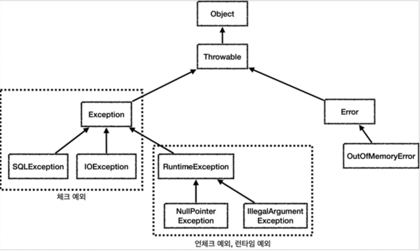
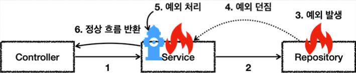
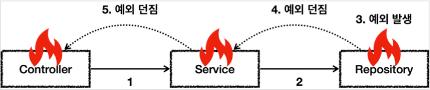

# 자바 예외 이해

## 예외 계층

스프링이 제공하는 예외 추상화를 이해하기 위해서는 먼저 자바 기본 예외에 대한 이해가 필요하다.

### 예외 계층 그림



* `Object` : 예외도 객체이다. 모든 객체의 최상위 부모는 Object 이므로 예외의 최상위 부모도 `Object` 이다.
* `Throwable` : 최상위 예외이다. 하위에 Exception 과 Error 가 있다.
* `Error` : 메모리 부족이나 심각한 시스템 오류와 같이 애플리케이션에서 복구 불가능한 시스템 예외이다. 
  애플리케이션 개발자는 이 예외를 잡으려고 해서는 안된다.
  * 상위 예외를 `catch` 로 잡으면 그 하위 예외까지 함께 잡는다. 따라서 애플리케이션 로직에서는 `Throwable` 예외도 잡으면 안되는데, 
    앞서 이야기한 `Error` 예외도 함께 잡을 수 있기 때문에다. 애플리케이션 로직은 이런 이유로 Exception 부터 필요한 예외로 생각하고 잡으면 된다.
  * `Error` 도 언체크 예외이다.
* `Exception` : 체크 예외
  * 애플리케이션 로직에서 사용할 수 있는 실질적인 최상위 예외이다.
  * `Exception` 과 그 하위 예외는 모두 컴파일러가 체크하는 체크 예외이다. 단 `RuntimeException` 은 예외로 한다.
* `RuntimeException` : 언체크 예외, 런타임 예외 
  * 컴파일러가 체크 하지 않는 언체크 예외이다.
  * `RuntimeException` 과 그 자식 예외는 모두 언체크 예외이다.
  * `RuntimeException` 의 이름을 따라서 `RuntimeException` 과 그 하위 언체크 예외를 런타임 예외라고 많이 부른다.

## 예외 기본 규칙

예외는 폭탄 돌리기와 같다. 잡아서 처리하거나, 처리할 수 없으면 밖으로 던져야한다.

#### 예외 처리



* 5번에서 예외를 처리하면 이후에는 애플리케이션 로직이 정상 흐름으로 동작한다.

#### 예외 던짐




예외를 처리하지 못하면 호출한 곳으로 예외를 계속 던지게 된다.


#### 예외에 대해서는 2가지 기본 규칙을 기억하자.

1. 예외는 잡아서 처리하거나 던져야 한다.
2. 예외를 잡거나 던질 때 지정한 예외뿐만 아니라 그 예외의 자식들도 함께 처리된다.
   * 예를 들어서 `Exception` 을 `catch` 로 잡으면 그 하위 예외들도 모두 잡을 수 있다. 
   * 예를 들어서 `Exception` 을 `throws` 로 던지면 그 하위 예외들도 모두 던질 수 있다.

#### 참고: 예외를 처리하지 못하고 계속 던지면 어떻게 될까?

* 자바 `main()` 쓰레드의 경우 예외 로그를 출력하면서 시스템이 종료된다.
* 웹 애플리케이션의 경우 여러 사용자의 요청을 처리하기 때문에 하나의 예외 때문에 시스템이 종료되면 안된다. 
  WAS가 해당 예외를 받아서 처리하는데, 주로 사용자에게 개발자가 지정한, 오류 페이지를 보여준다.


## 체크 예외 기본 이해

* `Exception` 과 그 하위 예외는 모두 컴파일러가 체크하는 체크 예외이다. 
  단 `RuntimeException` 은 예외로 한다.
* 체크 예외는 잡아서 처리하거나, 또는 밖으로 던지도록 선언해야한다. 그렇지 않으면 컴파일 오류가 발생한다.


#### 체크 예외 전체 코드

```java
package hello.jdbc.exception;

import lombok.extern.slf4j.Slf4j;
import org.assertj.core.api.Assertions;
import org.junit.jupiter.api.Test;

@Slf4j
public class CheckedTest {

    @Test
    public void checked_catch() {
        Service service = new Service();
        service.callCatch();
    }

    @Test
    public void checked_throw(){
        Service service = new Service();
        Assertions.assertThatThrownBy(() -> service.callThrow())
                .isInstanceOf(MyCheckedException.class);
    }

    /**
     * Exception을 상속받은 예외는 체크 예외가 된다.
     */
    static class MyCheckedException extends Exception{
        public MyCheckedException(String message) {
            super(message);
        }
    }

    /**
     * Checked 예외는
     * 예외를 잡아서 처리하거나, 던지거나 필수적으로 하나를 선택
     */
    static class Service{
        Repository repository = new Repository();

        /**
         * 예외를 잡아서 처리하는 코드
         */
        public void callCatch(){
            try {
                repository.call();
            } catch (MyCheckedException e) {
                //예외 처리 로직
                log.info("예외 처리 로직, message={}", e.getMessage(), e);
            }
        }

        /**
         * 체크 예외를 밖으로 던지는 코드
         * 체크 예외는 예외를 잡지 않고 밖으로 던지려면 throws 예외를 메서드에 필수로 선언해야한다.
         * @throws MyCheckedException
         */
        public void callThrow() throws MyCheckedException {
            repository.call();
        }


    }

    static class Repository{
        public void call() throws MyCheckedException {
            throw new MyCheckedException("ex");
        }
    }
}
```

### Excpetion을 상속받은 예외는 체크 예외가 된다.

```java
static class MyCheckedException extends Exception{
    public MyCheckedException(String message) {
        super(message);
    }
}
```

* `MyCheckedException` 는 `Exception` 을 상속받았다. `Exception` 을 상속받으면 체크 예외가 된다. 
* `RuntimeException` 을 상속받으면 언체크 예외가 된다. 이런 규칙은 자바 언어에서 문법으로 정한 것이다.
* 예외가 제공하는 여러가지 기본 기능이 있는데, 그 중에 오류 메시지를 보관하는 기능도 있다. 
  예제에서 보는 것 처럼 생성자를 통해서 해당 기능을 그대로 사용하면 편리하다.


#### 체크 예외를 잡는 실행

```java
@Test
public void checked_catch() {
    Service service = new Service();
    service.callCatch();
}
```

`service.callCatch()` 에서 예외를 처리했기 때문에 테스트 메서드까지 예외가 올라오지 않는다.

#### 실행 순서 분석

1. `test` -> `service.callCatch()` -> `repository.call()` [예외 발생, 던짐] 
2. `test` ->  `service.callCatch()` [예외 처리] <- `repository.call()`
3. `test` [정상 흐름] -> `service.callCatch()` <- `repository.call()`

`Repository.call()` 에서 `MyUncheckedException` 예외가 발생하고, 
그 예외를 `Service.callCatch()` 에서 잡는 것을 확인할 수 있다.


#### 체크 예외를 잡아서 처리하는 코드

```java
public void callCatch(){
    try {
        repository.call();
    } catch (MyCheckedException e) {
        //예외 처리 로직
    }
}
```

체크 예외를 잡아서 처리하려면 `catch(..)` 를 사용해서 예외를 잡으면 된다.
여기서는 `MyCheckedException` 예외를 잡아서 처리한다.


#### catch는 해당 타입과 그 하위 타입을 모두 잡을 수 있다

```java
public void callCatch(){
    try {
        repository.call();
    } catch (Exception e) {
        //예외 처리 로직
    }
}
```

`catch` 에 `MyCheckedException` 의 상위 타입인 `Exception` 을 적어주어도 `MyCheckedException` 을 잡을 수 있다.
`catch` 에 예외를 지정하면 해당 예외와 그 하위 타입 예외를 모두 잡아준다.
물론 정확하게 `MyCheckedException` 만 잡고 싶다면 `catch` 에 `MyCheckedException` 을 적어주어야 한다.


### 예외를 밖으로 던지는 실행

```java
@Test
public void checked_throw(){
    Service service = new Service();
    Assertions.assertThatThrownBy(() -> service.callThrow())
            .isInstanceOf(MyCheckedException.class);
}
```

* `service.callThrow()` 에서 예외를 처리하지 않고, 밖으로 던졌기 때문에 예외가 테스트 메서드까지 올라온다.
* 테스트에서는 기대한 것 처럼 `MyCheckedException` 예외가 던져지면 성공으로 처리한다.

#### 실행 순서 분석

1. `test` -> `service.callThrow()` -> `repository.call()` [예외 발생, 던짐]
2. `test` -> `service.callThrow()` [예외 던짐] -> `repository.call()` 
3. `test` -> [예외 도착] `service.callThrow()` -> `repository.call()`

#### 체크 예외를 밖으로 던지는 코드

```java
public void callThrow() throws MyCheckedException{
        repository.call();
        }
```

* 체크 예외를 처리할 수 없을 때는 `method() throws 예외` 을 사용해서 밖으로 던질 예외를 필수로 
  지정해주어야 한다. 여기서는 `MyCheckedException` 을 밖으로 던지도록 지정해주었다.


#### 체크 예외를 밖으로 던지지 않으면 컴파일 오류 발생

```java
public void callThrow() {
    repository.call();
}
```

* `throws` 를 지정하지 않으면 컴파일 오류가 발생한다.
  * `Unhandled exception: hello.jdbc.exception.basic.CheckedTest.MyCheckedException`
* 체크 예외의 경우 예외를 잡아서 처리하거나 또는 `throws` 를 지정해서 예외를 밖으로 던진다는 선언을 필수로 해주어야 한다.


#### 체크 예외를 밖으로 던지는 경우에도 해당 타입과 그 하위 타입을 모두 던질 수 있다

```java
public void callThrow() throws Exception {
    repository.call();
}
```


* `throws` 에 `MyCheckedException` 의 상위 타입인 `Exception` 을 적어주어도 `MyCheckedException` 을 던질 수 있다.
* `throws` 에 지정한 타입과 그 하위 타입 예외를 밖으로 던진다.
* 물론 정확하게 `MyCheckedException` 만 밖으로 던지고 싶다면 `throws` 에 `MyCheckedException` 을 적어주어야 한다.


#### 체크 예외의 장단점

체크 예외는 예외를 잡아서 처리할 수 없을때, 예외를 밖으로 던지는 `throws 예외`를 필수로 선언해야 한다. 
그렇지 않으면 컴파일 오류가 발생한다. 이것 때문에 장점과 단점이 동시에 존재한다.

* 장점: 개발자가 실수로 예외를 누락하지 않도록 컴파일러를 통해 문제를 잡아주는 훌륭한 안전 장치이다. 
* 단점: 실제로는 개발자가 모든 체크 예외를 반드시 잡거나 던지도록 처리해야 하기 때문에, 너무 번거로운 일이 된다. 
  크게 신경쓰고 싶지 않은 예외까지 모두 챙겨야 한다.