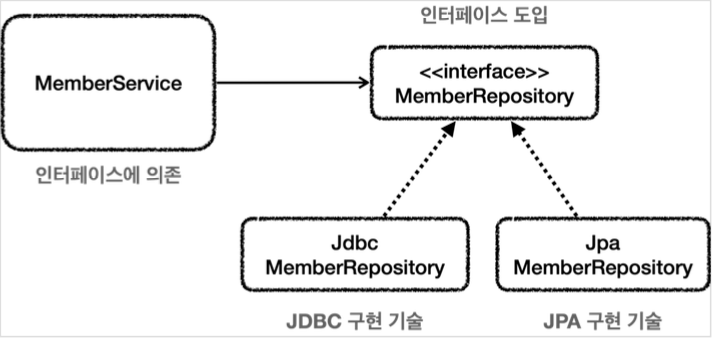

# 스프링 문제 해결 - 예외 처리, 반복

## 체크 예외와 인터페이스


서비스 계층은 가급적 특정 구현 기술에 의존하지 않고, 순수하게 유지하는 것이 좋다. 
이렇게 하려면 예외에 대한 의존도 함께 해결해야한다.


예를 들어서 서비스가 처리할 수 없는 `SQLException` 에 대한 의존을 제거하려면 서비스가
처리할 수 없으므로 리포지토리가 던지는 `SQLException` 체크 예외를 
런타임 예외로 전환해서 서비스 계층에 던져야 한다. 
이렇게 하면 서비스 계층이 해당 예외를 무시할 수 있기 때문에, 
특정 구현 기술에 의존하는 부분을 제거하고 서비스 계층을 순수하게 유지할 수 있다.


### 인터페이스 도입

먼저 `MemberRepository` 인터페이스도 도입해서 구현 기술을 쉽게 변경할 수 있도록 한다 .


### 인터페이스 도입 그림



* 이렇게 인터페이스를 도입하면 `MemberService` 는 `MemberRepository` 
  인터페이스에만 의존하면 된다. 
* 이제 구현 기술을 변경하고 싶으면 DI를 사용해서 `MemberService` 코드의 
  변경 없이 구현 기술을 변경할 수 있다.

### MemberRepository 인터페이스

```java
package hello.jdbc.repository;

import hello.jdbc.domain.Member;

public interface MemberRepository {
    Member save(Member member);
    Member findById(String memberId);
    void update(String memberId, int money);
    void delete(String memberId);
}
```

특정 기술에 종속되지 않는 순수한 인터페이스이다. 이 인터페이스를 기반으로 특정 
기술을 사용하는 구현체를 만들면 된다.


### 체크 예외와 인터페이스

기존에는 왜 이런 인터페이스를 만들지 않았던 이유는 `SQLException` 이 
체크 예외이기 때문이다. 체크 예외를 사용하려면 인터페이스에도 
해당 체크 예외가 선언 되어 있어야 한다.

#### 체크 예외 코드에 인터페이스 도입시 문제점 - 인터페이스

```java
package hello.jdbc.repository;

import hello.jdbc.domain.Member;

import java.sql.SQLException;

public interface MemberRepository {
    Member save(Member member) throws SQLException;
    Member findById(String memberId) throws SQLException;
    void update(String memberId, int money) throws SQLException;
    void delete(String memberId) throws SQLException;
}
```

인터페이스의 메서드에 `throws SQLException` 이 있는 것을 확인할 수 있다.


#### 체크 예외 코드에 인터페이스 도입시 문제점 - 구현 클래스

```java
import java.sql.SQLException;

public class MemberRepositoryV3 implements MemberRepositoryEx {
    public Member save(Member member) throws SQLException{
        String sql = "insert into member(member_id, money) values(?, ?)";
    }
}
```

* 인터페이스의 구현체가 체크 예외를 던지려면, 인터페이스 메서드에 먼저 체크 예외를 
  던지는 부분이 선언 되어 있어야 한다. 그래야 구현 클래스의 메서드도 체크 예외를 던질 수 있다.
  * `MemberRepositoryV3` 가 `throws SQLException` 를 하려면 
    `MemberRepositoryEx` 인터페이스에도 `throws SQLException` 이 필요하다.
* 구현 클래스의 메서드에 선언할 수 있는 예외는 부모 타입에서 던진 예외와 같거나 
  하위 타입이어야 한다.
* 예를 들어서 인터페이스 메서드에 `throws Exception` 를 선언하면, 
  구현 클래스 메서드에 `throws SQLException` 는 가능하다. `SQLException` 은
  `Exception` 의 하위 타입이기 때문이다.


### 특정 기술에 종속되는 인터페이스

구현 기술을 쉽게 변경하기 위해서 인터페이스를 도입하더라도 `SQLException` 과 같은
특정 구현 기술에 종속적인 체크 예외를 사용하게 되면 인터페이스에도 해당 예외를 
포함해야 한다. 하지만 이것은 우리가 원하던 순수한 인터페이스가 아니다. 
JDBC 기술에 종속적인 인터페이스일 뿐이다. 인터페이스를 만드는 목적은 구현체를 쉽게
변경하기 위함인데, 이미 인터페이스가 특정 구현 기술에 오염이 되어 버렸다. 
향후 JDBC가 아닌 다른 기술로 변경한다면 인터페이스 자체를 변경해야 한다.


#### 런타임 예외와 인터페이스

런타임 예외는 이런 부분에서 자유롭다. 인터페이스에 런타임 예외를 따로 선언하지 
않아도 된다. 따라서 인터페이스가 특정 기술에 종속적일 필요가 없다.


## 런타임 예외 적용

### MemberRepository 인터페이스

```java
package hello.jdbc.repository;

import hello.jdbc.domain.Member;

public interface MemberRepository {
    Member save(Member member);
    Member findById(String memberId);
    void update(String memberId, int money);
    void delete(String memberId);
}
```

### MyDbException 런타임 예외

```java
package hello.jdbc.repository.ex;

public class MyDbException extends RuntimeException{

    public MyDbException() {
    }

    public MyDbException(String message) {
        super(message);
    }

    public MyDbException(String message, Throwable cause) {
        super(message, cause);
    }

    public MyDbException(Throwable cause) {
        super(cause);
    }
}
```

* `RuntimeException` 을 상속받았다. 따라서 `MyDbException` 은 
  런타임(언체크) 예외가 된다.

#### MemberRepositoryV4_1

```java
package hello.jdbc.repository;

import hello.jdbc.domain.Member;
import hello.jdbc.repository.ex.MyDbException;
import lombok.extern.slf4j.Slf4j;
import org.springframework.jdbc.datasource.DataSourceUtils;
import org.springframework.jdbc.support.JdbcUtils;

import javax.sql.DataSource;
import java.sql.*;
import java.util.NoSuchElementException;

/**
 * 예외 누수 문제 해결
 * 체크 예외를 런타임 예외로 변경
 * MemberRepository 인터페이스 변경
 * throws SQLException 제거
 */
@Slf4j
public class MemberRepositoryV4_1 implements MemberRepository{

    private final DataSource dataSource;
    public MemberRepositoryV4_1(DataSource dataSource) {
        this.dataSource = dataSource;
    }

    @Override
    public Member save(Member member){
        String sql = "insert into member(member_id, money) values (?, ?)";

        Connection con = null;
        PreparedStatement pstmt = null;


        try {
            con = getConnection();
            pstmt = con.prepareStatement(sql);
            pstmt.setString(1, member.getMemberId());
            pstmt.setInt(2, member.getMoney());
            pstmt.executeUpdate();
            return member;
        } catch (SQLException e) {
            log.error("db error", e);
            throw new MyDbException(e);
        } finally {
            close(con, pstmt, null);
        }

    }

    @Override
    public Member findById(String memberId) {
        String sql = "select * from member where member_id = ?";

        Connection con = null;
        PreparedStatement pstmt = null;
        ResultSet rs = null;

        try{
            con = getConnection();
            pstmt = con.prepareStatement(sql);
            pstmt.setString(1, memberId);
            rs = pstmt.executeQuery();

            if(rs.next()){
                Member member = new Member();
                member.setMemberId(rs.getString("member_id"));
                member.setMoney(rs.getInt("money"));
                return member;
            } else {
                throw new NoSuchElementException("member not found memberId =" + memberId);
            }

        } catch (SQLException e) {
            log.error("db error", e);
            throw new MyDbException(e);
        } finally {
            close(con, pstmt, rs);
        }
    }

    @Override
    public void update(String memberId, int money){
        String sql = "update member set money=? where member_id=?";

        Connection con = null;
        PreparedStatement pstmt = null;

        try{
            con = getConnection();
            pstmt = con.prepareStatement(sql);
            pstmt.setInt(1, money);
            pstmt.setString(2, memberId);
            int resultSize = pstmt.executeUpdate();
            log.info("resultSize={}", resultSize);
        } catch (SQLException e){
            log.error("db error", e);
            throw new MyDbException(e);
        } finally {
            close(con, pstmt, null);
        }
    }

    @Override
    public void delete(String memberId){
        String sql = "delete from member where member_id=?";

        Connection con = null;
        PreparedStatement pstmt = null;

        try{
            con = getConnection();
            pstmt = con.prepareStatement(sql);
            pstmt.setString(1, memberId);

            pstmt.executeUpdate();

        } catch (SQLException e){
            log.error("db error", e);
            throw new MyDbException(e);
        } finally {
            close(con, pstmt, null);
        }
    }

    private void close(Connection con, Statement stmt, ResultSet rs){
        JdbcUtils.closeResultSet(rs);
        JdbcUtils.closeStatement(stmt);
        // 주의! 트랜잭션 동기화를 사용하라면 DataSourceUtils를 사용해야 한다.
        DataSourceUtils.releaseConnection(con, dataSource);
    }

    private Connection getConnection() throws SQLException {
        //주의! 트랜잭션 동기화를 사용하려면 DataSourceUtils를 사용해야 한다.
        Connection con = DataSourceUtils.getConnection(dataSource);
        log.info("get connection={}", con);
        return con;
    }
}
```

* `MemberRepository` 인터페이스를 구현한다.
* 이 코드에서 핵심은 `SQLException` 이라는 체크 예외를 `MyDbException` 
  이라는 런타임 예외로 변환해서 던지는 부분이다.

### 예외 반환

```java
catch (SQLException e) {
    throw new MyDbException(e);
}
```

* 잘 보면 기존 예외를 생성자를 통해서 포함하고 있는 것을 확인할 수 있다. 
  예외는 원인이 되는 예외를 내부에 포함할 수 있는데, 꼭 이렇게 작성해야 한다. 
  그래야 예외를 출력했을 때 원인이 되는 기존 예외도 함께 확인할 수 있다.
* `MyDbException` 이 내부에 `SQLException` 을 포함하고 있다고 
  이해하면 된다. 예외를 출력했을 때 스택 트레이스를 통해 둘다 확인할 수 있다.


#### 다음과 같이 기존 예외를 무시하고 작성하면 절대 안된다!

#### 예외 변환 - 기존 예외 무시

```java
catch (SQLException e) {
    throw new MyDbException();
}
```

* 잘 보면 `new MyDbException()` 으로 해당 예외만 생성하고 기존에 있는 
  `SQLException` 은 포함하지 않고 무시한다.
* 따라서 `MyDbException` 은 내부에 원인이 되는 다른 예외를 포함하지 않는다.
* 이렇게 원인이 되는 예외를 내부에 포함하지 않으면, 예외를 스택 트레이스를 통해 
  출력했을 때 기존에 원인이 되는 부분을 확인할 수 없다.
  * 만약 `SQLException` 에서 문법 오류가 발생했다면 그 부분을 확인할 방법이 없게 된다.

> 주의!
> 
> 예외를 변환할 때는 기존 예외를 꼭 포함해야 한다. 


#### MemberServiceV4

```java
package hello.jdbc.service;

import hello.jdbc.domain.Member;
import hello.jdbc.repository.MemberRepository;
import lombok.extern.slf4j.Slf4j;
import org.springframework.transaction.annotation.Transactional;

import java.sql.SQLException;

/**
 * 예외 누수 문제 해결
 * SQLExcpetion 제거
 *
 * MemberRepository 인터페이스에 의존
 */
@Slf4j
public class MemberServiceV4 {

    private final MemberRepository memberRepository;

    public MemberServiceV4(MemberRepository memberRepository) {
        this.memberRepository = memberRepository;
    }

    @Transactional
    public void accountTransfer(String fromId, String toId, int money){
        bizLogic(fromId, toId, money);
    }

    private void bizLogic(String fromId, String toId, int money){
        Member fromMember = memberRepository.findById(fromId);
        Member toMember = memberRepository.findById(toId);

        memberRepository.update(fromId, fromMember.getMoney() - money);
        validation(toMember);
        memberRepository.update(toId, toMember.getMoney() + money);
    }


    private void validation(Member toMember){
        if(toMember.getMemberId().equals("ex")){
            throw new IllegalStateException("이체중 예외 발생");
        }
    }
}
```

* `MemberRepository` 인터페이스에 의존하도록 코드를 변경했다.
* `MemberServiceV3_3` 와 비교해서 보면 드디어 메서드에서 
  `throws SQLException` 부분이 제거된 것을 확인할 수 있다.


#### MemberServiceV4Test

```java

```

* `MemberRepository` 인터페이스를 사용하도록 했다.


#### 남은 문제
리포지토리에서 넘어오는 특정한 예외의 경우 복구를 시도할 수도 있다. 
그런데 지금 방식은 항상 `MyDbException` 이라는 예외만 넘어오기 때문에 
예외를 구분할 수 없는 단점이 있다. 만약 특정 상황에는 예외를 잡아서 
복구하고 싶으면 예외를 어떻게 구분해서 처리할 수 있어야 한다.

