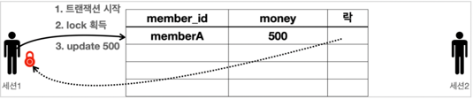
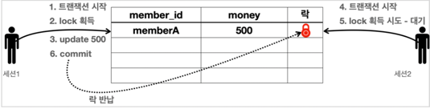
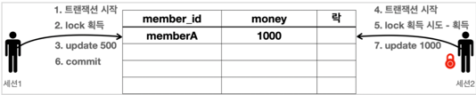

# 트랜잭션 - 개념 이해

데이터를 저장할 때 단순히 파일에 저장해도 되는데, 
데이터베이스에 저장하는 이유는 
가장 대표적인 이유는 데이터베이스는 트랜잭션이라는 개념을 지원하기 때문이다.


트랜잭션을 이름 그대로 번역하면 거래라는 뜻이다. 
이는, 데이터베이스에서 트랜잭션은 하나의 거래를 안전하게 처리하도록 보장해주는 것을 뜻한다.
그런데 하나의 거래를 안전하게 처리하려면 생각보다 고려해야 할 점이 많다. 


예를 들어서 A의 5000원을 B에게 계좌이체할 때. 
A의 잔고를 5000원 감소하고, B의 잔고를 5000원 증가해야한다.


#### 5000원 계좌이체

1. A의 잔고를 5000원 감소
2. B의 잔고를 5000원 증가


계좌이체라는 거래는 이렇게 2가지 작업이 합쳐져서 하나의 작업처럼 동작해야 한다. 
만약 1번은 성공했는데 2번에서 시스템에 문제가 발생하면 계좌이체는 실패하고, 
A의 잔고만 5000원 감소하는 심각한 문제가 발생한다.
데이터베이스가 제공하는 트랜잭션 기능을 사용하면 1,2 둘다 함께 성공해야 저장하고,
중간에 하나라도 실패하면 거래 전의 상태로 돌아갈 수 있다. 
만약 1번은 성공했는데 2번에서 시스템에 문제가 발생하면
계좌이체는 실패하고, 거래 전의 상태로 완전히 돌아갈 수 있다. 
결과적으로 A의 잔고가 감소하지 않는다. 모든 작업이 성공해서 데이터베이스에 정상 
반영하는 것을 커밋( `Commit` )이라 하고, 작업 중 하나라도 실패해서 
거래 이전으로 되돌리는 것을 롤백( `Rollback` )이라 한다.


### 트랜잭션 ACID


트랜잭션은 ACID(http://en.wikipedia.org/wiki/ACID)라 하는 
원자성(`Atomicity`), 일관성(`Consistency`), 
격리성(`Isolation`), 지속성(`Durability`)을 보장해야 한다.


* **원자성**: 트랜잭션 내에서 실행한 작업들은 마치 하나의 작업인 것처럼 모두 성공 하거나 모두 실패해야 한다.

* **일관성**: 모든 트랜잭션은 일관성 있는 데이터베이스 상태를 유지해야 한다. 
  예를 들어 데이터베이스에서 정한 무결성 제약 조건을 항상 만족해야 한다.

* **격리성**: 동시에 실행되는 트랜잭션들이 서로에게 영향을 미치지 않도록 격리한다. 예를 들어 동시에 같은 데이터를 수정하지 못하도록 해야 한다. 
  격리성은 동시성과 관련된 성능 이슈로 인해 트랜잭션 격리 수준 (Isolation level)을 선택할 수 있다.

* **지속성**: 트랜잭션을 성공적으로 끝내면 그 결과가 항상 기록되어야 한다. 
  중간에 시스템에 문제가 발생해도 데이터베이스 로그 등을 사용해서 성공한 트랜잭션 내용을 복구해야 한다.


#### 트랜잭션 격리 수준 - Isolation level

* READ UNCOMMITED(커밋되지 않은 읽기) 
* READ COMMITTED(커밋된 읽기) 
* REPEATABLE READ(반복 가능한 읽기) 
* SERIALIZABLE(직렬화 가능)

> 참고 
> 
> 강의에서는 일반적으로 많이 사용하는 READ COMMITTED(커밋된 읽기) 트랜잭션 격리 수준을 기준으로 설명한다.
> 트랜잭션 격리 수준은 데이터베이스에 자체에 관한 부분이어서 이 강의 내용을 넘어선다. 


## 데이터베이스 연결 구조와 DB 세션


### 데이터베이스 연결 구조1


* 사용자는 웹 애플리케이션 서버(WAS)나 DB 접근 툴 같은 클라이언트를 사용해서 
  데이터베이스 서버에 접근할 수 있다. 클라이언트는 데이터베이스 서버에 연결을 요청하고
  커넥션을 맺게 된다. 이때 데이터베이스 서버는 내부에 세션이라는 것을 만든다. 
  그리고 앞으로 해당 커넥션을 통한 모든 요청은 이 세션을 통해서 실행하게 된다.

* 개발자가 클라이언트를 통해 SQL을 전달하면 현재 커넥션에 연결된 세션이
  SQL을 실행한다.

* 세션은 트랜잭션을 시작하고, 커밋 또는 롤백을 통해 트랜잭션을 종료한다. 
  그리고 이후에 새로운 트랜잭션을 다시 시작할 수 있다.

* 사용자가 커넥션을 닫거나, 또는 DBA(DB 관리자)가 세션을 강제로 종료하면 세션은 종료된다.


### 데이터베이스 연결 구조2


* 커넥션 풀을 다수 생성하면, 세션도 다수 생성한다.


## 트랜잭션의 예1


구체적인 실제 구현 방식은 데이터베이스 마다 다르다.


### 트랜잭션 사용법


* 데이터 변경 쿼리를 실행하고 데이터베이스에 그 결과를 반영하려면 커밋 명령어인 `commit` 을 호출하고, 
  결과를 반영하고 싶지 않으면 롤백 명령어인 `rollback` 을 호출하면 된다.

* **커밋을 호출하기 전까지는 임시로 데이터를 저장**하는 것이다. 
  따라서 해당 트랜잭션을 시작한 세션(사용자) 에게만 변경 데이터가 보이고 
  다른 세션(사용자)에게는 변경 데이터가 보이지 않는다.

* 등록, 수정, 삭제 모두 같은 원리로 동작한다. 앞으로는 등록, 수정, 삭제를 
  간단히 변경이라는 단어로 표현하겠다.


### 기본 데이터


* 세션1, 세션2 둘다 가운데 있는 기본 테이블을 조회하면 해당 테이서가 그대로 조회된다.


### 세션1 신규 데이터 추가


* 세션 1은 트랜잭션을 시작하고 회원1, 신규 회원2를 DB에 추가했다. 
  아직 커밋은 하지 않은 상태이다.
* 새로운 데이터는 임시 상태로 저장된다.
* 세션1은 `select` 쿼리를 실행해서 본인이 입력한 신규 회원1, 신규 회원2를 조회할 수 있다.
* 세션2는 `select` 쿼리를 실행해도 신규 회원들을 조회할 수 없다. - 세션1이 아직 커밋을 하지 않았기 때문에


### 커밋하지 않은 데이터를 다른 곳에서 조회할 수 있으면 어떤 문제가 발생하는가


* 예를 들어서 커밋하지 않는 데이터가 보인다면, 세션2는 데이터를 조회했을 때 신규 회원1, 2가 보일 것이다.
  따라서 신규 회원1, 신규 회원2가 있다고 가정하고 어떤 로직을 수행할 수 있다. 
  그런데 세션1이 롤백을 수행하면 신규 회원1, 신규 회원2의 데이터가 사라지게 된다. 
  따라서 데이터 정합성에 큰 문제가 발생한다.

* 세션2에서 세션1이 아직 커밋하지 않은 변경 데이터가 보이다면, 세션1이 롤백 했을 때 
  심각한 문제가 발생할 수 있다. 따라서 커밋 전의 데이터는 다른 세션에서 보이지 않는다.


### 세션1 신규 데이터 추가 후 commit


* 세션1이 신규 데이터를 추가한 후에 `commit` 을 호출했다.
* `commit` 으로 새로운 데이터가 실제 데이터베이스에 반영된다. 데이터의 상태도 임시 -> 완료로 변경되었다.
* 이제 다른 세션에서도 회원 테이블을 조회하면 신규 회원들을 확인할 수 있다.


### 세션1 신규 데이터 추가 후 rollback


* 세션1이 신규 데이터를 추가한 후에 `commit` 대신에 `rollback` 을 호출했다.
* 세션1이 데이터베이스에 반영한 모든 데이터가 처음 상태로 복구된다.
* 수정하거나 삭제한 데이터도 `rollback` 을 호출하면 모두 트랜잭션을 시작하기 직전의 상태로 복구된다.


## 트랜잭션 - DB 예제2 - 자동 커밋, 수동 커밋

### 자동 커밋

트랜잭션을 사용하려면 먼저 자동 커밋과 수동 커밋을 이해해야 한다.
자동 커밋으로 설정하면 각각의 쿼리 실행 직후에 자동으로 커밋을 호출한다. 
따라서 커밋이나 롤백을 직접 호출하지 않아도 되는 편리함이 있다. 하지만 쿼리를 하나하나 실행할 때 마다 자동으로 커밋이 되어버리기 때문에 
우리가 원하는 트랜잭션 기능을 제대로 사용할 수 없다.


#### 자동 커밋 설정

```mysql
set autocommit true;
insert into member(member_id, money) values ('data1',10000);
insert into member(member_id, money) values ('data2',10000); 
```

따라서 `commit` , `rollback` 을 직접 호출하면서 트랜잭션 기능을 제대로 수행하려면 자동 커밋을 끄고 수동 커밋을 사용해야 한다.

#### 수동 커밋 설정

```mysql
set autocommit false;
insert into member(member_id, money) values ('data3',10000);
insert into member(member_id, money) values ('data4',10000); commit;
commit;
```

보통 자동 커밋 모드가 기본으로 설정된 경우가 많기 때문에, **수동 커밋 모드로 설정하는 것을 트랜잭션을 시작한다고 표현할 수 있다.**
수동 커밋 설정을 하면 이후에 꼭 `commit` , `rollback` 을 호출해야 한다.


## 트랜잭션 - DB 예제3 - 트랜잭션 실습

### 1. 기본 데이터 입력

### 기본 데이터


### 데이터 초기화 SQL

```sql
set autocommit true;
delete from member;
insert into member(member_id, money) values ("oldId", 10000);
```

* 자동 커밋 모드를 사용했기 때문에 별도로 커밋을 호출하지 않아도 된다.


#### 이렇게 데이터를 초기화하고, 세션1, 세션2에서 다음 쿼리를 실행해서 결과를 확인

```sql
select * from member;
```

결과를 이미지와 비교하자. 참고로 이미지의 `name` 필드는 이해를 돕기 위해 그린 것이고 실제로는 없다.


2. 신규 데이터 추가 - 커밋 전


### 세션1 신규 데이터 추가


### 세션1 신규 데이터 추가 SQL

```sql
set autocommit false; //수동 커밋 모드
insert into member(member_id, money) values ('newId1',10000); 
insert into member(member_id, money) values ('newId2',10000);
```

#### 세션1, 세션2에서 다음 쿼리를 실행해서 결과를 확인

```sql
select * from member;
```

아직 세션1이 커밋을 하지 않은 상태이기 때문에 세션1에서는 입력한 데이터가 보이지만, 
세션2에서는 입력한 데이터가 보이지 않는 것을 확인할 수 있다.


### 3. 커밋 - commit

세션1에서 신규 데이터를 입력했는데, 아직 커밋은 하지 않았다. 이제 커밋해서 데이터베이스에 결과를 반영해보자.


### 세션1 신규 데이터 추가 후 commit


#### 세션1에서 커밋을 호출

```sql
commit;
```


#### 세션1, 세션2에서 다음 쿼리를 실행해서 결과를 확인

```sql
select * from member;
```

결과를 이미지와 비교해보자. 세션1이 트랜잭션을 커밋했기 때문에 데이터베이스에 실제 데이터가 반영된다.
커밋 이후에는 모든 세션에서 데이터를 조회할 수 있다.


### 롤백 - rollback

### 기본 데이터


#### 예제를 처음으로 돌리기 위해 데이터를 초기화

```sql
 //데이터 초기화
set autocommit true;
delete from member;
insert into member(member_id, money) values ('oldId',10000);
```

### 세션1 신규 데이터 추가 후


세션1에서 트랜잭션을 시작 상태로 만든 다음에 데이터를 추가

```sql
//트랜잭션 시작
set autocommit false; //수동 커밋 모드
insert into member(member_id, money) values ('newId1',10000); 
insert into member(member_id, money) values ('newId2',10000);
```

### 세션1, 세션2에서 다음 쿼리를 실행해서 결과를 확인

```sql
select * from member;
```

아직 세션1이 커밋을 하지 않은 상태이기 때문에 세션1에서는 입력한 데이터가 보이지만, 
세션2에서는 입력한 데이터가 보이지 않는 것을 확인할 수 있다.


### 세션1 신규 데이터 추가 후 rollback


#### 세션1에서 롤백을 호출

```sql
rollback;
```

#### 세션1, 세션2에서 다음 쿼리를 실행해서 결과를 확인

```sql
select * from member;
```

결과를 이미지와 비교해보자. 롤백으로 데이터가 DB에 반영되지 않은 것을 확인할 수 있다.


## 트랜잭션 - DB 예제4 - 계좌이체

* 계좌이체 정상 
* 계좌이체 문제 상황 - 커밋
* 계좌이체 문제 상황 - 롤백


### 계좌이체 정상

#### 기본 데이터 입력


#### 기본 데이터 입력 - SQL

```sql
set autocommit true;
delete from member;
insert into member(member_id, money) values ('memberA', 10000);
insert into member(member_id, money) values ('memberB', 10000);
```

#### 계좌이체 실행


* `memberA` 의 돈을 `memberB` 에게 2000원 계좌이체하는 트랜잭션을 실행해보자. 다음과 같은 2번의 `update` 쿼리가 수행되어야 한다.
* `set autocommit false` 로 설정한다. 
* 아직 커밋하지 않았으므로 다른 세션에는 기존 데이터가 조회된다.


#### 계좌이체 실행 SQL - 성공

```sql
set autocommit false;
update member set money = 10000 - 20000 where member_id = 'memberA';
update member set money = 10000 + 2000 where member_id = 'memberB';
```

#### 커밋


* commit 명령어를 실행하면 데이터베이스에 결과가 반영된다.
* 다른 세션에서도 `memberA` 의 금액이 8000원으로 줄어들고, `memberB` 의 금액이 12000원으로 증가한 것을 확인할 수 있다.


#### 세션1의 커밋

```sql
commit;
```

#### 계좌이체 문제 상황 - 커밋

계좌이체 도중에 문제가 발생하는 상황

#### 기본 데이터 입력


#### 기본 데이터 입력 - SQL

```sql
set autocommit true;
delete from member;
insert into member(member_id, money) values ('memberA', 10000);
insert into member(member_id, money) values ('memberB', 10000);
```

#### 계좌이체 실행


* 계좌이체를 실행하는 도중에 SQL에 문제가 발생한다. 그래서 `memberA` 의 돈을 2000원 줄이는 것에는 성공했지만,
  `memberB` 의 돈을 2000원 증가시키는 것에 실패한다.


* 두 번째 SQL은 `member_iddd` 라는 필드에 오타가 있다. 
  두 번째 update 쿼리를 실행하면 SQL 오류가 발생하는 것을 확인할 수 있다.


#### 계좌이체 실행 SQL - 오류

```sql
set autocommit false;
update member set money = 10000 - 2000 where member_id = 'memberA';
update member set money = 10000 + 2000 where member_iddd = 'memberB';
```

#### 두 번째 SQL 실행시 발생하는 오류 메시지

```text
Column "MEMBER_IDDD" not found; SQL statement:
update member set money=10000 + 2000 where member_iddd = 'memberB' [42122-200]
42S22/42122
```

* 여기서 문제는 memberA 의 돈은 2000원 줄어들었지만, memberB 의 돈은 2000원 증가하지 않았다는 점이다. 
  결과적으로 계좌이체는 실패하고 memberA 의 돈만 2000원 줄어든 상황이다.


#### 강제 커밋


만약 이 상황에서 강제로 `commit` 을 호출하면 어떻게 될까?
계좌이체는 실패하고 `memberA` 의 돈만 2000원 줄어드는 아주 심각한 문제가 발생한다.


#### 세션1 커밋

```sql
commit;
```


#### 확인 쿼리

```sql
select * from member;
```

이렇게 중간에 문제가 발생했을 때는 커밋을 호출하면 안된다. 롤백을 호출해서 데이터를 트랜잭션 시작 시점으로 원복해야 한다.


### 계좌이체 문제 상황 - 롤백

#### 기본 데이터 입력


#### 기본 데이터 입력 - SQL

```sql
set autocommit true;
delete from member;
insert into member(member_id, money) values ('memberA', 10000);
insert into member(member_id, money) values ('memberB', 10000);
```

#### 계좌이체 실행


계좌이체를 실행하는 도중에 SQL에 문제가 발생한다. 그래서 `memberA` 의 돈을 2000원 
줄이는 것에는 성공했지만, `memberB` 의 돈을 2000원 증가시키는 것에 실패한다. 
두 번째 update 쿼리를 실행하면 SQL 오류가 발생하는 것을 확인할 수 있다.


#### 계좌이체 실행 SQL - 오류

```sql
set autocommit false;
update member set money = 10000 - 2000 where member_id = 'memberA';
update member set money = 10000 + 2000 where member_iddd = 'memberB';
```

#### 두 번째 SQL 실행시 발생하는 오류 메시지

```text
Column "MEMBER_IDDD" not found; SQL statement:
update member set money=10000 + 2000 where member_iddd = 'memberB' [42122-200]
42S22/42122
```

여기서 문제는 `memberA` 의 돈은 2000원 줄어들었지만, `memberB` 의 돈은 2000원 증가하지 않았다는 점이다. 
결과적으로 계좌이체는 실패하고 `memberA` 의 돈만 2000원 줄어든 상황이다.


#### 롤백


이럴 때는 롤백을 호출해서 트랜잭션을 시작하기 전 단계로 데이터를 복구해야 한다.
롤백을 사용한 덕분에 계좌이체를 실행하기 전 상태로 돌아왔다. `memberA` 의 돈도 이전 상태인 10000 원으로 돌아오고, 
`memberB` 의 돈도 10000 원으로 유지되는 것을 확인할 수 있다.


#### 세션1 - 롤백

```sql
rollback;
```

#### 확인 쿼리

```sql
select * from member;
```

#### 정리

> 원자성
> 
> 트랜잭션 내에서 실행한 작업들은 마치 하나의 작업인 것처럼 모두 성공 하거나 모두 실패해야 한다. 
> 트랜잭션의 원자성 덕분에 여러 SQL 명령어를 마치 하나의 작업인 것 처럼 처리할 수 있었다. 
> 성공하면 한번에 반영하고, 중간에 실패해도 마치 하나의 작업을 되돌리는 것 처럼 간단히 되돌릴 수 있다.


#### 오토 커밋


## DB 락 - 개념 이해

세션1이 트랜잭션을 시작하고 데이터를 수정하는 동안 아직 커밋을 수행하지 않았는데, 세션2에서 동시에 같은 데이터를 수정하게 되면 여러가지 문제가 발생한다. 
트랜잭션의 **원자성**이 깨지는 것이다. 여기에 더해서 세션1이 중간에 롤백을 하게 되면 세션2는 잘못된 데이터를 수정하는 문제가 발생한다.


이런 문제를 방지하려면, 세션이 트랜잭션을 시작하고 데이터를 수정하는 동안에는 커밋이나 롤백 전까지 다른 세션에서 해당 데이터를 수정할 수 없게 막아야 한다.


#### 락0


* 세션1은 `memberA` 의 금액을 500원으로 변경하고 싶고, 세션2는 같은 `memberA` 의 금액을 1000원으로 변경하고 싶다.
* 데이터베이스는 이런 문제를 해결하기 위해 락(Lock)이라는 개념을 제공한다.


#### 락1


* 1. 세션1은 트랜잭션을 시작한다.
* 2. 세션1은 `memberA` 의 `money` 를 500으로 변경을 시도한다. 이때 해당 로우의 락을 먼저 획득해야 한다. 락이 남아 있으므로 세션1은 락을 획득한다. 
   (세션1이 세션2보다 조금 더 빨리 요청했다.)
* 3. 세션1은 락을 획득했으므로 해당 로우에 update sql을 수행한다.


#### 락2


* 4. 세션2는 트랜잭션을 시작한다.
* 5. 세션2도 `memberA` 의 `money` 데이터를 변경하려고 시도한다. 이때 해당 로우의 락을 먼저 획득해야 한다. 락이 없으므로 락이 돌아올 때 까지 대기한다.
*    세션2가 락을 무한정 대기하는 것은 아니다. 락 대기 시간을 넘어가면 락 타임아웃 오류가 발생한다. 락 대기 시간은 설정할 수 있다.


#### 락3


* 6. 세션1은 커밋을 수행한다. 커밋으로 트랜잭션이 종료되었으므로 락도 반납한다.


#### 락4


* 락을 획득하기 위해 대기하던 세션2가 락을 획득한다.


#### 락6


* 8. 세션2는 커밋을 수행하고 트랜잭션이 종료되었으므로 락을 반납한다.


## DB 락 - 변경

#### 락0


#### 기본 데이터 입력 - SQL

```sql
set autocommit true;
delete from member;
insert into member(member_id, money) values ('memberA', 10000);
```


### 변경과 락

#### 락1




#### 세션1

```sql
set autocommit false;
update member set money = 500 where member_id = 'memberA';
```

* 세션1이 트랜잭션을 시작하고, `memberA` 의 데이터를 500원으로 업데이트 했다. 아직 커밋은 하지 않았다.
* `memberA` 로우의 락은 세션1이 가지게 된다.

#### 락2


#### 세션2

```sql
SET LOCK_TIMEOUT 60000;
set autocommit false;
update member set money = 1000 where member_id = 'memberA';
```

* 세션2는 memberA의 데이터를 1000원으로 수정하려 한다.
* 세션1이 트랜젝션을 커밋하거나 롤백해서 종료하지 않았으므로 아직 세션1이 락을 가지고 있다. 따라서 세션2는
  락을 획득하지 못하기 때문에 데이터를 수정할 수 없다. 세션2는 락이 돌아올 때 까지 대기하게 된다.
* `SET LOCK_TIMEOUT 60000` : 락 획득 시간을 60초로 설정한다. 60초 안에 락을 얻지 못하면 예외가
  발생한다.
  * 참고로 H2 데이터베이스에서는 딱 60초에 예외가 발생하지는 않고, 시간이 조금 더 걸릴 수 있음 

#### 세션2 락 획득

세션1을 커밋하면 세션1이 커밋되면서 락을 반납한다. 이후에 대기하던 세션2가 락을 획득하게 된다. 따라서
락을 획득한 세션2의 업데이트가 바녕되는 것을 확인할 수 있다. 물론 이후에 세션2도 커밋을 호출해서 락을
반납해야 한다.

#### 락3



* 6. 세션1은 커밋을 수행한다. 커밋으로 트랜잭션이 종료되었으므로 락도 반납한다.


#### 세션1

```sql
commit;
```

세션1이 커밋하면 이후에 락을 반납하고 다음 시나리오가 이어진다.


#### 락4


* 락을 획득하기 위해 대기하던 세션2가 락을 획득한다.


#### 락5





* 7. 세션2는 update sql을 정상 수행한다.


#### 락6


* 8. 세션2는 커밋을 수행하고 트랜잭션이 종료되었으므로 락을 반납한다.


#### 세션2

```sql
commit;
```


### 세션2 락 타임아웃

* `SET LOCK_TIMEOUT <milliseconds>` : 락 타임아웃 시간을 설정한다.
* 예) `SET LOCK_TIMEOUT 10000` 10초, 세션2에 설정하면 세션2가 10초 동안 대기해도 
  락을 얻지 못하면 락 타임아웃 오류가 발생한다.


#### 세션2의 실행 결과

```error
Timeout trying to lock table {0}; SQL statement:
update member set money=10000 - 2000 where member_id = 'memberA' [50200-200] HYT00/50200
```

세션1이 `memberA` 의 데이터를 변경하고, 트랜잭션을 아직 커밋하지 않았다. 
따라서 세션2는 세션1이 트랜잭션을 커밋하거나 롤백할 때 까지 대기해야 한다. 
기다리면 락 타임아웃 오류가 발생하는 것을 확인할 수 있다.


## DB 락 - 조회

### 일반적으로 조회는 락을 사용하지 않는다.

* 데이터베이스마다 다르지만, 보통 조회할 때는 락을 획득하지 않고 바로 데이터를 조회할 수 있다.

세션1이 락을 획득하고 데이터를 변겨아고 있어도, 세션2에서 데이터를 조회할 수 있다.
세션2에서 조회가 아니라 데이터를 변경하려면 락이 필요하기 때문에 락이 돌아올 때 까지 대기해야한다.

### 조회와 락
* 데이터를 조회할 때도 락을 획득하고 싶을 때가 있다. 이럴 때는 select for update 구문을 사용해야한다.
* 세션1이 조회 시점에서 락을 가져가기 때문에 다른 세션에서 해당 데이터를 변경할 수 없다.
* 이 경우 트랜잭션을 커밋하면 락을 반납한다.


### 조회 시점에 락이 필요한 경우

* 트랜잭션 종료 시점까지 해당 데이터를 다른 곳에서 변경하지 못하도록 강제로 막아야 할 때 사용한다.
* 애플리케이션 로직에서 memberA 의 금액을 조회한 다음에 이 금액 정보로 애플리케이션에서 어떤 계산을
  수행한다. 그런데 이 계산이 돈과 괸련된 매우 중요한 계산이어서 계산을 완료할 때 까지 memberA 의 금액을
  다른곳에서 변경하면 안된다. 이럴 때 조회 시점에 락을 획득하면 된다.


#### 기본 데이터

```sql
set autocommit true;
delete from memebr;
insert into member(member_id, money) values ('memberA', 10000);
```

#### 세션1

```sql
set autocommit false;
select * from member where member_id = 'memberA' for update;
```

* `select for update` 구문을 사용하면 조회를 하면서 동시에 선택한 로우의 락도 획득한다.
  * 물론 락이 없다면 획득할 때 까지 대기해야 한다.
* 세션1은 트랜잭션을 종료할 때 까지 `memberA` 의 로우의 락을 보유한다.

#### 세션2

```sql
set autocommit false;
update member set money=500 where member_id = 'memberA';
```

* 세션2는 데이터를 변경하고 싶어한다. 데이터를 변경하기 위해 락이 필요하다.
* 세션1이 `memberA` 로우의 락을 획득했기 때문에 세션2는 락을 획득할 때 까지 대기한다.
* 이후에 세션1이 커밋을 수행하면 세션2가 락을 획득하고 데이터를 변경한다. 만약 락 타임아웃 시간이
  지나면 락 타임아웃 예외가 발생한다.

#### 세션1, 2 커밋

```sql
commit
```

### 정리

* 트랙잰션과 락은 데이터베이스마다 실제 동작하는 방식이 조금씩 다르기 때문에, 해당 데이터베이스 메뉴얼을
  확인 후, 의도한대로 동작하는지 테스트해야 한다.