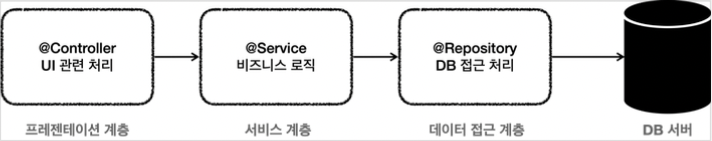
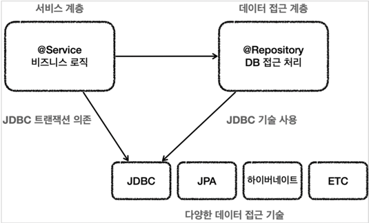
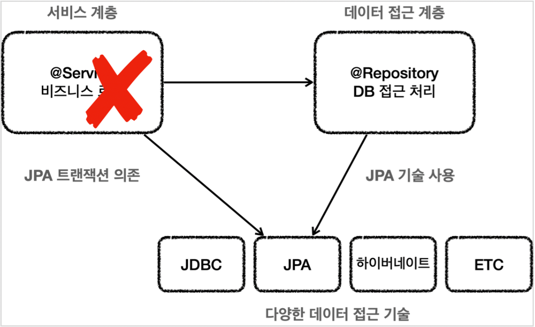
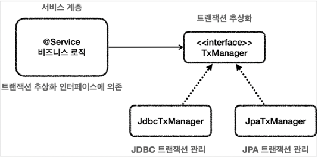
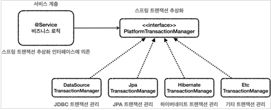
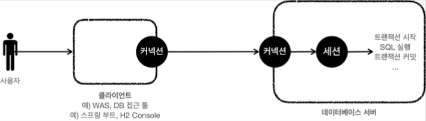
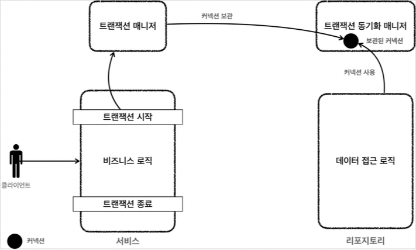
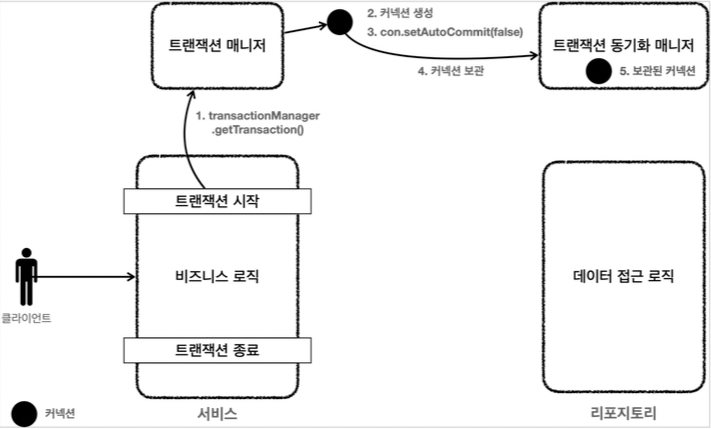
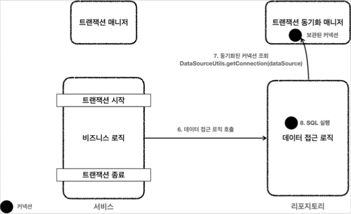
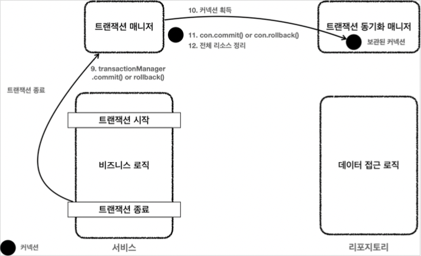

# 스프링과 문제 해결 - 트랜잭션

## 문제점들

### 애플리케이션 구조


여러가지 애플리케이션 구조가 있지만, 가장 단순하면서 많이 사용하는 방법은 역할에 따라 3가지 계층으로 나누는 것이다.





* 프레젠테이션 계층
  * UI와 관련된 처리 담당
  * 웹 요청과 응답
  * 사용자 요청을 검증
  * 주 사용 기술: 서블릿과 HTTP 같은 웹 기술, 스프링 MVC
* 서비스 계층
  * 비즈니스 로직을 담당
  * 주 사용 기술: 가급적 특정 기술에 의존하지 않고, 순수 자바 코드로 작성 
* 데이터 접근 계층
  * 실제 데이터베이스에 접근하는 코드
  * 주 사용 기술: JDBC, JPA, File, Redis, Mongo ...


### 순수한 서비스 계층

* 여기서 가장 중요한 곳은 핵심 비즈니스 로직이 들어있는 서비스 계층이다. 
  시간이 흘러서 UI(웹)와 관련된 부분이 변하고, 데이터 저장 기술을 다른 기술로 변경해도, 
  비즈니스 로직은 최대한 변경없이 유지되어야 한다.
* 이렇게 하려면 서비스 계층을 특정 기술에 종속적이지 않게 개발해야 한다.
  * 이렇게 계층을 나눈 이유도 서비스 계층을 최대한 순수하게 유지하기 위한 목적이 크다. 
    기술에 종속적인 부분은 프레젠테이션 계층, 데이터 접근 계층에서 가지고 간다.
  * 프레젠테이션 계층은 클라이언트가 접근하는 UI와 관련된 기술인 웹, 서블릿, HTTP와 관련된 부분을 담당해준다.
    그래서 서비스 계층을 이런 UI와 관련된 기술로부터 보호해준다. 예를 들어서 HTTP API 를 사용하다가 GRPC 같은 기술로 변경해도 
    프레젠테이션 계층의 코드만 변경하고, 서비스 계층은 변경하지 않아도 된다.
  * 데이터 접근 계층은 데이터를 저장하고 관리하는 기술을 담당해준다. 
    그래서 JDBC, JPA와 같은 구체적인 데이터 접근 기술로부터 서비스 계층을 보호해준다. 
    예를 들어서 JDBC를 사용하다가 JPA 로 변경해도 서비스 계층은 변경하지 않아도 된다. 
    물론 서비스 계층에서 데이터 접근 계층을 직접 접근하는 것이 아니라, 인터페이스를 제공하고 서비스 계층은 
    이 인터페이스에 의존하는 것이 좋다. 그래야 서비스 코드의 변경 없이 `JdbcRepository` 를 `JpaRepository` 로 변경할 수 있다.
* 서비스 계층이 특정 기술에 종속되지 않기 때문에 비즈니스 로직을 유지보수 하기도 쉽고, 테스트 하기도 쉽다.
* 정리하자면 서비스 계층은 가급적 비즈니스 로직만 구현하고 특정 구현 기술에 직접 의존해서는 안된다. 
  이렇게 하면 향후 구현 기술이 변경될 때 변경의 영향 범위를 최소화 할 수 있다


### 문제점들


#### MemberServiceV1

```java
package hello.jdbc.service;

import hello.jdbc.domain.Member;
import hello.jdbc.repository.MemberRepositoryV1;
import lombok.RequiredArgsConstructor;

import java.sql.SQLException;

@RequiredArgsConstructor
public class MemberServiceV1 {

    private final MemberRepositoryV1 memberRepository;

    public void accountTransfer(String fromId, String toId, int money) throws SQLException{
        Member fromMember = memberRepository.findById(fromId);
        Member toMember = memberRepository.findById(toId);

        memberRepository.update(fromId, fromMember.getMoney() - money);
        validation(toMember);
        memberRepository.update(toId, toMember.getMoney() + money);

    }

    private void validation(Member toMember){
        if(toMember.getMemberId().equals("ex")){
            throw new IllegalStateException("이체중 예외 발생");
        }
    }
}
```

* `MemberServiceV1` 은 특정 기술에 종속적이지 않고, 순수한 비즈니스 로직만 존재한다. 
* 특정 기술과 관련된 코드가 거의 없어서 코드가 깔끔하고, 유지보수 하기 쉽다.
* 향후 비즈니스 로직의 변경이 필요하면 이 부분을 변경하면 된다.


#### 이 코드에도 남은 문제가 있다.

* `SQLException` 이라는 JDBC 기술에 의존한다는 점이다. 
* 이 부분은 `memberRepository` 에서 올라오는 예외이기 때문에 `memberRepository` 에서 해결해야 한다. 이 부분은 뒤에서 예외를 다룰 때 알아보자. 
* `MemberRepositoryV1` 이라는 구체 클래스에 직접 의존하고 있다. `MemberRepository` 인터페이스를 
  도입하면 향후 `MemberService` 의 코드의 변경 없이 다른 구현 기술로 손쉽게 변경할 수 있다.


#### MemberServiceV2

```java
package hello.jdbc.service;

import hello.jdbc.domain.Member;
import hello.jdbc.repository.MemberRepositoryV2;
import lombok.RequiredArgsConstructor;
import lombok.extern.slf4j.Slf4j;

import javax.sql.DataSource;
import java.sql.Connection;
import java.sql.SQLException;

/**
 * 트랜잭션 - 파라미터 연동, 풀을 고려한 종료
 */
@Slf4j
@RequiredArgsConstructor
public class MemberServiceV2 {

    private final DataSource dataSource;
    private final MemberRepositoryV2 memberRepository;

    public void accountTransfer(String fromId, String toId, int money) throws SQLException{

        Connection con = dataSource.getConnection();
        try{
            con.setAutoCommit(false);
            //비즈니스 로직
            bizLogic(con, fromId, toId, money);
            con.commit();
        } catch (Exception e){
            con.rollback();
            throw new IllegalStateException();
        } finally {
            release(con);
        }


    }

    private void bizLogic(Connection con, String fromId, String toId, int money) throws SQLException {
        Member fromMember = memberRepository.findById(con, fromId);
        Member toMember = memberRepository.findById(con, toId);

        memberRepository.update(con, fromId, fromMember.getMoney() - money);
        validation(toMember);
        memberRepository.update(con, toId, toMember.getMoney() + money);
    }

    private void release(Connection con) {
        if(con != null){
            try{
                con.setAutoCommit(true);
                con.close();
            } catch (Exception e){
                log.info("error", e);
            }
        }
    }

    private void validation(Member toMember){
        if(toMember.getMemberId().equals("ex")){
            throw new IllegalStateException("이체중 예외 발생");
        }
    }
}
```

* 트랜잭션은 비즈니스 로직이 있는 서비스 계층에서 시작하는 것이 좋다.
* 그런데 문제는 트랜잭션을 사용하기 위해서 `javax.sql.DataSource` , `java.sql.Connection` , `java.sql.SQLException` 
  같은 JDBC 기술에 의존해야 한다는 점이다.
* 트랜잭션을 사용하기 위해 JDBC 기술에 의존한다. 결과적으로 비즈니스 로직보다 JDBC를 사용해서 트랜잭션을 처리하는 코드가 더 많다.
* 향후 JDBC에서 JPA 같은 다른 기술로 바꾸어 사용하게 되면 서비스 코드도 모두 함께 변경해야 한다.
* 핵심 비즈니스 로직과 JDBC 기술이 섞여 있어서 유지보수 하기 어렵다.


### 문제 정리

개발한 애플리케이션의 문제점은 크게 3가지이다.

* 트랜잭션 문제 
* 예외 누수 문제 
* JDBC 반복 문제

### 트랜잭션 문제


가장 큰 문제는 트랜잭션을 적용하면서 생긴 다음과 같은 문제들이다.


* JDBC 구현 기술이 서비스 계층에 누수되는 문제
  * 트랜잭션을 적용하기 위해 JDBC 구현 기술이 서비스 계층에 누수되었다.
  * 서비스 계층은 순수해야 한다. -> 구현 기술을 변경해도 서비스 계층 코드는 최대한 유지할 수 있어야 한다.
    * 그래서 데이터 접근 계층에 JDBC 코드를 다 몰아두는 것이다.
    * 물론 데이터 접근 계층의 구현 기술이 변경될 수도 있으니 데이터 접근 계층은 인터페이스를 제공하는 것이 좋다.
  * 서비스 계층은 특정 기술에 종속되지 않아야 한다. 지금까지 그렇게 노력해서 데이터 접근 계층으로 JDBC 관련 코드를 모았는데, 트랜잭션을 적용하면서 
    결국 서비스 계층에 JDBC 구현 기술의 누수가 발생했다.
* 트랜잭션 동기화 문제
  * 같은 트랜잭션을 유지하기 위해 커넥션을 파라미터로 넘겨야 한다.
  * 이때 파생되는 문제들도 있다. 똑같은 기능도 트랜잭션용 기능과 트랜잭션을 유지하지 않아도 되는 기능으로 분리해야 한다.
* 트랜잭션 적용 반복 문제
  * 트랜잭션 적용 코드를 보면 반복이 많다. `try` , `catch` , `finally` ...


### 예외 누수

* 데이터 접근 계층의 JDBC 구현 기술 예외가 서비스 계층으로 전파된다. 
* `SQLException` 은 체크 예외이기 때문에 데이터 접근 계층을 호출한 서비스 계층에서 해당 예외를 잡아서 처리하거나 
  명시적으로 `throws` 를 통해서 다시 밖으로 던져야한다. 
* `SQLException` 은 JDBC 전용 기술이다. 향후 JPA나 다른 데이터 접근 기술을 사용하면, 그에 맞는 다른 
  예외로 변경해야 하고, 결국 서비스 코드도 수정해야 한다.


### JDBC 반복 문제

* 지금까지 작성한 `MemberRepository` 코드는 순수한 JDBC를 사용했다.
* 이 코드들은 유사한 코드의 반복이 너무 많다.
  * `try` , `catch` , `finally` ... 
  * 커넥션을 열고, `PreparedStatement` 를 사용하고, 결과를 매핑하고... 실행하고, 커넥션과 리소스를 정리한다.


## 트랜잭션 추상화

현재 서비스 계층은 트랙잭션을 사용하기 위해서 JDBC 기술에 의존하고 있다. 향후 JDBC에서 JPA 같은
다른 데이터 접근 기술로 변경하면, 서비스 계층의 트랜잭션 관련 코드도 모두 함께 수정해야 한다.

### 구현 기술에 따른 트랜잭션 사용법

* 트랜잭션은 원자적 단위의 비즈니스 로직을 처리하기 위해 사용한다. 
* 구현 기술마다 트랜잭션을 사용하는 방법이 다르다.
  * JDBC : `con.setAutoCommit(false)` 
  * JPA : `transaction.begin()`


트랜잭션을 사용하는 코드는 데이터 접근 기술마다 다르다. 
만약 다음 그림과 같이 JDBC 기술을 사용하고, JDBC 트랜잭션에 의존하다가 JPA 기술로 변경하게 되면 
서비스 계층의 트랜잭션을 처리하는 코드도 모두 함께 변경해야 한다.


#### JDBC 트랜잭션 의존





#### JDBC 기술 -> JPA 기술로 변경





#### 트랜잭션 추상화


이 문제를 해결하려면 트랜잭션 기능을 추상화하면 된다.
아주 단순하게 생각하면 다음과 같은 인터페이스를 만들어서 사용하면 된다.


#### 트랜잭션 추상화 인터페이스

```java
public interface TxManager {
    begin();
    commit();
    rollback();
}
```


그리고 다음과 같이 TxManager 인터페이스를 기반으로 각각의 기술에 맞는 구현체를 만들면 된다. 

* `JdbcTxManager` : JDBC 트랜잭션 기능을 제공하는 구현체
* `JpaTxManager` : JPA 트랜잭션 기능을 제공하는 구현체


### 트랜잭션 추상화와 의존관계





* 서비스는 특정 트랜잭션 기술에 직접 의존하는 것이 아니라, `TxManager` 라는 추상화된 인터페이스에 의존한다.
  이제 원하는 구현체를 DI를 통해서 주입하면 된다. 예를 들어서 JDBC 트랜잭션 기능이 필요하면 
  `JdbcTxManager` 를 서비스에 주입하고, JPA 트랜잭션 기능으로 변경해야 하면 `JpaTxManager` 를 
  주입하면 된다.

* 클라이언트인 서비스는 인터페이스에 의존하고 DI를 사용한 덕분에 OCP 원칙을 지키게 되었다. 
  이제 트랜잭션을 사용하는 서비스 코드를 전혀 변경하지 않고, 트랜잭션 기술을 마음껏 변경할 수 있다.


### 스프링의 트랜잭션 추상화

스프링이 제공하는 트랜잭션 추상화 기술을 사용하면 된다. 데이터 접근 기술에 따른 트랜잭션 구현체도 
대부분 만들어두어서 가져다 사용하면 된다.





스프링 트랜잭션 추상화의 핵심은 `PlatformTransactionManager` 인터페이스이다. 
* `org.springframework.transaction.PlatformTransactionManager`


### PlatformTransactionManager 인터페이스

```java
/*
 * Copyright 2002-2020 the original author or authors.
 *
 * Licensed under the Apache License, Version 2.0 (the "License");
 * you may not use this file except in compliance with the License.
 * You may obtain a copy of the License at
 *
 *      https://www.apache.org/licenses/LICENSE-2.0
 *
 * Unless required by applicable law or agreed to in writing, software
 * distributed under the License is distributed on an "AS IS" BASIS,
 * WITHOUT WARRANTIES OR CONDITIONS OF ANY KIND, either express or implied.
 * See the License for the specific language governing permissions and
 * limitations under the License.
 */

package org.springframework.transaction;

import org.springframework.lang.Nullable;

public interface PlatformTransactionManager extends TransactionManager {
    
	TransactionStatus getTransaction(@Nullable TransactionDefinition definition)
			throws TransactionException;
    
	void commit(TransactionStatus status) throws TransactionException;
    
	void rollback(TransactionStatus status) throws TransactionException;

}
```

* `getTransaction()` : 트랜잭션을 시작한다.
  * 이름이 `getTransaction()` 인 이유는 기존에 이미 진행중인 트랜잭션이 있는 경우 
    해당 트랜잭션에 참여할 수 있기 때문이다.
  * 참고로 트랜잭션 참여, 전파에 대한 부분은 뒤에서 설명한다. 지금은 단순히 트랜잭션을 시작하는
    것으로 이해하면 된다.
* `commit()` : 트랜잭션을 커밋한다. 
* `rollback()` : 트랜잭션을 롤백한다.


## 트랜잭션 동기화

스프링이 제공하는 트랜잭션 매니저는 크게 2가지 역할을 한다.

* 트랜잭션 추상화
* 리소스 동기화


### 리소스 동기화

트랜잭션을 유지하려면 트랜잭션의 시작부터 끝까지 같은 데이터베이스 커넥션을 유지해아한다. 
결국 같은 커넥션을 동기화(맞추어 사용)하기 위해서 이전에는 파라미터로 커넥션을 전달하는 방법을 사용했다. 
파라미터로 커넥션을 전달하는 방법은 코드가 지저분해지는 것은 물론이고, 커넥션을 넘기는 메서드와 넘기지 않는 
메서드를 중복해서 만들어야 하는 등 여러가지 단점들이 많다.


#### 커넥션과 세션





### 트랜잭션 매니저와 트랜잭션 동기화 매니저





* 스프링은 트랜잭션 동기화 매니저를 제공한다. 이것은 쓰레드 로컬(`ThreadLocal`)을 사용해서 커넥션을 동기화해준다. 
  트랜잭션 매니저는 내부에서 이 트랜잭션 동기화 매니저를 사용한다.

* 트랜잭션 동기화 매니저는 쓰레드 로컬을 사용하기 때문에 멀티쓰레드 상황에 안전하게 커넥션을 동기화 할 수 있다. 
  따라서 커넥션이 필요하면 트랜잭션 동기화 매니저를 통해 커넥션을 획득하면 된다. 
  따라서 이전처럼 파라미터로 커넥션을 전달하지 않아도 된다.

                                        
### 동작 방식을 간단하게 설명하면 다음과 같다.

1. 트랜잭션을 시작하려면 커넥션이 필요하다. 트랜잭션 매니저는 데이터소스를 통해 커넥션을 만들고
   트랜잭션을 시작한다.
2. 트랜잭션 매니저는 트랜잭션이 시작된 커넥션을 트랜잭션 동기화 매니저에 보관한다.
3. 리포지토리는 트랜잭션 동기화 매니저에 보관된 커넥션을 꺼내서 사용한다. 따라서 파라미터로 커넥션을
   전달하지 않아도 된다.
4. 트랜잭션이 종료되면 트랜잭션 매니저는 트랜잭션 동기화 매니저에 보관된 커넥션을 통해 트랜잭션을
   종료하고, 커넥션도 닫는다.


#### 트랜잭션 동기화 매니저


다음 트랜잭션 동기화 매니저 클래스를 열어보면 쓰레드 로컬을 사용하는 것을 확인할 수 있다.

#### `org.springframework.transaction.support.TransactionSynchronizationManager`

```java
/*
 * Copyright 2002-2021 the original author or authors.
 *
 * Licensed under the Apache License, Version 2.0 (the "License");
 * you may not use this file except in compliance with the License.
 * You may obtain a copy of the License at
 *
 *      https://www.apache.org/licenses/LICENSE-2.0
 *
 * Unless required by applicable law or agreed to in writing, software
 * distributed under the License is distributed on an "AS IS" BASIS,
 * WITHOUT WARRANTIES OR CONDITIONS OF ANY KIND, either express or implied.
 * See the License for the specific language governing permissions and
 * limitations under the License.
 */

package org.springframework.transaction.support;

import java.util.ArrayList;
import java.util.Collections;
import java.util.HashMap;
import java.util.LinkedHashSet;
import java.util.List;
import java.util.Map;
import java.util.Set;

import org.springframework.core.NamedThreadLocal;
import org.springframework.core.OrderComparator;
import org.springframework.lang.Nullable;
import org.springframework.util.Assert;

public abstract class TransactionSynchronizationManager {

	private static final ThreadLocal<Map<Object, Object>> resources =
			new NamedThreadLocal<>("Transactional resources");

	private static final ThreadLocal<Set<TransactionSynchronization>> synchronizations =
			new NamedThreadLocal<>("Transaction synchronizations");

	private static final ThreadLocal<String> currentTransactionName =
			new NamedThreadLocal<>("Current transaction name");

	private static final ThreadLocal<Boolean> currentTransactionReadOnly =
			new NamedThreadLocal<>("Current transaction read-only status");

	private static final ThreadLocal<Integer> currentTransactionIsolationLevel =
			new NamedThreadLocal<>("Current transaction isolation level");

	private static final ThreadLocal<Boolean> actualTransactionActive =
			new NamedThreadLocal<>("Actual transaction active");
    
	public static Map<Object, Object> getResourceMap() {
		Map<Object, Object> map = resources.get();
		return (map != null ? Collections.unmodifiableMap(map) : Collections.emptyMap());
	}
    
	public static boolean hasResource(Object key) {
		Object actualKey = TransactionSynchronizationUtils.unwrapResourceIfNecessary(key);
		Object value = doGetResource(actualKey);
		return (value != null);
	}
    
	@Nullable
	public static Object getResource(Object key) {
		Object actualKey = TransactionSynchronizationUtils.unwrapResourceIfNecessary(key);
		return doGetResource(actualKey);
	}
    
	@Nullable
	private static Object doGetResource(Object actualKey) {
		Map<Object, Object> map = resources.get();
		if (map == null) {
			return null;
		}
		Object value = map.get(actualKey);
		// Transparently remove ResourceHolder that was marked as void...
		if (value instanceof ResourceHolder && ((ResourceHolder) value).isVoid()) {
			map.remove(actualKey);
			// Remove entire ThreadLocal if empty...
			if (map.isEmpty()) {
				resources.remove();
			}
			value = null;
		}
		return value;
	}
    
	public static void bindResource(Object key, Object value) throws IllegalStateException {
		Object actualKey = TransactionSynchronizationUtils.unwrapResourceIfNecessary(key);
		Assert.notNull(value, "Value must not be null");
		Map<Object, Object> map = resources.get();
		// set ThreadLocal Map if none found
		if (map == null) {
			map = new HashMap<>();
			resources.set(map);
		}
		Object oldValue = map.put(actualKey, value);
		// Transparently suppress a ResourceHolder that was marked as void...
		if (oldValue instanceof ResourceHolder && ((ResourceHolder) oldValue).isVoid()) {
			oldValue = null;
		}
		if (oldValue != null) {
			throw new IllegalStateException(
					"Already value [" + oldValue + "] for key [" + actualKey + "] bound to thread");
		}
	}
    
	public static Object unbindResource(Object key) throws IllegalStateException {
		Object actualKey = TransactionSynchronizationUtils.unwrapResourceIfNecessary(key);
		Object value = doUnbindResource(actualKey);
		if (value == null) {
			throw new IllegalStateException("No value for key [" + actualKey + "] bound to thread");
		}
		return value;
	}
    
	@Nullable
	public static Object unbindResourceIfPossible(Object key) {
		Object actualKey = TransactionSynchronizationUtils.unwrapResourceIfNecessary(key);
		return doUnbindResource(actualKey);
	}
    
	@Nullable
	private static Object doUnbindResource(Object actualKey) {
		Map<Object, Object> map = resources.get();
		if (map == null) {
			return null;
		}
		Object value = map.remove(actualKey);
		// Remove entire ThreadLocal if empty...
		if (map.isEmpty()) {
			resources.remove();
		}
		// Transparently suppress a ResourceHolder that was marked as void...
		if (value instanceof ResourceHolder && ((ResourceHolder) value).isVoid()) {
			value = null;
		}
		return value;
	}

	public static boolean isSynchronizationActive() {
		return (synchronizations.get() != null);
	}
    
	public static void initSynchronization() throws IllegalStateException {
		if (isSynchronizationActive()) {
			throw new IllegalStateException("Cannot activate transaction synchronization - already active");
		}
		synchronizations.set(new LinkedHashSet<>());
	}
    
	public static void registerSynchronization(TransactionSynchronization synchronization)
			throws IllegalStateException {

		Assert.notNull(synchronization, "TransactionSynchronization must not be null");
		Set<TransactionSynchronization> synchs = synchronizations.get();
		if (synchs == null) {
			throw new IllegalStateException("Transaction synchronization is not active");
		}
		synchs.add(synchronization);
	}
    
	public static List<TransactionSynchronization> getSynchronizations() throws IllegalStateException {
		Set<TransactionSynchronization> synchs = synchronizations.get();
		if (synchs == null) {
			throw new IllegalStateException("Transaction synchronization is not active");
		}
		if (synchs.isEmpty()) {
			return Collections.emptyList();
		}
		else {
			// Sort lazily here, not in registerSynchronization.
			List<TransactionSynchronization> sortedSynchs = new ArrayList<>(synchs);
			OrderComparator.sort(sortedSynchs);
			return Collections.unmodifiableList(sortedSynchs);
		}
	}
    
	public static void clearSynchronization() throws IllegalStateException {
		if (!isSynchronizationActive()) {
			throw new IllegalStateException("Cannot deactivate transaction synchronization - not active");
		}
		synchronizations.remove();
	}

	public static void setCurrentTransactionName(@Nullable String name) {
		currentTransactionName.set(name);
	}
    
	@Nullable
	public static String getCurrentTransactionName() {
		return currentTransactionName.get();
	}
    
	public static void setCurrentTransactionReadOnly(boolean readOnly) {
		currentTransactionReadOnly.set(readOnly ? Boolean.TRUE : null);
	}
    
	public static boolean isCurrentTransactionReadOnly() {
		return (currentTransactionReadOnly.get() != null);
	}
    
	public static void setCurrentTransactionIsolationLevel(@Nullable Integer isolationLevel) {
		currentTransactionIsolationLevel.set(isolationLevel);
	}
    
	@Nullable
	public static Integer getCurrentTransactionIsolationLevel() {
		return currentTransactionIsolationLevel.get();
	}
    
	public static void setActualTransactionActive(boolean active) {
		actualTransactionActive.set(active ? Boolean.TRUE : null);
	}
    
	public static boolean isActualTransactionActive() {
		return (actualTransactionActive.get() != null);
	}
    
	public static void clear() {
		synchronizations.remove();
		currentTransactionName.remove();
		currentTransactionReadOnly.remove();
		currentTransactionIsolationLevel.remove();
		actualTransactionActive.remove();
	}

}
```

## 트랜잭션 문제 해결 - 트랜잭션 매니저 1

#### MemberRepositoryV3

```java
package hello.jdbc.repository;

import hello.jdbc.domain.Member;
import lombok.extern.slf4j.Slf4j;
import org.springframework.jdbc.datasource.DataSourceUtils;
import org.springframework.jdbc.support.JdbcUtils;

import javax.sql.DataSource;
import java.sql.*;
import java.util.NoSuchElementException;

/**
 * 트랜잭션 - 트랜잭션 매니져
 * DataSourceUtils.getConnection()
 * DataSourceUtils.releaseConnection()
 */
@Slf4j
public class MemberRepositoryV3 {

    private final DataSource dataSource;
    public MemberRepositoryV3(DataSource dataSource) {
        this.dataSource = dataSource;
    }

    public Member save(Member member) throws SQLException {
        String sql = "insert into member(member_id, money) values (?, ?)";

        Connection con = null;
        PreparedStatement pstmt = null;


        try {
            con = getConnection();
            pstmt = con.prepareStatement(sql);
            pstmt.setString(1, member.getMemberId());
            pstmt.setInt(2, member.getMoney());
            pstmt.executeUpdate();
            return member;
        } catch (SQLException e) {
            log.error("db error", e);
            throw e;
        } finally {
            close(con, pstmt, null);
        }

    }

    public Member findById(String memberId) throws SQLException {
        String sql = "select * from member where member_id = ?";

        Connection con = null;
        PreparedStatement pstmt = null;
        ResultSet rs = null;

        try{
            con = getConnection();
            pstmt = con.prepareStatement(sql);
            pstmt.setString(1, memberId);
            rs = pstmt.executeQuery();

            if(rs.next()){
                Member member = new Member();
                member.setMemberId(rs.getString("member_id"));
                member.setMoney(rs.getInt("money"));
                return member;
            } else {
                throw new NoSuchElementException("member not found memberId =" + memberId);
            }

        } catch (SQLException e) {
            log.error("db error", e);
            throw e;
        } finally {
            close(con, pstmt, rs);
        }
    }

    public void update(String memberId, int money) throws SQLException{
        String sql = "update member set money=? where member_id=?";

        Connection con = null;
        PreparedStatement pstmt = null;

        try{
            con = getConnection();
            pstmt = con.prepareStatement(sql);
            pstmt.setInt(1, money);
            pstmt.setString(2, memberId);
            int resultSize = pstmt.executeUpdate();
            log.info("resultSize={}", resultSize);
        } catch (SQLException e){
            log.error("db error", e);
            throw e;
        } finally {
            close(con, pstmt, null);
        }
    }

    public void delete(String memberId) throws SQLException {
        String sql = "delete from member where member_id=?";

        Connection con = null;
        PreparedStatement pstmt = null;

        try{
            con = getConnection();
            pstmt = con.prepareStatement(sql);
            pstmt.setString(1, memberId);

            pstmt.executeUpdate();

        } catch (SQLException e){
            log.error("db error", e);
            throw e;
        } finally {
            close(con, pstmt, null);
        }
    }

    private void close(Connection con, Statement stmt, ResultSet rs){
        JdbcUtils.closeResultSet(rs);
        JdbcUtils.closeStatement(stmt);
        // 주의! 트랜잭션 동기화를 사용하라면 DataSourceUtils를 사용해야 한다.
        DataSourceUtils.releaseConnection(con, dataSource);
    }

    private Connection getConnection() throws SQLException {
        //주의! 트랜잭션 동기화를 사용하려면 DataSourceUtils를 사용해야 한다.
        Connection con = DataSourceUtils.getConnection(dataSource);
        log.info("get connection={}", con);
        return con;
    }
}

```

* 커넥션을 파라미터로 전달하는 부분이 모두 제거되었다.

### DataSourceUtils.getConnection()

* `getConnection()` 에서 `DataSourceUtils.getConnection()` 를 사용하도록 변경된 부분을 특히 주의해야 한다.
* `DataSourceUtils.getConnection()` 는 다음과 같이 동작한다.
  * 트랜잭션 동기화 매니저가 관리하는 커넥션이 있으면 해당 커넥션을 반환한다.
  * 트랜잭션 동기화 매니저가 관리하는 커넥션이 없는 경우 새로운 커넥션을 생성해서 반환한다.


### DataSourceUtils.releaseConnection()

* `close()` 에서 `DataSourceUtils.releaseConnection()` 를 사용하도록 변경된 부분을 특히 주의해야 한다. 
  커넥션을 `con.close()` 를 사용해서 직접 닫아버리면 커넥션이 유지되지 않는 
  문제가 발생한다. 이 커넥션은 이후 로직은 물론이고, 트랜잭션을 종료(커밋, 롤백)할
  때 까지 살아있어야 한다.
* `DataSourceUtils.releaseConnection()` 을 사용하면 커넥션을 바로 닫는 것이 아니다. 
  * 트랜잭션을 사용하기 위해 동기화된 커넥션은 커넥션을 닫지 않고 그대로 유지해준다. 
  * 트랜잭션 동기화 매니저가 관리하는 커넥션이 없는 경우 해당 커넥션을 닫는다.


#### MemberServiceV3_1

```java
package hello.jdbc.service;

import hello.jdbc.domain.Member;
import hello.jdbc.repository.MemberRepositoryV2;
import hello.jdbc.repository.MemberRepositoryV3;
import lombok.RequiredArgsConstructor;
import lombok.extern.slf4j.Slf4j;
import org.springframework.transaction.PlatformTransactionManager;
import org.springframework.transaction.TransactionStatus;
import org.springframework.transaction.support.DefaultTransactionDefinition;

import javax.sql.DataSource;
import java.sql.Connection;
import java.sql.SQLException;

/**
 * 트랜잭션 - 트랜잭션 매니저
 */
@Slf4j
@RequiredArgsConstructor
public class MemberServiceV3_1 {

//    private final DataSource dataSource;
    private final PlatformTransactionManager transactionManager;
    private final MemberRepositoryV3 memberRepository;

    public void accountTransfer(String fromId, String toId, int money) throws SQLException{

        //트랜잭션 시작
        TransactionStatus status = transactionManager.getTransaction(new DefaultTransactionDefinition());

        try{
            //비즈니스 로직
            bizLogic(fromId, toId, money);
            transactionManager.commit(status);
        } catch (Exception e){
            transactionManager.rollback(status);
            throw new IllegalStateException();
        }

    }

    private void bizLogic(String fromId, String toId, int money) throws SQLException {
        Member fromMember = memberRepository.findById(fromId);
        Member toMember = memberRepository.findById(toId);

        memberRepository.update(fromId, fromMember.getMoney() - money);
        validation(toMember);
        memberRepository.update(toId, toMember.getMoney() + money);
    }

    private void release(Connection con) {
        if(con != null){
            try{
                con.setAutoCommit(true);
                con.close();
            } catch (Exception e){
                log.info("error", e);
            }
        }
    }

    private void validation(Member toMember){
        if(toMember.getMemberId().equals("ex")){
            throw new IllegalStateException("이체중 예외 발생");
        }
    }
}
```

* `private final PlatformTransactionManager transactionManager`
  * 트랜잭션 매니저를 주입 받는다. 지금은 JDBC 기술을 사용하기 때문에 
    `DataSourceTransactionManager` 구현체를 주입 받아야 한다.
  * JPA 같은 기술로 변경되면 `JpaTransactionManager` 를 주입 받으면 된다.
* `transactionManager.getTransaction()`
  * 트랜잭션을 시작한다.
  * `TransactionStatus status` 를 반환한다. 
    현재 트랜잭션의 상태 정보가 포함되어 있다. 
    이후 트랜잭션을 커밋, 롤백할 때 필요하다.
* `new DefaultTransactionDefinition()`
  * 트랜잭션과 관련된 옵션을 지정할 수 있다. 
* `transactionManager.commit(status)`
  * 트랜잭션이 성공하면 이 로직을 호출해서 커밋하면 된다. 
* `transactionManager.rollback(status)`
  * 문제가 발생하면 이 로직을 호출해서 트랜잭션을 롤백하면 된다.


#### MemberServiceV3_1Test

```java
package hello.jdbc.service;

import hello.jdbc.domain.Member;
import hello.jdbc.repository.MemberRepositoryV2;
import hello.jdbc.repository.MemberRepositoryV3;
import org.junit.jupiter.api.AfterEach;
import org.junit.jupiter.api.BeforeEach;
import org.junit.jupiter.api.DisplayName;
import org.junit.jupiter.api.Test;
import org.springframework.jdbc.datasource.DataSourceTransactionManager;
import org.springframework.jdbc.datasource.DriverManagerDataSource;
import org.springframework.transaction.PlatformTransactionManager;

import java.sql.SQLException;

import static hello.jdbc.connection.ConnectionConst.*;
import static org.assertj.core.api.Assertions.assertThat;
import static org.assertj.core.api.Assertions.assertThatThrownBy;
import static org.junit.jupiter.api.Assertions.*;

class MemberServiceV3_1Test {
  public static final String MEMBER_A = "memberA";
  public static final String MEMBER_B = "memberB";
  public static final String MEMBER_EX = "ex";

  private MemberRepositoryV3 memberRepository;
  private MemberServiceV3_1 memberService;

  @BeforeEach
  void before() {
    DriverManagerDataSource dataSource = new DriverManagerDataSource(URL, USERNAME, PASSSWORD);
    memberRepository = new MemberRepositoryV3(dataSource);

    PlatformTransactionManager transactionManager = new DataSourceTransactionManager(dataSource);
    memberService = new MemberServiceV3_1(transactionManager, memberRepository);
  }

  @AfterEach
  void after() throws SQLException {
    memberRepository.delete(MEMBER_A);
    memberRepository.delete(MEMBER_B);
    memberRepository.delete(MEMBER_EX);
  }

  @Test
  @DisplayName("정상 이체")
  void accountTransfer() throws SQLException{
    //given
    Member memberA = new Member(MEMBER_A, 10000);
    Member memberB = new Member(MEMBER_B, 10000);
    memberRepository.save(memberA);
    memberRepository.save(memberB);

    //when
    memberService.accountTransfer(memberA.getMemberId(), memberB.getMemberId(), 2000);

    //then
    Member findMemberA = memberRepository.findById(memberA.getMemberId());
    Member findMemberB = memberRepository.findById(memberB.getMemberId());
    assertThat(findMemberA.getMoney()).isEqualTo(8000);
    assertThat(findMemberB.getMoney()).isEqualTo(12000);
  }

  @Test
  public void accountTransferEx() throws Exception {
    //given
    Member memberA = new Member(MEMBER_A, 10000);
    Member memberEx = new Member(MEMBER_EX, 10000);
    memberRepository.save(memberA);
    memberRepository.save(memberEx);

    //when
    assertThatThrownBy(() ->
            memberService.accountTransfer(memberA.getMemberId(), memberEx.getMemberId(), 2000))
            .isInstanceOf(IllegalStateException.class);
    //then
    Member findMemberA = memberRepository.findById(memberA.getMemberId());
    Member findMemberEx = memberRepository.findById(memberEx.getMemberId());

    assertThat(findMemberA.getMoney()).isEqualTo(10000);
    assertThat(findMemberEx.getMoney()).isEqualTo(10000);
  }
}
```


#### 초기화 코드 설명

```java
@BeforeEach
void before() {
    DriverManagerDataSource dataSource = new DriverManagerDataSource(URL, USERNAME, PASSSWORD);
    memberRepository = new MemberRepositoryV3(dataSource);

    PlatformTransactionManager transactionManager = new DataSourceTransactionManager(dataSource);
    memberService = new MemberServiceV3_1(transactionManager, memberRepository);
}
```

* `new DataSourceTransactionManager(dataSource)`
  * JDBC 기술을 사용하므로, JDBC용 트랜잭션 매니저(`DataSourceTransactionManager`)를 선택해서 서비스에 주입한다.
  * 트랜잭션 매니저는 데이터소스를 통해 커넥션을 생성하므로 `DataSource` 가 필요하다.


## 트랜잭션 문제 해결 - 트랜잭션 매니저2


### 트랜잭션 매니저1 - 트랜잭션 시작



클라이언트의 요청으로 서비스 로직을 실행한다.
1. 서비스 계층에서 `transactionManager.getTransaction()` 을 호출해서 트랜잭션을 시작한다.
2. 트랜잭션을 시작하려면 먼저 데이터베이스 커넥션이 필요하다. 트랜잭션 매니저는 내부에서 데이터소스를
   사용해서 커넥션을 생성한다.
3. 커넥션을 수동 커밋 모드로 변경해서 실제 데이터베이스 트랜잭션을 시작한다.
4. 커넥션을 트랜잭션 동기화 매니저에 보관한다.
5. 트랜잭션 동기화 매니저는 쓰레드 로컬에 커넥션을 보관한다. 따라서 멀티 쓰레드 환경에 안전하게
   커넥션을 보관할 수 있다.


### 트랜잭션 매니저2 - 로직 실행



6. 서비스는 비즈니스 로직을 실행하면서 리포지토리의 메서드들을 호출한다. 이때 커넥션을 파라미터로 전달하지 않는다.
7. 리포지토리 메서드들은 트랜잭션이 시작된 커넥션이 필요하다. 
   리포지토리는 `DataSourceUtils.getConnection()` 을 사용해서 트랜잭션 동기화 매니저에 보관된 커넥션을 꺼내서 사용한다. 
   이 과정을 통해서 자연스럽게 같은 커넥션을 사용하고, 트랜잭션도 유지된다.
8. 획득한 커넥션을 사용해서 SQL을 데이터베이스에 전달해서 실행한다.


### 트랜잭션 매니저3 - 트랜잭션 종료




9. 비즈니스 로직이 끝나고 트랜잭션을 종료한다. 트랜잭션은 커밋하거나 롤백하면 종료된다.
10. 트랜잭션을 종료하려면 동기화된 커넥션이 필요하다. 트랜잭션 동기화 매니저를 통해 동기화된 커넥션을
    획득한다.
11. 획득한 커넥션을 통해 데이터베이스에 트랜잭션을 커밋하거나 롤백한다.
12. 전체 리소스를 정리한다.
    트랜잭션 동기화 매니저를 정리한다. 쓰레드 로컬은 사용후 꼭 정리해야 한다. `con.setAutoCommit(true)` 로 되돌린다. 커넥션 풀을 고려해야 한다.
    con.close() 를 호출해셔 커넥션을 종료한다. 커넥션 풀을 사용하는 경우 `con.close()` 를
    호출하면 커넥션 풀에 반환된다.


#### 정리
* 트랜잭션 추상화 덕분에 서비스 코드는 이제 JDBC 기술에 의존하지 않는다.
  * 이후 JDBC에서 JPA로 변경해도 서비스 코드를 그대로 유지할 수 있다.
  * 기술 변경시 의존관계 주입만 `DataSourceTransactionManager` 에서 `JpaTransactionManager` 로 변경해주면 된다.
  * `java.sql.SQLException` 이 아직 남아있지만 이 부분은 뒤에 예외 문제에서 해결하자. 
* 트랜잭션 동기화 매니저 덕분에 커넥션을 파라미터로 넘기지 않아도 된다.


## 트랜잭션 문제 해결 - 트랜잭션 템플릿


#### 트랜잭션 사용 코드

```java
//트랜잭션 시작
TransactionStatus status = transactionManager.getTransaction(new DefaultTransactionDefinition());

try{
    //비즈니스 로직
    bizLogic(fromId, toId, money);
    transactionManager.commit(status);
} catch (Exception e){
    transactionManager.rollback(status);
    throw new IllegalStateException();
}
```

* 트랜잭션을 시작하고, 비즈니스 로직을 실행하고, 성공하면 커밋하고, 예외가 발생해서 실패하면 롤백한다. 
* 다른 서비스에서 트랜잭션을 시작하려면 `try` , `catch` , `finally` 를 포함한 성공시 커밋, 실패시 롤백 코드가 반복될 것이다.
* 이런 형태는 각각의 서비스에서 반복된다. 달라지는 부분은 비즈니스 로직 뿐이다.
* 이럴 때 템플릿 콜백 패턴을 활용하면 이런 반복 문제를 깔끔하게 해결할 수 있다.


### 트랜잭션 템플릿

템플릿 콜백 패턴을 적용하려면 템플릿을 제공하는 클래스를 작성해야 하는데, 스프링은 `TransactionTemplate` 라는 템플릿 클래스를 제공한다.


#### TransactionTemplate

```java
package org.springframework.transaction.support;

import java.lang.reflect.UndeclaredThrowableException;

import org.apache.commons.logging.Log;
import org.apache.commons.logging.LogFactory;

import org.springframework.beans.factory.InitializingBean;
import org.springframework.lang.Nullable;
import org.springframework.transaction.PlatformTransactionManager;
import org.springframework.transaction.TransactionDefinition;
import org.springframework.transaction.TransactionException;
import org.springframework.transaction.TransactionStatus;
import org.springframework.transaction.TransactionSystemException;
import org.springframework.util.Assert;

@SuppressWarnings("serial")
public class TransactionTemplate extends DefaultTransactionDefinition
		implements TransactionOperations, InitializingBean {
    
	protected final Log logger = LogFactory.getLog(getClass());

	@Nullable
	private PlatformTransactionManager transactionManager;
    
	public TransactionTemplate() {
	}

	public TransactionTemplate(PlatformTransactionManager transactionManager) {
		this.transactionManager = transactionManager;
	}
    
	public TransactionTemplate(PlatformTransactionManager transactionManager, TransactionDefinition transactionDefinition) {
		super(transactionDefinition);
		this.transactionManager = transactionManager;
	}
    
	public void setTransactionManager(@Nullable PlatformTransactionManager transactionManager) {
		this.transactionManager = transactionManager;
	}
    
	@Nullable
	public PlatformTransactionManager getTransactionManager() {
		return this.transactionManager;
	}

	@Override
	public void afterPropertiesSet() {
		if (this.transactionManager == null) {
			throw new IllegalArgumentException("Property 'transactionManager' is required");
		}
	}


	@Override
	@Nullable
	public <T> T execute(TransactionCallback<T> action) throws TransactionException {
		Assert.state(this.transactionManager != null, "No PlatformTransactionManager set");

		if (this.transactionManager instanceof CallbackPreferringPlatformTransactionManager) {
			return ((CallbackPreferringPlatformTransactionManager) this.transactionManager).execute(this, action);
		}
		else {
			TransactionStatus status = this.transactionManager.getTransaction(this);
			T result;
			try {
				result = action.doInTransaction(status);
			}
			catch (RuntimeException | Error ex) {
				// Transactional code threw application exception -> rollback
				rollbackOnException(status, ex);
				throw ex;
			}
			catch (Throwable ex) {
				// Transactional code threw unexpected exception -> rollback
				rollbackOnException(status, ex);
				throw new UndeclaredThrowableException(ex, "TransactionCallback threw undeclared checked exception");
			}
			this.transactionManager.commit(status);
			return result;
		}
	}
    
	private void rollbackOnException(TransactionStatus status, Throwable ex) throws TransactionException {
		Assert.state(this.transactionManager != null, "No PlatformTransactionManager set");

		logger.debug("Initiating transaction rollback on application exception", ex);
		try {
			this.transactionManager.rollback(status);
		}
		catch (TransactionSystemException ex2) {
			logger.error("Application exception overridden by rollback exception", ex);
			ex2.initApplicationException(ex);
			throw ex2;
		}
		catch (RuntimeException | Error ex2) {
			logger.error("Application exception overridden by rollback exception", ex);
			throw ex2;
		}
	}


	@Override
	public boolean equals(@Nullable Object other) {
		return (this == other || (super.equals(other) && (!(other instanceof TransactionTemplate) ||
				getTransactionManager() == ((TransactionTemplate) other).getTransactionManager())));
	}

}
```


* `execute()` : 응답 값이 있을 때 사용한다. 
* `executeWithoutResult()` : 응답 값이 없을 때 사용한다.


#### MemberServiceV3_2

```java
package hello.jdbc.service;

import hello.jdbc.domain.Member;
import hello.jdbc.repository.MemberRepositoryV3;
import lombok.RequiredArgsConstructor;
import lombok.extern.slf4j.Slf4j;
import org.springframework.transaction.PlatformTransactionManager;
import org.springframework.transaction.TransactionStatus;
import org.springframework.transaction.support.DefaultTransactionDefinition;
import org.springframework.transaction.support.TransactionTemplate;

import java.sql.Connection;
import java.sql.SQLException;

/**
 * 트랜잭션 - 트랜잭션 템플릿
 */
@Slf4j
public class MemberServiceV3_2 {

    private final TransactionTemplate txTemplate;
    private final MemberRepositoryV3 memberRepository;

    public MemberServiceV3_2(PlatformTransactionManager transactionManager, MemberRepositoryV3 memberRepository) {
        this.txTemplate = new TransactionTemplate(transactionManager);
        this.memberRepository = memberRepository;
    }

    public void accountTransfer(String fromId, String toId, int money) throws SQLException{
        txTemplate.executeWithoutResult((status) -> {
            try{
                bizLogic(fromId, toId, money);
            } catch (SQLException e){
                throw new IllegalStateException(e);
            }
        });
    }

    private void bizLogic(String fromId, String toId, int money) throws SQLException {
        Member fromMember = memberRepository.findById(fromId);
        Member toMember = memberRepository.findById(toId);

        memberRepository.update(fromId, fromMember.getMoney() - money);
        validation(toMember);
        memberRepository.update(toId, toMember.getMoney() + money);
    }

    private void release(Connection con) {
        if(con != null){
            try{
                con.setAutoCommit(true);
                con.close();
            } catch (Exception e){
                log.info("error", e);
            }
        }
    }

    private void validation(Member toMember){
        if(toMember.getMemberId().equals("ex")){
            throw new IllegalStateException("이체중 예외 발생");
        }
    }
}
```

* `TransactionTemplate` 을 사용하려면 `transactionManager` 가 필요하다. 
  생성자에서 `transactionManager` 를 주입 받으면서 `TransactionTemplate` 을 생성했다.


### 트랜잭션 템플릿 사용 로직

```java
txTemplate.executeWithoutResult((status) -> {
    try{
        bizLogic(fromId, toId, money);
    } catch (SQLException e){
        throw new IllegalStateException(e);
    }
});
```

* 트랜잭션 템플릿 덕분에 트랜잭션을 시작하고, 커밋하거나 롤백하는 코드가 모두 제거되었다. 
* 트랜잭션 템플릿의 기본 동작은 다음과 같다.
  * 비즈니스 로직이 정상 수행되면 커밋한다.
  * 언체크 예외가 발생하면 롤백한다. 그 외의 경우 커밋한다.
* 코드에서 예외를 처리하기 위해 `try~catch` 가 들어갔는데, `bizLogic()` 메서드를 호출하면 
  `SQLException` 체크 예외를 넘겨준다. 해당 람다에서 체크 예외를 밖으로 던질 수 없기 때문에 언체크 예외로 바꾸어 던지도록 예외를 전환했다.


#### MemberServiceV3_2Test

```java
package hello.jdbc.service;

import hello.jdbc.domain.Member;
import hello.jdbc.repository.MemberRepositoryV3;
import org.junit.jupiter.api.AfterEach;
import org.junit.jupiter.api.BeforeEach;
import org.junit.jupiter.api.DisplayName;
import org.junit.jupiter.api.Test;
import org.springframework.jdbc.datasource.DataSourceTransactionManager;
import org.springframework.jdbc.datasource.DriverManagerDataSource;
import org.springframework.transaction.PlatformTransactionManager;

import java.sql.SQLException;

import static hello.jdbc.connection.ConnectionConst.*;
import static org.assertj.core.api.Assertions.assertThat;
import static org.assertj.core.api.Assertions.assertThatThrownBy;

class MemberServiceV3_2Test {
    public static final String MEMBER_A = "memberA";
    public static final String MEMBER_B = "memberB";
    public static final String MEMBER_EX = "ex";

    private MemberRepositoryV3 memberRepository;
    private MemberServiceV3_2 memberService;

    @BeforeEach
    void before() {
        DriverManagerDataSource dataSource = new DriverManagerDataSource(URL, USERNAME, PASSSWORD);
        memberRepository = new MemberRepositoryV3(dataSource);

        PlatformTransactionManager transactionManager = new DataSourceTransactionManager(dataSource);
        memberService = new MemberServiceV3_2(transactionManager, memberRepository);
    }

    @AfterEach
    void after() throws SQLException {
        memberRepository.delete(MEMBER_A);
        memberRepository.delete(MEMBER_B);
        memberRepository.delete(MEMBER_EX);
    }

    @Test
    @DisplayName("정상 이체")
    void accountTransfer() throws SQLException{
        //given
        Member memberA = new Member(MEMBER_A, 10000);
        Member memberB = new Member(MEMBER_B, 10000);
        memberRepository.save(memberA);
        memberRepository.save(memberB);

        //when
        memberService.accountTransfer(memberA.getMemberId(), memberB.getMemberId(), 2000);

        //then
        Member findMemberA = memberRepository.findById(memberA.getMemberId());
        Member findMemberB = memberRepository.findById(memberB.getMemberId());
        assertThat(findMemberA.getMoney()).isEqualTo(8000);
        assertThat(findMemberB.getMoney()).isEqualTo(12000);
    }

    @Test
    public void accountTransferEx() throws Exception {
        //given
        Member memberA = new Member(MEMBER_A, 10000);
        Member memberEx = new Member(MEMBER_EX, 10000);
        memberRepository.save(memberA);
        memberRepository.save(memberEx);

        //when
        assertThatThrownBy(() ->
                memberService.accountTransfer(memberA.getMemberId(), memberEx.getMemberId(), 2000))
                .isInstanceOf(IllegalStateException.class);
        //then
        Member findMemberA = memberRepository.findById(memberA.getMemberId());
        Member findMemberEx = memberRepository.findById(memberEx.getMemberId());

        assertThat(findMemberA.getMoney()).isEqualTo(10000);
        assertThat(findMemberEx.getMoney()).isEqualTo(10000);
    }
}
```