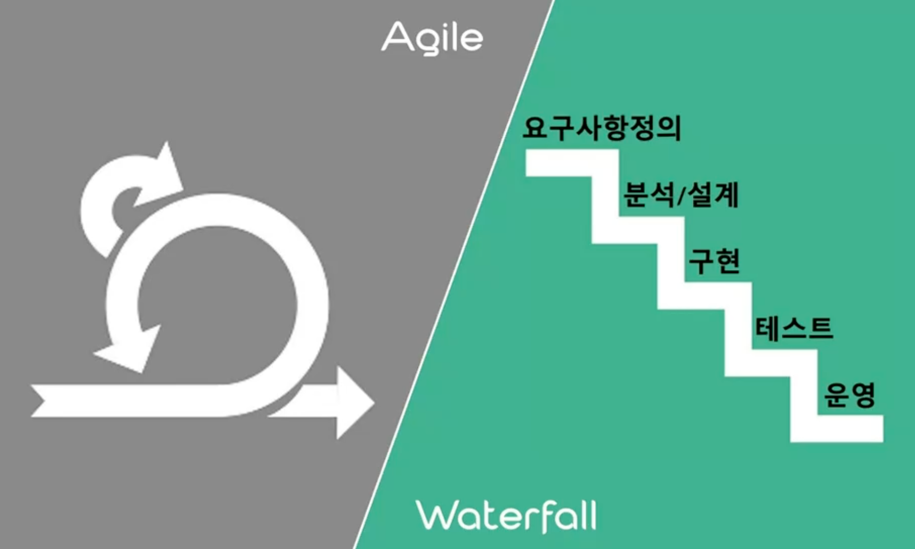
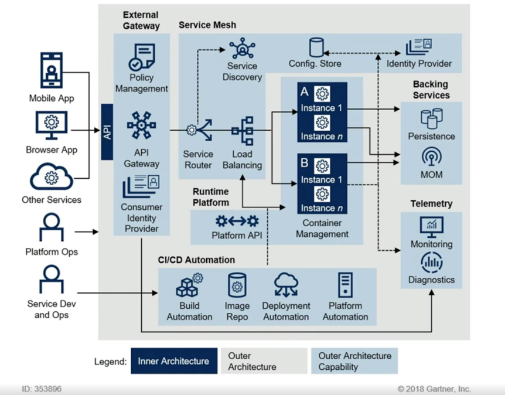
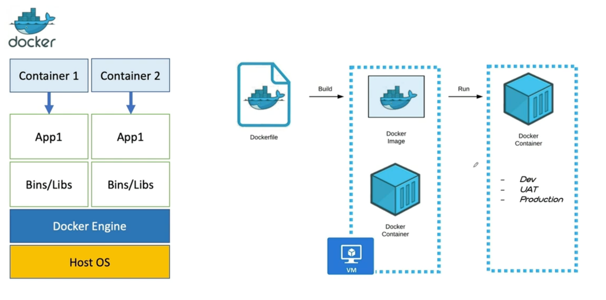
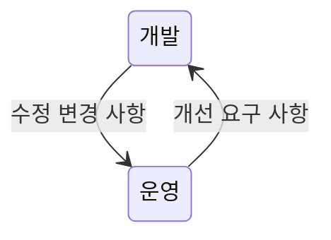
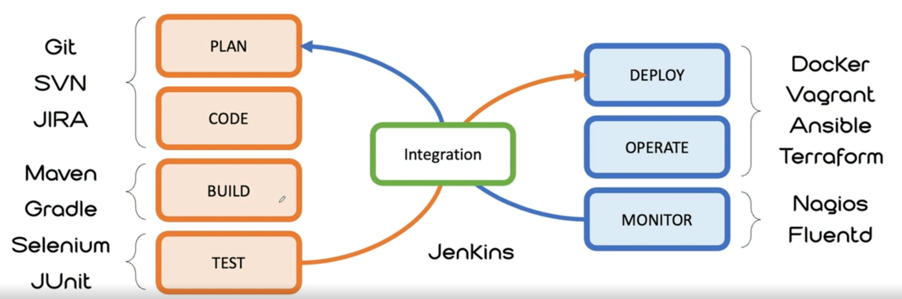
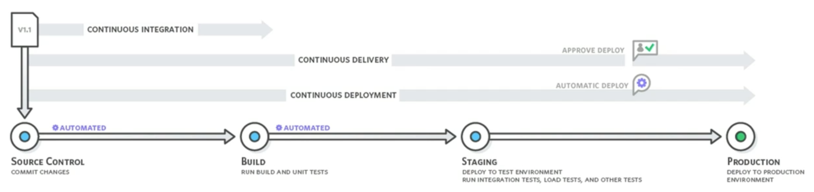
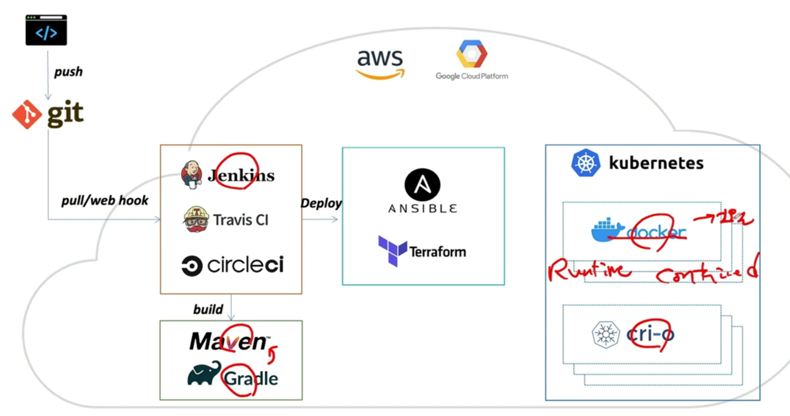
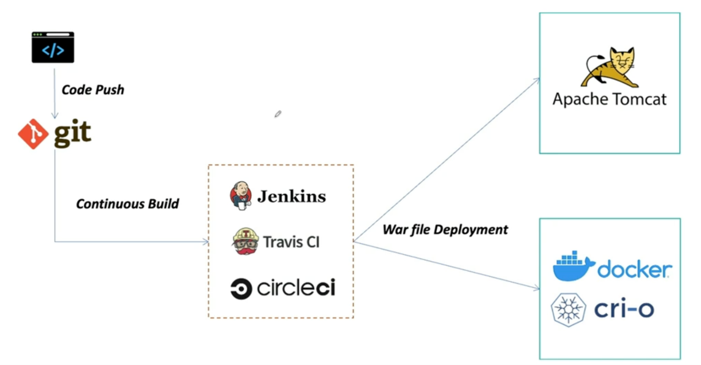
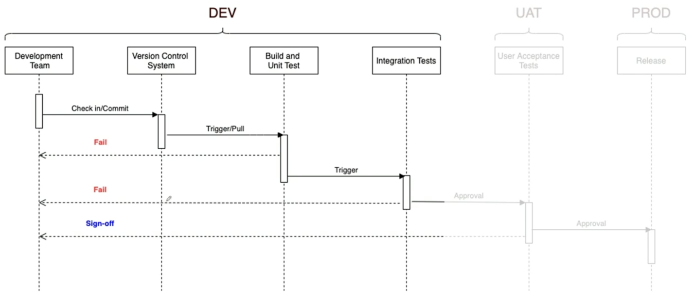

## DevOps와 CI/CD


### `Waterfall` vs `Agile`



#### Waterfall

* 전통적인 개발 방법론 
* 순차적인 개발 방법론 
* 한 번 완료된 단계는 폭포처럼 거슬러 올라가기 힘들다.
* 고객의 니즈를 바로 반영하기 어렵다.


#### Agile

* 계획이 지나치게 많았던 개발 방법론과의 타협점
* 프로젝트의 생명주기 동안 점점 프로젝트를 진화시켜 사용자의 니즈를 만족시켜 감

### Manifesto for Agile Software Development

```
We are uncovering better ways of developing
software by doing it and helping others do it.
Through this work we have come to value:

Individuals and interactions over process and tools
Working software over comprehensive documentation
Customer collaboration over contract negotiation
Responding to change over following a plan

That is, while there is value in the items on th right,
we value the items on the left more
```

* 개인과 상호작용을 우선시
* 작동하는 소프트웨어
* 고객과의 협력
* 변화에 대응

|       | Development Process | Application <br/>Architecture | Development <br/>& Packing | Application <br/>Infrastructure |
|-------|:-------------------:|:-----------------------------:|:--------------------------:|:-------------------------------:|
| ~1990 |      Waterfall      |          Monolithic           |      Physical Server       |           Datacenter            |
| ~2000 |        Agile        |             N-Tie             |      Virtual Servers       |             Hosted              |
| ~2010 |       DevOps        |         Microservices         |         Container          |              Cloud              |


### Cloud Native Architecture

* 클라우드 네이티브 아키텍처 및 기술은 클라우드에서 빌드되고 클라우드 컴퓨팅 모델을 최대한 활용하는 워크로드를 디자인, 생성 및 운영하는 접근 방식이다.
* 클라우드 네이키브 기술을 통해 조직은 퍼블릭, 프라이빗 및 하이브리드 클라우드와 같은 최식 동적 환경에서 확장 가능한 애플리케이션을 빌드하고 실행할 수 있다.
  컨테이너, 서비스 메시, 마이크로 서비스, 변경할 수 없는 인프라 및 선언적 API는 이 접근 방식을 예로 들 수 있다.
* 이러한 기술을 사용하면 복원력, 관리 가능 및 관찰 가능한 느슨하게 결합된 시스템을 사용할 수 있다. 강력한 자동화와 결합된 엔지니어는 최고한의 수고로 자주
  예측 가능하게 높은 영향을 미치는 변경을 할 수 있다.


### Cloud Native Application

* Microservices
* Containers
* DevOps
* CI/CD


#### MSA



#### Containerization



#### DevOps

* 2007~2008년 -> Startup
* IT 운영 및 sw 개발에 문제점 대두
  * 개발과 배포가 다른 조직에서 관리(다른 목표를 가짐)
* 2009년 Belgium에서 첫 DevOps 컨퍼런스
  * `Development` + `Operations`
  * 인프라로 코드 관리
  * 애자일 인프라 스트럭처
  * 애자일 시스템 관리 운동
  * learn Startup
  * 지속적인 통합 및 배포 운동 -> CI, CD



* 엔지니어가, 개발하고, 빌드하고, 직접 시스템에 배포 및 서비스를 RUN
* 사용자와 끊임없이 상호작용하면서 서비스를 개선해 나가는 일련의 과정 문화



#### CI/CD

* Continuous Integration
  * 작업된 코드의 컴파일
  * 테스트
  * 패키징

* Continuous Delivery
  * 개발, 운영 서버로 배포

* Continuous Deployment



### CI/CD Flow




#### Deploy on Docker using Jenkins




### Jenkins

* 지속적인 통합 배포 -> work flow를 제어
  * Continuous Integration Server
    * Continuous Development, Build, Test, Deploy
* 다양한 Plugins 연동
  * Build Plugins: Maven, Ant, Gradle
  * VCS Plugins: Git, SVN
  * Language Plugins: Java, Python, Node.js

#### Jenkins Pipeline



