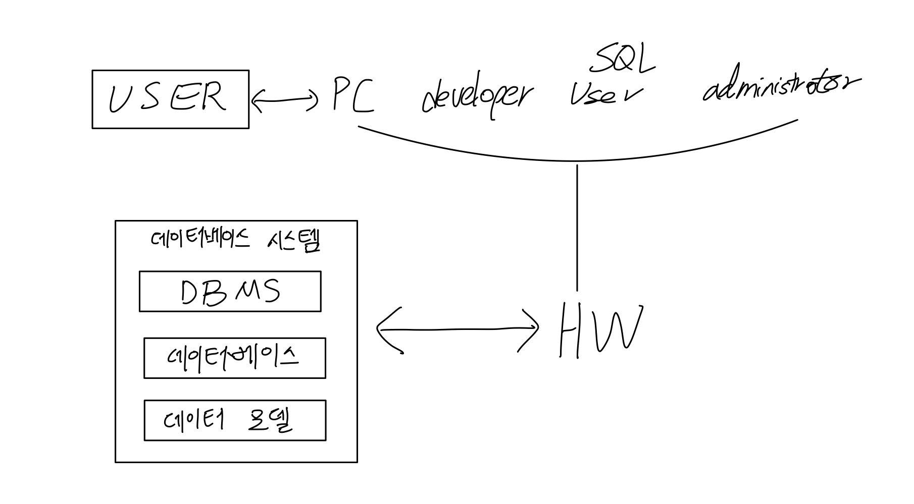

## 데이터베이스와 데이터베이스 시스템

### 데이터, 정보 지식

* 데이터(Data): 관찰의 결과로 나타난 정량적 혹은 정성적인 실제 값
* 정보(Information): 데이터에 의미를 부여한 것
* 지식(Knowledge): 사물이나 현상에 대한 이해

### 데이터베이스

* 데이터베이스: 조직에 필요한 정보를 얻기 위해 논리적으로 연관된 데이터를 모아 구조적으로 통합해 놓은 것

### 데이터베이스의 개념 및 특징

데이터베이스는 각 조직에서 사용하던 데이터를 모아서 통합하고 공유할 목적으로 구축된다.

#### 데이터베이스의 개념

1. 통합된 데이터(integrated data)
2. 저장된 데이터(stored data)
3. 운영 데이터(operational data)
4. 공용 데이터(shared data)

#### 데이터베이스의 특징

1. 실시간 접근성(real time accessibility)
2. 계속적인 변화(continuous change)
3. 동시 공유(concurrent sharing)
4. 내용에 따른 참조(reference by content)

### 데이터베이스 시스템의 구성

* DBMS: 사용자와 데이터베이스를 연결시켜주는 소프트웨어 주기억장치에 상주한다.
* 데이터베이스: 데이터베이스는 데이터를 모아두는 토대, 물리적으로 컴퓨터 내부의 하드디스크에 저장된다.
* 데이터 모델: 데이터가 저장되는 스타일

## 데이터베이스 시스템의 발전

### 데이터베이스 시스템의 예

* 서점 사업의 확장으로 예를 들어 데이터베이스 시스템을 발전을 살펴본다.

#### 1. 서점의 시작

* 도서: 100권
* 고객: 근처 학교의 학생, 지역 주민
* 업무: 회계 업무, 장부에 기록
* 고객 서비스: 사장이 직접 도서 안내

#### 2. 컴퓨터의 도입

* 도서: 1000권
* 고객: 근처 학교의 학생, 지역 주민
* 업무: 회계 업부(컴퓨터 사용), 파일 시스템
* 고객 서비스: 컴퓨터를 이용하여 도서 검색, 직원 고용