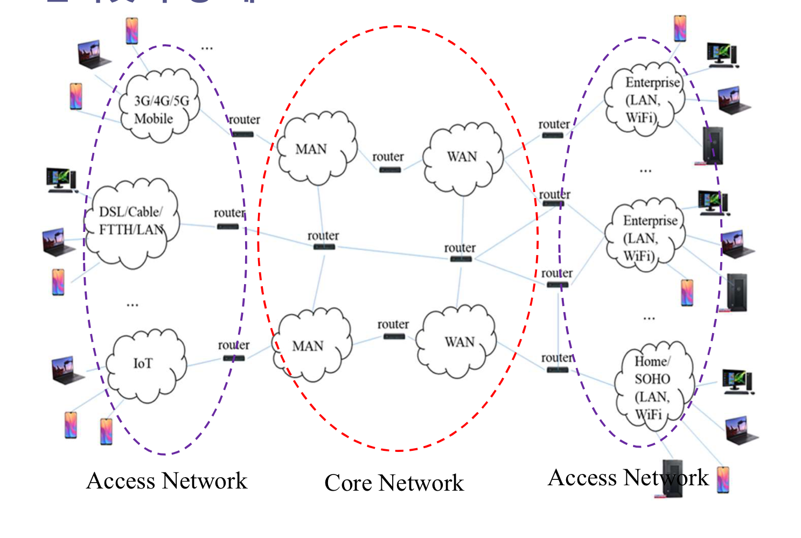
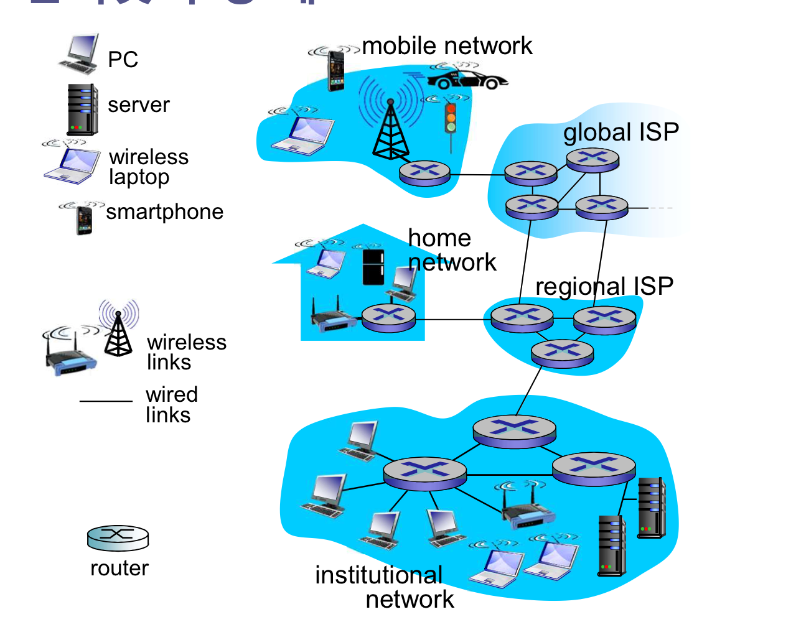
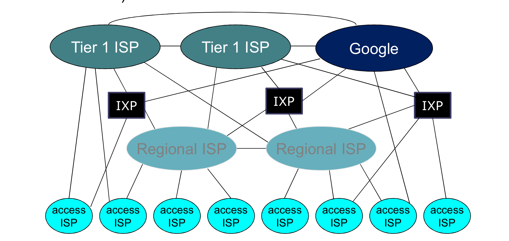
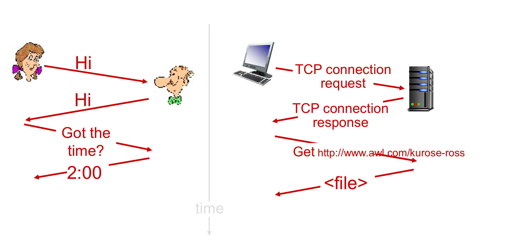

## 인터넷 프로토콜

### 인터넷이란?

#### 정의

* 네트워크들을 상호 연결한 네트워크(Inter-connected network of networks)

#### 호스트(Host)

* 인터넷의 끝에 연결된 종단 장치
* PC, 서버 스마트폰 IoT 센서 등

#### 네트워크(Network)

* 다양한 유형의 `스위치`들을 통신 `링크`로 연결한 분산 시스템

#### 링크(Link)

* 통신 장치들 간에 정보 전달 단위인 패킷을 전달하는 유, 무선 매체
* 구리선, 광케이블, WIFI 채널, 위성 채널 등

#### 링크 전송속도(Transmission rate)

* 초당 전송가능한 비트수(bit persecond, bps)

### 스위치

* 다수의 통신 장치를 통신 링크로 연결하는 장치
* 입력 링크로 수신된 패킷을 출력 링크로 전달하는 장치
* 라우터(Router), 링크계층 스위치(L2 Switch)

#### L2 스위치 

* 일반적으로 접속 네트워크(Access network)에서 사용

#### 라우터

* 일반적으로 코어 네트워크(Core network)에서 사용

#### 인터넷 구성

#### ISP(Internet Service Provider)

* 인터넷 서비스를 제공하는 조직과 네트워크
* Access ISP(Residential ISP, Corporate ISP, University ISP), Upper-tier ISP(Regional ISP, Tier-1 ISP* )

### 프로토콜

* 인터넷을 구성하는 장치들 간에 정보 교환을 제어하는 규칙
* 통신 장치: 하나 또는 다수의 프로토콜을 구현한 시스템

#### TCP/IP

* 인터넷에서 가장 많이 사용되는 프로토콜

#### 프로토콜 표준

* IETF(Internet Engineering Task Force)에서 제정한 프로토콜
* RFC 번호로 표시 

#### 휴먼 프로토콜과 네트워크 프로토콜

#### 네트워크 프로토콜

* 통신 장치들간에 교환될 메시지의 형식 정의
* 메시지 교환 순서 정의
* 메시지를 교환할 때 수행해야할 행위를 정의

#### 프로토콜의 종류

* HTTP
* HTTPS
* FTP
* SMTP
* VoIP
* DNS
* TCP
* UDP
* TLS
* IP
* ICMP
* ARP
* OSPF
* IPsec
* WIFI
* Ethernet
* PPP
* HDLC 