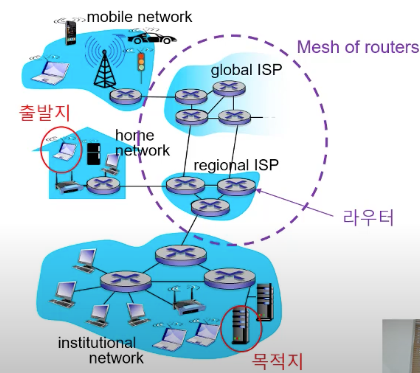
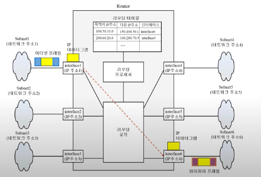
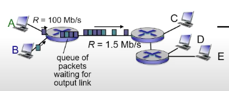
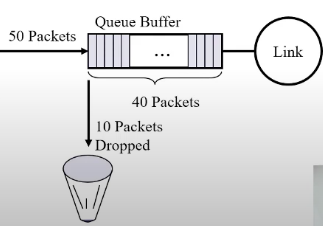
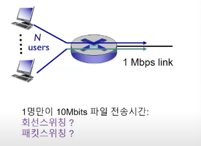
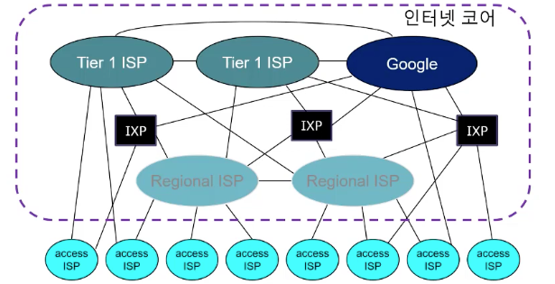

### 코어 네트워크와 라우터

* 접속 네트워크(Access network)들을 연결하기 위해 ISP들이 운영하는 광역 네트워크

#### 구성
 
* 라우터들을 고속의 링크로 연결

#### 종간간 경로

* N개의 링크와 (N - 1)개의 라우터의 연결

### 라우터

#### 기능

   1. 연결 기능: 대상(Network)
   2. 교환 기능: 대상(Packet) 

### 패킷 스위칭

#### 패킷

* 전송 장치 간에 전달되는 정보 단위
* 공유 링크의 공정한 전송을 위한 긴 메시지를 작은 패킷 단위로 나누어 전송

#### 패킷 스위치

* 입력 링크와 출력 링크 간에 패킷 단위 교환
* L2(링크 계층) 스위치, 라우터

### 라우터 링크 전송속도와 지연시간

#### 링크 전송속도(Link transmission rate)

* 초당 링크가 전송가능한 비트의 수
* 링크의 종류에 따라 달라짐
* Fast Ethernet 링크: `100Mbps`, Gigabit Ethernet 링크: `1000Mbps`

#### 패킷 전송지연시간(Transmission delay)

* 전송 장치가 패킷을 링크로 전송하는 데 걸리는 시간
* 패킷 크기 : `L bit`, 링크 전송속도: `R bps` 
  패킷 전송지연시간 : `L/R seconds`
* `L` = `7.5Mbits`, `R` = `1.5Mbps` -> 전송 지연시간 = `5 sec`

### 라우터 Store-and-Forward 전송

#### 라우터의 저장-전달(Store-and-Forward) 전송

* 수신 패킷을 버퍼 메모리에 일단 다 저장한다.
* 패킷을 완전히 수신 후 패킷 전송을 시작한다.
* *출발지*와 *각 라우터*에서 전송지연시간이이 발생한다.

#### 종단간 패킷 전송지연시간 : Dend_to_end

* 패킷 크기: `L bit`, 링크 전송속도: `R bps`, 링크 개수: `N`
* Dend_to_end = `N * (L/R)`, 전달 지연시간 미고려

### 라우터 큐잉 지연시간과 패킷 손실

#### 큐잉 지연시간(Queuing delay)

* 패킷이 패킷 스위치(라우터)의 출력 링크의 큐 버퍼 메모리에서 전송전에 대기하는 시간
* 출력 링크의 전송속도보다 많은 양의 패킷이 해당 링크로 교환될 때 발생

#### 패킷 손실(Packet loss)

* 버퍼 메모리에서 패킷이 저장되지 못하고 없어지는 현상
* 유한한 크기의 버퍼 메모리에 저장될 수 없는 많은 양의 패킷이 해당 링크로 교환될 때 발생

### 라우팅 테이블과 라우팅 프로토콜

#### 라우팅 테이블

* 입력 패킷에 대한 교환 규칙을 정의하는 자료구조
* 패킷 전달 테이블(Forwarding table)

#### 라우팅 프로토콜(Routing protocol)

* 라우팅 테이블을 자동으로 생성하는 프로토콜

### 회선 스위치(Circuit switching)

* 스위치 입력 포트에 연결된 회선을 출력 포트에 
  연결된 동일 전송속도의 회선으로 교환
* 회선 교환 작업을 일련의 스위치에서 반복하여 
  종단 장치를 일정 전송속도의 전용 회선으로 연결
* 전화망(음성 `64Kbps`)에서 사용

#### 회선 스위칭의 특징과 응용

* 일정한 전송 속도 보장
* 짧고 일정한 지연 시간이 보장
* 전화와 같이 연속적인 신호 전송과 시간을 요하는 응용에 적합

#### 회선 스위칭의 문제점

* 데이터가 발생되지 않는 구간에서는 회선이 낭비

#### 회선 스위칭: 링크 일부 전송

* 링크 전송속도: 1Mbps
* 사용자 수: 10명
* 1인당 100kbps 전용회선 할당

#### 패킷 스위칭 : 링크 공유

* 링크 전송속도: `1Mbps`
* 전체 시간 중 10%만 링크 사용
* 35명의 사용자중에 11명 이상이 동시에 링크를 사용할 확률: 0.0004(0.04%)
* 35명이 `100kbps` 이상의 전송속도로 링크를 사용할 확률이 `99.94%`
* 1명만 사용하는 경우 `1Mbps` 전송속도로 사용
* 불연속족인 데이터 전송에 매우 효율적

### 인터넷 코어 구조

#### 상위 ISP 네트워크들의 네트워크

* 고속의 링크들이 패킷 스위치인 라우터들로 그물망처럼 연결된 네트워크

