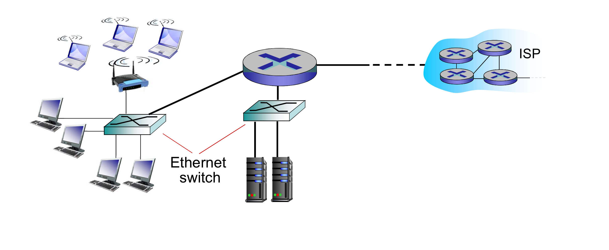

## 네트워크 에지

#### 정의

인터넷에서 호스트 또는 종단 장치가 연결되는 접속 네트워크(Access Network)

#### 접속 네트워크 구분

* Home Access Network: DSL, Cable, FTTH, Ethernet/WIFI
* Enterprise Access Network: Ethernet/WIFI
* Mobile Access Network: 3G, 4G/LTE, 5G

### DSL Access Network

* DSL(Digital Subscriber Line) 네트워크 구성

#### DSL 종류와 채널 구성

* ADSL: 10Mbps 전후의 전송속도 제공(전화선 길이에 따라 달라짐)
* VDSL: 100Mbps 전후의 전송속도 제공

### Cable Access Network

#### Cable 네트워크 구성

#### 케이블 네트워크 채널 구성

* 상향: 1Gbps 전후의 전송속도 제공(공유 속도)
* 하향: 10Gbps 전후의 전송속도 제공(공유 속도)

### FTTH Access Network

* access network까지 광케이블을 직접 연결

#### FTTH에서 집집마다 광케이블을 공유하기 위한 방법

1. TDM-PON

   * 광 분기기에 의해 분기된 관 케이블에 연결된 모든 가입자가 시간 분할 다중 접근(`TDMA`)으로 광 케이블의 대역폭을 공유
   * 10Gbps 전후의 공유 전송 속도 제공

2. WDM-PON
   * 파장 분할 다중 접근 기술을 적용하여 각 가입자별로 서로 다른 파장의 광 신호 할당 
   * 수 Gbps 전후의 전용 전송속도 제공

### Ethernet / WiDi Access Network

### 서비스별 초고속 인터넷 가입자수

| 년도      | DSL        | Cable     | FTTH      | LAN       |
|:--------|:-----------|:----------|:----------|:----------|
| 2012.8  | 2,222,683  | 4,974,820 | 4,409,687 | 6,501,717 |
| 2017.12 | 944,876    | 3,974,077 | 7,703,833 | 8,573,132 |
| 2021.2  | 498,605    | 2,857,013 | 9,472,016 | 9,633,118 |