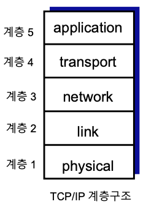

# 프로토콜 계층 구조

## 통신 프로토콜

* 통신 장치들간에 교환될 메시지의 형식 정의
* 메시지 교환 순서 정의
* 메시지를 교환할 때 수행해야할 행위를 정의

### 프로톨콜 구조: 계층 구조

#### 계층 구조의 예

#### 계층 구조의 장점

* 기존의 프로토콜을 이용하여 새로운 프로토콜을 정의하기에 용이하다.
* 특정 통신 기능 또는 서비스 수정이 용이하다.
* 전체 시스템 이해 용이

#### 계층 구조의 단점

* 하위의 프로토콜에 필요없는 기능이 포함될 수 있어 최적의 프로토콜이라 할 수 없다. 즉 최적의 시스템을 구현하기에는
  무리가 있다.

#### 프로토콜

* 특정 통신 서비스를 위한 정보 교환 규칙 정의
* 유사한 통신 서비스를 위해 유사한 프로토콜 다수 정의 가능
* 물리 매체 프로토콜: UTP, 광케이블, 무선 채널
* 인터넷 응용 프로토콜: HTTP(웹 서비스), SMTP(이메일 서비스)

#### 계층

* 유사한 프로토콜들의 집합
* 1개의 계층에 다수의 프로토콜이 존재할 수 있다.

### 계층 구조 모델

#### TCP/IP 계층 구조

* 인터넷 프로토콜 구조
* 5계층 구조

#### OSI구조
* ISO에서 정의
* 7계층 구조
* 실제 사용되지 않고 참조 모델로 활용

#### Application layer

* 인터넷 최종 사용자 서비스를 위한 정보 교환 규칙 정의
* 사용자 서비스 종류에 따라 서로 다른 응용 프로토콜 정의
* HTTP, SMTP, FTP, DNS

#### Transport layer

* 응용 계층 프로토콜 간에 메시지를 작은 전송단위(`segment`)로 나누고 전송하는 규칙 정의
* 응용 프로토콜 지정(End-point, Port 번호), 오류 제어(Error control), 흐름 제어(Flow control)
  혼잡 제어(Congestion control)
* TCP(Transmission Control Protocol), UDP(User Datagram Protocol)

#### Network layer

* 네트워크 상에서 최적 경로를 찾고, 출발지 트랜스포트 프로토콜의 전송단위(segment)를 네트워크 
  전달단위인 데이터그램(Datagram)으로 변환하고, 목적지 트랜스포트 프로토콜까지 데이터그램을 교환하고 전달한다.
* 데이터그램 전달 프로토콜: IP
* 최적 경로 찾기 프로토콜: Routing Protocol

#### Link layer

* 네트워크 경로를 구성하는 각 링크 상에서, 네트워크 전송단위(데이터그램)을 프레임(Frame)으로 변환하고
  링크의 끝까지 전송하는 규칙 정의 링크의 유형에 따라 다양한 링크 프로토콜 정의
* 유선 LAN: Ethernet, 무선 LAN: WiFi

#### Physical layer

* 디지털 비트와 물리적인 신호의 변환과 물리 매체 접속 규격 정의
* 물리 매체의 유형에 따라 다양한 물리 프로토콜 정의
* Ethernet 링크를 위해 UTP, 광케이블 물리 프로토콜 정의 
* WiFi 채널의 디지털 비트와 물리 신호의 변환 방법에 따라 다양한 물리 프로토콜 정의

#### OSI Presentation layer

* 응용 프로토콜이 교환하는 정보의 의미를 동일하게 해석하도록 표현하는 규칙 정의
* 데이터 표현, 압축 방식, 암호 방식 등
* TCP/IP 구조에서는 필요한 경우 응용 프로토콜에서 정의(정의할 필요가 없을 수도 있음)

#### OSI Session layer

* 체크포인트를 통해 교환되는 정보를 구분하고, 교환 정보를 상호 동기화하며, 복구할 수 있는 규칙을 정의한다.
* TCP/IP 구조에서는 필요한 경우 응용 프로토콜에서 정의(정의할 필요가 없을 수도 있음)

### 캡슐화

* 데이터 정보(Data information): 사용자가 통신 상대방 사용자에게 전송ㄹ을 의뢰한 정보
* 제어 정보(Control information): 프로토콜의 규칙을 수행하기 위해 상대방 프로토콜에게 제공하는 정보

#### 프로토콜 제어 정보와 데이터

#### 계층별 프로토콜 교환정보 이름

* application: `message`
* transport: `segment`
* network: `datagram`
* link: `frame`

#### 호스트, 라우터, 스위치와 계층구조

