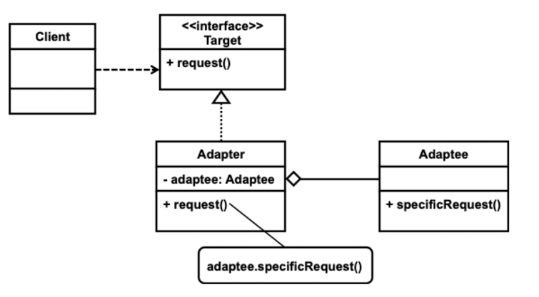

# Adapter 패턴

#### 패턴의 종류
* 구조 패턴

##### 패턴의 목적
* This pattern converts the interface of a class into another class into another interface client expect. 
  Adpater lets classes work together that couldn't otherwise because of incompatible interfaces.


#### 패턴의 수준
  * `component`

#### 패턴의 적용

* 기존 클래스를 사용하고 싶은데 해당 클래스가 제공하는 인터페이스가 필요한 인터페이스와 다른 경우(다른 타입으로 사용하고 싶은 경우)
* 객체가 어떤 공통 인터페이스를 가지고 있지 않은 클래스들과 상호작용해야 할 경우
* 기존 여러 하위 클래스가 제공하고 있지 않은 어떤 공통 기능을 추가하고 싶지만 이 기능을 상위 클래스에 추가할 수 없는 경우 (객체 어댑터)
  * 각 하위 클래스를 상속하여 새 클래스를 만들기보다는 객체 어댑터를 사용하는 것이 효과적인 방법이다.

#### 패턴의 참여자
* 목표 `interface`: 클라이언트가 사용하고 싶은 `interface`
* 클라이언트:  목표 `interface`를 사용해야 하는 객체
* adaptee: 클라이언트가 사용해야 하지만 목표 interface를 제공하지 않는 객체
* adapter: 어댑터를 목표 interface로 사용할 수 있도록 해주는 객체

### 패턴의 구조

#### 클래스 어댑터


#### 객체 어댑터



* 자바는 목표 `interface`가 실제 `interface` 타입일 수 있지만 클래스일 수 있다.
  interface를 새롭게 정의할 수 있고, 클래스를 활용할 수 있다.

```java
public class TurkeyAdapter implements Duck {}
public class TurkeyAdapter extends Duck {}
```

### 패턴의 장단점

#### 장점
* 어댑터 클래스는 `SRP`에 충실한 클래스이다.
* 어댑터는 `OCP`를 제공하는 한 가지 방법이다. 기존 클래스를 수정하지 않고 서비스를 제공한다.

#### 단점
* 경우에 따라 어댑터를 만들기보단 어댑터를 바꾸는 것이 간단할 수 있다. 보통 어댑티와 클라이언트를 모두 수정하기 힘들거나 적절하지 않을 때 사용하는 패턴이다.

### 패턴의 변형

#### 클래스 어댑터 / 객체 어댑터

* 클래스 어댑터는 `subclassing`을 이용하여 어댑터를 구현하는 방식이고, 객체 어댑터는 포함 관계를 이용하여 어댑터를 구현한다.
  * 클래스 어댑터는 상속을 이용하기 때문에 객체는 하나만 존재하지만 객체 어댑터는 항상 두 개(어댑터, 어댑티)의 객체가 존재한다.
  * 클래스 어댑터는 상속을 이용하기 때문에 특정 클래스 하나에 대해서만 어댑터 역할을 할 수 있지만 객체 어댑터는 포함 관계를 사용하기 때문에 하나의 클래스를
    이용하여 계층 구조에 있는 다양한 객체에 대한 어댑터로 사용할 수 있다.
  * 클래스 어댑터는 상속을 사용하기 때문에 기본적으로 양방향 어댑터로 사용할 수 있다.

* 양방향(two-way) 어댑터: 어댑터를 어댑티가 필요한 곳에서도 사용할 수 있는 어댑터
  * 클래스 어댑터는 기본적으로 양방향 어댑터로 사용할 수 있다.
  * 어댑터에 추가된 코드 때문에 어댑티 환경에서 사용할 때 원래 어댑티와 다르게 행동할 수 있다.

* `n` 방향 어댑터 n(>= 3)개의 타입으로 사용 가능한 어댑터. 다른 말로 만능 어댑터.
  * 다중 상속이 제공되지 않으면 양방향, n 방향 모두 제공하기 어려울 수 있다. 자바에서는 모든 방향마다 `interface`가 정의되어 있어야 만들 수 있다.

* 플러그 가능 어댑터

> 하나의 어댑터가 다양한 종류의 어댑티를 처리할 수 있는 어댑터

  * 어댑티가 정해져 있지 않기 때문에 어댑티를 상속받는 형태로 만들 수 없다.
  * 프로그래밍 언어의 특성에 따라 구현하는 것이 어려울 수 있다.

#### 다른 패턴과의 비교
  * `decorator`
    * 인터페이스를 바꾸지 않으며, decorator 패턴은 보통 다중 장식이 가능하다. 어댑터는 인터페이스를 바꾸며, 보통은 이렇게 하지 않으면 어댑터도
      어댑터 객체를 유지하는 방법으로 인터페이스를 여러 차례 바꿀 수 있다.
  * `proxy`
    * `decorator` 패턴과 마찬가지로 인터페이스를 바꾸지 않는다.