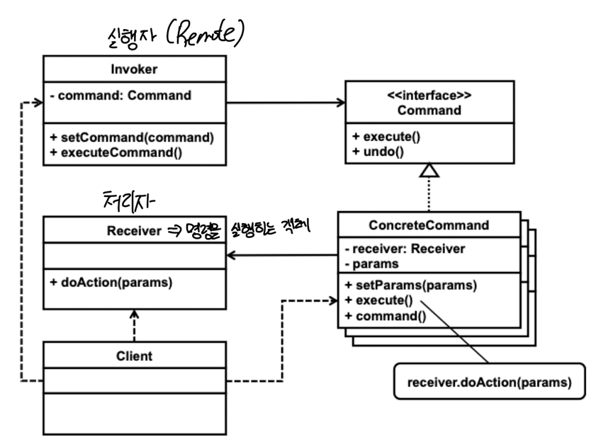

# Command 패턴

#### 패턴의 종류
* 행위 패턴

##### 패턴의 목적

> This pattern encapsulates a request as an object, thereby letting you parameterize 
> clients with different request, queue, or log requests, and support undoable operation
>
> GOF

#### 패턴의 수준
* `component`

#### 패턴의 적용

* 요청을 하는 소스와 그 요청을 실제 실행하는 개체를 분리하기 위해
  * 이 분리를 통해 요청 자체나 요청을 실행하는 객체를 쉽게 바꿀 수 있다.
* 실행한 행위에 대한 undo 기능이 필요할 때
* 실행한 행위를 저장하고 나중에 재실행하는 기능이 필요할 때
* 요청을 나중에 실행할 필요성이 있을 때, 이를 위해 요청을 큐에 유지할 수 있다.

#### 패턴의 참여자

* 명령 `interface`
  * 구체적 명령 객체를 위한 `interface`, 보통 `execute`와 `undo` 메서드를 포함하고 있다.
* 구체적 명쳥
  * 명령 처리자와 행동을 연결함. 처리자가 제공하는 메서드를 이용하여 실제 행동을 실행한다. 
  * 구체적 명령은 처리자를 의존한다.
* 실행자(invoker)
  * 요청을 수행하기 위해 해야 하는 기능이 구현되어 있는 객체
  * 어떤 종류의 객체도 처리자가 될 수 있다.
* 클라이언트
  * 구체적 명령 객체를 생성하고 처리자와 연결한다.
  * 실행자에게 명령의 실행을 요청한다.
  * 명령 객체를 생성하는 클라이언트와 명령의 실행을 요청하는 클라이언트는 서로 다를 수 있다.

### 패턴의 구조

* 실행자는 등록되어 있는 명령 객체를 실행한다.
  * 이때 명령 객체가 undo 기능을 제공하면 이것에 필요한 작업을 수행하여야 한다. 실행자에 명령 객체를 등록하는 자와 나중에 실행을 요청하는 자가
    다를 수 있다.
  * 명령 객체는 연결된 처리자가 제공하는 메서드를 이용하여 일을 수행하며, undo 기능을 제공하기 위해 실행하기 전의 처리자의 상태를 보관해야 할 수 있다.

### 패턴의 구현

* 보통 명령 객체의 `execute` 메서드는 인자가 없고 반환 타입도 없다.
* 명령 객체가 수행해야 하는 일이 인자가 필요할 때 인자를 제공하는 방법
  1. 명령 객체를 생성할 때 처리자와 함께 등록할 수 있다.
     * 생성한 명령 객체가 사용하는 인자는 바뀌지 않는다는 것을 의미한다.
     * 다양한 인자를 이용하여 명령 객체를 실행해야 하면 인자 값마다 다른 명령 객체의 생성이 필요할 수 있다.
  2. 명령 객체의 `execute` 메서드를 실행한기 전에 별도 메서드를 이용하여 인자를 등록할 수 있다.
     * 클라이언트가 실행을 요청하기 전에 인자를 별도록 전달해야 하는 번거로움이 있다.
     * 모든 명령 객체가 균일한 방법으로 인자를 설정하는 방법을 제공하기 힘들 수 있다.
  3. `execute` 메서드가 인자를 받도록 정의한다.
     * 다양한 종류의 명령 객체를 위한 명령 `interface`를 정의하기 힘들 수 있어 유연성이 떨어질 수 있다.
     * 패턴을 적용하는 응용에서 필요한 모든 종류의 명령 객체가 동일한 인자가 필요하다면 이 방법ㅇ르 사용할 수 있다.

* 명령 객체의 실행 결과를 반환 받아야 하는 경우에도 `execute`의 반환 타입으로 처리하는 것이 아니라 별도 저장하고 `getter` 메서드를 통해 반한값을
  받는 방법을 사용하기도 한다.
* `undo`와 `redo` 기능의 제공 여부
* 다중 `undo`와 `redo`를 제공해야 하면 히스토리 유지가 필요하다.
  * 단순 명령 객체의 저장으로 다중 undo와 redo를 제공하기 어려울 수 있다. 특히, 통일 명령 객체를 계속 사용하고, 이 객체의 주소를 히스토리로 유지하면
    이와 같은 기능르 제공하기 힘들 수 있다.
  * 다중 undo와 redo를 제공해야 하면 별도 Command 관리자를 만들어 처리하는 것이 효과적일 수 있다.
* 명령 객체를 파일시스템에 저장하고 나중에 이등을 이용하여 지난 과정을 재현할 수 있다.
  * 동일 명령 객체를 여러 번 저장하는 형태의 경우 이에 대한 고려가 필요하다. 가장 오래된 것부터 하나씩 읽어 실행하는 형태가 필요할 수 있다.
  * 명령 객체 뿐만 아니라 처리자의 저장이 필요하다.
  * 자바의 경우 object serialization을 이용할 수 있다.

### 패턴의 장단점

#### 장점
* 명령 객체를 여러 객체가 공유할 수 있다.
* 실행 시간에 명령 객체나 명령 객체의 처리자를 변경할 수 있다.
* 새로운 명령 객체를 만들기 쉽다
* 명령의 요청자와 처리자를 분리할 수 있다.
* 여러 명령 객체를 조합하여 매크로 명령을 만들 수 있다.
* 명령 실행 시점과 방법에 대한 엄격한 통제가 가능하다.

#### 단점
* 작은 명령 클래스들이 많이 만들어질 수 있다.
* 코드 자체가 복잡해질 수 있다.

