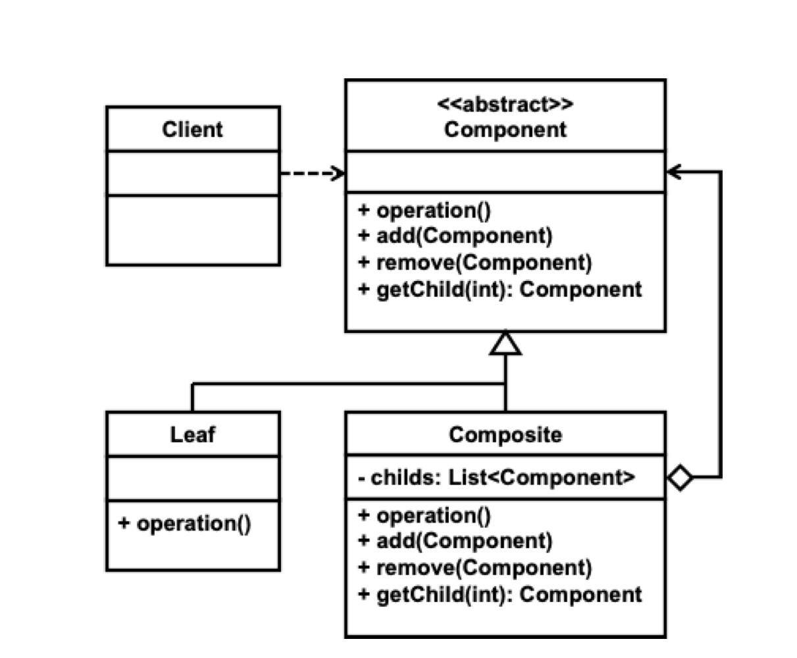

# Composite 패턴

#### 패턴의 종류
* 합성 패턴

##### 패턴의 목적

> This pattern compose objects into tree structures to represent part-whole hierarchies. 
> This pattern lets clients treat individual objects and compositions of objects uniformly
> 
> GOF

#### 패턴의 수준
* `structure`

#### 패턴의 적용

* 객체들의 전체-부분관계 계층구조를 표현하고 싶을 때
* 클라이언트가 개별 객체나 묶음의 차이를 무시하고 같은 방법으로 접근할 수 있도록 하고 싶을 때

#### 패턴 적용 가능 시나리오

* 어떤 것이 단말 노드로 사용되다가 중간 노드가 될 수 있다면 이 패턴은 바람직하지 않다. 단말과 중간 노드의 구분이 명확하지만 단말과 중간 노드를 구분하지
  않고 일관성 있게 접근할 필요가 있을 때 이 패턴을 사용해야 한다.
* 트리 구조로 표현할 필요가 없지만 개별 객체나 객체 묶음을 동일하게 처리하고 싶을 때 사용할 수 있다.

#### 패턴의 참여자

* 추상 노드
  * 모델링하고자 하는 객체애 대한 인터페이스 제공
  * 중간 노드, 단말 노드가 공통으로 제공하는 메서드의 기본 구현 제공 가능
  * 자식 노드에 대한 접근, 자식 노드의 추가, 삭제하기 위한 인터페이스 제공
  * 선택저긍로 부모 노드에 대한 접근 방법을 제공할 수 있다.

* 중간 노드
  * 자식 모드를 유지할 수 있는 복합 타입
  * 자식 노드에 대한 접근
  * 자식 노드의 추가, 삭제하기 위한 메서드 구현

#### 패턴의 구조

#### 참여자 간 협력

* 클라이언트는 항상 추상 노드 타입을 이용하여 중간 노드와 단말 노드를 같은 방법으로 접근한다.
* 자식에 대한 순서가 필요한 경우에는 이를 제공할 수 있는 자료구조로 자식을 유지할 필요가 있다.
* 트리 구조로 구성한 경우 반복자의 제공
  * 일반적인 그래프 탐색 알고리즘인 `BFS`, `DFS`를 이용한다.

### 패턴의 장단점

#### 장점

* 현재 처리해야 하는 것이 중간 노드인지 단말 노드인지 구분하지 않고 처리할 수 있게 해준다.
* 새로운 종류의 단말을 도입하기 쉽다.

#### 단점

* 단말과 중간 노드를 동일하게 취급하기 위해 추상 노드에 너무 많은 메서드가 선언 또는 정의될 수 있다.
  * ISP에 위배된다.
* LSP 측면에서 바람직하다고 보기 힘들다.

#### 패턴의 변형

* 부모에 대한 연결 유지여부
* 자식에 대한 접근, 자식 추가, 삭제를 중간 노드에만 정의하는 방법
  * 투명한 접근이 가능하지 않다.
  * 강건성 측면에서 중간노드에 정의하는 것이 더 유리할 수 있지만 단말 노드에 자식 관련 메서드들은 예외 처리함으로써 개발 과정을 오류를 발견하는 것이 더
    바람직한 방법이다.
* 자식들을 유지하기 위한 자료구조

