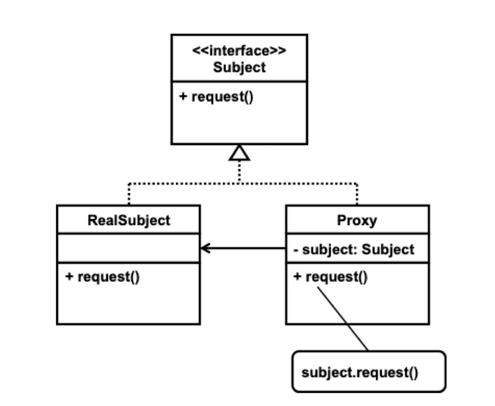

# Proxy 패턴

#### 패턴의 종류
* 행위 패턴

##### 패턴의 목적

> This pattern povide a surrogate or placeholder for another object to control to it.
>
> GOF

#### 패턴의 수준
* `component`

#### 패턴의 적용
* 원격 프록시
  * 원격에 있는 객체를 대신할 지역 객체
* 가상 프록시
  * 생성 비용이 비싼 객체를 대신할 객체, 보통 생성을 필요할 때까지 지연하거나 생성에 소요되는 시간이 길면 그 과정에서 대신 프록시를 사용함
* 보호 프록시
  * 원 객체에 대한 접근 제어를 제공하는 객체
  * 기존 언어에서 제공하는 접근 제어로 제어할 수 없는 것을 제공한다.
  * 한 객체에 대한 다향한 형태의 접근 제어를 제공할 수 있음

#### 패턴의 참여자

* 프록시
  * 포함 관계로 원 객체를 유지하며 `subclassing` / `subtyping`을 이용하여 원 객체와 동일한 인터페이스를 제공한다.
  * 원격 프록시는 원 객체를 유지하지는 않고 원 객체와 통신할 수 있는 기능을 갖추고 있어야 한다.
  * 원 객체에 대한 접근 제어를 제공하며, 객체의 생성과 삭제를 담당할 수 있다.

* 대상(`subject`) 객체 `interface`:
  * 프록시가 대신할 객체가 갖추어야 하는 `interface`

* 대상 객체
  * 프록시가 대신할 실제 객체

### 패턴의 구조

#### 참여자 간 협력

* 프록시는 클라이언트의 요청을 대상 객체에게 전달한다.

#### 패턴의 구현

* 프록시가 보통 대상 객체 interface만 알면 되지만, 객체 생성까지 담당해야 하는 경우에는 구체적 대상 객체와 직접적 의존 관계를 가지게 된다.
  * 일반적으로 구체적 대상 객체와 의존 관계 없이 프록시 기능을 제공할 수 있다.

### 패턴의 장단점

#### 장점

* 원격 프록시는 객체가 원격에 있다는 것을 숨겨줄 수 있다.
  * 통신 과정에서 언제든지 오류가 발생할 수 있으므로 이에 대한 인식이 필요하기 때문에 로컬 객체를 접근하는 것과 완전히 동일하게 접근할 수는 없다.
* 가상 프록시는 객체 생성 등과 관련하여 최적화를 해줄 수 있다.
  * 대상 객체가 아직 준비되지 않아도 프로그램이 동작하도록 할 수 있다.
* 보호 프록시는 `private`, `public`, `protected`와 같은 접근 제어를 통해 제어할 수 없는 접근 제어를 제공하여 준다.
  * 하나의 객체를 접근하는 클라이언트에 따라 다른 접근 제어를 제공할 수 있다.
* 기존 클라이언트나 대상 객체에 대한 수정 없이 새 프록시를 도입할 수 있다.
* 대상 객체애 대한 다양한 관리를 할 수 있다.

#### 단점
* 요청에 대한 결과가 지연될 수 있다.
* 원격 프록시의 경우에는 여러 가지 예외 처리 때문에 클라이언트가 인식할 수밖에 없다.

#### 관련 패턴

* `Adapter` 패턴
  * 어댑터가 대상 객체를 유지하는 측면에서 유사하지만 어댑터는 다른 인터페이스를 제공하기 위한 것이고, 프록시는 대상 객체와 동일한 인터페이스를 제공한다.
    * 프록시는 그것의 종류에 따라 대상 객체 인터페이스 중 일부만 제공할 수 있다.
* `Decorator` 패턴
  * 여러 번 장식할 수 있다는 측면과 보통 장식 패턴은 하나의 메서드의 기능을 확장하는 용도로 주로 사용한다는 측면에서 차이가 있다.
  * 보통 프록시는 접근을 제한하거나 숨겨주는 기능이 있지만 이와 같은 측면에서는 사용되지 않는다.
  * 장식은 항상 장식 대상을 생성자의 인자로 받는 형태이지만 프록시는 내부적으로 대신할 원 객체를 생성할 수 있다. 장식ㄷ은 실행 시간에 동적으로 장식이
    이루어지지만 프록시는 원 객체와 컴파일 시간에 그 관계가 설정된다.
  * 클라이언트가 사용하는 측면에서 차이가 있다.
    * 프록시의 클라이언트는 프록시를 주어진 대로 사용하지만 장식 패턴에서 클라이언트는 원하는 기능을 위해 직접 객체를 장식하여 사용한다.

