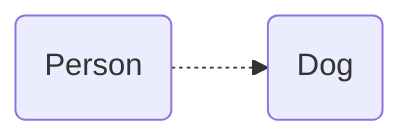
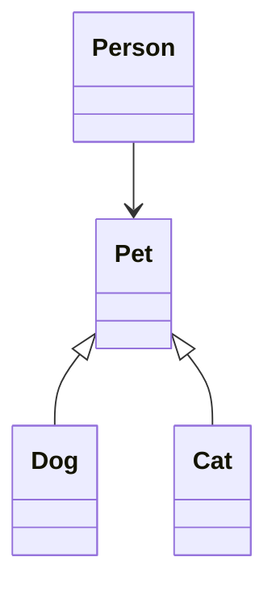

# 객체지향 설계 원리

### SOLID

#### Single Responsibility Principle

* 수정해야 하는 이유는 한 가지로 하고, 한 가지의 책임만 가지고 있어야 한다.

#### Open-Closed Principle

* 코드 수정 없이 확장이 가능해야 한다.

#### Liskov Substitution Principle

* 필요 없는 것을 구현하도록 강제하지 않아야 한다.

#### Dependency Inversion Principle

* 클래스는 구체적 클래스 대신에 상위 추상 타입이나 interface에 의존해야 한다.

### SRP

`A class shoud have only one reson to change`

* 클래스는 응집성이 높아야 한다.
* 클래스는 여러 멤버 변수를 유지하고 여러 메서드를 가질 수 있지만 이들은 모두 한 가지 책임을 위해 존재해야 한다.

#### OCP

`Classes should be open for extension, but closed for modification`

* 코드 수정 없이 클래스를 확장하는 기본적인 방법
  1. 상속
  2. 포함 관꼐 활용
     * 기존 클래스가 제공하는 기능은 이 클래스의 객체를 멤버 변수로 유지하여 사용하고 추가로 필요한 기능만 구현하여 새 클래스를 정의한다.
     * 이때 상위 타입의 참조 변수에 유지하면 더 유연한 코드가 된다.
       * 유지하는 구체적인 객체를 동적으로 변경할 수 있다.

#### LSP

` If S is a subtype of T, then objects of type T in a program may be replaced with objects of type S without altering any of the desirable properties of that program.`

* 클래스 간 관계는 크게 `subclassing`과 `subtyping`으로 분류된다.
* `subclassing`을 하더라도 `subtyping`이 충족된어야 한다는 것이 `LSP`이다.
* LSP가 충족되기 위해 메서드를 재정의할 때 보장되어야 하는 것
  * 메서드 매개변수 타입은 반변성
  * 메서드 반환타입의 공변성
  * 자식 메서드가 더 많은 종류의 예외를 발생할 수 없음
* 공변성은 더 특수화한트 것, 반변성은 더 일반화되는 것을 말함

```java
public class pluggable.Main {

}

class Pet{ }

class Cat extends Pet{ }

class Dog extends Pet { }

class PetShop{
    private Pet pet;


    Pet getPet() {
        return pet;
    }

    /**
     * 상속에 파라미터 타입은 정확히 일치해야 한다.
     * @param pet
     */
    void addPet(Pet pet){
        this.pet = pet;
    }
}

class CatShop extends PetShop{

    @Override
    Cat getPet() {
        return (Cat)super.getPet();
    }

    /**
     * 상속에 파라미터 타입은 정확히 일치해야 한다.
     * @param pet
     */
    @Override
    void addPet(
            // 컴파일 에러
            // Cat pet
            Pet pet
    ) {
        super.addPet(pet);
    }
}

class DogShop extends PetShop{

    @Override
    Pet getPet() {
        return super.getPet();
    }

    /**
     * 상속에 파라미터 타입은 정확히 일치해야 한다.
     * @param pet
     */
    @Override
    void addPet(
            // 컴파일 에러
            // Object pet
            Pet pet
    ) {
        super.addPet((Pet) pet);
    }
}
```

* LSP는 문법적인 측면뿐만 아니라 논리적인 측면에서 다음이 보장되어야 한다.

  * 메서드의 사전 조건은 강화되지 않아야 한다.
  * 메서드의 사후 조건은 약화되지 않아야 한다.
  * 상위 타입의 불변 조건은 계속 유지되어야 한다.
  * 객체는 자신의 메서드를 통해서만 상태가 변경될 수 있어야 한다.
* 예) 부모 메서드의 `int foo(int n)`

  * 사전 조건: `n > 0`, 사후 조건: `retval > 0`
  * 사전 조건 강화의 경우: `n > 0 && n % 2 == 0`
  * 사후 조건 약화의 경우: `retval > -1000`

```java
class Foo{
    int foo(int n){
        int retval = 0;
        if(n > 0){

            for (int i = 0; i < n; i++) {
                retval++;
            }
        }
        if (retval < 0) throw new IllegalStateException();
        return retval;
    }
}

class enhancedPrerequisitesFoo extends Foo{
    @Override
    int foo(int n) {
        if(n % 2 ==0) {
            return super.foo(n);
        } else throw new IllegalStateException();
    }
}

class weakenedPostConditionsFoo extends Foo{
    @Override
    int foo(int n) {
        int res = super.foo(n);
        if(res > -1000){
            return res;
        } else throw new IllegalStateException();
    }
}
```

* 상속할 때 자식 클래스에 새 메서드를 추가하면 LSP에 위배되는가?

  * LSP는 부모 클래스를 사용하여 객체를 처리할 때 문법적으로 논리적으로 문제가 없어야 한다는 것이다.
  * 자바에서 interface를 구체화한 클래스는 보통 interface에 선언된 메서드 외에 추가적인 공개 메서드를 가지고 있다.
  * 자식 클래스에 새 메서드의 추가는 LSP와 무관한 것이다.
    * 하지만 부모에 없는 공개 메서드의 추가는 객체지향 설계 측면에서 바람직한 것은 아니다.
  * LSP의 핵심은 부모 공개 메서드의 재정의이다.
    * 빈 메서드로 재정의하는 것은 LSP에 위배되는 것이다.(메서드 사전 조건의 강화?)
* LSP가 위배된 경우 일반적인 해결 방법

  1. 부모 자식 사이가 아니라 형제 클래스로 모델링 함
  2. 자식 중 특정 메서드가 필요한 쪽과 그렇지 않은 쪽이 있으면 해당 메서드를 부모 타입에서 제외하고, 그것을 포함하는 하위 클래스를 추가한다.
  3. 포함 관계를 활용

#### ISP

* 클래스나 interface가 제공하는 메서드의 수는 최소화되어야 한다.
* 단일 메서드 interface를 사용하면 ISP가 위배될 수 없다.
* 하지만 항상 같이 제공되어야 한느 것까지 분리할 필요는 없다.

> 주의사항
>
> ISP에서 Interface는 자바의 interface를 말하는 것은 아니다.

```java
public class pluggable.Main {
}

/**
 * 잘못된 설계
 */
interface MisunderstoodLivingThing{
    void eat();

    void walk();

    void swim();

    void fly();
}

interface LivingThing{
    void eat();
}

interface LivingInSky extends LivingThing{
    void fly();
}

interface LivingOnLand extends LivingThing{
    void walk();
}

interface LivingInWater extends LivingThing{
    void swim();
}

class Frog implements LivingInWater, LivingOnLand{

    @Override
    public void eat() {

    }

    @Override
    public void walk() {

    }

    @Override
    public void swim() {

    }
}

class duck.duck.Duck implements LivingInSky, LivingInWater, LivingOnLand{

    @Override
    public void eat() {
  
    }

    @Override
    public void fly() {

    }

    @Override
    public void walk() {

    }

    @Override
    public void swim() {

    }
}
```

### interface `A`에 `bar()`의 추가가 필요한 상황

#### interface A의 원형

```java
interface A {
  void foo();
}

class X implements A {
  @Override
  public void foo() {
    return;
  }
}

class Y implements A {
  @Override
  public void foo() {
  
  }
}
```

#### interface A의 수정

```java
interface A {
  void foo();

  void bar();
}

class X implements A {
  @Override
  public void foo() {
    return;
  }

  @Override
  public void bar() {
    return;
  }
}

class Y implements A {
  @Override
  public void foo() {
    return;
  }

  @Override
  public void bar() {}
}
```

* interface `Y`는 `bar()` 메서드의 구현을 필요로 하지 않는다.

#### ISP와 LSP의 원리에 적합한 설계

```java
interface A{
    void foo();
}

interface B extends A{
    void bar();
}
```

```java
class X implements B{

    @Override
    public void foo() {
  
    }

    @Override
    public void bar() {

    }
}

class Y implements A{
    @Override
    public void foo() {
  
    }
}
```

#### `interface`에 `default` 메서드를 추가할 수 있게 되어 다음과 같은 해결책도 가능하다.

```java
interface A {
  void foo();

  default void bar() {
  }
}

class X implements A {
  @Override
  public void foo() {
    return;
  }

  @Override
  public void bar() {
    return;
  }
}

class Y implements A {
  @Override
  public void foo() {
    return;
  }
}
```

* 각 메서드를 다른 interface로 정의할 수 있지만 함께 가져야 하는 타입을 모델링하지 못하는 문제점이 있음
* 응용에 따라 이것이 오히려 적합한 모델을 찾아야 한다.

#### DIP

`Depend upon abstractions. Do not depend on concrete classes`

* 의존 관계의 결합 정도와 관련된 원리이다.
  * 기본적으로 의존 관계는 적을수록 좋다.
  * DIP는 의존을 하더라도 구체적인 클래스 대신에 상위 추상 타입이나 `interface`에 의존해야 한다는 원리이다.
    * 의존 관계는 순화되지 않고, 일방향인 것이 더 바람직함
  * 이 원리에 충실해야 OCP가 가능헤진다.
* 의존 관계 역전의 의미
  * 현재 Person 클래스는 구체적인 Dog 클래스에 의존한다.
  * Dog는 Person을 클래스를 의존하지 않으면 두 클래스의 관계도를 그리면 화살표의 방향이 다음과 같다.



* 구체적인 클래스에 의존하기 때문에 강아지 대신에 고양이를 기르고 싶으면 코드 수정이 불가피하다.

```java
class Person{
    private Pet pet;
    public Person(Pet pet){
      setPet(pet);
    }
    
    public void setPet(Pet pet){
        this.pet = pet;
    }
}
```

* 이러한 형태가 되면 `Person`은 더 이상 Dog에 의존하지 않는다.
* `setPet`을 이용하면 언제든지 다양한 애완동물을 유지할 수 있다.
* 이와 같은 방식을 관계 주입(Dependency Injection)이라 한다.




* 관계를 고정하는 것이 아니라 사용하는 측에서 관계를 동적으로 맺어주는 방식
* 생성자 관계 주입 방식도 있고 `setter`를 이용하는 방식도 있다.


```java
abstract class A{
    public void foo(){
        bar();
        baz();
    }
    
    public void bar(){
        return;
    }
    
    protected abstract void baz();
}

class B extends A{
    protected void baz(){
      System.out.println("bazzz");
    }
}

class pluggable.Main{
  public static void main(String[] args) {
      B b = new B();
      ham(b);
  }
  
  void ham(A a){
      a.foo();
  }
}
```

* `B`는 `A` 클래스에 의존하지만 `A`는 `B`에 의존하지 않는다.
* 하위 클래스가 무엇을 할지 결정하지만 그것을 호출할 시점은 상위 클래스가 결정한다.

