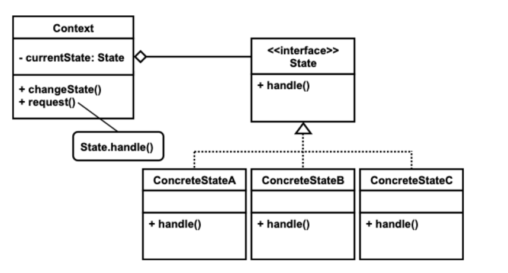

# State 패턴

#### 패턴의 종류
* 행위 패턴

##### 패턴의 목적

> This pattern allow an object to alter its behavior when its internal state changes, The object will appear
> to change its class
> 
> GOF

#### 패턴의 수준
* `component`

#### 패턴의 적용

* 객체의 상태가 변할 때 해야 하는 일이나 할 수 있는 일이 바뀌는 경우
  * 특히, 객체의 여러 메서드가 객체 상태 변화에 영향을 받는 경우
* 객체의 상태가 상태 전이도로 표현할 수 있고, 각 상태에서 행위가 서로 차이가 많은 경우, 상태의 종류가 많을수록 더 효과적이다.
* 객체의 여러 메서드가 동일한 형태의 객체 상태에 의존하는 다중 조건문으로 구성되어 있을 때

#### 패턴 적용 가능 시나리오

* 배송: 준비중, 배송중, 배송완료(취소, 배달지변경)

#### 패턴의 참여자

* context
  * 클라이언트와 상호작용하는 객체이며, 구체적 상태 클래스 객체들을 이용하여 자신의 상태의 일부분을 나타낸다.
* 상태 interface
  * 모든 상태 클래스를 추상화하기 위한 `interface`로 모델링하는 상태들과 관련된 행위들을 가진 `interface`
* 구체적 상태 클래스
  * 대상 객체의 개별 상태를 나타내는 클래스로 상태의 종류만큼 존재한다.

### 패턴의 구조

#### 참여자 간 협력

* 문맥 클래스는 구체적 상태 클래스와 연관된 행위는 구체적 상태 클래스 객체에게 위임한다.
* 필요하면 요청을 위임하는 과정에서 자신을 인자로 전달한다.
* 상태 전이의 결정은 문맥 객체 또는 구체적 상태 객체들이 결정한다.

#### 패턴의 구현

* 상태 전이가 고정되어 있다는 것은 한 상태에서 동일 사전에 대해 오직 다른 한 상태로만 전이되는 경우를
  말함

##### 상태 중심 전이

1. 문맥을 생성자를 통해 상태 객체에 전달하면 상태 객체는 문맥 객체를 멤버 변수로 유지한다.
   * 코들르 통해 상태 전이를 명확하게 알 수 있다.
2. 문맥 객체를 유지하지 않고 상태 전이 메서드의 인자로 문맥 객체를 전달한다.
3. 문맥은 상태 전이를 위한 메서드를 제공해야 한다. 상태 객체는 메서드를 이용하고 상태 전이를 한다.
   상태의 수가 n이면 n개의 getter와 1개의 setter를 제공하는 방법이 있고, n개의 특정 상태로 전이하는 메서드를
   제공할 수 있다.

##### 문맥 중심 전이

* 상태 전이가 고정되어 있지 않으며 문맥에서 상태 전이를 하기 위해 추가적인 검사가 필요하다.
* 상태 객체가 전이 여부에 대한 판단만 할 수 있고, 상태 중심 전이처럼 전이 메서드에서 문맥 객체를 인자로 받아 문맥 대신 각 상태에서 처리해야 하는 일을
  상태 객체가 처리할 수 있다.

1. 상태 전이 메서드의 반환 값으로 상태 전이 여부를 나타내는 `boolean`값을 사용하는 경우
   * 문맥 객체는 여전히 조건문을 사용하여 전이를 해야하는지 검사해야 한다.
2. 상태 전이 메서드의 반환 값으로 다음 상태 객체를 반환하는 경우
   * 상태 전이가 고정된 경우에는 문맥에서 조건문 없이 상태 전이를 할 수 있다.

#### 열거형으로 구현

* 상태 중심 전이, 문맥 중심 전이 모두 가능
* 상태 중심 전이 형태로 구현하면 한 눈에 언제 상태 전이가 일어나는지 알 수 있다.
* 상태 객체를 자동으로 공유하는 형태가 된다.
* 열거형으로 상태 중심 전이 방식으로 구현하면 문맥은 `n`개의 `changeToStateA`를 제공하는 것이 아니라
  `changeToState(State)` 형태의 메서드를 하나만 제공하면 된다.

#### 상태의 공유

* 구현하는 방법에 따라 상태 객체의 공유가 가능하지 않을 수 있다.
* 상태 객체를 싱글톤으로 만들어 공유할 수 잇고, `static` 멤버 변수로 선언해야 공유할 수 있다.
  객체를 생성하는 수 측면에서 두 방법의 차이가 없다.
* 싱글톤으로 구현하면 열거형과 마찬가지로 `changeToState(State)` 형태의 메서드르 하나만 제공하면 된다.

### 패턴의 장단점

#### 장점

* 상태 의존적인 행위를 작은 클래스로 응집한다.
* 새로운 상태나 상태 전이를 쉽게 추가할 수 있고, 기존 상태의 행위를 독립적으로 수정 보완할 수 있다.
* 동일한 구조의 코드가 중복되는 것을 제거할 수 있다.
* 기존과 달리 상태 전이가 명백하게 나타난다.
* 상태가 자신만의 내부 상태를 가지고 이씾 않으면 상태 객체를 공유할 수 있다.

#### 단점

* 상태 종류만큼의 클래스가 필요하다.
* 상태가 너무 적고 단순하면 패턴을 적용하기 위한 노력의 효과가 별로 없을 수 있다.

