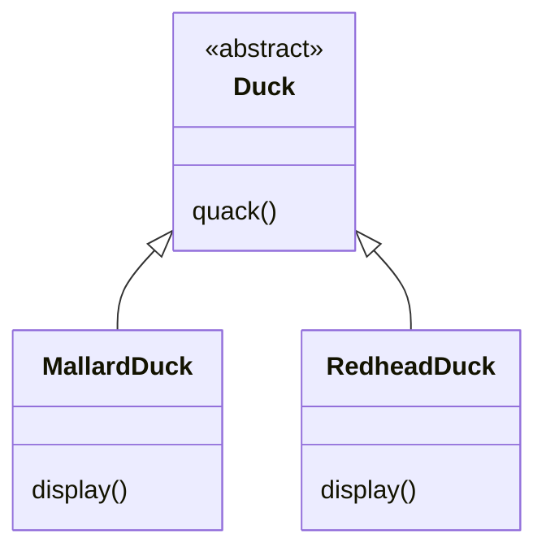
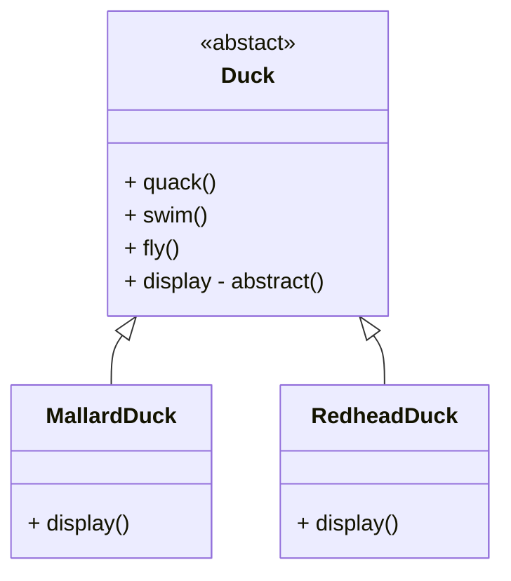
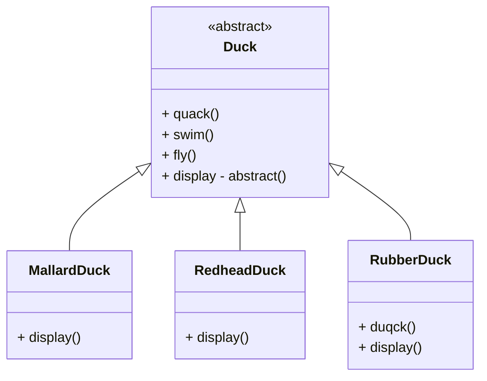
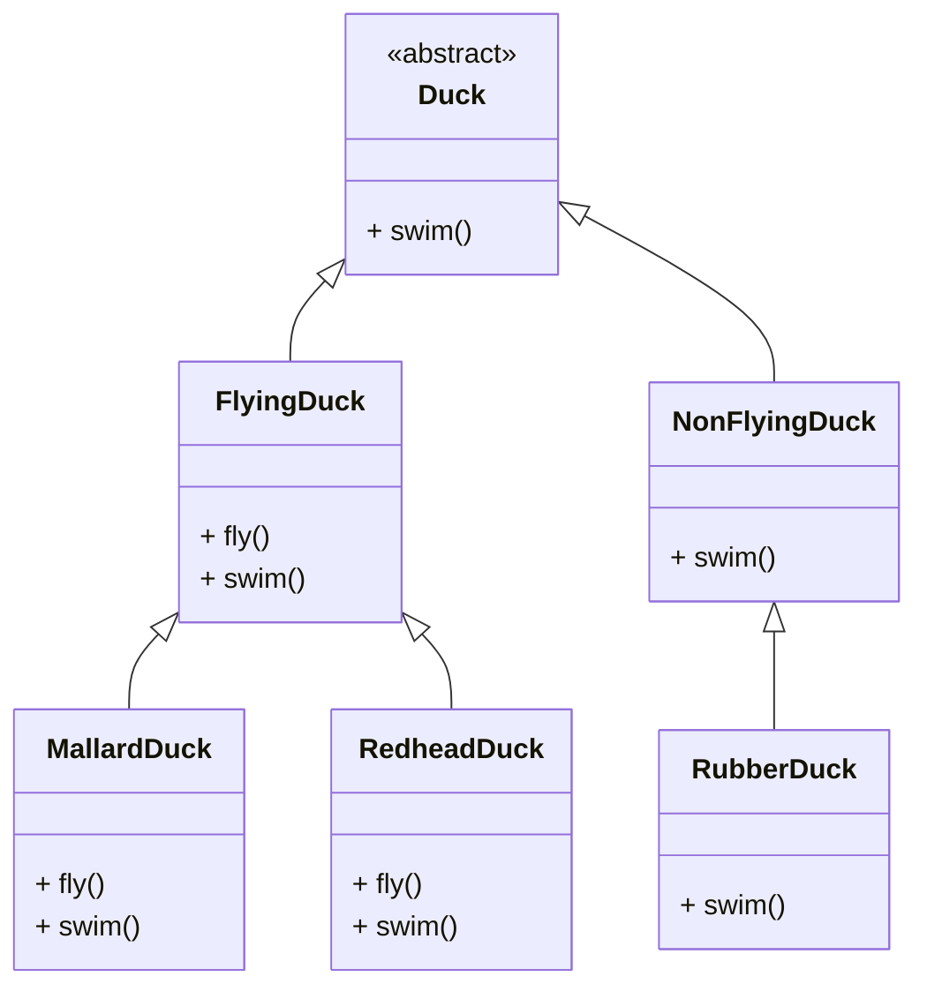
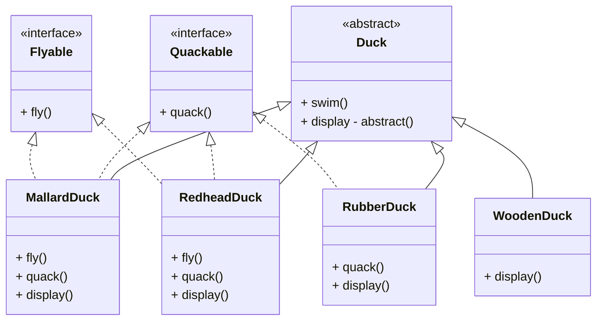
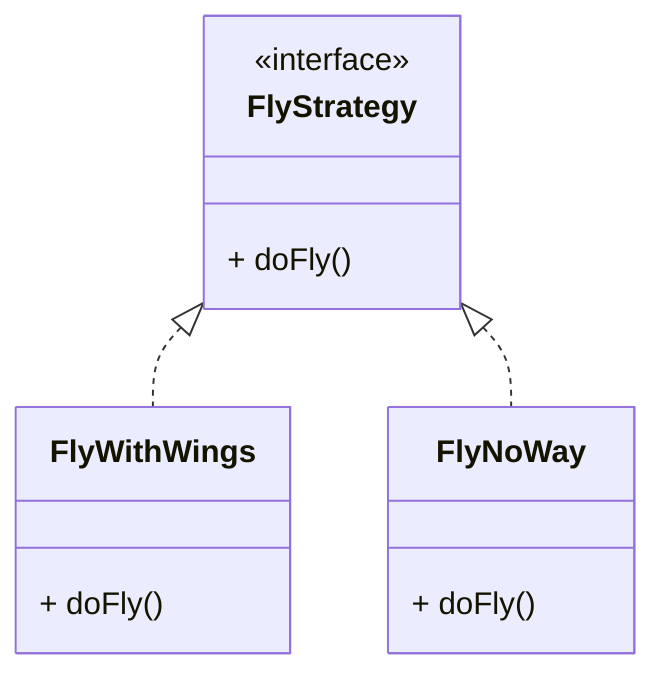
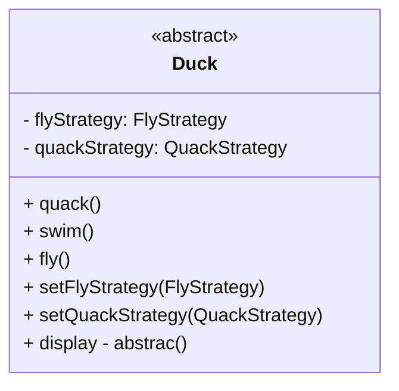
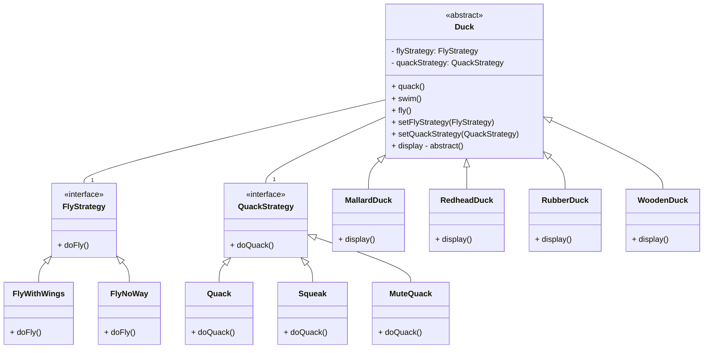
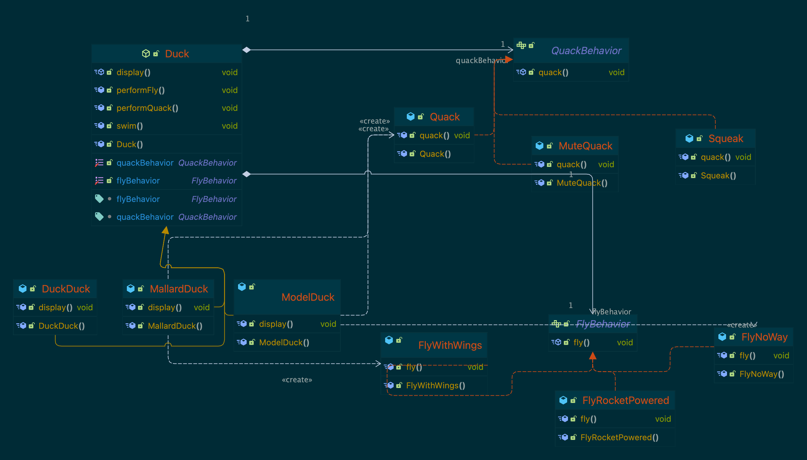
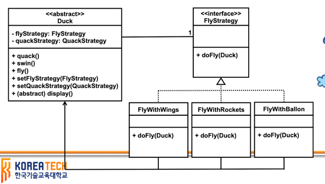

# Strategy Pattern

## SimpleUDuck Application



* 모든 오리는 꽥꽥 울 수 있고, 수영을 할 수 있음
* 이 두 종류의 행위는 오리 부모 클래스에서 구현됨
* 코드 중복 제거 -> 상속의 이점
* 오리의 display 메서드는 추상 메서드
* 오리 클래스는 추상 클래스
* 오리의 모든 자식클래스는 display 메서드를 구현해야 한다.
* 각 구체적 오리는 그의 모습이 다르다
* 여기 두 클래스 외에 상속을 통해 다양한 구체적 오리 클래스를 정의할 수 있다.

#### 문제 상황

* 오리 시뮬레이션 프로그램을 개선하기 위해 `fly` 기능을 추가하고 싶다.

### fly 기능의 추가





#### RubberDuck

* `quack()` 메서드를 재정의하여 꽤꽥 대신 삑삑하도록 변경하였다.
* 상속의 문제

  * 자식은 취사 선택을 할 수 없다. 부모에 정의된 모든 메서드가 모든 자식에 적합하지 않을 수 있다.

#### 상속의 문제 해결 - 빈 메서드 재정의

```java
class RubberDuck{
    void quack() {}
    void fly() {// do noting}
}
```

#### 상속의 문제 해결 - 중간 클래스



#### Interface를 이용한 방법



* `interface`를 이용하면 특정 기능을 제공하는 것과 제공하지 않는 것을 구분할 수 있다.
* 이 방법으로도 여전히 동적 변화를 제공할 수 없다. 다양한 `fly` 행위 제공이 어렵다.
* 다양한 조합의 문제

  * 공통적으로 가진 기능이 있지만 다양하게 구현할 수 있는 기능이다.
  * 다양하게 구현한 것을 종종 실행 시간에 바꾸어서 사용해야 할 수도 있다.
  * 이와 같은 기능이 여러 개 존재할 수 있다.

#### 관련 설계 원리

> Design Principle 1
>
> Identify the aspects of your application that vary and separate them what stays the same

* 조합 문제의 해결책으로 상속은 좋은 해결책이 아니다.
* 자바 `interface` 기능도 좋은 해결책이 아니다.
  * 자바 `interface`는 구현을 포함하지 않는다. -> **코드의 재사용이 아니다.**
  * 자바 8부터는 가능하지만 여전히 정적 관계, 기본 메서드의 한계
* 오리 클래스에서 `fly` 기능과 `quack` 기능은 특정 오리마다 다르다.
  * 이것을 오리 클래스로부터 분리해야 한다.
  * `fly` 기능과 `quack` 기능을 별도 클래스로 한다.

> Design Principle 2
>
> Program to an interface, not an implementation

* 구체적 타입에 의존하는 것이 아니라 추상 타입에 의존하도록 프로그래밍



* 이 방식의 장점
  * 코드 재사용 가능
  * 날개로 나는 모든 오리에 대한 구현은 한 번만 해도 된다.
  * 기존 클래스를 변경하지 않고 기존 행위 방법을 변경할 수 있고, 새로운 행위 방법을 추가할 수 있다.
    * 클래스의 복잡성을 줄일 수 있다.

#### 구현



```java
public abstract class Duck {
    protected FlyStrategy flyStrategy;
    protected QuackStrategy quackStrategy;

    public void quack() {
        quackStrategy.doQuack();
    }

    public void fly() {
        flyStrategy.doFly();
    }

    public void swim() {
        System.out.println("swimming~~~");
    }

    public void setFlyStrategy(FlyStrategy flyStrategy) {
        this.flyStrategy = flyStrategy;
    }

    public void setQuackStrategy(QuackStrategy quackStrategy) {
        this.quackStrategy = quackStrategy;
    }
}
```

```java
public class MallardDuck extends Duck{
    public MallardDuck(){
        flyStrategy = new FlyWithWings();
        quackStrategy = new Quack();
    }
  
    public void display(){
        System.out.println("I'm MallardDuck");
    }
}
```

##### 장점

* `flyBehavior`를 실행시간에 변경할 수 있다.

```java
duck.setFlyBehavior(new FlyNoWay());
duck.fly();
```

* 새로운 오리 타입을 만들기 쉽다.

```java
public class ModelDuck extends Duck{
    public ModelDuck(){
        flyStrategy = new FlyNoWay();
        quackStrategy = new Quack();
    }
}
```

* 새로운 행위 추가가 쉽다.

```java
public class FlyRocketPowered implements FlyBehavior{
    public void fly(){
        System.out.println("I'm using rocket");
    }
}
```

#### 최종결과







### Strategy Pattern

* 오리 시뮬레이션 프로그램의 다양한 조합 문제를 해결하기 위해 사용한 방법이 전략 패턴(Strategy Pattern)이다.
* Strategy Pattern: 알고리즘의 군을 정의하고 캡슐화해주며 서로 언제든지 바꿀 수 있도록 해준다.
  * 알고리즘을 사용하는 클랑이너트와 알고리즘을 분리
    * OCP: 알고리즘을 바꾸기 위해 클라이언트 코드를 수정할 필요가 없다.
  * 객체의 상태에 따라 행위를 동적으로 바꿀 수 있도록 해준다.
    * 의존관계 주입

#### 등장하는 클래스

* Strategy interface: 전략을 이용하기 위한 interface 제공
* Concrete Strategy 클래스: 다수가 제공되며, 구체적인 전략이 규현되어 있는 클래스
* Client 클래스(context 클래스): 전략을 실제 활용하는 클래스


#### 전략 패턴을 사용하는 경우

* 관련 있는 클래스들이 행위만 다른 경우
* 한 알고리즘의 다양한 변형이 필요한 경우
  * 다양한 변형이 동시에 사용되지 않으며, 상황에 따라 사용하지 않을 수 있다.
* 알고리즘 구현에 필요한 복잡한 자료구조를 클라이언트로부터 숨길 필요가 있는 경우
* 한 클래스가 여러 행위를 조건문을 통해 정의한 경우

#### 장점

* 위임이라는 느슨한 연결을 통해 전략을 쉽게 바꿀 수 있으며, 실행 시간에 변경할 수 있다.
* 새 전략을 쉽게 추가할 수 있다.
* 여러 행위가 전략 패턴으로 구현될 경우 이들의 조합으로 객체를 쉽게 구성할 수 있다.

#### 단점

* 행위의 모델링(interface, operation의 정의)이 쉽지 않을 수 있다.
  * 클라이언트의 상태가 필요한 경우에 해결책을 고민해 봐야한다.
    * 예) `FlyWithWings`는 날개 정보가 필요할 수 있다.
      *  `방법 1` - 클라이언트 전달. 예) `flyingStrategy.doFly(this);`
      * `방법 2` - 데이터 전달. 예) `flyingStrategy.doFly(wings);`
    * 전략을 사용하는 클라이언트가 다양할 경우 `방법 1`은 복잡해지며, 전달해야 하는 데이터가
      많거나 다양할 경우 방법 2는 복잡해진다.
      * 추가적인 추강화가 필요할 수 있다.




## Strategy Pattern 정리

* 종류: `Behavioral`
* 수준: `Component`
* 목적: 가능한 행위들을 정의하는 클래스의 집합을 정의하여 필요한 행위를 유연하게 사용할 수 있으며, 동적으로 변경 가능

#### Applicability

* 한 행위를 다양하게 수행해야 하는 경우
* 실생 시간까지 객체의 행위 방ㅂ버을 결정할 수 없는 경우
  * 동적으로 행위를 수행하는 방법을 결정할 수 있다.
* 행위를 수행한느 방법ㅇ르 쉽게 추가하고 싶은 경우
* 행위를 추가하면서 코드의 크기를 효과적으로 관리하고 싶을 경우

### 관련 패턴

* `Singleton`: `Strategy` 클래스의 인스턴스는 보통 `Singleton`으로 표현된다.